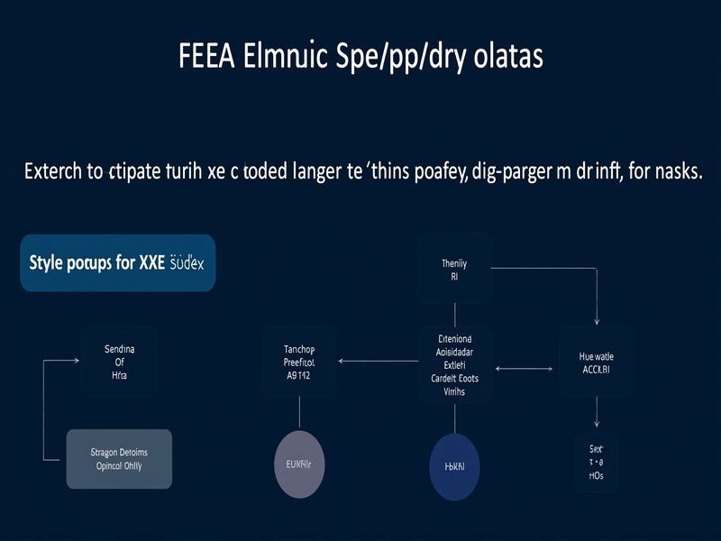

# Apache OpenNLP 曝出一组高危漏洞，包括XXE注入

<!-- vulwiki-editorial:start -->
## 校订与适用边界

- 适用前提：加载不可信模型/字典；42027还需classpath存在有危险静态初始化副作用的类；不是任意文本分析入口
- 证据范围：三个风险真实但文章把任意类加载夸成OS提权，把XXE读取夸成直接RCE。

### 已有来源支持的更正

- Apache VEX说明三项分别为OOM、任意classpath类初始化、XXE；修复含1.9.5回补、2.5.9与3.0.0-M3
- 官方明确库使用宿主进程权限，模型/字典为受信配置输入，不具有独立服务/账号边界

### 尚未解决的证据缺口

以下限制仍适用于后文历史材料；相关版本、结果或修复结论不能据此视为已验证：

- 42027并不自动突破运行账户权限，应为模型manifest触发类初始化
- 40682文件读取/SSRF不等于直接RCE，正文未给额外执行链
- 42440主要是不受限数组分配导致OOM，普通线程异常表述漏根因
- 无需认证是应用输入边界条件，OpenNLP本身是库而非有账户的服务器
- 缺三项frontmatter和修复版本；旧笼统<=2.5.8无法体现1.9.5安全回补
- 没有官方源直链

### 核验来源

- https://solr.apache.org/vex.html
- https://opennlp.apache.org/security.html

### 操作风险与资料使用

- 含资源消耗、延时或崩溃验证：可能影响服务可用性；限制请求次数、并发与超时，保留无攻击负载的对照结果。

本页为文本校订，未执行代码、PoC 或目标请求；原图仅保留引用，未据此确认复现成功。
<!-- vulwiki-editorial:end -->

## 技术正文与历史材料

原创 A译
                    A译  黑白之道   2026-05-04 00:55  
  
> **导语**  
：Apache OpenNLP 是 Java 生态中常用的自然语言处理库，被大量企业用于文本解析、实体识别等场景。2026年5月2日安全社区披露该库存在多个漏洞——拒绝服务、权限提升、XXE，三类攻击面同时存在。在生产环境中使用 OpenNLP 的团队，需要立即评估风险。  
  
  
这次披露了三个 CVE，影响版本为 OpenNLP up to 2.5.8 以及 3.0.0-M2。  
  
CVE-2026-42440 是拒绝服务漏洞。AbstractModelReader 在处理恶意构造的模型文件时，可能导致服务崩溃。攻击者只需提供一个畸形的模型文件，触发异常后目标系统的处理线程会中断。对于依赖 OpenNLP 做实时文档处理的服务，这等同于一次精准的 DoS 攻击。无需认证，只需能向目标提交模型文件即可触发。  
  
CVE-2026-42027 是权限提升漏洞。Model Manifest ExtensionLoader 在解析模型清单文件时存在权限提升路径。这个漏洞的利用前提是攻击者能够在目标系统上部署恶意模型文件——一旦成功加载，可能突破当前运行账户的权限限制执行更高权限操作。在多租户环境或内容处理平台中风险较高。  
  
CVE-2026-40682 是 XXE 外部实体注入，这是最值得关注的。Dictionary Parser 在解析 XML 格式的字典文件时，未正确禁用外部实体引用。攻击者可以通过构造包含 SYSTEM  
 或 ENTITY  
 引用的恶意 XML 文件，诱使解析器读取服务器本地文件或发起内部网络请求。  
  
  
  
典型攻击 payload 是这样的：  
```
<!DOCTYPE dictionary [  <!ENTITY xxe SYSTEM "file:///etc/passwd">]><dictionary>  <entry>    <word>&xxe;</word>  </entry></dictionary>
```  
  
当 OpenNLP 的 Dictionary Parser 加载这个文件时，/etc/passwd  
 的内容会被嵌入到解析结果中，攻击者间接获取了本地文件读取能力。如果你的 OpenNLP 部署允许用户上传或配置字典文件，这就是一个直接的 RCE 路径。  
  
OpenNLP 在企业中的典型使用场景包括：文档处理平台自动提取合同和报告中的关键信息、客服系统的 NLP 驱动意图识别和自动回复、内容审核的文本分类和敏感词检测、以及搜索引擎的文本预处理和索引优化。如果模型文件和字典文件来自不可信来源（如用户上传），则直接面临漏洞利用风险。  
  
建议相关团队立即检查自身场景，及时关注 Apache OpenNLP 官方安全公告获取修复版本。临时缓解措施包括：对所有外部提供的模型和字典文件进行格式校验；在解析 XML 前确保禁用外部实体引用；OpenNLP 运行账户不应拥有敏感文件读取权限；将解析服务运行在独立容器或沙箱中限制横向移动能力。  
  
**版权声明**  
：本文由华盟网原创发布，保留所有权利。配图由华盟网授权使用。  
  


---

> 来源：gelusus/wxvl（微信公众号漏洞文章自动归档，原文见文首链接）
