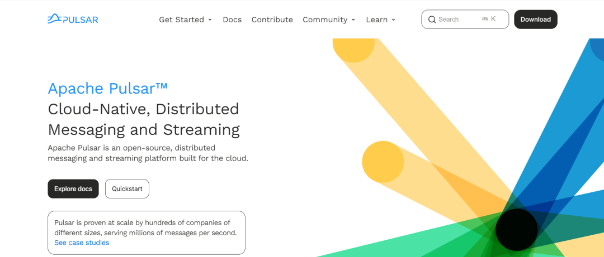

# 漏洞预警 | Apache Pulsar任意文件读取漏洞

<!-- vulwiki-editorial:start -->
## 校订与适用边界

- 适用前提：已认证且具有相关Functions Worker API权限的用户；组件开启/可达
- 证据范围：分支版本列举清楚，但无读取端点或操作细节，只是通告。

### 尚未解决的证据缺口

以下限制仍适用于后文历史材料；相关版本、结果或修复结论不能据此视为已验证：

- 严重错分类：Pulsar条目置于RocketMQ目录，必须迁移产品归属
- 经过认证不说明精确角色/租户权限，需公告核对
- 官网首页不是安全公告，应补每分支修复版本及直接公告
- 未展示证据不能将任意本地文件无条件泛化到全部Pulsar节点

本页为文本校订，未执行代码、PoC 或目标请求；原图仅保留引用，未据此确认复现成功。
<!-- vulwiki-editorial:end -->

## 技术正文与历史材料

浅安  浅安安全   2024-03-16 08:00  
  
**0x00 漏洞编号**  
- # CVE-2024-27894  
  
**0x01 危险等级**  
- 高危  
  
**0x02 漏洞概述**  
  
Apache Pulsar是一个多租户、高性能的服务间消息传输解决方案，数据持久化依赖Apache BookKeeper实现，支持多租户、低延时、读写分离、跨地域复制、快速扩容、灵活容错等特性。  
  
  
  
**0x03 漏洞详情**  
###   
###   
  
**CVE-2024-27894**  
  
**漏洞类型：**  
任意文件读取  
  
**影响：**  
获取  
敏感信息  
  
**简述：**  
Apache Pulsar Functions Worker中存在一个任意文件读取漏洞，由于未对参数进行过滤导致允许经过身份验证的用户进行任意文件读取漏洞，访问服务器敏感信息。  
###   
  
**0x04 影响版本**  
- 2.4.0 <= Apache Pulsar <= 2.10.5  
  
- 2.11.0 <= Apache Pulsar <= 2.11.3  
  
- 3.0.0 <= Apache Pulsar <= 3.0.2  
  
- 3.1.0 <= Apache Pulsar <= 3.1.2  
  
- Apache Pulsar = 3.2.0  
  
**0x05****修复建议**  
  
******目前官方已发布漏洞修复版本，建议用户升级到安全版本****：******  
  
https://pulsar.apache.org/  
  
  
  

---

> 来源：gelusus/wxvl（微信公众号漏洞文章自动归档，原文见文首链接）
