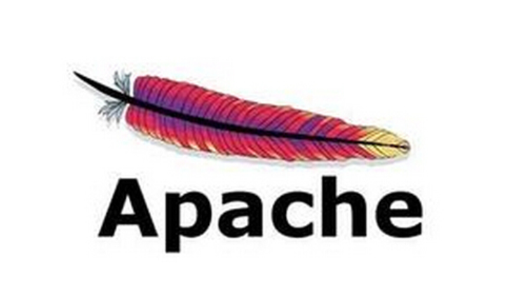

# Apache SIS XML外部实体（XXE）漏洞预警（CVE-2025-68280）

<!-- vulwiki-editorial:start -->
## 校订与适用边界

- 适用前提：0.4–1.5，解析不可信GeoTIFF GEO_METADATA、ISO19115/GML/GPX等相关XML路径，文件读取受进程权限限制
- 证据范围：组件与文档入口比通用XXE说明具体；1.6修复需官方核验，实际PoC没有。

### 本次正文校订

- 移除 1 组不含任何正文的空代码围栏；保留全部非空代码。

### 尚未解决的证据缺口

以下限制仍适用于后文历史材料；相关版本、结果或修复结论不能据此视为已验证：

- 临时缓解命令代码块为空，应恢复而非保留无内容示例
- Apache SIS XML应统一产品SIS并将解析模块做标签
- XXE不自动泄露任意敏感文件，输出/回传与权限条件未列
- 唯一彻底修复方式措辞过度绝对；需说明JAXP属性实际解析器适用性
- 缺厂商安全公告直链

本页为文本校订，未执行代码、PoC 或目标请求；原图仅保留引用，未据此确认复现成功。
<!-- vulwiki-editorial:end -->

## 技术正文与历史材料

 TtTeam   2026-01-10 05:13  
  
#   
# 一、预警摘要  
  
  
  
近日，Apache官方披露了Apache SIS组件存在XML外部实体（XXE）漏洞，漏洞编号为CVE-2025-68280。该漏洞源于Apache SIS在解析特定XML格式文件时，未对外部实体引用进行严格限制，攻击者可通过构造恶意XML文件，诱导服务器解析，从而泄露服务器本地文件内容。漏洞危害等级为中等，影响Apache SIS 0.4至1.5版本（含），官方已发布修复版本，建议相关用户立即采取措施进行防护。  
# 二、漏洞基本信息  
#   
- **漏洞编号**  
：CVE-2025-68280  
  
- **漏洞名称**  
：Apache SIS XML外部实体（XXE）注入漏洞  
  
- **危害等级**  
：中等（Moderate）  
  
- **漏洞类型**  
：XML外部实体注入（XXE）  
  
- **影响产品**  
：Apache SIS（组件：org.apache.sis.core:sis-metadata）  
  
三、影响范围  
  
受影响版本：Apache SIS 0.4 至 1.5 版本（含两端版本）  
  
安全版本：Apache SIS 1.6 及以上版本  
# 四、漏洞详情  
#   
## 4.1 漏洞原理  
##   
  
XML外部实体（XXE）注入漏洞源于应用程序在解析XML输入数据时，未充分过滤或禁用外部实体引用，导致攻击者可构造恶意XML文档，诱导解析器加载外部资源（如本地文件、内网服务等）。本次Apache SIS漏洞中，攻击者可通过编写特定XML文件，当该文件被Apache SIS解析时，服务器会泄露本地文件内容，造成敏感信息泄露风险。  
## 4.2 受影响服务  
##   
  
该漏洞影响Apache SIS的以下核心服务，涉及多种地理信息相关文件的解析场景：  
- 读取包含国防地理信息工作组（DGIWG）定义的GEO_METADATA标签的GeoTIFF文件；  
  
- 解析ISO 19115格式的XML元数据；  
  
- 解析GML格式定义的坐标参考系统；  
  
- 解析GPS交换格式（GPX）文件。  
  
## 4.3 漏洞危害  
##   
  
攻击者利用该漏洞可获取运行Apache SIS服务器的本地文件内容，可能泄露的敏感信息包括但不限于：  
- 系统配置文件（如数据库连接信息、服务配置参数等）；  
  
- 用户凭证信息（如账号密码、令牌等）；  
  
- 业务数据文件及其他敏感文档。  
  
进一步可结合内网探测、服务攻击等手段，扩大攻击影响范围，威胁服务器及内网环境安全。  
# 五、修复建议  
#   
  
官方已发布Apache SIS 1.6版本修复该漏洞，建议所有受影响用户优先通过升级版本进行彻底修复：  
1. 升级方式：前往Apache SIS官方网站下载最新版本（https://sis.apache.org/），按照官方文档完成升级部署；  
  
1. 验证说明：升级后需确认服务正常运行，且相关文件解析功能不受影响。  
  
# 六、临时缓解措施  
#   
  
若暂时无法完成版本升级，可通过配置Java系统属性限制外部DTD访问权限，临时规避漏洞风险。具体操作如下：  
  
在启动Java应用时，添加javax.xml.accessExternalDTD系统属性，设置为仅允许授权的协议（建议为空字符串，即禁用外部DTD访问），示例命令：  
  
说明：该属性用于控制JAXP（Java API for XML Processing）对外部DTD的访问权限，设置为空字符串可禁用外部DTD加载，从而阻断XXE攻击的触发条件。  
# 七、相关参考  
#   
- Apache SIS官方网站：https://sis.apache.org/  
  
- CVE官方记录：https://www.cve.org/CVERecord?id=CVE-2025-68280  
  
- XXE漏洞防护指南：https://juejin.cn/post/7547507733961424942  
  
# 八、注意事项  
#   
- 请相关用户尽快完成资产排查，确认是否使用受影响版本的Apache SIS组件，避免遗漏防护；  
  
- 临时缓解措施仅用于应急规避，升级到官方安全版本是彻底修复漏洞的唯一方式；  
  
- 在进行版本升级和配置修改前，建议做好数据备份和测试工作，避免影响业务正常运行；  
  
- 加强对XML格式输入文件的安全校验，仅允许解析可信来源的文件，降低漏洞利用风险。  
  

---

> 来源：gelusus/wxvl（微信公众号漏洞文章自动归档，原文见文首链接）
