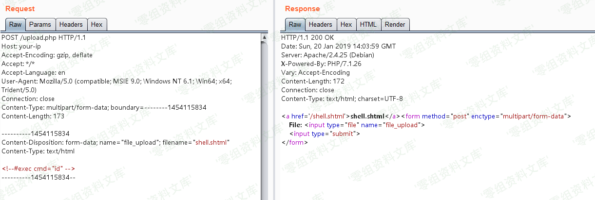
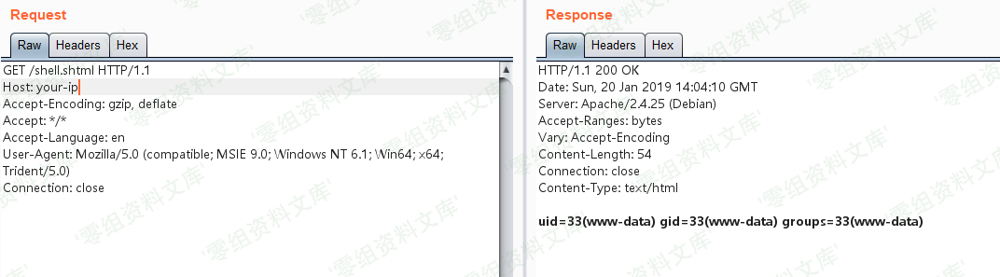

# Apache SSI 远程命令执行漏洞

<!-- vulwiki-editorial:start -->
## 校订与适用边界

- 适用前提：允许上传.s​html并Web访问，SSI执行启用且非IncludesNOEXEC；命令运行账户权限
- 证据范围：正常SSI exec功能被任意上传利用，不能命名为独立Apache SSI产品漏洞。

### 尚未解决的证据缺口

以下限制仍适用于后文历史材料；相关版本、结果或修复结论不能据此视为已验证：

- 目录Apache SSI应统一HTTP Server模块/配置风险
- 简介利用语法丢为两枚反引号，影响范围空白
- 需给mod_include/Options和exec可用条件，不能仅说开启SSI/CGI即可
- 无原始上传请求与结果文本，图片未视检

### 操作风险与资料使用

- 含落盘脚本或账户创建：会留下持久状态。记录本次生成的路径或账户，测试后清理这些对象并撤销关联令牌；不要删除既有业务对象。

本页为文本校订，未执行代码、PoC 或目标请求；原图仅保留引用，未据此确认复现成功。
<!-- vulwiki-editorial:end -->

## 技术正文与历史材料

一、漏洞简介
------------

在测试任意文件上传漏洞的时候，目标服务端可能不允许上传php后缀的文件。如果目标服务器开启了SSI与CGI支持，我们可以上传一个shtml文件，并利用\`\`语法执行任意命令。

二、漏洞影响
------------

三、复现过程
------------

正常上传PHP文件是不允许的，我们可以上传一个shell.shtml文件：

    <!--#exec cmd="ls" -->

成功上传，然后访问shell.shtml，可见命令已成功执行：

参考链接
--------

> https://vulhub.org/\#/environments/httpd/ssi-rce/
