# Apache Shiro 两种姿势绕过认证分析（CVE-2020-17523）

<!-- vulwiki-editorial:start -->
## 校订与适用边界

- 适用前提：<1.7.1，特定/admin/*规则及Spring路由；点路径方法额外需alwaysUseFullPath设置，演示1.7.0
- 证据范围：空格trim和末尾斜线/normalize两条路径有独立增量，明确默认404与实验额外配置，不应删为重复。

### 尚未解决的证据缺口

以下限制仍适用于后文历史材料；相关版本、结果或修复结论不能据此视为已验证：

- trim清除所有whitespace表述不精确，应按实际Java字符范围；文章测试仅确认空格
- 多个路径因中文排版插入空格，代码/名称需恢复精确字符串
- 应将Spring/Tomcat版本及规则代码一起固定，不能泛称所有Spring组合
- 相同分隔图片/推广可移除

本页为文本校订，未执行代码、PoC 或目标请求；原图仅保留引用，未据此确认复现成功。
<!-- vulwiki-editorial:end -->

## 技术正文与历史材料

<meta name="referrer" content="no-referrer"/>

> 本文由 [简悦 SimpRead](http://ksria.com/simpread/) 转码， 原文地址 [mp.weixin.qq.com](https://mp.weixin.qq.com/s/MEoqMjGkifnIn4MedluCHw)


作者：jweny@360 云安全

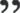

漏洞描述

Apache Shiro 是一个强大且易用的 Java 安全框架，执行身份验证、授权、密码和会话管理。使用 Shiro 的易于理解的 API，您可以快速、轻松地获得任何应用程序，从最小的移动应用程序到最大的网络和企业应用程序。

当它和 Spring 结合使用时，在一定权限匹配规则下，攻击者可通过构造特殊的 HTTP 请求包完成身份认证绕过。

影响范围：Apache Shiro < 1.7.1


漏洞环境搭建

shiro 1.7.0

https://github.com/jweny/shiro-cve-2020-17523 两种姿势的漏洞环境均已更新。


poc 测试

姿势一：

http://127.0.0.1:8080/admin/%20 或 http://127.0.0.1:8080/admin/%20/

使用空格等空字符，可绕过 shiro 身份验证。

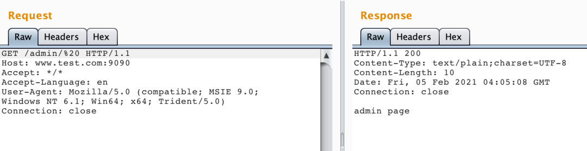

姿势二：

经过和 p0desta 师傅交流，发现还有另一种特殊场景下的利用方式。

http://127.0.0.1:8080/admin/%2e 或 http://127.0.0.1:8080/admin/%2e/

但是.（还有 /）在 Spring 的路径匹配的规则中是代表路径分隔符的，不作为普通字符进行匹配。因此在默认条件下访问 /admin/. 会返回 404。

但是在开启全路径的场景下 setAlwaysUseFullPath(true) 是可以正常匹配的。

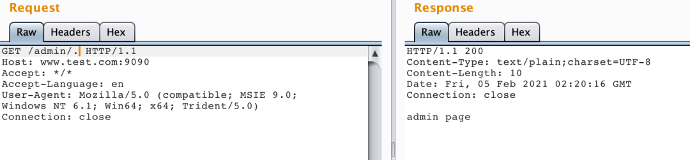


漏洞分析

Shiro 中对于 URL 的获取及匹配在 org.apache.shiro.web.filter.mgt.PathMatchingFilterChainResolver#getChain

先简单看下这个 getChain 方法：

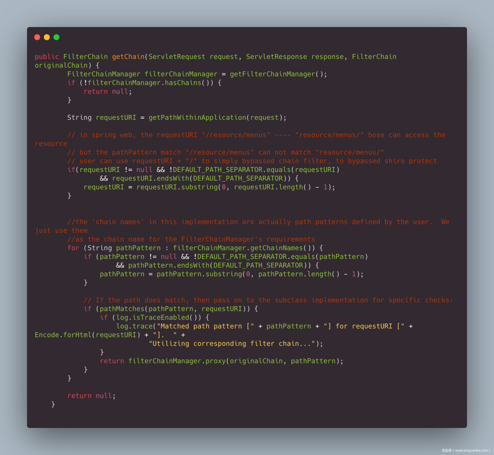

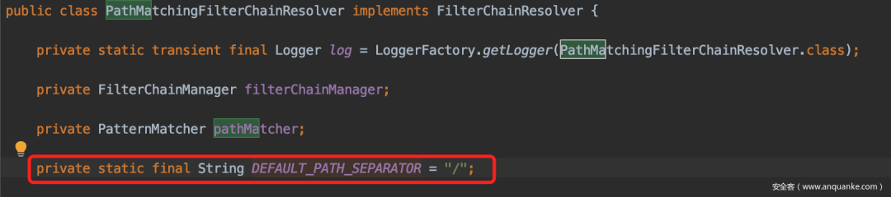

该方法先检查 requestURI 是否以 / 结尾，如果是，就删掉最后一个 /。

然后在匹配路径的循环中，会先判断下路径规则 pathPattern 是否以 / 结尾，如果是也会删除。然后再去调用 pathMatches() 方法进行路径匹配。

因此两种利用方式中，是否以 / 结尾都没有关系，因为开始经过 getChain 方法就会被删除。

### **4.1 空格绕过分析**

关注下 pathMatches() 方法：

调出 Evaluate，分别计算一下 pathMatches（"/admin/*","/admin/1"）和 pathMatches（"/admin/*","/admin/"），前者正常匹配，后者匹配失败。

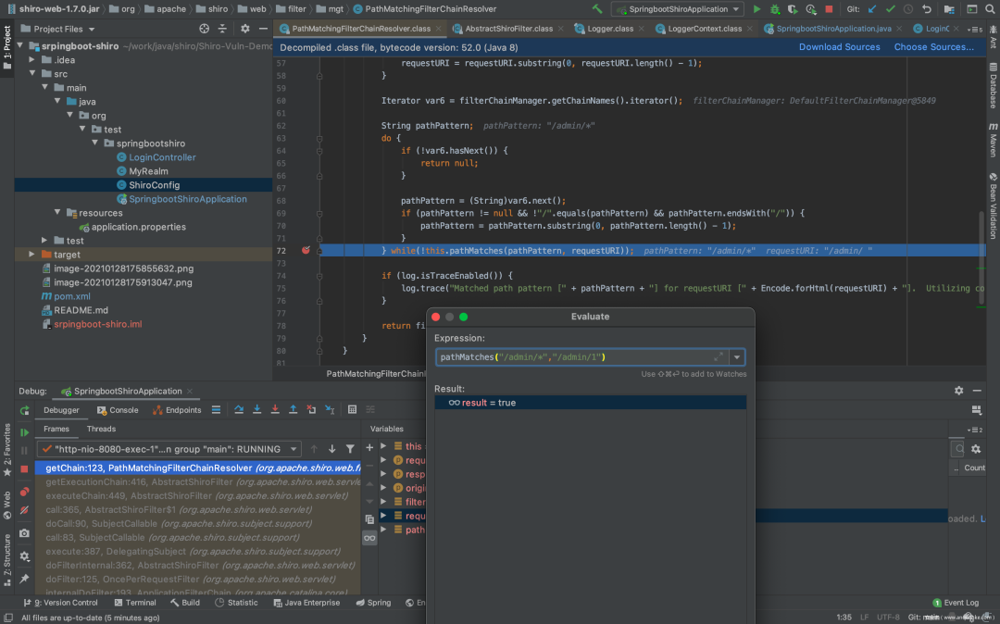

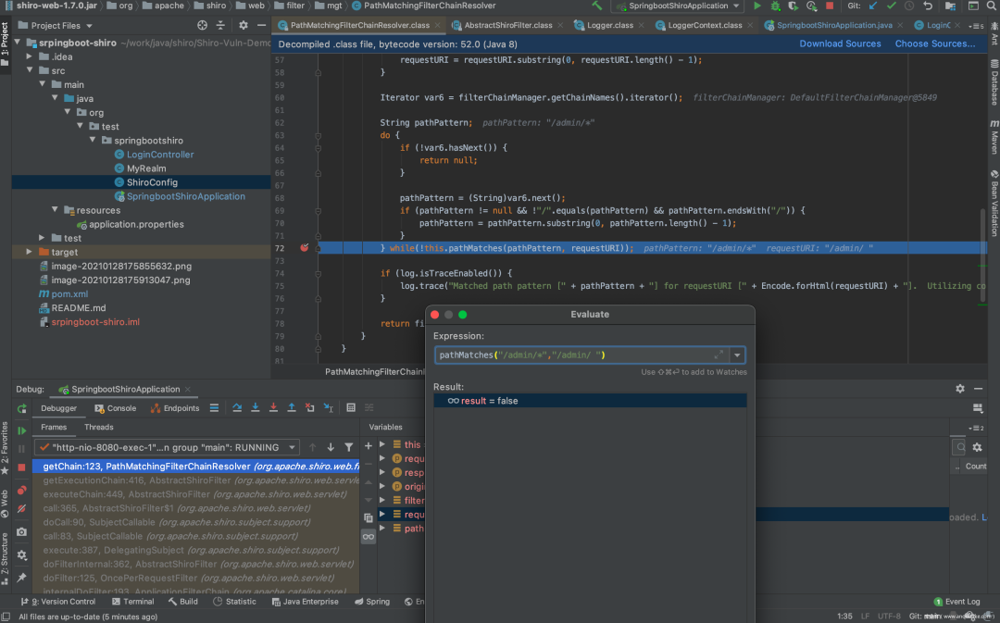

开始调试，调试开始会经过一阵漫长的 F7。一直到 doMatch("/admin/*","/admin/")。可见，tokenizeToStringArray 返回的 pathDirs 已经没有第二层路径了。因此会导致 / admin/* 和 / admin 不匹配。

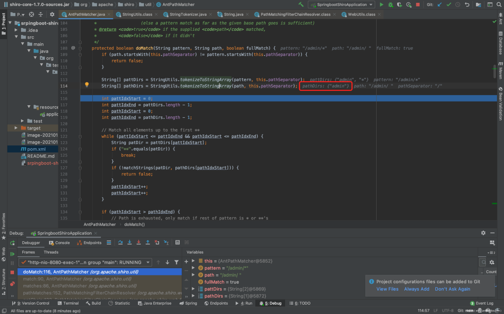

跟一下 tokenizeToStringArray 方法，发现其调用 tokenizeToStringArray 方法时的 trimTokens 参数为 true。

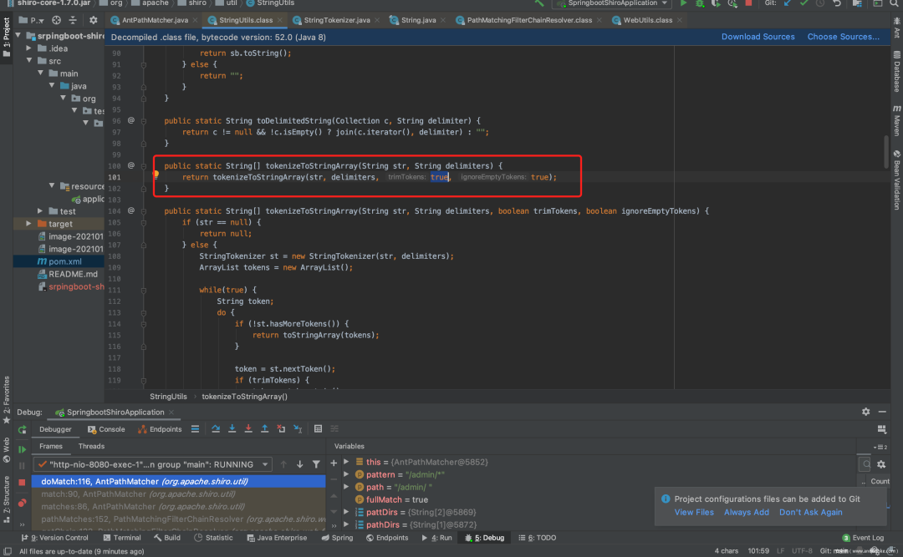

而 tokenizeToStringArray 方法，在参数 trimTokens 为 true 时，会经过 trim() 处理，因此导致空格被清除。再次返回 getChain 时最后一个 / 被删除。因此 tokenizeToStringArray 返回的 pathDirs 没有第二层路径。

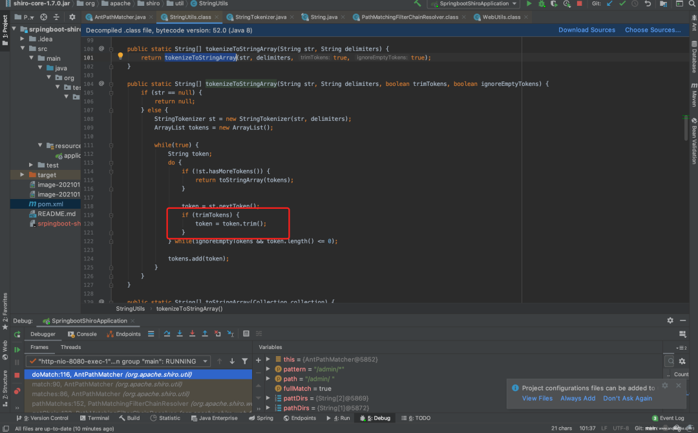

总结一下：存在漏洞的 shiro 版本，由于调用 tokenizeToStringArray 方法时，trimTokens 参数默认为 true，空格会经过 trim() 处理，因此导致空格被清除。再次返回 getChain 时最后一个 / 被删除，所以 / admin 与 / admin/* 匹配失败，导致鉴权绕过。而 Spring 接受到的访问路径为 / admin/%20，按照正常逻辑返回响应，因此导致权限被绕过。

### **4.2 /./ 绕过分析**

看到第二种姿势的 /. 和 /./，是不是想起了某个熟悉方法？没错，就是 normalize()。

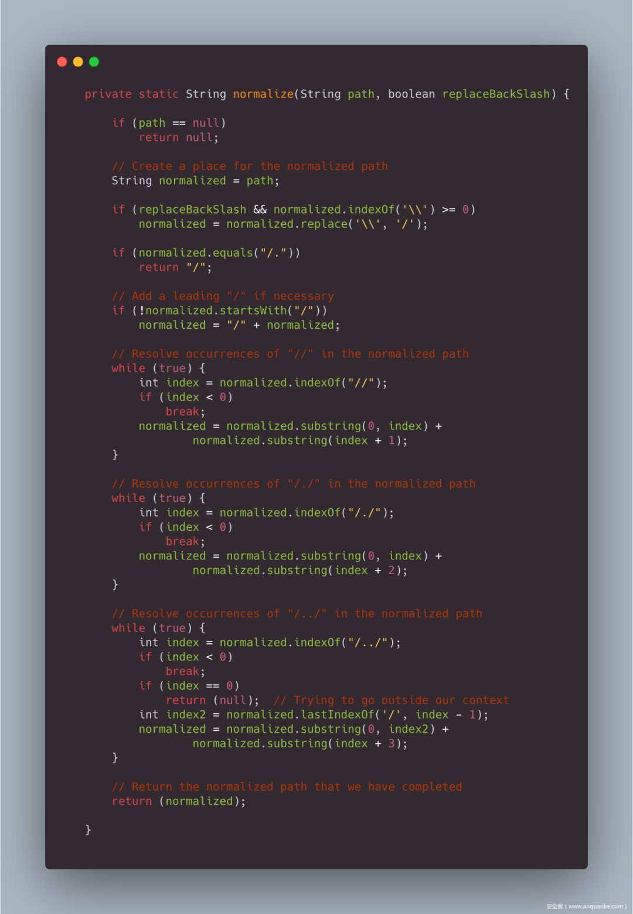

简单翻译下就是：  

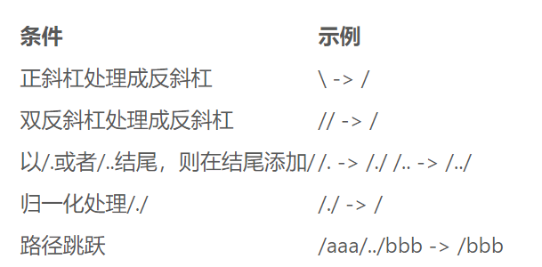

所以 / admin/. 在被处理成 / admin/./ 之后变成了 / admin/。

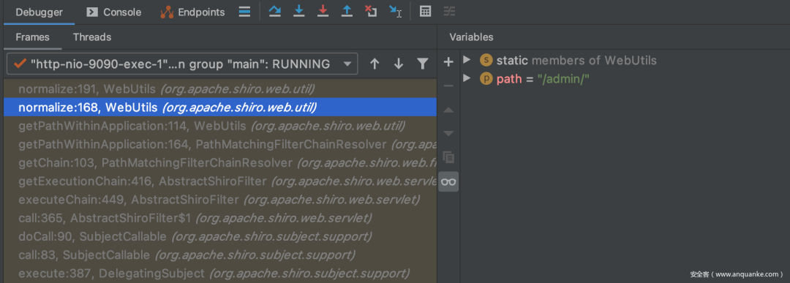

在经过 org.apache.shiro.web.filter.mgt.PathMatchingFilterChainResolver#getChain 处理，由于 / 结尾，如果是，就删掉最后一个 /，变成了 / admin。`/admin 与 / admin/* 不匹配，因此绕过了 shiro 鉴权。

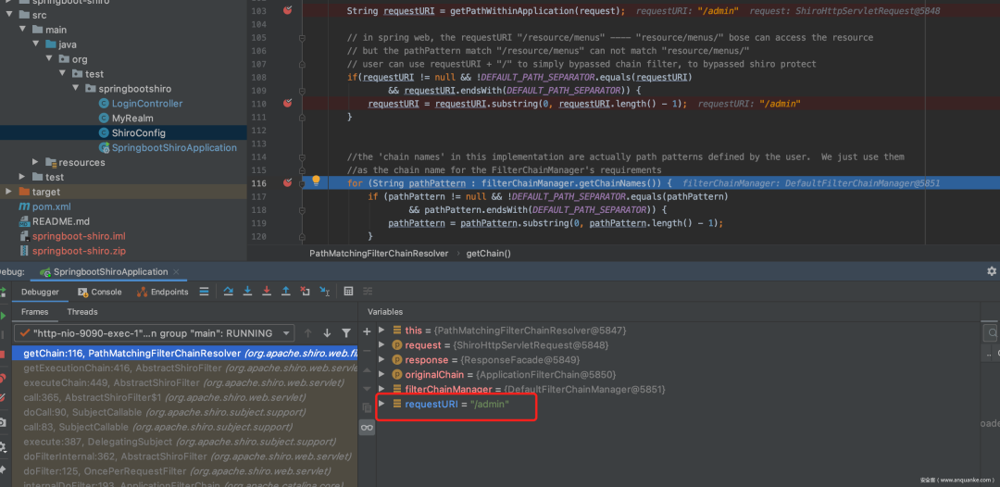

而此时 Spring 收到的请求为 / admin/.。如果没有开启全路径匹配的话，在 Spring 中. 和 / 是作为路径分隔符的，不参与路径匹配。因此会匹配不到 mapping，返回 404。

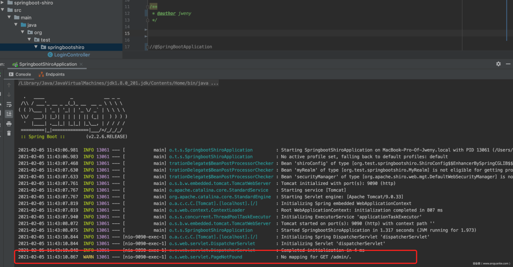

开启全路径匹配的话，会匹配整个 url，因此 Spring 返回 200。

这里附上开启全路径匹配的代码：

```
@SpringBootApplication
public class SpringbootShiroApplication extends SpringBootServletInitializer implements BeanPostProcessor {

    @Override
    protected SpringApplicationBuilder configure(SpringApplicationBuilder builder) {
        return builder.sources(SpringbootShiroApplication.class);
    }

    public static void main(String[] args) {

        SpringApplication.run(SpringbootShiroApplication.class, args);
    }

    @Override
    public Object postProcessBeforeInitialization(Object bean, String beanName)
            throws BeansException {
        if (bean instanceof RequestMappingHandlerMapping) {
            ((RequestMappingHandlerMapping) bean).setAlwaysUseFullPath(true);
        }
        return bean;
    }

    @Override
    public Object postProcessAfterInitialization(Object bean, String beanName)
            throws BeansException {
        return bean;
    }
}

```


官方的修复方案

经过以上的分析，造成 shiro 权限绕过的原因有两个：

1.  tokenizeToStringArray 函数没有正确处理空格。
    
2.  处理最后一个 / 的逻辑，不应在循环匹配路径的逻辑之前。
    

因此官方的修复方案为：

https://github.com/apache/shiro/commit/0842c27fa72d0da5de0c5723a66d402fe20903df

1.  将 tokenizeToStringArray 的 trimTokens 参数置为 false。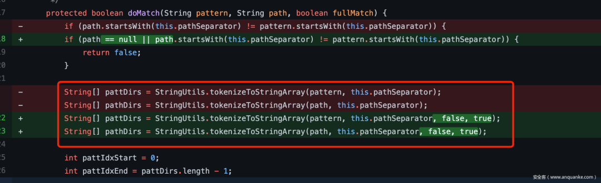
    
2.  调整删除最后一个 / 的逻辑。修改成先匹配原始路径，匹配失败后再去走删除最后一个 / 的逻辑。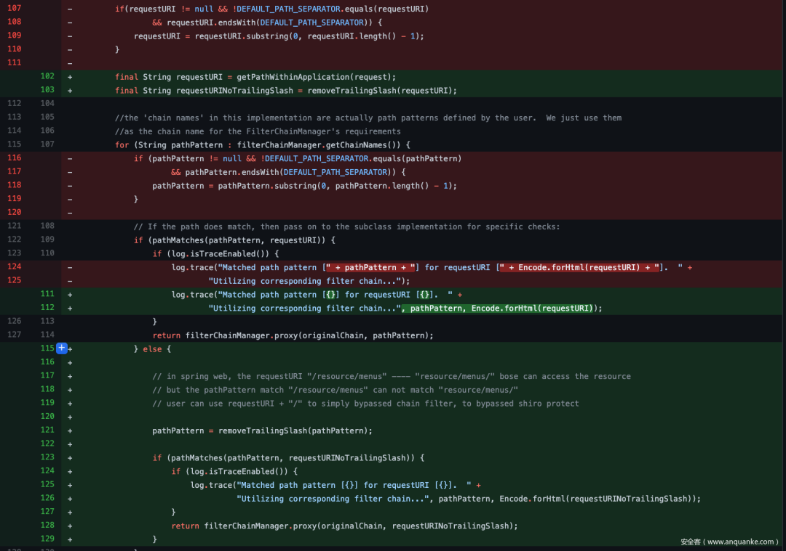
    


关于 trim

原理上来说 trim() 会清空字符串前后所有的 whitespace，空格只是其中的一种，但是在测试中发现除了空格以外的其他 whitespace，例如 %08、%09、%0a，spring+tomcat 处理时都会返回 400。

因此第一种姿势除了空格，尚未发现其他好用的 payload。


参考

https://github.com/apache/shiro/commit/0842c27fa72d0da5de0c5723a66d402fe20903df

https://www.anquanke.com/post/id/216096

https://www.cnblogs.com/syp172654682/p/9257282.html

（点击 “阅读原文” 查看链接）

```
- End -

精彩推荐
新型Linux恶意软件竟然可以从超级计算机中窃取SSH数据

App隐私合规简论

惊喜驾到 | 2020年安全客认证作者奖励出炉啦！

基于智能手机的近源渗透测试案例分享（二）——“点到为止”的测试成都某消防部门


戳“阅读原文”查看更多内容

```

---

> 来源：MrWQ/vulnerability-paper（https://github.com/MrWQ/vulnerability-paper）
