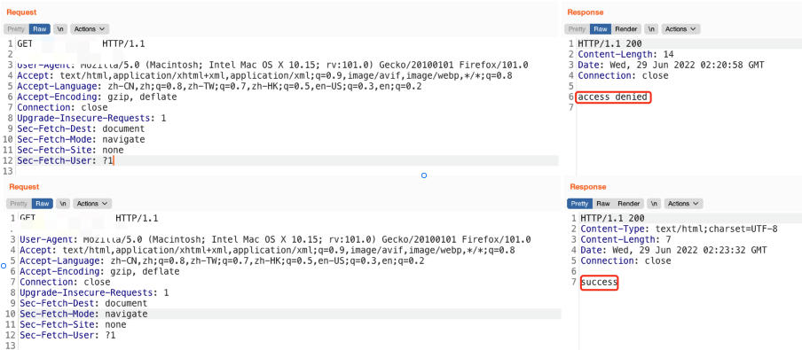

# 【已复现】Apache Shiro 身份认证绕过漏洞(CVE-2022-32532)安全风险通告

<!-- vulwiki-editorial:start -->
## 校订与适用边界

- 适用前提：<1.9.1，使用RegExPatternMatcher且正则含点，具体Servlet容器相关
- 证据范围：公告的matcher配置条件、版本及评分向量明确，但已复现仅为来源方截图主张。

### 已有来源支持的更正

- 官方确认RegexRequestMatcher配置与部分Servlet容器相关，修复1.9.1

### 尚未解决的证据缺口

以下限制仍适用于后文历史材料；相关版本、结果或修复结论不能据此视为已验证：

- 正文应补并非默认Ant matcher以及容器相关条件
- 不能把标题已复现转为本次审计已执行；没有文本PoC/具体配置
- 厂商中危与CVSS8.2高危是不同体系，可并列但须来源标签
- 巨型内联HTML表格和安全产品广告应压缩

### 核验来源

- https://shiro.apache.org/security-reports.html

本页为文本校订，未执行代码、PoC 或目标请求；原图仅保留引用，未据此确认复现成功。
<!-- vulwiki-editorial:end -->

## 技术正文与历史材料

原创 QAX CERT  奇安信 CERT   2022-06-29 11:45  
  
  
  
奇安信CERT  
  
**致力于**  
第一时间  
为企业级用户提供安全风险  
**通告**  
和  
**有效**  
解决方案。  
  
  
**安全通告**  
  
  
  
近日，奇安信CERT监测到Apache Shiro身份认证绕过漏洞(CVE-2022-32532)技术细节及PoC在互联网上公开，当Apache Shiro中使用RegExPatternMatcher进行权限配置，且正则表达式中携带"."时，未经授权的远程攻击者可通过构造恶意数据包绕过身份认证，导致配置的权限验证失效。**鉴于此漏洞影响范围较大，建议客户尽快做好自查及防护。**  
  
****  
  
  
<table><tbody><tr><td style="word-break: break-all;padding: 5px 10px;border-color: rgb(221, 221, 221);" width="83">
<strong>漏洞名称</strong>
</td><td colspan="3" style="padding: 5px 10px;word-break: break-all;border-color: rgb(221, 221, 221);">
<strong>Apache Shiro身份认证绕过漏洞</strong>
</td></tr><tr><td style="word-break: break-all;padding: 5px 10px;border-color: rgb(221, 221, 221);" width="104">
<strong>公开时间</strong>
</td><td style="padding: 5px 10px;border-color: rgb(221, 221, 221);" width="226">
2022-06-28
</td><td style="word-break: break-all;padding: 5px 10px;border-color: rgb(221, 221, 221);" width="173">
<strong>更新时间</strong>
</td><td style="padding: 5px 10px;border-color: rgb(221, 221, 221);" width="201">
2022-06-29
</td></tr><tr><td style="padding: 5px 10px;border-color: rgb(221, 221, 221);" width="122">
<strong>CVE编号</strong>
</td><td style="padding: 5px 10px;border-color: rgb(221, 221, 221);" width="235">
CVE-2022-32532
</td><td style="padding: 5px 10px;border-color: rgb(221, 221, 221);" width="183">
<strong>其他编号</strong>
</td><td style="padding: 5px 10px;border-color: rgb(221, 221, 221);" width="206">
QVD-2022-10156
</td></tr><tr><td style="padding: 5px 10px;border-color: rgb(221, 221, 221);" width="133">
<strong>威胁类型</strong>
</td><td style="padding: 5px 10px;border-color: rgb(221, 221, 221);" width="233">
身份认证绕过
</td><td style="padding: 5px 10px;border-color: rgb(221, 221, 221);" width="186">
<strong>技术类型</strong>
</td><td style="padding: 5px 10px;border-color: rgb(221, 221, 221);" width="206">
授权不当
</td></tr><tr><td style="padding: 5px 10px;border-color: rgb(221, 221, 221);" width="141">
<strong>厂商</strong>
</td><td style="padding: 5px 10px;border-color: rgb(221, 221, 221);" width="230">
Apache
</td><td style="padding: 5px 10px;border-color: rgb(221, 221, 221);" width="186">
<strong>产品</strong>
</td><td style="padding: 5px 10px;border-color: rgb(221, 221, 221);" width="204">
Shiro
</td></tr><tr><td colspan="4" style="word-break: break-all;padding: 5px 10px;border-color: rgb(221, 221, 221);" align="center" valign="middle">
<strong>风险等级</strong>
</td></tr><tr><td colspan="2" align="center" valign="middle" style="padding: 5px 10px;border-color: rgb(221, 221, 221);">
<strong>奇安信CERT风险评级</strong>
</td><td colspan="2" align="center" valign="middle" style="padding: 5px 10px;border-color: rgb(221, 221, 221);">
<strong>风险等级</strong>
</td></tr><tr><td colspan="2" align="center" valign="middle" style="padding: 5px 10px;border-color: rgb(221, 221, 221);">
<strong>中危</strong>
</td><td colspan="2" align="center" valign="middle" style="padding: 5px 10px;border-color: rgb(221, 221, 221);">
<strong>蓝色（一般事件）</strong>
</td></tr><tr><td colspan="4" align="center" valign="middle" style="padding: 5px 10px;border-color: rgb(221, 221, 221);">
<strong>现时威胁状态</strong>
</td></tr><tr><td align="center" valign="middle" style="padding: 5px 10px;border-color: rgb(221, 221, 221);" width="147">
<strong>POC状态</strong>
</td><td align="center" valign="middle" style="padding: 5px 10px;border-color: rgb(221, 221, 221);" width="228">
<strong>EXP状态</strong>
</td><td align="center" valign="middle" style="padding: 5px 10px;border-color: rgb(221, 221, 221);" width="185">
<strong>在野利用状态</strong>
</td><td align="center" valign="middle" style="padding: 5px 10px;border-color: rgb(221, 221, 221);" width="203">
<strong>技术细节状态</strong>
</td></tr><tr><td align="center" valign="middle" style="padding: 5px 10px;word-break: break-all;border-color: rgb(221, 221, 221);" width="151">
<strong>已发现</strong>
</td><td align="center" valign="middle" style="padding: 5px 10px;border-color: rgb(221, 221, 221);" width="227">
未发现
</td><td align="center" valign="middle" style="padding: 5px 10px;border-color: rgb(221, 221, 221);" width="184">
未发现
</td><td align="center" valign="middle" style="padding: 5px 10px;word-break: break-all;border-color: rgb(221, 221, 221);" width="202">
<strong>已公开</strong>
</td></tr><tr><td style="word-break: break-all;padding: 5px 10px;border-color: rgb(221, 221, 221);" width="154">
<strong>漏洞描述</strong>
</td><td colspan="3" style="padding: 5px 10px;border-color: rgb(221, 221, 221);word-break: break-all;">
当Apache Shiro中使用RegExPatternMatcher进行权限配置，且正则表达式中携带&#34;.&#34;时，未经授权的远程攻击者可通过构造恶意数据包绕过身份认证，导致配置的权限验证失效。
</td></tr><tr><td style="padding: 5px 10px;border-color: rgb(221, 221, 221);" width="156">
<strong>影响版本</strong>
</td><td colspan="3" style="padding: 5px 10px;border-color: rgb(221, 221, 221);">
Apache Shiro &lt; 1.9.1
</td></tr><tr><td style="padding: 5px 10px;border-color: rgb(221, 221, 221);" width="157">
<strong>不受影响版本</strong>
</td><td colspan="3" style="padding: 5px 10px;border-color: rgb(221, 221, 221);">
Apache Shiro &gt;= 1.9.1
</td></tr><tr><td style="padding: 5px 10px;border-color: rgb(221, 221, 221);" width="158">
<strong>其他受影响组件</strong>
</td><td colspan="3" style="padding: 5px 10px;border-color: rgb(221, 221, 221);">
无
</td></tr></tbody></table>  
  
目前，奇安信CERT已成功复现**Apache Shiro 身份认证绕过漏洞(CVE-2022-32532)**，截图如下：  
  
  
  
  
威胁评估  
  
<table><tbody><tr><td style="word-break: break-all;padding: 5px 10px;" width="15">
<strong>漏洞名称</strong>
</td><td colspan="4" style="padding: 5px 10px;" width="479" align="center" valign="middle">
Apache Shiro身份认证绕过漏洞
</td></tr><tr><td style="padding: 5px 10px;" width="56">
<strong>CVE编号</strong>
</td><td align="center" valign="middle" style="padding: 5px 10px;" width="112">
CVE-2022-32532
</td><td colspan="2" style="word-break: break-all;padding: 5px 10px;" width="221">
<strong>其他编号</strong>
</td><td align="center" valign="middle" style="padding: 5px 10px;" width="104">
QVD-2022-10156
</td></tr><tr><td style="padding: 5px 10px;" width="15">
<strong>CVSS 3.1评级</strong>
</td><td align="center" valign="middle" style="padding: 5px 10px;" width="112">
高危
</td><td colspan="2" style="padding: 5px 10px;" width="221">
<strong>CVSS 3.1分数</strong>
</td><td align="center" valign="middle" style="padding: 5px 10px;" width="104">
8.2
</td></tr><tr><td rowspan="8" style="padding: 5px 10px;" width="15">
<strong>CVSS向量</strong>
</td><td colspan="2" align="center" valign="middle" style="word-break: break-all;padding: 5px 10px;" width="227">
<strong>访问途径（AV）</strong>
</td><td colspan="2" align="center" valign="middle" style="padding: 5px 10px;">
<strong>攻击复杂度（AC）</strong>
</td></tr><tr><td colspan="2" align="center" valign="middle" style="padding: 5px 10px;" width="308">
网络
</td><td colspan="2" align="center" valign="middle" style="padding: 5px 10px;" width="105">
低
</td></tr><tr><td colspan="2" align="center" valign="middle" style="word-break: break-all;padding: 5px 10px;" width="312">
<strong>所需权限（PR）</strong>
</td><td colspan="2" align="center" valign="middle" style="padding: 5px 10px;" width="105">
<strong>用户交互（UI）</strong>
</td></tr><tr><td colspan="2" align="center" valign="middle" style="padding: 5px 10px;" width="314">
不需要
</td><td colspan="2" align="center" valign="middle" style="padding: 5px 10px;" width="105">
不需要
</td></tr><tr><td colspan="2" align="center" valign="middle" style="word-break: break-all;padding: 5px 10px;" width="315">
<strong>影响范围（S）</strong>
</td><td colspan="2" align="center" valign="middle" style="padding: 5px 10px;" width="105">
<strong>机密性影响（C）</strong>
</td></tr><tr><td colspan="2" align="center" valign="middle" style="padding: 5px 10px;" width="315">
不变
</td><td colspan="2" align="center" valign="middle" style="padding: 5px 10px;" width="105">
高
</td></tr><tr><td colspan="2" align="center" valign="middle" style="word-break: break-all;padding: 5px 10px;" width="315">
<strong>完整性影响（I）</strong>
</td><td colspan="2" align="center" valign="middle" style="padding: 5px 10px;" width="105">
<strong>可用性影响（A）</strong>
</td></tr><tr><td colspan="2" align="center" valign="middle" style="padding: 5px 10px;" width="315">
低
</td><td colspan="2" align="center" valign="middle" style="padding: 5px 10px;" width="105">
无
</td></tr><tr><td style="padding: 5px 10px;" width="15">
<strong>危害描述</strong>
</td><td colspan="4" style="padding: 5px 10px;word-break: break-all;" width="479">
当Apache Shiro中使用RegexPatternMatcher进行权限配置，且正则表达式中携带&#34;.&#34;时，未经授权的远程攻击者可通过构造恶意数据包绕过身份认证，导致配置的权限验证失效。
</td></tr></tbody></table>  
  
处置建议  
  
目前Apache官方已发布此漏洞修复版本，建议用户尽快升级至Apache Shiro 1.9.1及以上版本。  
  
https://github.com/apache/shiro/releases/tag/shiro-root-1.9.1  
  
  
产品解决方案  
  
**奇安信网站应用安全云防护系统已更新防护特征库**  
  
奇安信网神网站应用安全云防护系统已全面支持对Apache Shiro 身份认证绕过漏洞（CVE-2022-32532）的防护。  
  
  
**奇安信开源卫士已更新**  
  
奇安信开源卫士20220629. 1114版本已支持对Apache Shiro身份认证绕过漏洞（CVE-2022-32532）的检测。  
  
  
参考资料  
  
[1]https://seclists.org/oss-sec/2022/q2/215  
  
[2]https://lists.apache.org/thread/y8260dw8vbm99oq7zv6y3mzn5ovk90xh  
  
  
时间线  
  
2022年6月29日，奇安信 CERT发布安全风险通告  
  
  
点击**阅读原文**  
到奇安信NOX-安全监测平台查询更多漏洞详情  

---

> 来源：gelusus/wxvl（微信公众号漏洞文章自动归档，原文见文首链接）
