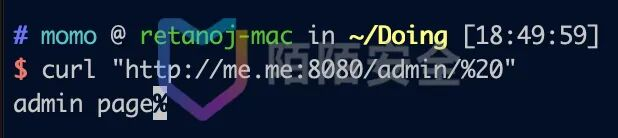
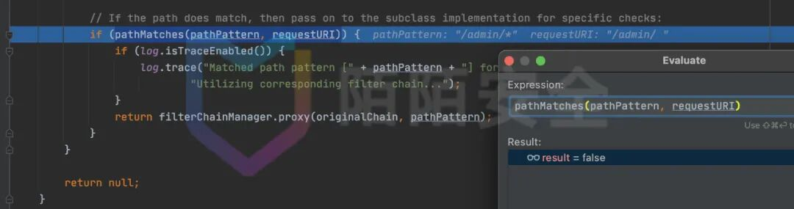
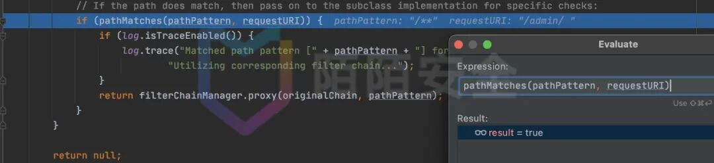
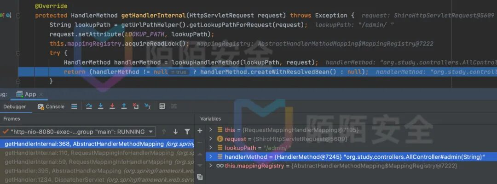
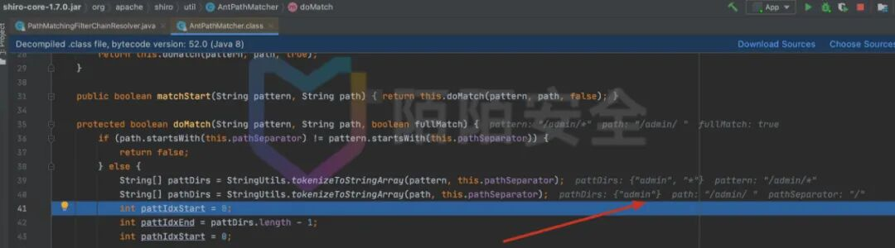
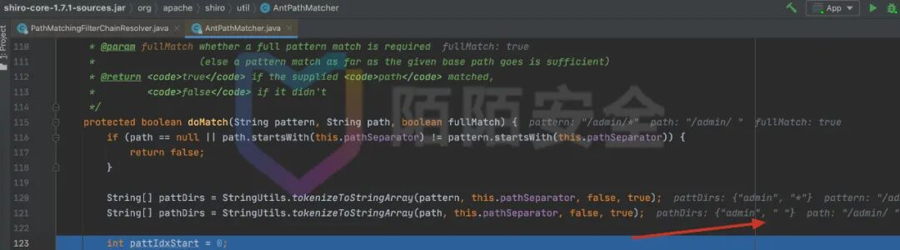

# 技术干货 - Apache Shiro 权限绕过漏洞分析 (CVE-2020-17523)

<!-- vulwiki-editorial:start -->
## 校订与适用边界

- 适用前提：Shiro1.7.0、/admin/*过滤与/admin/{name}路由、未匹配路径无需认证
- 证据范围：空格trim原理与184关联但独立分析；不含184点路径方法。

### 尚未解决的证据缺口

以下限制仍适用于后文历史材料；相关版本、结果或修复结论不能据此视为已验证：

- 两个curl命令粘连，Java@Bean与方法名粘连且一行，需恢复源码格式
- 示例map只配置/admin/*，文字却称匹配/**，需说明默认未匹配放行与显式anon规则差异
- 改为/admin/**/*就安全不能作通用替代升级结论，依完整规则及框架验证
- 保留原作者/转载链，去微信群广告

本页为文本校订，未执行代码、PoC 或目标请求；原图仅保留引用，未据此确认复现成功。
<!-- vulwiki-editorial:end -->

## 技术正文与历史材料

<meta name="referrer" content="no-referrer"/>

> 本文由 [简悦 SimpRead](http://ksria.com/simpread/) 转码， 原文地址 [mp.weixin.qq.com](https://mp.weixin.qq.com/s/2K3b-LFA1dc-5sFHKwK_6A)

本公众号发布的文章均转载自互联网或经作者投稿授权的原创，文末已注明出处，其内容和图片版权归原网站或作者本人所有，并不代表安世加的观点，若有无意侵权或转载不当之处请联系我们处理，谢谢合作！

**欢迎各位添加微信号：asj-jacky**

**加入安世加 交流群 和大佬们一起交流安全技术**


背景
--

Apache Shiro 是一个 Java 安全框架，它可以用来执行身份验证、授权、密码和会话管理。  
在 Shiro 与 Spring 进行组合应用时，两者在对 URI 的处理中存在差异，常常导致 Shiro 认证绕过问题。

CVE-2020-17523 复现
-----------------

非漏洞作者，所以只能半猜测地复现该问题。先上 payload:

```
> curl -v "http://host/admin/%20"> curl -v "http://host/admin/%20/"
```

#### 复现配置

SpringBoot + Shiro 认证  
(部分内容取自 https://github.com/xhycccc/Shiro-Vuln-Demo/blob/main/shiro_cve-2020-13933）

向 Spring 中注入 Bean

```
@BeanShiroFilterFactoryBean shiroFilterFactoryBean(){    ShiroFilterFactoryBean bean = new ShiroFilterFactoryBean();    bean.setSecurityManager(securityManager());    Map<String, String> map = new LinkedHashMap<>();    map.put("/admin/*", "authc");    bean.setFilterChainDefinitionMap(map);    return bean;}
```

构造接口

```
@GetMapping("/admin/{name}")public String admin(@PathVariable String name) {     return "admin page";}
```

可见，在未经过认证的情况下，可以访问到 admin page.



漏洞分析  

-------

在 Shiro 1.7.1 与 1.7.0 的 diff 中，有两个文件值得关注。  
diff: https://github.com/apache/shiro/compare/shiro-root-1.7.0...shiro-root-1.7.1

`web/src/test/java/org/apache/shiro/web/filter/PathMatchingFilterParameterizedTest.java` 90-93 行。  
该部分增加了很多有关空格的测试内容。猜测本次补丁与空格或 %20 有关。

`core/src/main/java/org/apache/shiro/util/AntPathMatcher.java` 这个文件是补丁的关键所在，后面再说。

先来跟踪一下 payload 在 Shiro 1.7.0 下路径规则判断过程。

Shiro 的路径判断从`org.apache.shiro.web.filter.mgt.PathMatchingFilterChainResolver.getChain`开始。因为 payload 中无分号，反斜线，非 ASCII 码等字符，所以`requestURI`会原样保留一直到进行 AntMatch 模式匹配。



可见，`requestURI`并没能与`/admin/*`匹配成功，那它匹配上了哪个规则呢？



它匹配到了`/**`这个规则。在 ShiroFilter 中，`/**`是没有配置认证的，因此绕过了认证过程。

再看 Spring 处理环节。Spring 的路由匹配在`org.springframework.web.servlet.DispatcherServlet.getHandler`过程中获取对应的处理 handler。这里给出调用栈。



由于 Spring 也没对路径中的空格进行特殊的处理，因此能获取到`/admin/{name}`所对应的 Controller，从而访问到 admin page。

一边 (Shiro) 是没能匹配到需要认证的规则路由，一边 (Spring) 又能够正常匹配到 API 路由。还是挺有意思的。

Shiro 是怎么修复的呢？关键就在`core/src/main/java/org/apache/shiro/util/AntPathMatcher.java#L121`这里。  
Shiro 中`StringUtils.tokenizeToStringArray`的第三个参数控制了是否会对解析出的 token 进行 trim 操作。  
在 1.7.1 之前，空格被 trim 了，所以第二层路径没有了，就没能匹配到`/admin/*`。



在 1.7.1 中，正确处理了空格。



当然，如果认证的路由写作`/admin/**/*`，就不会有问题了。

漏洞影响
----

该漏洞影响范围 Apache Shiro <= 1.7.0

修复建议
----

升级 Apache Shiro 组件到 1.7.1


**T****H****A****N****K****S** **F****O****R** **W****A****I****T****C****H****I****N****G**

  

  

* * *

  

_About us_

  

****

  

**陌陌安全**

致力于以务实的工作保障陌陌旗下所有产品及亿万用户的信息安全

以开放的心态拥抱信息安全机构、团队与个人之间的共赢协作

以自由的氛围和丰富的资源支撑优秀同学的个人发展与职业成长

---

> 来源：MrWQ/vulnerability-paper（https://github.com/MrWQ/vulnerability-paper）
