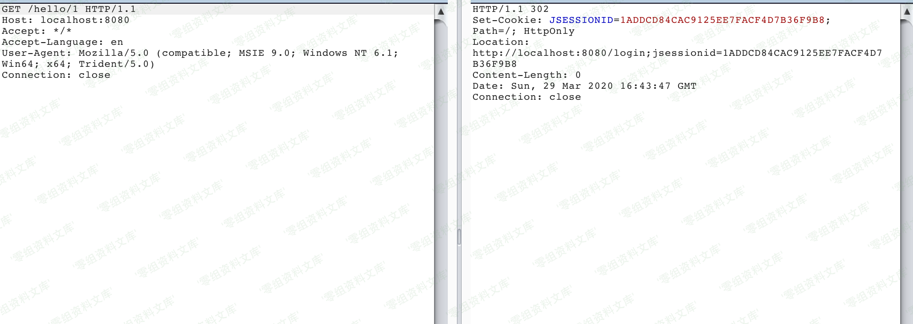
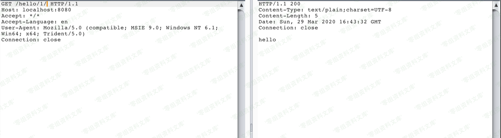
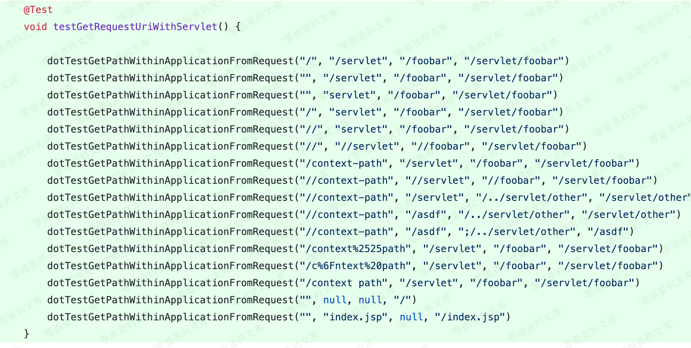
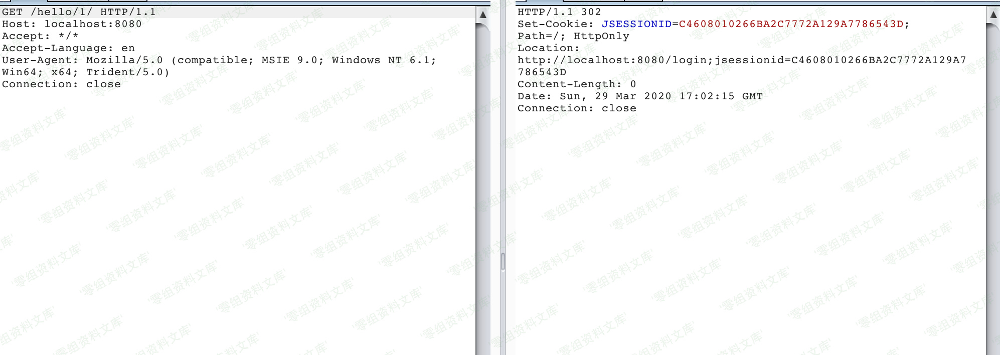
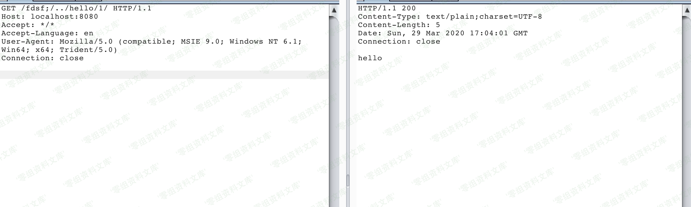
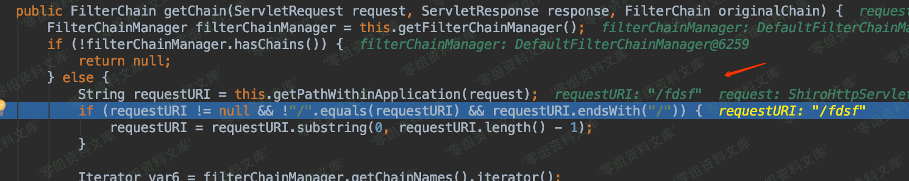
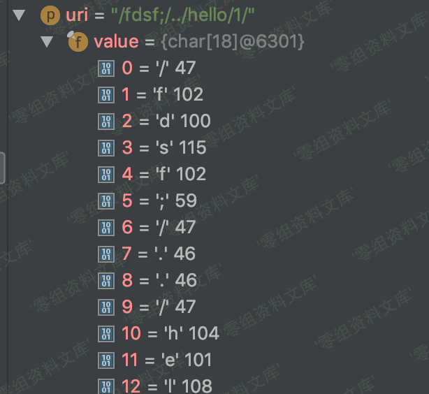

# （CVE-2020-1957）Apache Shiro \< 1.5.2 身份认证绕过漏洞

> 版本字段校订（2026-10-04）：误填的版本字段原值逐字保存到对应 `previous_*` 字段。当前值区分正文声称的影响范围、实验环境与尚未知的范围；后文对该元数据误填的旧说明只描述校订前状态，未据此升级来源结论。

<!-- vulwiki-editorial:start -->
## 校订与适用边界

- 适用前提：示例1.4.2尾斜线及1.5.1分号/遍历方法；单层过滤、动态controller，未匹配路径放行
- 证据范围：保留1.4.2和1.5.1不同表现，不能把第一段旧方法直接当所有<1.5.2通用。

### 尚未解决的证据缺口

以下限制仍适用于后文历史材料；相关版本、结果或修复结论不能据此视为已验证：

- 尾斜线旧问题与本编号新分号方法应分别标识，不把两种都称同一漏洞新增
- 多个{=html}空块及图片后重复尾巴，排版损坏
- 需固定Spring/Tomcat版本与补明确修复建议

本页为文本校订，未执行代码、PoC 或目标请求；原图仅保留引用，未据此确认复现成功。
<!-- vulwiki-editorial:end -->

## 技术正文与历史材料

一、漏洞简介
------------

Apache Shiro
1.5.2之前版本中存在安全漏洞。攻击者可借助特制的请求利用该漏洞绕过身份验证。

二、漏洞影响
------------

Apache Shiro \< 1.5.2

三、复现过程
------------

### 环境搭建

明白上文的内容，漏洞复现就很容易了，复现环境代码主要参考网上的开源[demo](https://github.com/lenve/javaboy-code-samples/tree/master/shiro/shiro-basic)。

-   下载demo代码
    [shiro-basic](https://github.com/lenve/javaboy-code-samples/tree/master/shiro/shiro-basic)。

-   导入idea

-   Shiro版本1.4.2

```{=html}
<!-- -->
```
        <dependency>
            <groupId>org.apache.shiro</groupId>
            <artifactId>shiro-web</artifactId>
            <version>1.4.2</version>
        </dependency>
        <dependency>
            <groupId>org.apache.shiro</groupId>
            <artifactId>shiro-spring</artifactId>
            <version>1.4.2</version>
        </dependency>

-   修改ShiroConfig配置文件，添加authc拦截器的拦截正则

```{=html}
<!-- -->
```
        @Bean
        ShiroFilterFactoryBean shiroFilterFactoryBean() {
            ShiroFilterFactoryBean bean = new ShiroFilterFactoryBean();
            ...
            ...
            //map.put("/*", "authc");
            map.put("/hello/*", "authc"); 
            bean.setFilterChainDefinitionMap(map);
            return bean;
        }

-   修改路由控制器方法

```{=html}
<!-- -->
```
    @GetMapping("/hello/{currentPage}")
        public String hello(@PathVariable Integer currentPage) {
            return "hello";
    }

-   启动应用

### 漏洞复现

访问`/hello/1`接口，可以看到被authc拦截器拦截了，将会跳转到登录接口进行登录。

ApacheShiro<1.5.2身份认证绕过漏洞/media/rId27.png)

访问/hello/1/，成功绕过authc拦截器，获取到了资源。

ApacheShiro<1.5.2身份认证绕过漏洞/media/rId28.png)

### ≤1.5.1版本绕过

观察1.5.2版本中新添加的[测试用例](https://github.com/apache/shiro/commit/3708d7907016bf2fa12691dff6ff0def1249b8ce)

ApacheShiro<1.5.2身份认证绕过漏洞/media/rId31.png)

切换测试版本到1.5.1中，然后从中上面的测试用例提取payload进行绕过。

在1.5.1版本中，添加`/`还是会直接跳转到登录。

ApacheShiro<1.5.2身份认证绕过漏洞/media/rId32.png)

绕过payload，`/fdsf;/../hello/1`，成功绕过。

ApacheShiro<1.5.2身份认证绕过漏洞/media/rId33.png)

问题同样可以定位到getChain函数中对于requestURI的获取中，如下图所示，`this.getPathWithinApplication(request)`获取的requestURI为`/fdsf`
，而不是我们输入的`/fdsf;/../hello/1`，从而导致后面的URI路径模式匹配返回False，从而再次绕过了shiro拦截器。

ApacheShiro<1.5.2身份认证绕过漏洞/media/rId34.png)

getPathWithinApplication函数中会调用WebUtils
(org.apache.shiro.web.util)中的getRequestUri函数获取RequestUri。

    public static String getRequestUri(HttpServletRequest request) {
            String uri = (String)request.getAttribute("javax.servlet.include.request_uri");
            if (uri == null) {
                uri = request.getRequestURI();
            }

            return normalize(decodeAndCleanUriString(request, uri));
        }

RequestUri函数中最终调用decodeAndCleanUriString函数对URI进行清洗。

    private static String decodeAndCleanUriString(HttpServletRequest request, String uri) {
          uri = decodeRequestString(request, uri);
          int semicolonIndex = uri.indexOf(59);//获取;号的位置
          return semicolonIndex != -1 ? uri.substring(0, semicolonIndex) : uri;
      }

如果URI中存在`;`号的话，则会删除其后面的所有字符。`/fdsf;/../hello/1/`最终也就变成了`/fdsf`。

ApacheShiro<1.5.2身份认证绕过漏洞/media/rId35.png)

参考链接
--------

> https://blog.riskivy.com/shiro-%e6%9d%83%e9%99%90%e7%bb%95%e8%bf%87%e6%bc%8f%e6%b4%9e%e5%88%86%e6%9e%90%ef%bc%88cve-2020-1957%ef%bc%89/
