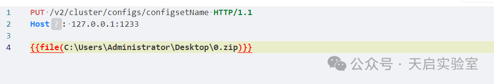
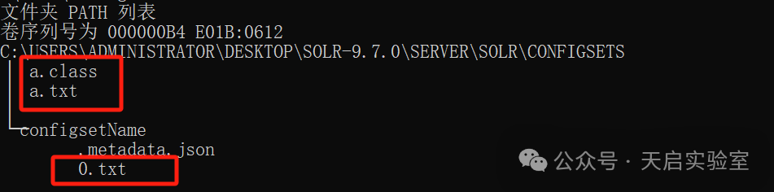
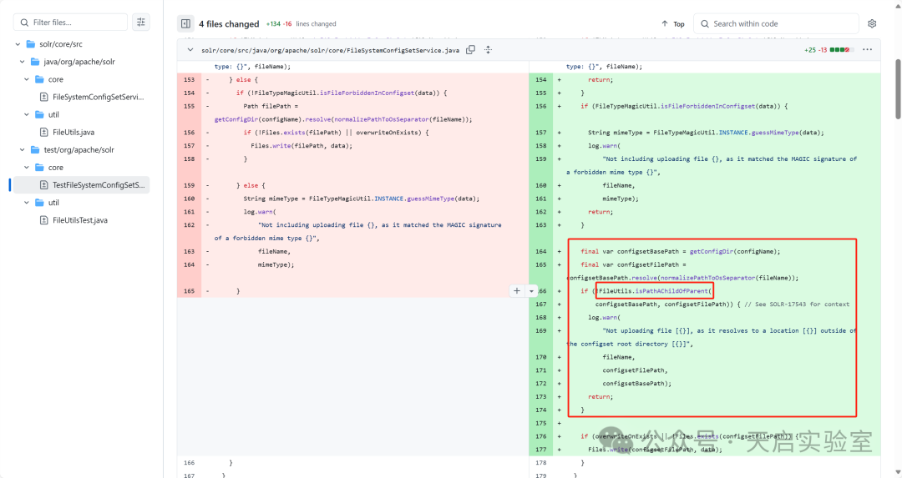
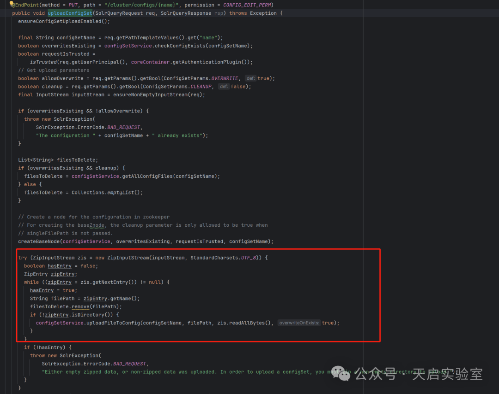
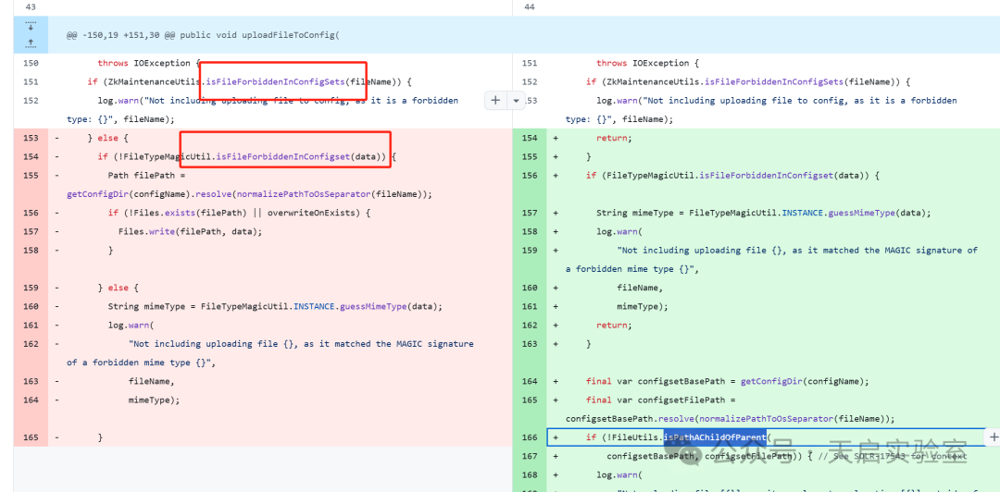

# Solr 文件上传路径遍历漏洞（CVE-2024-52012）

<!-- vulwiki-editorial:start -->
## 校订与适用边界

- 适用前提：Windows、6.6–9.7.0，上传API可调用，路径写权限；9.8.0修复
- 证据范围：ZIP文件名与新增目录限制代码相关，作者明确Windows原因仍有疑惑，不能把猜测当结论。

### 本次正文校订

- 按实际内容修正 1 处代码围栏语言标记，保留其中方法与请求内容。

### 尚未解决的证据缺口

以下限制仍适用于后文历史材料；相关版本、结果或修复结论不能据此视为已验证：

- 缺完整PUT请求、API版本/模式和鉴权条件，截图未视检
- a.class.写入内容只是class test，不能证明可加载Java类或RCE
- Windows限定与普通../路径的解释未闭合，应补实际路径处理证据
- 基于规则插件是授权控制，不宜译作认证插件；区分认证和API授权
- 相对路径写入仍受权限及目标目录限制

本页为文本校订，未执行代码、PoC 或目标请求；原图仅保留引用，未据此确认复现成功。
<!-- vulwiki-editorial:end -->

## 技术正文与历史材料

原创 天启实验室  天启实验室   2025-02-06 05:17  
  
  
  
**点击蓝字 关注我们**  
  
  
  
  
  
漏洞介绍  
  
   
  
Solr 在 Windows 上运行的实例容易受到任意文件路径写访问的攻击，这是由于“configset 上传”API 缺乏输入清理所致。恶意构造的 ZIP 文件可以使用相对文件路径将数据写入文件系统未预料到的部分。  
  
影响范围  
  
   
  
6.6 - 9.7.0  
  
修复建议  
  
   
  
用户建议升级到 9.8.0 版本，该版本修复了问题。无法升级的用户也可以通过使用 Solr 的“基于规则的认证插件”来限制对 configset 上传 API 的访问，以确保只能由一组受信任的管理员/用户访问，从而安全地防止问题发生。  
  
漏洞复现  
  
   
  
使用python构造一个恶意的zip文件。  
```python
import zipfile

# 创建ZIP文件并添加文件
with zipfile.ZipFile('0.zip', 'w') as zipf:
    zipf.writestr("0.txt", "hello world, 0")
    zipf.writestr("../a.txt","hello world")
    zipf.writestr("../a.class.","class test")
```  
  
然后在目标环境发送put请求上传恶意的zip文件。  
  
  
  
可以看到成功将a.txt和a.class上传到了上一级目录。  
  
  
  
  
  
漏洞分析  
  
   
  
打开仓库的更新推送信息，https://github.com/apache/solr/commit/5795edd143b8fcb2ffaf7f278a099b8678adf396#diff-fb4471c6f2ee95d8ed60f9b5746ad282b1cdd59527d463061bb8c24090be57b3  
  
看更新的主要代码，可以发下就是增加了isPathAChildOfParent函数检查目录逃逸。  
  
  
  
在org.apache.solr.handler.configsets.UploadConfigSetAPI#uploadConfigSet函数中调用了这个上传函数，这里是一个常见的存在漏洞地方。解压缩导致目录穿越。直接使用了ZipInputStream处理了传入的压缩包，在java的原生处理中，并没有对压缩包中特殊的文件名比如../a.txt做处理。这一点在其他语言中也常见。然后这里也没有进行其他的处理，直接将压缩包中每一项的信息使用了uploadFileToConfig函数进行了保存，就是上面截图中的函数。所以可以直接上传一个恶意的压缩包文件。  
  
  
  
在uploadFileToConfig函数中也可以看到在执行到写入文件钱前还经历了两部分检测。第一个函数isFileForbiddenInConfigSets是黑名单后缀检测，禁止  
  
"class", "java", "jar", "tgz", "zip", "tar", "gz"  
  
这些后缀进行上传。第二个函数isFileForbiddenInConfigset是根据文件前字节的魔术字节匹配确定禁止的文件类型。  
  
但是官方的漏洞介绍说在windows环境下存在这个风险，不知道是不是指可以通过Windows特性绕过后缀检测，比如a.class.这样。所以对描述中的Windows存在路径遍历还是不是很明白为什么这样说。  
  
  
  
  
参考链接  
  
   
  
https://solr.apache.org/security.html#cve-2024-52012-apache-solr-configset-upload-on-windows-allows-arbitrary-path-write-access  
  
  
https://github.com/apache/solr/commit/5795edd143b8fcb2ffaf7f278a099b8678adf396#diff-fb4471c6f2ee95d8ed60f9b5746ad282b1cdd59527d463061bb8c24090be57b3  
  
  


---

> 来源：gelusus/wxvl（微信公众号漏洞文章自动归档，原文见文首链接）
